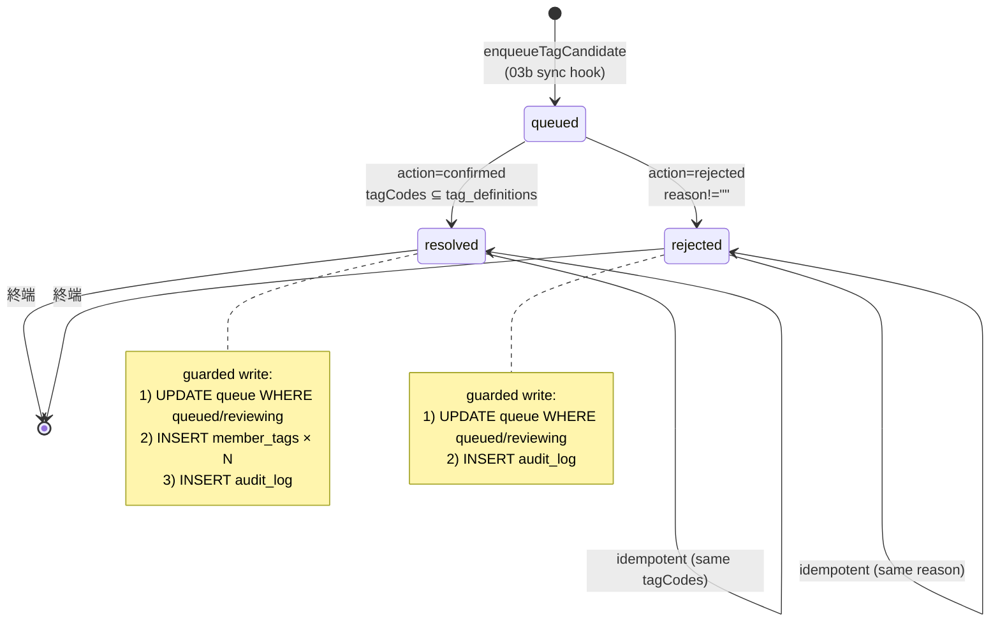

# tag_assignment_queue State Machine + tx 設計

## State Machine



> 既存 02b 実装の `reviewing` は互換状態として許可する。通常は `queued`（spec の `candidate`）から直接 `resolved`（spec の `confirmed`）または `rejected` に遷移する。詳細は phase-01 を参照。

## 書き込み境界（guarded update）

Cloudflare D1 の `batch` 結果を後から確認すると、race lost 時に後続 INSERT が実行済みになるおそれがある。そのため 07a 実装では、まず `UPDATE ... WHERE status IN ('queued','reviewing')` を実行し、`changes=1` の場合だけ `member_tags` / `audit_log` を書く。`changes=0` は 409 `race_lost`。

### confirmed の write sequence

```text
1) UPDATE tag_assignment_queue
     SET status='resolved', updated_at=?
     WHERE queue_id=? AND status IN ('queued','reviewing')
2) INSERT INTO member_tags (member_id, tag_id, source, assigned_by, assigned_at)
     VALUES (?, ?, 'admin_queue', ?, ?)
     ON CONFLICT (member_id, tag_id) DO UPDATE ...
   (× tagCodes.length)
3) INSERT INTO audit_log (audit_id, actor_id, action, target_type, target_id, before_json, after_json, created_at)
     VALUES (?, ?, 'admin.tag.queue_resolved', 'tag_queue', ?, ?, ?, ?)
```

### rejected の write sequence

```text
1) UPDATE tag_assignment_queue
     SET status='rejected', reason=?, updated_at=?
     WHERE queue_id=? AND status IN ('queued','reviewing')
2) INSERT INTO audit_log (audit_id, actor_id, action, target_type, target_id, before_json, after_json, created_at)
     VALUES (?, ?, 'admin.tag.queue_rejected', 'tag_queue', ?, ?, ?, ?)
```

statement #1 の status 条件が race condition 防御として機能する。`changes=0` を検出した場合は 409 Conflict を返し、後続書き込みは行わない。

## handler signature

```ts
// apps/api/src/workflows/tagQueueResolve.ts
import type { DbCtx } from "../repository/_shared/db";

export type ResolveAction = "confirmed" | "rejected";

export interface TagQueueResolveInput {
  queueId: string;
  actorUserId: string;
  actorEmail: string | null;
  action: ResolveAction;
  tagCodes?: string[];   // confirmed の場合のみ必須
  reason?: string;       // rejected の場合のみ必須
}

export interface TagQueueResolveResult {
  queueId: string;
  status: "resolved" | "rejected";
  resolvedAt: string;
  memberId: string;
  tagCodes?: string[];
}

export type TagQueueResolveErrorCode =
  | "queue_not_found"
  | "state_conflict"
  | "member_deleted"
  | "unknown_tag_code"
  | "idempotent_payload_mismatch"
  | "race_lost";

export class TagQueueResolveError extends Error {
  constructor(public code: TagQueueResolveErrorCode, message: string) {
    super(message);
  }
}

export function tagQueueResolve(
  c: DbCtx,
  input: TagQueueResolveInput,
): Promise<TagQueueResolveResult>;
```

## candidate 投入 hook signature

```ts
// apps/api/src/workflows/tagCandidateEnqueue.ts
export interface EnqueueTagCandidateInput {
  memberId: string;
  responseId: string;
}

export interface EnqueueTagCandidateResult {
  enqueued: boolean;
  reason?: "has_tags" | "has_pending_candidate";
  queueId?: string;
}

export function enqueueTagCandidate(
  c: DbCtx,
  input: EnqueueTagCandidateInput,
): Promise<EnqueueTagCandidateResult>;
```

## audit_log payload 構造

既存 audit_log テーブルは `before_json` / `after_json` の 2 列構成。本 workflow では:

```json
// confirmed
{
  "before": { "status": "queued" },
  "after":  { "status": "resolved", "tagCodes": ["ai", "dx"], "memberId": "mem_xxx" }
}
// rejected
{
  "before": { "status": "queued" },
  "after":  { "status": "rejected", "reason": "...", "memberId": "mem_xxx" }
}
```

action 値:
- confirmed: `admin.tag.queue_resolved`（既存定数を継続使用）
- rejected: `admin.tag.queue_rejected`（新規 brand 追加）

## Module 設計

| module | path | 責務 |
| --- | --- | --- |
| TagQueueResolveBody | apps/api/src/schemas/tagQueueResolve.ts | zod discriminatedUnion |
| tagQueueResolve | apps/api/src/workflows/tagQueueResolve.ts | resolve tx 本体 |
| enqueueTagCandidate | apps/api/src/workflows/tagCandidateEnqueue.ts | 03b sync hook |
| adminTagsQueueRoute | apps/api/src/routes/admin/tags-queue.ts | Hono handler（既存差し替え） |
| migration 0007 | apps/api/migrations/0007_tag_queue_rejected_status.sql | rejected status 受容 |
