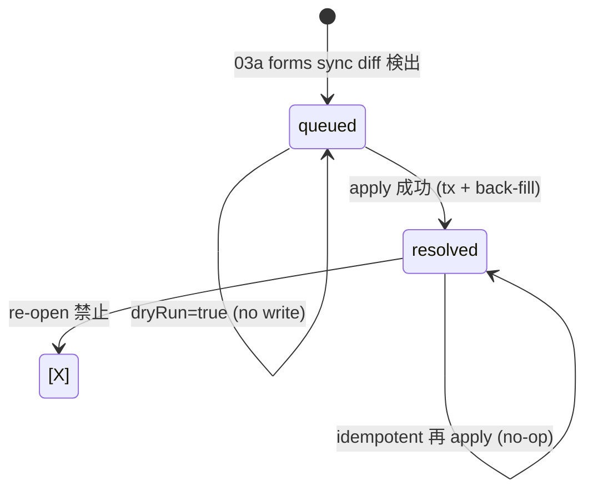

# schema-alias-workflow 設計

## state machine



## tx 境界

apply mode の atomic 処理（D1 batch 利用）:
1. SELECT: schema_questions.stable_key 現在値、schema_diff_queue.status
2. SELECT count: 同 revision_id で同 stable_key を持つ別 questionId（collision）
3. UPDATE schema_questions SET stable_key=? WHERE question_id=?
4. UPDATE schema_diff_queue SET status='resolved', resolved_by=?, resolved_at=? WHERE diff_id=?
5. UPDATE response_fields SET stable_key=? WHERE stable_key='__extra__:<questionId>' AND response_id NOT IN (SELECT first_response_id FROM deleted_members) LIMIT 100  ※ループ
6. INSERT audit_log

back-fill は別ループ（D1 batch 外）で idempotent UPDATE。

## handler signature

```ts
export type SchemaAliasAssignInput = {
  questionId: string;
  stableKey: string;
  diffId?: string;
  actorMemberId: string | null;
  actorEmail: string | null;
  dryRun: boolean;
};

export type SchemaAliasAssignResult =
  | {
      mode: "dryRun";
      questionId: string;
      currentStableKey: string | null;
      proposedStableKey: string;
      affectedResponseFields: number;
      currentStableKeyCount: number;
      conflictExists: boolean;
    }
  | {
      mode: "apply";
      questionId: string;
      oldStableKey: string | null;
      newStableKey: string;
      affectedResponseFields: number;
      queueStatus: "resolved";
    };

export type SchemaAliasAssignError =
  | { kind: "not_found"; what: "question" | "diff" }
  | { kind: "conflict"; reason: "diff_question_mismatch" }
  | { kind: "collision"; existingQuestionIds: string[] };
```

## alias 候補提案

スコア:
- `-levenshtein(diff.label, existing.label)`
- `+10` if section_key 一致
- `+5` if position 一致
- 上位 5 件の stable_key を返す（既存 schema_questions の stable_key 値のみ）

## back-fill batch 設計

- 対象: `response_fields.stable_key = '__extra__:<questionId>'`
- 削除 skip: `response_id NOT IN (SELECT first_response_id FROM deleted_members WHERE first_response_id IS NOT NULL)`
- batch=100、UPDATE meta.changes が 100 未満になるまでループ
- CPU 残予算 5s 切ったら RetryableError throw（queue は既に resolved 済なので再 apply で続行可能）

## audit_log payload

```json
{
  "actorId": "<adminId or null>",
  "actorEmail": "<email or null>",
  "action": "schema_diff.alias_assigned",
  "targetType": "schema_diff",
  "targetId": "<questionId>",
  "before": { "stableKey": "<oldStableKey>" },
  "after": {
    "stableKey": "<newStableKey>",
    "questionId": "<questionId>",
    "diffId": "<diffId or null>",
    "affectedResponseFields": 42
  }
}
```
