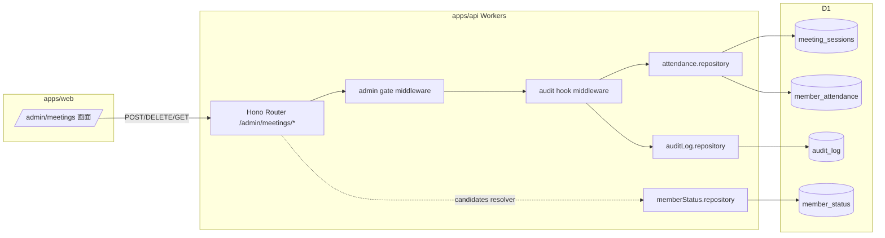

# Phase 2: 設計

## メタ情報

| 項目 | 値 |
| --- | --- |
| タスク名 | 07c-parallel-meeting-attendance-and-admin-audit-log-workflow |
| Phase 番号 | 2 / 13 |
| Phase 名称 | 設計 |
| 作成日 | 2026-04-26 |
| 前 Phase | 1 (要件定義) |
| 次 Phase | 3 (設計レビュー) |
| 状態 | completed |

## 目的

Phase 1 の AC-1〜7 を実装可能な設計に落とし、attendance API 仕様 / `audit_log` schema / audit hook 配線 / DB 制約 を Mermaid + table で固定する。

## 実行タスク

- [ ] attendance flow の Mermaid 図 (`outputs/phase-02/attendance-flow.mmd`)
- [ ] `audit_log` テーブル仕様の確定 (`outputs/phase-02/audit-log-schema.md`)
- [ ] 3 endpoint signature の確定（request schema / response schema / status code）
- [ ] env / dependency matrix
- [ ] module 設計（Hono router / repository / hook middleware）

## 参照資料

| 種別 | パス | 用途 |
| --- | --- | --- |
| 必須 | docs/00-getting-started-manual/specs/08-free-database.md | テーブル schema 出典 |
| 必須 | docs/00-getting-started-manual/specs/11-admin-management.md | UI 操作と endpoint 対応 |
| 必須 | docs/30-workflows/02-application-implementation/_design/phase-2-design.md | 全体 Wave 設計 |
| 参考 | docs/30-workflows/02-application-implementation/02c-parallel-admin-notes-audit-sync-jobs-and-data-access-boundary/index.md | `audit_log` repository 入口 |

## 構成図 (Mermaid)



## attendance API 仕様

### POST /admin/meetings/:sessionId/attendance

```ts
// request
type AttendanceCreateRequest = {
  memberId: string  // MemberId brand 型 (#7 responseId と区別)
  attendedAt?: string  // ISO 8601、省略時は session.heldAt
  note?: string  // 任意（管理メモではない、attendance row の補足）
}

// response 201
type AttendanceCreateResponse = {
  meetingSessionId: string
  memberId: string
  attendedAt: string
  createdAt: string
}

// response 409 (UNIQUE 違反)
type AttendanceConflictResponse = {
  error: "attendance_already_recorded"
  existing: AttendanceCreateResponse
}
```

### DELETE /admin/meetings/:sessionId/attendance/:memberId

- 200: 削除成功 + audit row 1 件
- 404: 該当 attendance なし

### GET /admin/meetings/:sessionId/attendance/candidates

- 応答: `Array<{ memberId, fullName, zone, status }>` から `member_status.isDeleted=true` を除外

## audit_log schema (要約)

| カラム | 型 | NOT NULL | 説明 |
| --- | --- | --- | --- |
| audit_id | TEXT | YES | PK |
| actor_id | TEXT | YES | Auth.js session 由来 |
| actor_email | TEXT | YES | Auth.js session email |
| action | TEXT | YES | enum 値（後述） |
| target_type | TEXT | YES | 07c は `meeting` |
| target_id | TEXT | YES | session id |
| before_json | TEXT (JSON) | NO | DELETE removed row |
| after_json | TEXT (JSON) | NO | POST inserted row |
| created_at | TEXT (ISO8601) | YES | サーバ時刻 |

## action enum

```
attendance.add
attendance.remove
```

## DB 制約

- `member_attendance` に `UNIQUE(meeting_session_id, member_id)` 制約 `uq_member_attendance` を追加（migration は 01a で定義済み前提、未定義なら 02b 経由で追加）
- `audit_log` に `INDEX(target_type, target_id, created_at DESC)` で履歴引き

## 環境変数一覧

| 区分 | キー | 配置 | 理由 |
| --- | --- | --- | --- |
| D1 binding | `DB` | wrangler.toml | attendance / audit / status table |
| Auth | （新規なし） | — | session.adminUserId は 05a 経由 |
| Secrets | （新規なし） | — | — |

## dependency matrix

| ファイル | 役割 | 依存元 | 依存先 |
| --- | --- | --- | --- |
| `apps/api/src/routes/admin/meetings.ts` | Hono router | 05a admin gate, 02b attendance repo | repository, audit hook |
| `apps/api/src/middleware/auditHook.ts` | audit middleware (新規) | session, action enum | `auditLog.repository` |
| `apps/api/src/repository/attendance.ts` | attendance CRUD | D1 binding | meeting_sessions / member_attendance |
| `apps/api/src/repository/auditLog.ts` | audit insert | D1 binding | audit_log |
| `apps/api/src/services/attendanceCandidates.ts` | candidates resolver (新規) | memberStatus repo | member_status |

## module 設計

- **router 層**: `apps/api/src/routes/admin/meetings.ts` に 3 endpoint を集約
- **middleware 層**: 共通 `auditHook(action: ActionEnum)` を使い、ハンドラ正常終了後に `c.get('auditPayload')` を読み取り `audit_log` に INSERT
- **repository 層**: attendance CRUD は 02b 提供、audit insert は 02c 提供を引き取る
- **service 層**: `attendanceCandidates(sessionId)` は memberStatus を JOIN して isDeleted=true を WHERE で除外

## 統合テスト連携

| 連携先 Phase | 連携内容 |
| --- | --- |
| Phase 3 | 設計 alternative の比較 |
| Phase 4 | endpoint signature をベースに verify suite |
| Phase 7 | AC × 設計のトレース |
| Phase 12 | implementation-guide の元データ |

## 多角的チェック観点

- 不変条件 **#5**: admin gate middleware を必ず通す（理由: 公開 / 会員から呼ばれない）
- 不変条件 **#6**: D1 アクセスは `apps/api` repository のみ（apps/web は fetch 経由）
- 不変条件 **#7**: candidates resolver で `isDeleted=true` を除外
- 不変条件 **#11**: profile 編集 endpoint は本タスクで定義しない（route 一覧に含めない）
- 不変条件 **#13**: meeting / attendance は admin-managed として Forms sync の影響範囲外
- 不変条件 **#15**: UNIQUE 制約 + 409 二重防御
- a11y: candidates 一覧の aria-label に「候補メンバー一覧」、attendance ボタンに `aria-pressed`

## サブタスク管理

| # | サブタスク | 担当 Phase | 状態 | 備考 |
| --- | --- | --- | --- | --- |
| 1 | Mermaid 図作成 | 2 | pending | outputs/phase-02/attendance-flow.mmd |
| 2 | audit_log schema 確定 | 2 | pending | outputs/phase-02/audit-log-schema.md |
| 3 | endpoint signature 確定 | 2 | pending | request / response 型 |
| 4 | env / dependency matrix | 2 | pending | matrix table |
| 5 | module 設計 | 2 | pending | router / middleware / repository |

## 成果物

| 種別 | パス | 説明 |
| --- | --- | --- |
| ドキュメント | outputs/phase-02/main.md | Phase 2 の主成果物 |
| ドキュメント | outputs/phase-02/audit-log-schema.md | audit_log 詳細 |
| 図 | outputs/phase-02/attendance-flow.mmd | Mermaid フロー |
| メタ | artifacts.json | Phase 状態と outputs の記録 |

## 完了条件

- [ ] Mermaid 図が描かれている
- [ ] audit_log schema / action enum が確定
- [ ] 3 endpoint の request / response 型が確定
- [ ] dependency matrix と module 設計が table 化されている

## タスク100%実行確認【必須】

- [ ] 全実行タスクが completed
- [ ] 全成果物が指定パスに配置
- [ ] 完了条件すべてチェック
- [ ] 多角的チェック観点が網羅
- [ ] 次 Phase への引き継ぎ事項記述
- [ ] artifacts.json の phase 2 を completed に更新

## 次 Phase

- 次: Phase 3 (設計レビュー)
- 引き継ぎ: alternative 案 3 つ、PASS-MINOR-MAJOR 判定の論点
- ブロック条件: 設計成果物が未完なら Phase 3 着手不可
