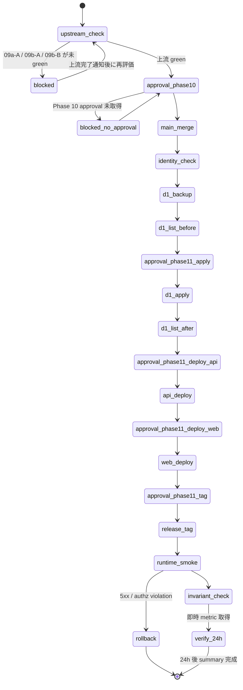

# Phase 2 Output: 設計 — 09c-A-production-deploy-execution

[実装区分: 実装仕様書（runbook execution + evidence collection）]

## 1. State Machine



各 step の状態遷移は `pending → in_progress → done`。失敗時は `blocked`（待機）または `rollback`（巻き戻し）に遷移。

## 2. 依存 Matrix（step × 入力 × 出力 × approval）

| # | step | 入力 | 出力（evidence） | approval gate |
| --- | --- | --- | --- | --- |
| 0 | upstream_check | 09a-A / 09b-A / 09b-B の outputs/phase-11 | `outputs/phase-11/upstream-green-evidence.md` | — |
| 1 | approval_phase10 | Phase 10 設計レビュー結果 | `outputs/phase-11/user-approval-log.md`（Phase 10 セクション） | Phase 10 |
| 2 | main_merge | dev ブランチ最新 / Phase 13 approval | `outputs/phase-11/main-merge-commit.txt`（commit hash, PR URL） | Phase 13 |
| 3 | identity_check | step 2 完了 | `outputs/phase-11/cf-whoami.txt` | — |
| 4 | d1_backup | step 3 完了 | `outputs/phase-11/d1-backup-<ts>.sql`（または size メタ情報） | — |
| 5 | d1_list_before | step 4 完了 | `outputs/phase-11/d1-migrations-list-before.txt` | — |
| 6 | approval_phase11_apply | step 5 完了 | `outputs/phase-11/user-approval-log.md`（apply セクション） | Phase 11 |
| 7 | d1_apply | step 6 完了 | `outputs/phase-11/d1-migrations-apply.txt` | — |
| 8 | d1_list_after | step 7 完了 | `outputs/phase-11/d1-migrations-list-after.txt` | — |
| 9 | approval_phase11_deploy_api | step 8 完了 | `outputs/phase-11/user-approval-log.md`（api deploy セクション） | Phase 11 |
| 10 | api_deploy | step 9 完了 | `outputs/phase-11/api-deploy.log` | — |
| 11 | approval_phase11_deploy_web | step 10 exit 0 | `outputs/phase-11/user-approval-log.md`（web deploy セクション） | Phase 11 |
| 12 | web_deploy | step 11 完了 | `outputs/phase-11/web-deploy.log` | — |
| 13 | approval_phase11_tag | step 12 exit 0 | `outputs/phase-11/user-approval-log.md`（release tag セクション） | Phase 11 |
| 14 | release_tag | step 13 完了 | `outputs/phase-11/release-tag.txt`（tag 名 / commit / push 確認） | — |
| 15 | runtime_smoke | State S14 完了 | `outputs/phase-11/smoke-public.md`, `smoke-member.md`, `smoke-admin.md`, `smoke-screenshots/*.png` | — |
| 16 | invariant_check | step 15 green | `outputs/phase-11/invariants.md`（#5/#6/#14 verification） | — |
| 17 | verify_24h | step 16 完了 + 24h 経過 | `outputs/phase-11/24h-verification-summary.md`, `24h-metrics-screenshots/*.png` | — |

## 3. Evidence Path 設計（`outputs/phase-11/` ファイル一覧）

```
outputs/phase-11/
├── main.md                         # Phase 11 まとめ
├── user-approval-log.md            # Phase 10 / 11 / 13 の承認集約
├── upstream-green-evidence.md      # 上流 green の citation
├── main-merge-commit.txt           # main merge commit hash と PR URL
├── cf-whoami.txt                   # Cloudflare account identity
├── d1-backup-<timestamp>.sql       # backup 本体（容量大なら meta ファイル化）
├── d1-migrations-list-before.txt
├── d1-migrations-apply.txt
├── d1-migrations-list-after.txt
├── api-deploy.log
├── web-deploy.log
├── release-tag.txt
├── smoke-public.md
├── smoke-member.md
├── smoke-admin.md
├── smoke-screenshots/              # VISUAL 証跡
│   ├── public-home-<ts>.png
│   ├── member-profile-<ts>.png
│   └── admin-dashboard-<ts>.png
├── invariants.md
├── 24h-verification-summary.md
└── 24h-metrics-screenshots/        # VISUAL 証跡
    ├── workers-requests-<ts>.png
    ├── d1-rows-<ts>.png
    └── sync-jobs-<ts>.png
```

## 4. Rollback / Skip 条件

| 条件 | 判断 | アクション |
| --- | --- | --- |
| step 4（D1 backup）失敗 | blocker | 再試行。継続失敗で incident 起票、execution 中止 |
| step 7（D1 apply）失敗 | rollback 候補 | `d1 migrations list` で current state 確認、forward migration で修復、破壊的 SQL 禁止 |
| step 10（API deploy）失敗 | rollback | `bash scripts/cf.sh rollback <prev-version-id> --config apps/api/wrangler.toml --env production`（user approval 必須） |
| step 12（Web deploy）失敗 | rollback | Cloudflare Dashboard で前 deployment へ戻す（user approval 必須） |
| State S14（release tag）失敗 | skip 不可 | tag 名重複なら timestamp を上げて再作成。push 失敗は再試行 |
| step 15（smoke）5xx / authz violation | rollback | worker / pages / D1 を最小単位で巻き戻す |
| step 17（24h verification）閾値超過 | incident | 09b incident response runbook に沿って escalate |
| 上流（09a-A / 09b-A / 09b-B）未 green | skip | 09c-A は実行開始しない（待機） |

`apps/web` から D1 を直接操作する rollback 手順は **不変条件 #6 違反** のため禁止。

## 5. Cloudflare CLI Wrapper 経路設計

`bash scripts/cf.sh` は次の 3 役割を担う:

1. `op run --env-file=.env` 経由で `CLOUDFLARE_API_TOKEN` 等を 1Password から動的注入（ファイル/ログに残さない）
2. グローバル `esbuild` とのバージョン不整合を `ESBUILD_BINARY_PATH` で解決
3. `mise exec --` 経由で Node 24 / pnpm 10 を保証

各 step での具体引数:

| step | 引数 |
| --- | --- |
| identity_check | `bash scripts/cf.sh whoami` |
| d1_backup | `bash scripts/cf.sh d1 export ubm-hyogo-db-prod --remote --output=outputs/phase-11/d1-backup-<ts>.sql --env production --config apps/api/wrangler.toml` |
| d1_list_before / d1_list_after | `bash scripts/cf.sh d1 migrations list ubm-hyogo-db-prod --remote --env production --config apps/api/wrangler.toml` |
| d1_apply | `bash scripts/cf.sh d1 migrations apply ubm-hyogo-db-prod --remote --env production --config apps/api/wrangler.toml` |
| api_deploy | `bash scripts/cf.sh deploy --config apps/api/wrangler.toml --env production`（`apps/api/package.json` に `deploy:production` script は不在のため、cf.sh wrapper 直接呼び出しを正規経路とする — Phase 4 で確定） |
| web_build | `mise exec -- pnpm --filter @ubm-hyogo/web build:cloudflare`（OpenNext build。`.open-next/worker.js` と `.open-next/assets/` 生成が deploy の必須前提） |
| web_deploy | `bash scripts/cf.sh deploy --config apps/web/wrangler.toml --env production`（同上、cf.sh wrapper 直接呼び出し） |
| rollback (api) | `bash scripts/cf.sh rollback <version-id> --config apps/api/wrangler.toml --env production` |

`wrangler` 直接実行は禁止。すべて wrapper 経由。secret 値は環境変数として揮発的に渡るのみで、log には mask 済みのものだけが残る。

## 6. D1 Migration の段階分離

| 段階 | 性質 | コマンド | approval |
| --- | --- | --- | --- |
| backup | mutation 前の保全 | `d1 export` | 不要（read-only 出力） |
| list-before | read-only | `d1 migrations list` | 不要 |
| apply | mutation | `d1 migrations apply` | **Phase 11 user approval 必須** |
| list-after | read-only（事後検証） | `d1 migrations list` | 不要 |

dry-run の段階は wrangler 標準では明示提供されないため、`list` の差分（apply 前後の Applied 件数比較）で代替する。`d1 execute` を使った任意 SQL 実行はスコープ外（破壊的 SQL 禁止）。

## 7. 24h Verification の自動化境界

| 項目 | 取得方法 | 自動化 |
| --- | --- | --- |
| Workers requests / errors | Cloudflare Dashboard 目視 + screenshot | 手動 |
| D1 read/write rows | Cloudflare Dashboard 目視 + screenshot | 手動 |
| `sync_jobs` 状況 | `bash scripts/cf.sh d1 execute ubm-hyogo-db-prod --remote --env production --command "SELECT status, COUNT(*) FROM sync_jobs GROUP BY status"` | 半自動（read-only SQL） |
| public/member/admin smoke 再実行 | curl + ブラウザ手動 | 手動 |
| 不変条件 #5 / #6 / #14 再確認 | bundle inspection / `/profile` 編集不可確認 / metrics threshold | 手動 |
| 異常検知 | Cloudflare Analytics の閾値表示 + Sentry / Slack 通知（09b-A 経由） | 半自動（通知到達のみ） |

MVP 段階では Analytics API + GitHub Actions 化は scope 外（Phase 3 で代替案として記録）。

## 8. 不変条件マッピング

| 不変条件 | 検証 step | evidence |
| --- | --- | --- |
| #5 public/member/admin boundary | step 15 runtime_smoke | `smoke-public.md` / `smoke-member.md` / `smoke-admin.md`（authz 期待値） |
| #6 apps/web から D1 直接アクセス禁止 | step 16 invariant_check | `invariants.md`（web bundle inspection 結果） |
| #14 Cloudflare free-tier | step 17 verify_24h | `24h-verification-summary.md`（metrics threshold 比較） |

## 9. Phase 3 への引き渡し

- 13 ステップ + approval gate を含む state machine
- 依存 matrix（17 行 / step × 入出力 × approval）
- evidence path 設計（`outputs/phase-11/` 完全リスト）
- rollback / skip 条件（8 ケース）
- Cloudflare CLI wrapper 経路と引数
- D1 migration 段階分離（4 段階）
- 24h verification 自動化境界（手動主体・MVP）
