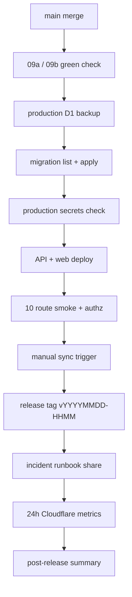

# Phase 2 Output: Design Summary

Status: spec_created  
Runtime evidence: pending_user_approval

## Design

Production deploy is designed as a 13-step serial flow: main merge, upstream checks, D1 backup, D1 migration checks, secrets check, API deploy, web deploy, smoke, manual sync, release tag, incident runbook sharing, and 24h verification.

## Production Environment

| Item | Value | Runtime status |
| --- | --- | --- |
| API worker | `ubm-hyogo-api` | existing target, verify at execution |
| Web project | `ubm-hyogo-web` | existing target, verify at execution |
| D1 database | `ubm_hyogo_production` | existing target, verify at execution |
| Wrangler env | `production` | template value |
| API URL | `https://ubm-hyogo-api.<account>.workers.dev` | TBD at execution |
| Web URL | `https://ubm-hyogo-web.pages.dev` | template value |
| Release tag | `vYYYYMMDD-HHMM` | generated at execution |

## Dependency Matrix

| Source | Handoff |
| --- | --- |
| 09a | staging URL, staging smoke results, sync job evidence, accessibility and free-tier checks |
| 09b | release runbook, incident response runbook, rollback procedures, cron schedule assumptions |
| Downstream | none; this is Wave 9 terminal serial work |

## Modules

| Module | Responsibility |
| --- | --- |
| pre-deploy-check | Confirm upstream 09a / 09b completion and main freshness. |
| production-d1 | Backup, migration list/apply, and D1 rollback compatibility. |
| production-deploy | API worker and web production deploy execution. |
| production-smoke | Route, authz, manual sync, and invariant checks. |
| release-tag-and-share | Release tag, incident runbook sharing, and 24h metrics summary. |
