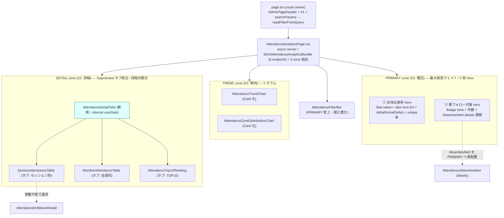

# Phase 2 設計 — main

> 上流: `../phase-01/main.md` / `../phase-01/spec-extraction-map.md`。本ファイルは 3 層レイアウトの topology・状態所有権・degrade 設計の確定実体。

## 1. 3 層レイアウト topology



### concern → target

| concern | target（描画担当） | source data |
| --- | --- | --- |
| 最重要判断 = 出席率の健全性 | PRIMARY ① hero（`KpiPanel` 再編） | `bundle.overview` |
| 最重要判断 = 要フォロー対象 | PRIMARY ② hero（`AttendanceAbsenteeAlert` 主役化） | `bundle.absentees` |
| 傾向 = 推移 + 参加の偏り | TREND 2 カラム | `bundle.trend` / `bundle.zoneDistribution` |
| 詳細 = セッション/会員/ランキング | DETAIL タブ（`AttendanceDetailTabs`） | `bundle.bySession` / `bundle.ranking` |
| 操作起点 = 絞り込み + CSV | フィルタバー（PRIMARY 直上） | URL searchParams（`useAttendanceFilters`） |

## 2. lane 設計（3 以下）

| lane | 範囲 | 並列性 | 締め |
| --- | --- | --- | --- |
| lane 1 | PRIMARY: `KpiPanel` を hero 化（特大 primary + secondary 分離）+ `AttendanceAbsenteeAlert` を件数トーン強調 hero へ | 独立 | — |
| lane 2 | DETAIL: `AttendanceDetailTabs` 新規作成 + 3 表（Session/Member/Top10）を埋め込み | 独立 | — |
| lane 3（validation） | TREND 移設のカード化 + `globals.css` の 3 層クラス追加 + `AttendanceAnalyticsPage` の統括組み替え + 全体結線 | 直列 | lane 1/2 を集約して締める |

> validation lane は直列で締める（typecheck / lint / token gate / vitest）。

## 3. 既存コンポーネント再利用可否（[FB-SDK-07-1]）

| 用途 | 再利用 primitive（既存） | パス | 新規作成 |
| --- | --- | --- | --- |
| KPI 表示 | `Stat`（label/value/delta/tone/helpText） | `apps/web/src/components/ui/Stat.tsx` | 不要 |
| ゾーン見出し + サーフェス | `AdminSectionCard`（title/description/actions） | `apps/web/src/features/admin/components/_shared/AdminSectionCard.tsx` | 不要 |
| カードサーフェス | `Card` 系 | `apps/web/src/components/ui/Card.tsx` | 不要 |
| 要フォロートーン / zone ラベル | `Badge`（tone: default/accent/success/warning/danger/info） | `apps/web/src/components/ui/Badge.tsx` | 不要 |
| DETAIL タブ切替 | `Segmented`（options/value/onChange/ariaLabel） | `apps/web/src/components/ui/Segmented.tsx` | 不要 |
| データ 0 件 | `EmptyState` / `AdminEmptyState` | `apps/web/src/components/ui/EmptyState.tsx` / `_shared/AdminEmptyState.tsx` | 不要 |
| ゾーン error degrade | `AdminSectionErrorClient` | `_shared/AdminSectionErrorClient.tsx` | 不要 |
| DETAIL タブホスト | （上記 `Segmented` を内部利用する feature コンポーネント） | `AttendanceDetailTabs.tsx`（新規・feature 層） | **新規 1 件（primitive ではない）** |

> **判定**: 新規追加は `AttendanceDetailTabs`（feature 層コンポーネント）1 件のみ。`apps/web/src/components/ui/` への primitive 追加はゼロ（AC-6 / ui-prototype #3 充足）。

## 4. 状態所有権テーブル

| 状態 | 所有者 | 種別 | 扱い |
| --- | --- | --- | --- |
| navigation / breadcrumb | `page.tsx` + `AdminPageHeader` | server | 不変 |
| filter state（期間 / 回数帯） | `useAttendanceFilters`（URL 駆動） | client hook | 不変（再利用） |
| 6 endpoint データ bundle | `AttendanceAnalyticsPage`（`fetchAttendanceAnalyticsBundle`） | server fetch | 不変 |
| **DETAIL タブ選択** | `AttendanceDetailTabs` | **新規 internal `useState`** | 新設（[VSCPKR-03]：外部 props ではない） |
| ドリルダウン modal 開閉 | `SessionAttendanceTable`（既存 `useState`） | client | 不変 |
| 要フォロー details 開閉 | `AttendanceAbsenteeAlert`（native `<details>`） | DOM | 不変（配置のみ PRIMARY へ） |

### Segmented モード管理（[VSCPKR-03] 対策）

- DETAIL タブの選択状態は **`AttendanceDetailTabs` 内部の `useState<DetailTabKey>`** であり、親（`AttendanceAnalyticsPage`）から渡される外部 props ではない。
- Phase 4 の TDD では「テスト操作対象 = internal state」を前提とし、`Segmented` の `onChange` をクリックして state 遷移を起こす形でテストする（props を渡して切り替えるのではない）。
- `Segmented` 自体は `role="radiogroup"` / `role="radio"` 実装（`aria-checked` でアクティブ表現）であり、tablist ではない。AC-9 のアクセシビリティはこの既存実装を踏襲する。

## 5. SafeResult degrade 設計（ゾーン単位）

| ゾーン | source | error degrade |
| --- | --- | --- |
| PRIMARY ① 出席率 | `bundle.overview` | `AdminSectionErrorClient sectionLabel="出席KPI"` |
| PRIMARY ② 要フォロー | `bundle.absentees` | `AdminSectionErrorClient sectionLabel="要フォローアップ"` |
| TREND 折れ線 | `bundle.trend` | `AdminSectionErrorClient sectionLabel="出席トレンド"` |
| TREND 分布 | `bundle.zoneDistribution` | `AdminSectionErrorClient sectionLabel="区画別分布"` |
| DETAIL セッション別タブ | `bundle.bySession` | タブ body 内 `AdminSectionErrorClient sectionLabel="セッション別出席状況"` |
| DETAIL 会員別 / TOP10 タブ | `bundle.ranking` | タブ body 内 `AdminSectionErrorClient sectionLabel="会員別出席率"`（共通 source） |

設計原則:
- error は **ゾーン/タブ単位で隔離**。1 ゾーンの error が他ゾーンの描画を止めない（AC-10）。
- degrade 判定は `AttendanceAnalyticsPage`（server）で行い、`bundle.<key>.ok` の分岐は現状ロジックをそのまま 3 層配置に移植する。
- DETAIL の会員別 / TOP10 は `bundle.ranking` 共通 source のため、ranking error 時は両タブが同一 error を表示する（現状 `AttendanceAnalyticsPage` の挙動を踏襲）。

## 6. データフロー（不変）

```
page.tsx (searchParams)
  → readFilterFromQuery() → filterState
    → AttendanceAnalyticsPage(filterState)  [server]
        → fetchAttendanceAnalyticsBundle({periodFrom, periodTo, zones, limit:50, lastN:3})
            → safeServerFetch × 6 (overview / by-session / ranking / trend / zone-distribution / absentees)
        → bundle: { overview, bySession, ranking, trend, zoneDistribution, absentees } : SafeResult<T>
        → PRIMARY / TREND / DETAIL の 3 ゾーンへ分配（描画のみ変更・取得は不変）
```

> このフローは AC-7 により**一切変更しない**。3 層化は「分配先」の組み替えのみ。

## 7. 設計上の決定事項サマリ

| 決定 | 内容 | 根拠 |
| --- | --- | --- |
| D-1 | route 側 `<section className="attendance-analytics-page">` と `AttendanceAnalyticsPage` 内部の同名 div の二重を解消 | spec-extraction-map A 節で検出した二重。内部 div を 3 層ラッパー（`attendance-zones` 等）へ置換し testid 重複を整理 |
| D-2 | `KpiPanel` を「PRIMARY hero（出席率特大）」と「secondary KPI 行」に分離 | AC-1（`--ubm-text-3xl`）。既存 testid（`attendance-kpi-rate` 等）は維持し、Phase 4 でレイアウト変更分のみ追従 |
| D-3 | `AttendanceAbsenteeAlert` を PRIMARY 2 枚目の hero に格上げ、件数で `data-attendance-level` トーン | AC-4。新規 token なし |
| D-4 | DETAIL の 3 表を `AttendanceDetailTabs` で Segmented 統合 | AC-3。internal state |
| D-5 | TREND は既存 2 カラム grid をゾーン化（`AdminSectionCard` でカード統一） | AC-2 |
| D-6 | 新規型を作らず既存 shared 型（`SessionAttendanceRowView` 等）を props にそのまま使用 | AC-7 |
