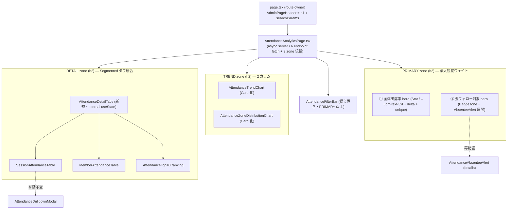

# Phase 2: 設計

## メタ情報

| 項目 | 値 |
| --- | --- |
| タスク名 | admin-attendance-dashboard-ux-hierarchy-refine |
| Phase 番号 | 2 / 13 |
| Phase 名称 | 設計 |
| 実行種別 | serial |
| 作成日 | 2026-06-08 |
| 上流 | Phase 1（要件定義） |
| 下流 | Phase 3（設計レビュー） |
| 状態 | spec_created |

## 目的

Phase 1 で確定した inventory・命名規則・AC を、**3 層レイアウト（PRIMARY / TREND / DETAIL）の topology・各コンポーネントの Before/After 責務・新規タブホスト `AttendanceDetailTabs` の props/state signature・状態所有権・SafeResult degrade 設計**として確定する。後続実装者が迷わず実装できる粒度まで落とす。**新規 primitive ゼロ・API/D1/shared 型変更ゼロ**を設計面で担保する。

## 実行タスク

1. **3 層 topology の確定**: PRIMARY / TREND / DETAIL のゾーン構造・各 concern の target・lane（3 以下）を `outputs/phase-02/main.md` に確定する。
2. **既存コンポーネント再利用可否の明示（[FB-SDK-07-1]）**: `Card` / `Badge` / `Stat` / `Segmented` / `EmptyState` / `AdminSectionCard` の再利用で新規 primitive ゼロを担保することを明記する。
3. **Segmented モード管理の明記（[VSCPKR-03]）**: DETAIL タブの選択状態が **internal state（`useState`）**であり外部 props ではないことを明記する。
4. **状態所有権の確定**: navigation 不変 / filter state は既存 `useAttendanceFilters` のまま / タブ選択のみ新規 internal state。
5. **SafeResult degrade 設計**: ゾーン単位（PRIMARY / TREND / DETAIL）の error degrade を `AdminSectionErrorClient` で行う設計を確定する。
6. **layout-blueprint 作成**: 3 層の ASCII ワイヤフレーム・余白/タイポ/トークン割当・レスポンシブ breakpoint・`data-attendance-level` マッピングを `outputs/phase-02/layout-blueprint.md` に書く。
7. **component-map 作成**: 各コンポーネントの Before/After 責務テーブル + `AttendanceDetailTabs` の props/state signature + 既存 primitive 対応を `outputs/phase-02/component-map.md` に書く。

## 3 層レイアウト topology

### lane 設計（3 以下）

| lane | 範囲 | 並列性 |
| --- | --- | --- |
| lane 1 | PRIMARY ゾーン（`KpiPanel` 再編 + `AttendanceAbsenteeAlert` 主役化） | 独立 |
| lane 2 | DETAIL ゾーン（`AttendanceDetailTabs` 新規 + 3 表の埋め込み） | 独立 |
| lane 3（validation） | TREND 移設 + `globals.css` 3 層クラス + `AttendanceAnalyticsPage` 統括組み替え | 直列で締める（lane 1/2 を集約） |

## 状態所有権テーブル

| 状態 | 所有者 | 種別 | 本タスクでの扱い |
| --- | --- | --- | --- |
| navigation（route / breadcrumb） | `page.tsx` + `AdminPageHeader` | server | **不変** |
| filter state（期間 / 回数帯） | `useAttendanceFilters`（URL searchParams 駆動） | client hook | **不変**（既存のまま再利用） |
| データ bundle（6 endpoint） | `AttendanceAnalyticsPage`（`fetchAttendanceAnalyticsBundle`） | server fetch | **不変**（取得経路を変えない） |
| DETAIL タブ選択 | `AttendanceDetailTabs` | **新規 internal `useState`** | 新設（[VSCPKR-03]：外部 props ではない） |
| ドリルダウン modal 開閉 | `SessionAttendanceTable`（既存 `useState`） | client | **不変** |
| 要フォロー `
` 開閉 | `AttendanceAbsenteeAlert`（native `
`） | DOM | **不変**（PRIMARY 配置のみ変更） |

## SafeResult degrade 設計

| ゾーン | データ source（`SafeResult`） | error 時の degrade |
| --- | --- | --- |
| PRIMARY ① 出席率 | `bundle.overview` | `AdminSectionErrorClient sectionLabel="出席KPI"`（既存挙動維持） |
| PRIMARY ② 要フォロー | `bundle.absentees` | `AdminSectionErrorClient sectionLabel="要フォローアップ"` |
| TREND 折れ線 | `bundle.trend` | `AdminSectionErrorClient sectionLabel="出席トレンド"` |
| TREND 分布 | `bundle.zoneDistribution` | `AdminSectionErrorClient sectionLabel="区画別分布"` |
| DETAIL セッション別 | `bundle.bySession` | タブ内 `AdminSectionErrorClient sectionLabel="セッション別出席状況"` |
| DETAIL 会員別 / TOP10 | `bundle.ranking` | タブ内 `AdminSectionErrorClient sectionLabel="会員別出席率"` |

> 1 ゾーンの error は他ゾーンの描画を阻害しない（AC-10）。DETAIL は ranking が共通 source のため、会員別 / TOP10 タブは同一 error を共有する。

## 参照資料

### タスク内部資料

| 種別 | パス | 用途 |
| --- | --- | --- |
| 必須 | outputs/phase-01/main.md | inventory / 命名規則 / AC |
| 必須 | outputs/phase-01/spec-extraction-map.md | spec ↔ code anchor 1:1 |
| 必須 | apps/web/src/components/ui/Segmented.tsx | Segmented の実 signature（options/value/onChange/ariaLabel） |
| 必須 | apps/web/src/components/ui/Stat.tsx | Stat の実 signature（label/value/delta/tone/helpText） |
| 必須 | apps/web/src/features/admin/components/_meetings/meetingStats.ts | `attendanceLevel` パターン（issue-1112） |

### システム仕様（aiworkflow-requirements）

| 参照資料 | パス | 用途 |
| --- | --- | --- |
| UI/UX 設計原則 | `.claude/skills/aiworkflow-requirements/references/ui-ux-design-principles-core.md` | 階層・焦点・余白リズム |
| UI/UX admin dashboard | `.claude/skills/aiworkflow-requirements/references/ui-ux-admin-dashboard.md` | ダッシュボード情報設計 |
| UI/UX primitives | `.claude/skills/aiworkflow-requirements/references/ui-ux-atoms-patterns-core.md` | primitive 再利用ルール |
| アーキテクチャ境界 | `.claude/skills/aiworkflow-requirements/references/architecture-admin-api-client.md` | apps/web → apps/api 境界 |

### プロジェクト spec 正本

| 種別 | パス | 用途 |
| --- | --- | --- |
| 必須 | docs/00-getting-started-manual/specs/09b-design-tokens.md | token 値・HEX 禁止 |
| 必須 | docs/00-getting-started-manual/specs/09c-primitives.md | primitive catalog |
| 必須 | docs/00-getting-started-manual/specs/09g-screen-blueprints-admin.md | admin 画面 contract |

## 実行手順

### ステップ 1: topology と lane の確定

- 上記 Mermaid を `outputs/phase-02/main.md` に貼る。
- lane 設計（3 以下）を main.md に書く。
- [FB-SDK-07-1] 既存 primitive 再利用可否を明記する。

### ステップ 2: layout-blueprint の作成

- `outputs/phase-02/layout-blueprint.md` に下記を書く:
  - 3 層 ASCII ワイヤフレーム（PRIMARY 2 枚 / TREND 2 カラム / DETAIL タブ）
  - 各ゾーンの余白（`--ubm-space-*`）・タイポ（`--ubm-text-*`）・色（`--ubm-color-*`）割当
  - レスポンシブ breakpoint（mobile 1col → lg 2col）
  - `data-attendance-level` マッピング（0 名 → neutral/ok、1+ → warn）

### ステップ 3: component-map の作成

- `outputs/phase-02/component-map.md` に下記を書く:
  - 各コンポーネントの Before/After 責務テーブル
  - `AttendanceDetailTabs` の props/state signature（internal `useState`）
  - props 受け渡し図
  - 各コンポーネントが使う既存 primitive の対応

## 統合テスト連携

| 連携先 Phase | 連携内容 |
| --- | --- |
| Phase 3 | alternative 案でこの 3 層 topology の妥当性を検証 |
| Phase 4 | `AttendanceDetailTabs` の internal state を TDD RED のテスト操作対象として明記する根拠 |
| Phase 5 | component-map を runbook の章立て（新規/修正ファイル一覧）にする |
| Phase 9 | token-audit で `globals.css` の HEX ゼロを確認 |

## 多角的チェック観点（AIが判断）

| 観点 | 不変条件 / AC | 確認内容 |
| --- | --- | --- |
| 新規 primitive 禁止 | AC-6 / ui-prototype #3 | `AttendanceDetailTabs` は **コンポーネント（feature 層）**であり primitive ではない。`Segmented` を内部利用する。`components/ui/` への新規追加なし |
| Segmented モード管理 | [VSCPKR-03] | タブ選択は internal `useState`。Phase 4 のテスト操作対象が internal state であることを担保 |
| 状態所有権の混在禁止 | — | filter（hook）/ タブ（local state）/ データ（server fetch）の所有権を混ぜない |
| API/D1/shared 型不変 | AC-7 | `AttendanceDetailTabs` の props は既存 `SessionAttendanceRowView` / `MemberAttendanceRankingView` 型をそのまま受ける（新規型を作らない） |
| token 正本 | AC-5 | layout-blueprint の色/余白割当が `tokens.css` 実在値のみ |
| トーン強調 | AC-4 | `data-attendance-level`（issue-1112）を流用。要フォロー用に 0 名/1+ の 2 段マッピングを定義（新規 token なし） |
| degrade 維持 | AC-10 | ゾーン単位 `AdminSectionErrorClient` で他ゾーンの描画継続 |

## サブタスク管理

| # | サブタスク | 担当 Phase | 状態 | 備考 |
| --- | --- | --- | --- | --- |
| 1 | 3 層 topology + lane 確定 | 2 | spec_created | Mermaid + lane 3 以下 |
| 2 | 既存 primitive 再利用可否明示 | 2 | spec_created | [FB-SDK-07-1] |
| 3 | Segmented internal state 明記 | 2 | spec_created | [VSCPKR-03] |
| 4 | 状態所有権テーブル | 2 | spec_created | navigation / filter / タブ |
| 5 | SafeResult degrade 設計 | 2 | spec_created | ゾーン単位 |
| 6 | layout-blueprint 作成 | 2 | spec_created | ASCII + token 割当 + responsive |
| 7 | component-map 作成 | 2 | spec_created | Before/After + props/state |

## 成果物

| 種別 | パス | 説明 |
| --- | --- | --- |
| ドキュメント | outputs/phase-02/main.md | 3 層 topology / lane / 状態所有権 / degrade / 再利用可否 |
| ドキュメント | outputs/phase-02/layout-blueprint.md | ASCII ワイヤフレーム / token 割当 / responsive / data-attendance-level |
| ドキュメント | outputs/phase-02/component-map.md | Before/After 責務 / `AttendanceDetailTabs` props/state / primitive 対応 |
| メタ | artifacts.json | Phase 2 を spec_created に維持 |

## 完了条件

- [ ] `outputs/phase-02/main.md` に 3 層 topology（Mermaid）と lane 設計（3 以下）が書かれている
- [ ] 既存 primitive 再利用可否が明示され、新規 primitive ゼロ方針が担保されている（[FB-SDK-07-1]）
- [ ] DETAIL タブ選択が internal `useState` である点が明記されている（[VSCPKR-03]）
- [ ] 状態所有権テーブル（navigation 不変 / filter 既存 hook / タブ 新規 state）が完成している
- [ ] SafeResult のゾーン単位 degrade 設計が完成している
- [ ] `outputs/phase-02/layout-blueprint.md` に ASCII ワイヤフレーム・token 割当・responsive・`data-attendance-level` マッピングが書かれている
- [ ] `outputs/phase-02/component-map.md` に Before/After 責務 + `AttendanceDetailTabs` の props/state signature が書かれている

## タスク100%実行確認【必須】

- [ ] サブタスク 1〜7 が完了している
- [ ] `outputs/phase-02/{main,layout-blueprint,component-map}.md` が配置済み
- [ ] `AttendanceDetailTabs` の props が既存 shared 型のみで構成され、新規型を作らない設計になっている（AC-7）
- [ ] layout-blueprint の色/余白が `tokens.css` 実在値のみで HEX 直書きがゼロ（AC-5）
- [ ] 新規 primitive 追加がゼロであることが component-map で確認できる（AC-6）
- [ ] artifacts.json の Phase 2 ステータスが spec_created に整合している

## 次Phase

- 次: Phase 3（設計レビュー）
- 引き継ぎ事項: 3 層 topology / 状態所有権 / `AttendanceDetailTabs` props/state / layout-blueprint / component-map
- ブロック条件: `AttendanceDetailTabs` の props に新規型が混入している、または layout-blueprint に HEX 直書きがある場合は再設計
