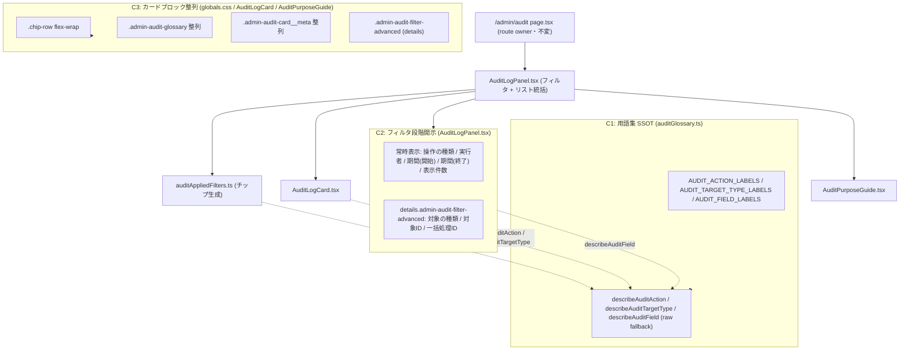

# Phase 2 設計 — main

> 上流: `../phase-01/main.md` / `../phase-01/spec-extraction-map.md`。本ファイルは concern 分割・状態所有権・degrade の設計実体。

## 1. concern 分割（C1 / C2 / C3）

## 2. lane 設計（3 以下）

| lane | 範囲 | 並列性 |
| --- | --- | --- |
| lane 1 | C1（`auditGlossary.ts` map + helper 追加） | 独立（C2/C3 の依存元・先行） |
| lane 2 | C2（`AuditLogPanel.tsx` 2 層段階開示）+ `auditAppliedFilters.ts` / `AuditLogCard.tsx` の describe helper 適用 | lane 1 完了後 |
| lane 3（validation） | C3（`globals.css` 整列 + `AuditPurposeGuide.tsx` 軽微調整）+ テスト追従 | 直列で締める（lane 1/2 を集約） |

## 3. 既存コンポーネント再利用可否（[FB-SDK-07-1]）

| concern | 使用する既存 primitive / 機構 | 新規追加 |
| --- | --- | --- |
| C1（用語集 SSOT） | — （純関数 + 定数。primitive 不要） | なし |
| C2（フィルタ段階開示） | `FormField` / `Input` / `Select` / `Button` / native `
` / `
` | なし（native `
` は HTML 標準・primitive 追加に当たらない） |
| C3（カードブロック整列） | `Card` / `Chip`（既存）+ `globals.css` のクラス調整 | なし |

> 新規 primitive ゼロ（AC-10）。`apps/web/src/components/ui/` への新規ファイル追加なし。`
`/`
` はブラウザ標準要素であり primitive catalog の拡張ではない。

## 4. details `open` 状態の設計判断（[VSCPKR-03]）

| 項目 | 決定 | 根拠 |
| --- | --- | --- |
| details 開閉の所有 | **DOM 属性 `
`**（内部 `useState` を新設しない） | ネイティブ `
` の uncontrolled 挙動を尊重。ユーザーのトグルはブラウザに委ねる |
| `defaultOpen` 算出 | `Boolean(filters.targetType \|\| filters.targetId \|\| filters.batchId)`（詳細 3 項目のいずれかに値があれば true） | 適用中の高度条件を隠さない（AC-2）。値が無ければ閉じて初見負荷を下げる |
| ステップ間 state 引き渡し | 該当なし（ウィザード形式でない） | 単一フォーム内の段階開示。details は表示制御のみ |

> details の `open` は「初期描画時の既定」を decide するだけ。その後のユーザー操作は uncontrolled。Phase 4 のテストは DOM 属性（`element.open` / `[open]` セレクタ）を検証対象にする。

## 5. 状態所有権テーブル

| 状態 | 所有者 | 種別 | 本タスクでの扱い |
| --- | --- | --- | --- |
| navigation（route / breadcrumb） | `page.tsx` + `AdminPageHeader` | server | **不変** |
| フィルタ入力値（query param 駆動） | `AuditLogPanel`（既存 form + searchParams） | client | **不変**（既存のまま再利用・`<input name>` 英語維持） |
| データ取得（audit endpoint） | `AuditLogPanel`（`safeServerFetch` 経由） | server fetch | **不変**（取得経路・query param キーを変えない） |
| details 開閉 | ネイティブ `
`（DOM・`open` 既定のみ算出） | DOM | **新設の `defaultOpen` 算出のみ**（内部 state なし） |
| 適用フィルタチップ | `auditAppliedFilters.ts`（純関数で生成） | derived | label/value を describe helper 経由で日本語化（C1） |

## 6. SafeResult / degrade 設計

| 対象 | データ source | error 時の degrade |
| --- | --- | --- |
| 監査ログリスト | audit endpoint（`safeServerFetch`） | 既存のエラー親切メッセージを維持（AC-12 で挙動不変）。本タスクは degrade ロジックを変更しない |

> 本タスクは表示文言・レイアウトの改善であり、データ取得・degrade ロジックには触れない。エラー時の親切メッセージ（#1202 実装）は不変。

## 7. handoff（Phase 3 へ）

1. concern 3 分割（C1/C2/C3）と lane 3 以下が確定。
2. details open は DOM 属性 `defaultOpen` 算出（内部 state なし）。
3. describe helper は表示専用で query param キーを変更しない（AC-9）。
4. 新規 primitive ゼロ・native `
` 利用（AC-10）。
5. Phase 3 で「日本語のみ vs 操作コード併記」「段階開示 vs フラット」「DOM 属性 vs 内部 state」の代替案を比較し go/no-go を判定する。
