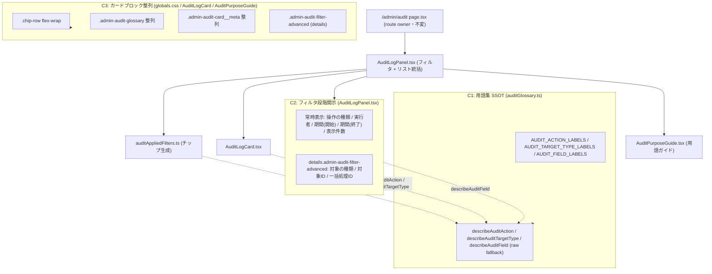

# Phase 2: 設計

[実装区分: 実装仕様書]（VISUAL / コード変更を伴う）

## メタ情報

| 項目 | 値 |
| --- | --- |
| タスク名 | admin-audit-log-japanese-clarity-and-filter-collapse |
| Phase 番号 | 2 / 13 |
| Phase 名称 | 設計 |
| 実行種別 | serial |
| 作成日 | 2026-06-11 |
| 上流 | Phase 1（要件定義） |
| 下流 | Phase 3（設計レビュー） |
| 状態 | completed |

## 目的

Phase 1 で確定した inventory・命名規則・AC を、**3 つの concern（C1: 用語集 SSOT 拡張 / C2: フィルタ段階開示 / C3: カードブロック整列）の設計**として確定する。各 concern の責務・props/signature・依存（既存 primitive 再利用）・CSS トークン割当を、後続実装者が迷わず実装できる粒度まで落とす。**新規 primitive ゼロ・API/D1/shared 型変更ゼロ**を設計面で担保する。details の `open` 既定は内部 state ではなく `defaultOpen` 算出（詳細フィルタ値の有無）で決める旨を設計判断として記載する。

## 実行タスク

1. **C1 設計（`auditGlossary.ts`）**: `AUDIT_ACTION_LABELS` / `AUDIT_TARGET_TYPE_LABELS` / `AUDIT_FIELD_LABELS`（Readonly Record）+ `describeAuditAction` / `describeAuditTargetType` / `describeAuditField`（未登録 raw fallback）の signature を `outputs/phase-02/component-map.md` に確定する。
2. **C2 設計（`AuditLogPanel.tsx`）**: 2 層段階開示（常時 5 項目 + `<details className="admin-audit-filter-advanced">` の 3 項目）の構造、`<summary>` 文言、details の `open` 既定算出ロジックを確定する。
3. **C3 設計（`globals.css` / `AuditLogCard.tsx` / `AuditPurposeGuide.tsx`）**: `.chip-row` flex-wrap、`.admin-audit-glossary` / `.admin-audit-card__meta` 整列、`.admin-audit-filter-advanced`（details）の CSS トークン割当を確定する。
4. **既存コンポーネント再利用可否の明示（[FB-SDK-07-1]）**: `Card` / `FormField` / `Input` / `Select` / `Button` / `Chip` / native `<details>` の再利用で新規 primitive ゼロを担保することを明記する。
5. **details open 状態の設計判断（[VSCPKR-03]）**: details の開閉が内部 `useState` ではなく、詳細フィルタ（targetType / targetId / batchId）の値有無から算出する `defaultOpen` の `<details open={...}>`（DOM 属性）で決まることを明記する。
6. **layout-blueprint 作成**: フィルタ 2 層 + 適用チップ + カード整列の ASCII 図、token 割当、レスポンシブを `outputs/phase-02/layout-blueprint.md` に書く。
7. **component-map 作成**: 各コンポーネントの責務・props・依存（既存 primitive 対応）を `outputs/phase-02/component-map.md` に書く。

## concern 分割（C1 / C2 / C3）



### lane 設計（3 以下）

| lane | 範囲 | 並列性 |
| --- | --- | --- |
| lane 1 | C1（`auditGlossary.ts` map + helper 追加） | 独立（他 concern の依存元・先行） |
| lane 2 | C2（`AuditLogPanel.tsx` 2 層段階開示）+ `auditAppliedFilters.ts` / `AuditLogCard.tsx` の describe helper 適用 | lane 1 完了後 |
| lane 3（validation） | C3（`globals.css` 整列 + `AuditPurposeGuide.tsx` 軽微調整）+ テスト追従 | 直列で締める |

## details `open` 状態の設計判断（[VSCPKR-03]）

| 項目 | 決定 | 根拠 |
| --- | --- | --- |
| details 開閉の所有 | **DOM 属性 `<details open={defaultOpen}>`**（内部 `useState` を新設しない） | ネイティブ `<details>` の uncontrolled 挙動を尊重。ユーザーのトグルはブラウザに委ねる |
| `defaultOpen` 算出 | `Boolean(filters.targetType \|\| filters.targetId \|\| filters.batchId)`（詳細 3 項目のいずれかに値があれば true） | 適用中の高度条件を隠さない（AC-2）。値が無ければ閉じて初見負荷を下げる |
| ステップ間 state 引き渡し | 該当なし（ウィザード形式でない） | 単一フォーム内の段階開示であり、details は表示制御のみ |

> details の `open` は「初期描画時の既定」を decide するだけで、その後のユーザー操作は uncontrolled。再レンダリング（検索実行で searchParams 変化）時に詳細フィルタ値があれば再度 `open` 既定になる。

## 状態所有権テーブル

| 状態 | 所有者 | 種別 | 本タスクでの扱い |
| --- | --- | --- | --- |
| navigation（route / breadcrumb） | `page.tsx` + `AdminPageHeader` | server | **不変** |
| フィルタ入力値（query param 駆動） | `AuditLogPanel`（既存 form + searchParams） | client | **不変**（既存のまま再利用・name 属性英語維持） |
| データ取得（audit endpoint） | `AuditLogPanel`（`safeServerFetch` 経由） | server fetch | **不変**（取得経路・query param キーを変えない） |
| details 開閉 | ネイティブ `<details>`（DOM・`open` 既定のみ算出） | DOM | **新設の `defaultOpen` 算出のみ**（内部 state なし） |
| 適用フィルタチップ | `auditAppliedFilters.ts`（純関数で生成） | derived | label/value を describe helper 経由で日本語化（C1） |

## C1: `auditGlossary.ts` signature（確定）

```ts
export const AUDIT_ACTION_LABELS: Readonly<Record<string, string>> = { /* attendance.add: "出席を追加" 等 */ };
export const AUDIT_TARGET_TYPE_LABELS: Readonly<Record<string, string>> = { /* meeting: "開催日" 等 */ };
export const AUDIT_FIELD_LABELS: Readonly<Record<string, string>> = { /* action: "操作の種類" 等（query param キー → 表示ラベル） */ };

export const describeAuditAction = (code: string): string => AUDIT_ACTION_LABELS[code] ?? code;
export const describeAuditTargetType = (code: string | null): string =>
  code == null ? "—" : (AUDIT_TARGET_TYPE_LABELS[code] ?? code);
export const describeAuditField = (key: string): string => AUDIT_FIELD_LABELS[key] ?? key;
```

> 未登録 raw fallback は情報欠落防止の安全弁（常用想定ではない）。未登録コードが出た場合は Phase 12 未タスク化候補として記録する。具体値は `_shared-context.md` §4 C1 を正本とする。

## C2: フィルタ段階開示の構造（確定）

- **常時表示**: 操作の種類（action）/ 実行者（メール）（actorEmail）/ 期間（開始）（from）/ 期間（終了）（to）/ 表示件数（limit）＋ 検索 / リセット
- **詳細な絞り込み**: `<details className="admin-audit-filter-advanced" open={defaultOpen}>` + `<summary>詳細な絞り込み（対象・一括処理ID）</summary>` → 対象の種類（targetType）/ 対象ID（targetId）/ 一括処理ID（batchId）
- 全 `FormField` の `label` は `describeAuditField(key)` 経由。`<input name>` / datalist の `id` は query param キー（英語）を維持。
- datalist `placeholder` は日本語例示（例: 操作の種類 = 「例: 出席を追加」）。生コード露出を避ける。

## SafeResult / degrade 設計

| 対象 | データ source | error 時の degrade |
| --- | --- | --- |
| 監査ログリスト | audit endpoint（`safeServerFetch`） | 既存のエラー親切メッセージを維持（AC-12 で挙動不変）。本タスクは degrade ロジックを変更しない |

## 参照資料

### タスク内部資料

| 種別 | パス | 用途 |
| --- | --- | --- |
| 必須 | outputs/phase-01/main.md | inventory / 命名規則 / AC |
| 必須 | outputs/phase-01/spec-extraction-map.md | 要望 → 真因 → AC → ファイル |
| 必須 | apps/web/src/components/admin/auditGlossary.ts | 既存 map（`AUDIT_GLOSSARY` / `AUDIT_ACTION_PRESETS` / `AUDIT_TARGET_TYPE_PRESETS`）の実 signature |
| 必須 | apps/web/src/components/ui/FormField.tsx | `FormField` の label / aria 配線 signature |

### システム仕様（aiworkflow-requirements）

| 参照資料 | パス | 用途 |
| --- | --- | --- |
| UI/UX 設計原則 | `.claude/skills/aiworkflow-requirements/references/ui-ux-design-principles-core.md` | 段階開示・余白リズム |
| UI/UX primitives | `.claude/skills/aiworkflow-requirements/references/ui-ux-atoms-patterns-core.md` | primitive 再利用ルール |
| アーキテクチャ境界 | `.claude/skills/aiworkflow-requirements/references/architecture-admin-api-client.md` | apps/web → apps/api 境界 |

### プロジェクト spec 正本

| 種別 | パス | 用途 |
| --- | --- | --- |
| 必須 | docs/00-getting-started-manual/specs/09b-design-tokens.md | token 値・HEX 禁止 |
| 必須 | docs/00-getting-started-manual/specs/09c-primitives.md | primitive catalog |

## 実行手順

### ステップ 1: concern 分割と lane の確定

- 上記 Mermaid を `outputs/phase-02/main.md` に貼る。
- lane 設計（3 以下）を main.md に書く。
- [FB-SDK-07-1] 既存 primitive 再利用可否を明記する。

### ステップ 2: layout-blueprint の作成

- `outputs/phase-02/layout-blueprint.md` に下記を書く:
  - フィルタ 2 層（常時 + details）の ASCII ワイヤフレーム
  - 適用チップ行・用語集グリッド・カード meta の整列レイアウト ASCII 図
  - 各要素の余白（`--ubm-space-*`）・色（`--ubm-color-*`）割当
  - レスポンシブ（mobile 1col → wide multi col）

### ステップ 3: component-map の作成

- `outputs/phase-02/component-map.md` に下記を書く:
  - 各コンポーネントの責務・props・依存
  - C1 helper / map の signature
  - 既存 primitive 対応表
  - details `open` 算出の設計判断

## 統合テスト連携

| 連携先 Phase | 連携内容 |
| --- | --- |
| Phase 3 | alternative 案でこの concern 分割・段階開示方式の妥当性を検証 |
| Phase 4 | describe helper の raw fallback / details open（DOM 属性）を TDD RED のテスト操作対象として明記する根拠 |
| Phase 5 | component-map を runbook の章立て（修正ファイル一覧）にする |
| Phase 9 | token-audit で `globals.css` の HEX ゼロを確認 |

## 多角的チェック観点（AIが判断）

| 観点 | 不変条件 / AC | 確認内容 |
| --- | --- | --- |
| 新規 primitive 禁止 | AC-10 / ui-prototype #3 | C1〜C3 が既存 `Card` / `FormField` / `Input` / `Select` / `Button` / `Chip` / native `<details>` のみで成立する |
| details open 管理 | [VSCPKR-03] | details の `open` は DOM 属性 `defaultOpen` 算出であり内部 state を新設しない。Phase 4 のテスト操作対象が DOM 属性であることを担保 |
| FormField 経由 | #9 / AC-10 | 直接 `<input>` を増やさず `FormField` を維持する |
| API/D1/shared 型不変 | AC-9 | `<input name>` / datalist id（= query param キー）を変更しない。describe helper は表示専用 |
| token 正本 | AC-8 | layout-blueprint の色/余白割当が `tokens.css` 実在値のみ |
| a11y 維持 | AC-11 | `FormField` の label 関連付け・`<details>`/`<summary>` キーボード操作・適用フィルタ `aria-label="現在の絞り込み条件"` を維持 |
| 挙動不変 | AC-12 | 検索 / リセット / ページネーション / PII マスク / JSON 開示は component-map 上「挙動不変で温存」と明記する |

## サブタスク管理

| # | サブタスク | 担当 Phase | 状態 | 備考 |
| --- | --- | --- | --- | --- |
| 1 | C1 helper/map signature 確定 | 2 | completed | component-map.md |
| 2 | C2 段階開示構造確定 | 2 | completed | summary 文言 / defaultOpen 算出 |
| 3 | C3 CSS トークン割当確定 | 2 | completed | chip-row / glossary / card meta / advanced |
| 4 | 既存 primitive 再利用可否明示 | 2 | completed | [FB-SDK-07-1] |
| 5 | details open（DOM 属性）設計判断 | 2 | completed | [VSCPKR-03] |
| 6 | layout-blueprint 作成 | 2 | completed | ASCII + token 割当 + responsive |
| 7 | component-map 作成 | 2 | completed | 責務 / props / 依存 |

## 成果物

| 種別 | パス | 説明 |
| --- | --- | --- |
| ドキュメント | outputs/phase-02/main.md | concern 分割 / lane / 状態所有権 / 再利用可否 / details open 判断 |
| ドキュメント | outputs/phase-02/layout-blueprint.md | フィルタ 2 層 + チップ + カード整列の ASCII / token 割当 / responsive |
| ドキュメント | outputs/phase-02/component-map.md | 各コンポーネント責務 / C1 signature / primitive 対応 / details open 判断 |
| メタ | artifacts.json | Phase 2 を completed に維持 |

## 完了条件

- [ ] `outputs/phase-02/main.md` に concern 分割（Mermaid）と lane 設計（3 以下）が書かれている
- [ ] 既存 primitive 再利用可否が明示され、新規 primitive ゼロ方針が担保されている（[FB-SDK-07-1]）
- [ ] details の `open` が DOM 属性 `defaultOpen` 算出であり内部 state を新設しない点が明記されている（[VSCPKR-03]）
- [ ] 状態所有権テーブル（navigation 不変 / フィルタ既存 / details open 算出のみ）が完成している
- [ ] C1 helper/map signature と未登録 raw fallback が確定している
- [ ] `outputs/phase-02/layout-blueprint.md` にフィルタ 2 層・チップ・カード整列の ASCII・token 割当・responsive が書かれている
- [ ] `outputs/phase-02/component-map.md` に各コンポーネント責務 + C1 signature + primitive 対応が書かれている

## タスク100%実行確認【必須】

- [ ] サブタスク 1〜7 が完了している
- [ ] `outputs/phase-02/{main,layout-blueprint,component-map}.md` が配置済み
- [ ] describe helper が表示専用であり query param キー名（`<input name>`）を変更しない設計になっている（AC-9）
- [ ] layout-blueprint の色/余白が `tokens.css` 実在値のみで HEX 直書きがゼロ（AC-8）
- [ ] 新規 primitive 追加がゼロであることが component-map で確認できる（AC-10）
- [ ] artifacts.json の Phase 2 ステータスが completed に整合している

## 次Phase

- 次: Phase 3（設計レビュー）
- 引き継ぎ事項: concern 分割 / 状態所有権 / C1 signature / details open 算出 / layout-blueprint / component-map
- ブロック条件: describe helper が query param キーを変更する設計になっている、または layout-blueprint に HEX 直書きがある場合は再設計
