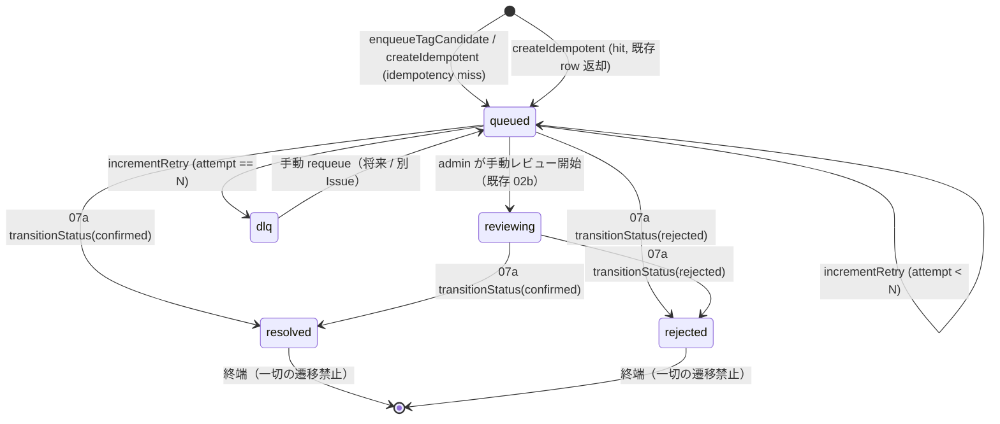

# tag_assignment_queue State Machine



## guard 規則（既存 `ALLOWED_TRANSITIONS` 拡張）

| from | allowed to |
| --- | --- |
| queued | reviewing, resolved, rejected, dlq（本タスク追加） |
| reviewing | resolved, rejected |
| resolved | (なし) |
| rejected | (なし) |
| dlq | queued（手動 requeue 専用、将来） |

## SQL 形（追加分）

```sql
-- guarded UPDATE: incrementRetry
UPDATE tag_assignment_queue
SET attempt_count = attempt_count + 1,
    last_error = ?,
    next_visible_at = ?,
    updated_at = ?
WHERE queue_id = ? AND status = 'queued';

-- guarded UPDATE: moveToDlq
UPDATE tag_assignment_queue
SET status = 'dlq', dlq_at = ?, last_error = ?, updated_at = ?
WHERE queue_id = ? AND status = 'queued';

-- idempotent INSERT
INSERT INTO tag_assignment_queue (queue_id, member_id, response_id, idempotency_key, suggested_tags_json, status)
VALUES (?, ?, ?, ?, '[]', 'queued')
ON CONFLICT(idempotency_key) DO NOTHING;
SELECT * FROM tag_assignment_queue WHERE idempotency_key = ?;
```
