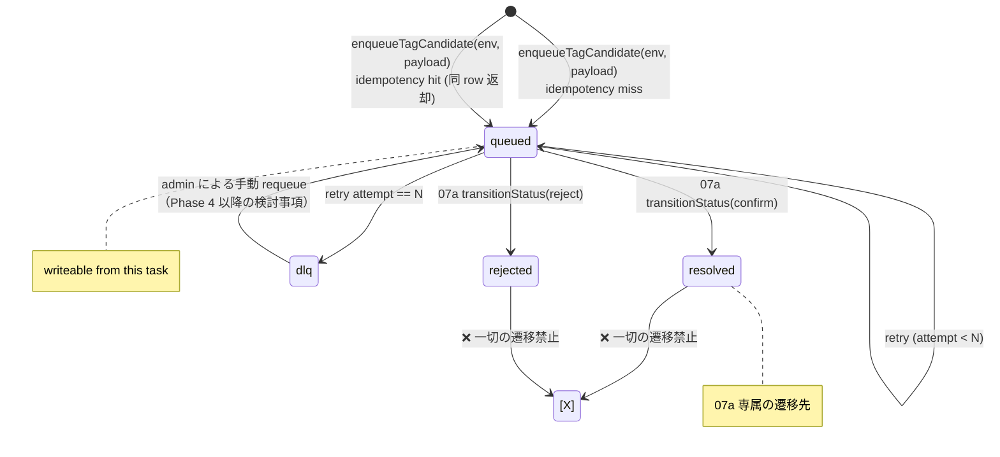

# Phase 2: 設計

## メタ情報

| 項目 | 値 |
| --- | --- |
| タスク名 | ut-02a-tag-assignment-queue-management |
| Phase 番号 | 2 / 3 |
| Phase 名称 | 設計 |
| Wave | 2-plus (serial) |
| 作成日 | 2026-05-01 |
| 前 Phase | 1 (要件定義) |
| 次 Phase | 3 (設計レビュー) |
| 状態 | spec_created |

## 目的

`tag_assignment_queue` 書き込み側の **state machine / idempotency key / retry / DLQ / shared schema ownership** を確定し、02a `memberTags.ts` の read-only 制約を **型レベル**で固定する設計を明示する。あわせて仕様語↔実装語対応表と、`apps/api/migrations/*.sql` × repository の grep 照合表を作成する。

## 実行タスク

1. state machine 設計（Mermaid）
2. idempotency key 設計（unique index + 既存 row 返却）
3. retry / DLQ 設計（指数バックオフ + status 拡張）
4. 仕様語↔実装語対応表
5. shared schema ownership 宣言（zod schema の単一所有者）
6. migration × repository 照合表（grep 一致）
7. 02a `memberTags.ts` の read-only 型 test 設計

## 参照資料

| 種別 | パス | 用途 |
| --- | --- | --- |
| 必須 | outputs/phase-01/main.md | scope と AC |
| 必須 | docs/00-getting-started-manual/specs/08-free-database.md | tag_assignment_queue 列定義 |
| 必須 | apps/api/migrations/*.sql | 既存 migration（grep 元） |
| 必須 | docs/30-workflows/completed-tasks/02b-parallel-meeting-tag-queue-and-schema-diff-repository/index.md | 既存 02b repo signature |
| 必須 | docs/30-workflows/completed-tasks/07a-parallel-tag-assignment-queue-resolve-workflow/phase-02.md | resolve 側の handler 期待形 |

## 実行手順

### ステップ 1: state machine



### ステップ 2: idempotency key

- key 構成: `(member_id, response_id, tag_code)` の複合 unique index `idx_tag_queue_idempotency`。
- 衝突時の挙動: INSERT を試行 → `UNIQUE constraint failed` を catch → 既存 row を SELECT → `{ queueId, isExisting: true }` を返す。
- D1 制約: `INSERT ... ON CONFLICT DO NOTHING RETURNING id` をサポートする SQLite 文法を採用し、return が空なら SELECT へフォールバック。
- key を request 側で渡せるか: 不要（payload から決定論的に生成）。

### ステップ 3: retry / DLQ

| 項目 | 設計 |
| --- | --- |
| retry トリガ | enqueue 時の D1 transient error（busy / lock / IO） |
| 戦略 | 指数バックオフ 1s / 2s / 4s、最大 3 回 |
| 終端 | attempt == 3 で `status='dlq'`、`last_error_message` カラムに最終 error を格納 |
| DLQ 保存先 | 同一 table の `status='dlq'`（option 1：migration コスト最小） |
| 観測 | `audit_log` に `action='tag_queue.dlq_moved'` を記録 |
| 復旧 | 手動 requeue（Phase 4 以降のサブタスクで設計） |

### ステップ 4: 仕様語↔実装語対応表

| 仕様語（docs / UI） | 実装語（DB / API / repository） | 出現箇所 | 備考 |
| --- | --- | --- | --- |
| candidate | queued | column `status`, repo enum | 入口の状態 |
| confirmed | resolved | column `status`, repo enum | 07a が遷移 |
| rejected | rejected | column `status`, repo enum | 仕様 / 実装一致 |
| (DLQ) | dlq | column `status` 拡張 | 本タスクで導入 |
| 投入 | enqueue | repo function 名 | |
| 解決 | resolve / transitionStatus | repo function / 07a workflow | |

### ステップ 5: shared schema ownership

- 本タスクが zod schema `tagAssignmentQueueRow` の **単一所有者**となる。
- export 場所: `apps/api/src/schemas/tagAssignmentQueue.ts`。
- 07a / 03b / 08a はこの schema を import only。再定義禁止。
- 重複定義検出は `pnpm lint` の dependency-cruiser ルールで担保。

### ステップ 6: migration × repository grep 照合表

| column | migration (`apps/api/migrations/*.sql`) | repository TypeScript 型 | 照合方法 |
| --- | --- | --- | --- |
| id | TEXT PRIMARY KEY | `id: string` | grep `tag_assignment_queue.*id` |
| member_id | TEXT NOT NULL | `memberId: string` | snake↔camel mapper 経由 |
| response_id | TEXT NOT NULL | `responseId: string` | 同上 |
| tag_code | TEXT NOT NULL | `tagCode: string` | 同上 |
| status | TEXT NOT NULL CHECK(status IN ('queued','resolved','rejected','dlq')) | `'queued'\|'resolved'\|'rejected'\|'dlq'` | enum 一致 |
| attempt_count | INTEGER NOT NULL DEFAULT 0 | `attemptCount: number` | retry 用 |
| last_error_message | TEXT | `lastErrorMessage: string \| null` | DLQ 用 |
| enqueued_at | TEXT NOT NULL | `enqueuedAt: string`（ISO8601） | |
| resolved_at | TEXT | `resolvedAt: string \| null` | 07a が更新 |
| idempotency_index | UNIQUE (member_id, response_id, tag_code) | unique index | INSERT 衝突検出 |

> 実装時は本表を `outputs/phase-02/migration-grep-table.md` に転記し、`grep -n "tag_assignment_queue" apps/api/migrations/*.sql` の生ログを併記する。

### ステップ 7: 02a `memberTags.ts` read-only 型 test 設計

```ts
// apps/api/src/repositories/__tests__/memberTags.readonly.test-d.ts
import * as memberTags from '../memberTags';
type Exports = typeof memberTags;
type WriteKeys = {
  [K in keyof Exports]: K extends `insert${string}` | `update${string}` | `delete${string}` | `upsert${string}` ? K : never
}[keyof Exports];
// 期待: WriteKeys は never に縮退する
type _Assert = WriteKeys extends never ? true : never;
const _: _Assert = true;
```

- 上記を `vitest --typecheck` 系で fail 化する。
- 加えて dependency-cruiser で `apps/web → tagAssignmentQueue.ts` の import を `error`、`memberTags.ts` への write 系 mock を grep で禁止。

## handler signature（本タスクで export する関数）

```ts
// apps/api/src/repositories/tagAssignmentQueue.ts
export type EnqueuePayload = { memberId: string; responseId: string; tagCode: string; source: 'forms_sync' };
export type EnqueueResult = { queueId: string; status: 'queued'; enqueuedAt: string; isExisting: boolean };

export async function enqueueTagCandidate(env: Env, payload: EnqueuePayload): Promise<EnqueueResult>;
export async function findById(env: Env, queueId: string): Promise<TagQueueRow | null>;
export async function listPending(env: Env, opts: { limit: number; cursor?: string }): Promise<{ rows: TagQueueRow[]; nextCursor?: string }>;
export async function transitionStatus(env: Env, queueId: string, to: 'resolved' | 'rejected', context: { actorUserId: string }): Promise<{ ok: true } | { ok: false; reason: 'state_conflict' | 'not_found' }>;
export async function moveToDlq(env: Env, queueId: string, error: { message: string }): Promise<void>;
```

## 統合テスト連携

| 連携先 Phase | 連携内容 |
| --- | --- |
| Phase 3 | alternative 評価（idempotency / DLQ 保存形態 / 02a 担保） |
| 07a | `transitionStatus` 経由で resolve を実行 |
| 08a | repository contract test の対象 |

## 多角的チェック観点

| 不変条件 | 設計担保 | 理由 |
| --- | --- | --- |
| #5 | repository は `apps/api` 内のみ、dependency-cruiser で `apps/web` からの import を error | data access boundary |
| #13 | `member_tags` への INSERT は本 repository から行わない（grep で確認） | tag 経路の単一化 |
| 02a read-only | type-level test で memberTags.ts の write export を禁止 | 02a 不変条件継承 |
| audit | enqueue / transition / dlq 移動で audit_log に entry | 操作トレース |
| 無料枠 | 1 enqueue = queue 1 INSERT + audit 1 INSERT = 2 writes | 100k writes/日 |

## サブタスク管理

| # | サブタスク | 担当 Phase | 状態 | 備考 |
| --- | --- | --- | --- | --- |
| 1 | state machine 図 | 2 | spec_created | Mermaid |
| 2 | idempotency key 設計 | 2 | spec_created | unique index |
| 3 | retry/DLQ 設計 | 2 | spec_created | status 拡張 |
| 4 | 仕様語↔実装語対応表 | 2 | spec_created | 6 行 |
| 5 | shared schema ownership | 2 | spec_created | zod 単一所有 |
| 6 | migration grep 照合表 | 2 | spec_created | 9 列 |
| 7 | 02a read-only 型 test 設計 | 2 | spec_created | vitest typecheck |

## 成果物

| 種別 | パス | 説明 |
| --- | --- | --- |
| ドキュメント | outputs/phase-02/main.md | サマリー |
| ドキュメント | outputs/phase-02/state-machine.md | Mermaid + handler signature |
| ドキュメント | outputs/phase-02/spec-extraction-map.md | 仕様語↔実装語 |
| ドキュメント | outputs/phase-02/migration-grep-table.md | grep 照合表 |
| メタ | artifacts.json | Phase 2 を spec_created |

## 完了条件

- [ ] state machine 図が valid Mermaid
- [ ] idempotency key が複合 unique index で表現されている
- [ ] retry/DLQ の終端条件が明示
- [ ] 仕様語↔実装語対応表が 6 行以上
- [ ] shared schema ownership が単一ファイルに固定
- [ ] migration × repository grep 照合表が 9 列以上一致
- [ ] 02a `memberTags.ts` の read-only 型 test コードが提示されている

## タスク100%実行確認

- 全成果物が outputs/phase-02 配下
- 不変条件 #5, #13, 02a read-only への設計担保
- artifacts.json で Phase 2 を spec_created

## 次 Phase

- 次: 3 (設計レビュー)
- 引き継ぎ: state machine + idempotency + retry/DLQ を alternative 評価へ
- ブロック条件: state machine / idempotency / retry のいずれか未確定なら次へ進めない

## 環境変数一覧

| 区分 | 代表値 | 置き場所 | 利用箇所 |
| --- | --- | --- | --- |
| D1 binding | DB | wrangler binding | repository 全関数 |

## 設定値表

| 項目 | 方針 | 根拠 |
| --- | --- | --- |
| idempotency 単位 | (memberId, responseId) | 再回答での re-evaluate 可能性。tagCode は admin resolve 時に確定するため enqueue key には含めない |
| retry 回数 | 3 | 無料枠 / 体感バランス |
| retry 戦略 | 指数バックオフ 1s/2s/4s | transient error 想定 |
| DLQ | 同一 table の `status='dlq'` | migration コスト最小 |
| schema 所有 | apps/api/src/schemas/tagAssignmentQueue.ts | 単一所有原則 |

## 依存マトリクス

| 種別 | 対象 | 役割 |
| --- | --- | --- |
| 上流 | 02a memberTags.ts | read-only 制約源 |
| 上流 | 02b 既存 queue schema | 列定義の出発点 |
| 上流 | 03a forms sync | enqueue 呼び出し元 |
| 下流 | 07a resolve workflow | transitionStatus 利用者 |
| 下流 | 08a test | contract test |

## Module 設計

| module | path | 責務 |
| --- | --- | --- |
| tagAssignmentQueue (repo) | apps/api/src/repositories/tagAssignmentQueue.ts | CRUD + 状態遷移 + idempotency + retry/DLQ |
| tagAssignmentQueueSchema | apps/api/src/schemas/tagAssignmentQueue.ts | zod schema 単一所有 |
| enqueueTagCandidate | (上記 repo の export) | 03b sync hook 入口 |
| memberTags (read-only) | apps/api/src/repositories/memberTags.ts | 02a 制約継承（write 禁止） |
