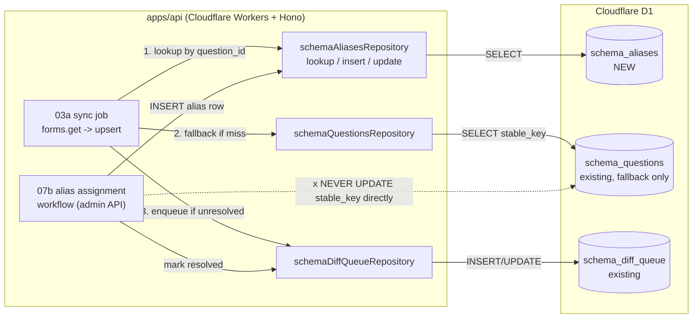

# Phase 2: 設計

## メタ情報

| 項目 | 値 |
| --- | --- |
| タスク名 | issue-191-schema-aliases-ddl-and-07b-alias-resolution-wiring |
| Phase 番号 | 2 / 13 |
| Phase 名称 | 設計 |
| 作成日 | 2026-04-30 |
| 前 Phase | 1（要件定義） |
| 次 Phase | 3（設計レビュー） |
| 状態 | spec_created |

## 目的

Phase 1 で確定した要件・AC・Ownership を入力に、`schema_aliases` テーブルの DDL、apps/api 配下の module 配置、03a 互換 path、07b 書き込み path を確定する。

## 構造図（Mermaid）



## env / dependency matrix

| 種別 | 値 | 備考 |
| --- | --- | --- |
| Runtime | Cloudflare Workers (apps/api) | 不変条件 #5 |
| DB | Cloudflare D1 binding | 既存 binding 流用 |
| Migration tool | `wrangler d1 migrations` 経由（`scripts/cf.sh` ラッパー） | 直接 wrangler 禁止 |
| 新規依存 npm | なし | 既存 better-sqlite / kysely 等を踏襲 |
| 新規 secret | なし | - |

## module 設計

| パス（提案） | 役割 | 種別 |
| --- | --- | --- |
| `apps/api/migrations/<timestamp>_create_schema_aliases.sql` | DDL | 新規 |
| `apps/api/src/repositories/schemaAliases.ts` | repository（lookup / insert / update） | 新規 |
| `apps/api/src/repositories/schemaQuestions.ts` | 03a fallback の追加メソッド `findStableKeyById(questionId)` | 既存に追加 |
| `apps/api/src/services/sync/resolveStableKey.ts` | lookup 順序ロジック（aliases → questions fallback） | 新規 |
| `apps/api/src/services/admin/aliasAssignment.ts` | 07b workflow の書き込み先切替 | 既存 patch |
| `apps/api/test/repositories/schemaAliases.contract.test.ts` | 契約テスト | 新規 |

## DDL 案

```sql
-- migrations/<timestamp>_create_schema_aliases.sql
CREATE TABLE IF NOT EXISTS schema_aliases (
  id              TEXT PRIMARY KEY,                 -- ULID 推奨
  stable_key      TEXT NOT NULL,                    -- 解決後の正規 stableKey
  alias_question_id TEXT NOT NULL,                  -- Google Forms の question_id
  alias_label     TEXT,                             -- 当時の question label（出自記録用、nullable）
  source          TEXT NOT NULL DEFAULT 'manual',   -- 'manual' | 'auto' | 'migration'
  created_at      TEXT NOT NULL DEFAULT (datetime('now')),
  resolved_by     TEXT,                             -- admin user id（07b 書き込み元）
  resolved_at     TEXT,                             -- 解決確定時刻
  UNIQUE (alias_question_id)                        -- 1 question_id = 1 alias
);

CREATE INDEX IF NOT EXISTS idx_schema_aliases_stable_key
  ON schema_aliases (stable_key);
```

### カラム設計理由

| カラム | 理由 |
| --- | --- |
| `id` | ULID で時系列ソート可能、admin UI 表示と監査用 |
| `stable_key` | 03a が lookup する正規キー。INDEX を貼り読み込み高速化 |
| `alias_question_id` | Google Forms の生 ID。UNIQUE で重複登録防止 |
| `alias_label` | 解決時点の question label snapshot。出自追跡用（不変条件 #1 の遵守証跡） |
| `source` | 自動 / 手動 / 移行のソース区別。運用判断材料 |
| `created_at` / `resolved_at` | 監査ログ。`resolved_at` は 07b 書き込みで埋まる |
| `resolved_by` | 07b workflow の admin user 紐付け。manual resolve では必須、migration source のみ nullable |

## 03a 互換 path（lookup 順序）

```
resolveStableKey(questionId, questionLabel):
  1. row = schemaAliasesRepository.lookup(questionId)
     -> hit: return row.stable_key (source: 'aliases')
  2. fallback = schemaQuestionsRepository.findStableKeyById(questionId)
     -> hit and not null: return fallback (source: 'questions_fallback')
  3. return null  -> caller が schema_diff_queue に unresolved enqueue
```

- 移行期間中: 1 と 2 が両方ヒットした場合は **1 を優先**（aliases 正本）
- 移行終端条件: `schema_questions.stable_key IS NOT NULL` の全行が `schema_aliases` にも存在する状態に到達したら、Phase 12 ドキュメントで fallback 廃止を予告

## 07b 書き込み path

```
assignAlias(diffQueueRow, stableKey, adminUserId):
  schemaAliasesRepository.insert({
    id: ulid(),
    stable_key: stableKey,
    alias_question_id: diffQueueRow.question_id,
    alias_label: diffQueueRow.question_label,
    source: 'manual',
    resolved_by: adminUserId,
    resolved_at: now()
  })
  schemaDiffQueueRepository.markResolved(diffQueueRow.id)
  // schema_questions への UPDATE は禁止
```

## 不変条件マッピング

| 不変条件 | 適合方法 |
| --- | --- |
| #1（schema 固定禁止） | alias を専用テーブルに分離、コードに stableKey 直書きしない |
| #5（D1 直接アクセスは apps/api のみ） | 全 repository / service を `apps/api/src/` 配下に閉じる |
| #14（schema 変更は /admin/schema に集約） | 07b workflow からのみ書き込み、03a は read-only |

## 成果物

| 種別 | パス | 説明 |
| --- | --- | --- |
| ドキュメント | outputs/phase-02/main.md | 設計本体 |
| 図 | outputs/phase-02/schema-aliases-er.mermaid | ER / フロー図 |
| DDL | outputs/phase-02/ddl-draft.sql | DDL 案 |

## 実行タスク

- [ ] 本 Phase の目的に対応する仕様判断を本文に固定する
- [ ] docs-only / spec_created 境界を崩す実行済み表現がないことを確認する
- [ ] 次 Phase が参照する入力と出力を明記する

## 参照資料

- `index.md`
- `artifacts.json`
- `.claude/skills/task-specification-creator/references/phase-templates.md`
- `.claude/skills/task-specification-creator/references/quality-gates.md`
- `.claude/skills/aiworkflow-requirements/indexes/resource-map.md`

## 統合テスト連携

本 workflow は spec_created / docs-only のため、この Phase では統合テストを実行しない。実装タスクでは Phase 4 の verify suite と Phase 7 の AC matrix を入力に、apps/api 側で契約テストと NON_VISUAL evidence を収集する。

## 完了条件

- [ ] DDL 案がカラム 8 種すべて定義され UNIQUE / INDEX を含む
- [ ] 03a 互換 path（lookup 順序）が pseudo code で明示
- [ ] 07b 書き込み path が pseudo code で明示
- [ ] module 配置が `apps/api` 配下に閉じている（不変条件 #5）
- [ ] artifacts.json の phase 2 が `spec_created`

## 次 Phase への引き渡し

- 引き継ぎ事項: DDL / module 配置 / lookup 順序 / 07b 書き込み path
- 議論 open: `id` を ULID にするか UUID にするか（Phase 3 で alternative 比較）
