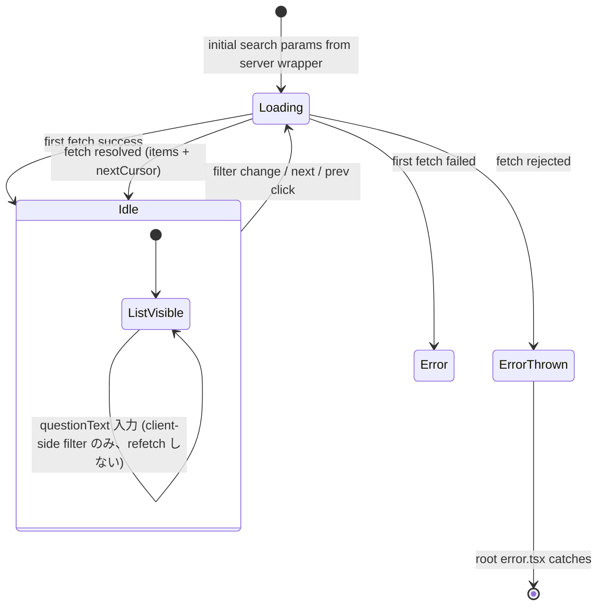

# Phase 2: 設計

## 1. 既存実装確認（Phase 5 実装着手前に再確認）

| 確認項目 | コマンド | 期待値 |
|---|---|---|
| audit endpoint shape | `grep -n "AdminAuditListResponseZ\|ListAuditQueryZ" apps/api/src/routes/admin/audit.ts` | `action / actorEmail / from / to / cursor / limit` を query 受理し `{ ok, items[], nextCursor, appliedFilters }` を返す |
| cursor encoding | `grep -n "encodeAuditCursor" apps/api/src/routes/admin/audit.ts` | `encodeAuditCursor({ createdAt, auditId })` → base64url |
| resolve payload に before/after stableKey が含まれるか | `grep -n "schema_diff.alias_assigned\|auditLogProvider.append" apps/api/src/workflows/schemaAliasAssign.ts` | `maskedBefore.stableKey` / `maskedAfter.stableKey` / `questionText` を含むこと（Phase 5 で実 record も grep）。**含まれなければ案 B 昇格** |
| shared primitive 存在 | `ls apps/web/src/components/ui/Pagination.* FormField.* Breadcrumb.* EmptyState.*` | parallel-09 で実装済み |
| 既存 admin api helper 方針 | `cat apps/web/src/lib/admin/api.ts` | `call<T>()` 内部関数経由で `/api/admin/*` を叩く構成 |
| Vitest DOM 環境 | `cat apps/web/vitest.config.ts` | jsdom or happy-dom |

## 2. 設計方針

- **endpoint 戦略**: 案 A（`/api/admin/audit?action=schema_diff.alias_assigned`）。fallback は案 B（`/api/admin/schema/history`）。
- **route 戦略**: 案 α（`/(admin)/admin/schema/history` 独立 route）。
- **component 分割**: server wrapper (`page.tsx`) は search params を読み serializable props として渡す。client component (`SchemaDiffHistoryPanel`) が初回 fetch、filter、pagination の state 管理を担う。
- **read-only**: 本タスクは fetch 系のみ。`useAdminMutation` は使わない。mutation hook を追加しない。
- **token 経由のみ**: 色は OKLch token utility のみ使用。HEX 禁止。
- **エラー方針**: fetch error は throw → root `error.tsx` で補足。component 内では握り潰さない。

## 3. component tree

```mermaid
flowchart TD
  A[apps/web/app/(admin)/admin/schema/history/page.tsx<br/>(Server Wrapper)] -->|initial filters + cursor| B[SchemaDiffHistoryPanel<br/>(Client Component)]
  B -->|Breadcrumb path| C[Breadcrumb<br/>admin > schema > history]
  B -->|filter inputs| D[FormField × 3<br/>(actorEmail / from / to)]
  B -->|client-only filter| E[question text input<br/>(client-side includes)]
  B -->|list render| F[table rows × ≤50]
  B -->|0件| G[EmptyState]
  B -->|pagination| H[Pagination<br/>(next / prev cursor)]
  B -.fetch.-> I[fetchSchemaAliasHistory()<br/>in apps/web/src/lib/admin/api.ts]
  I -.HTTP.-> J[/api/admin/audit?action=schema_diff.alias_assigned&.../]
```

## 4. ファイル設計

### 4.1 `apps/web/src/lib/admin/api.ts`（追加部のみ）

```ts
// 型定義（既存 admin/audit endpoint の AdminAuditListItemZ / AdminAuditListResponseZ を踏襲）
export interface SchemaAliasHistoryItem {
  auditId: string;
  actorId: string | null;
  actorEmail: string | null;
  action: string;               // "schema_diff.alias_assigned" 固定
  targetType: string | null;
  targetId: string | null;
  maskedBefore: unknown | null; // { stableKey?: string | null; label?: string | null; ... }
  maskedAfter: unknown | null;  // 同上
  parseError: boolean;
  createdAt: string;
}

export interface SchemaAliasHistoryQuery {
  actorEmail?: string;
  from?: string;     // YYYY-MM-DD or ISO
  to?: string;       // YYYY-MM-DD or ISO
  cursor?: string;
  limit?: number;    // default 50, max 100
}

export interface SchemaAliasHistoryResponse {
  ok: true;
  items: SchemaAliasHistoryItem[];
  nextCursor: string | null;
  appliedFilters: {
    action: string | null;
    actorEmail: string | null;
    targetType: string | null;
    targetId: string | null;
    from: string | null;
    to: string | null;
    limit: number;
  };
}

export async function fetchSchemaAliasHistory(
  query: SchemaAliasHistoryQuery = {},
  init?: { signal?: AbortSignal },
): Promise<SchemaAliasHistoryResponse>;
```

**実装方針**:
- 内部で `URLSearchParams` を組み立て、`action=schema_diff.alias_assigned` を **強制注入**（呼び出し側で上書き不可）。
- `/api/admin/audit?action=schema_diff.alias_assigned&...` を `fetch()`。
- レスポンスが `ok !== true` または HTTP non-2xx の場合は **throw** し、呼び出し元 client component が `role="alert"` で fail-soft 表示する。
- AbortSignal を `init.signal` で受け取り、React 18+ の effect cleanup と協調する。
- 既存 mutation helper 群（`patchMemberStatus` 等）とは別関数として export し、`call<T>()` 共通関数は再利用しない（read-only response shape が違い、throw 戦略も違うため）。

### 4.2 `apps/web/app/(admin)/admin/schema/history/page.tsx`（新規 / Server Wrapper）

```tsx
import type { ReactElement } from "react";
import { SchemaDiffHistoryPanel } from "@/components/admin/SchemaDiffHistoryPanel";

export const dynamic = "force-dynamic"; // session 認証 + 最新履歴を常に取得

export default function SchemaDiffHistoryPage({
  searchParams,
}: {
  searchParams: Record<string, string | string[] | undefined>;
}): ReactElement {
  return (
    <main
      data-page="admin-schema-history"
      className="mx-auto max-w-5xl space-y-6 px-6 py-8"
    >
      <h1 className="text-2xl font-bold">スキーマ resolve 履歴</h1>
      <SchemaDiffHistoryPanel initialSearchParams={searchParams} />
    </main>
  );
}
```

### 4.3 `apps/web/src/components/admin/SchemaDiffHistoryPanel.tsx`（新規 / Client Component）

```tsx
"use client";

import { useCallback, useEffect, useMemo, useRef, useState } from "react";
import { FormField } from "@/components/ui/FormField";
import { EmptyState } from "@/components/ui/EmptyState";
import { Pagination } from "@/components/ui/Pagination";
import {
  fetchSchemaAliasHistory,
  type SchemaAliasHistoryItem,
} from "@/lib/admin/api";

export interface SchemaDiffHistoryPanelProps {
  initialSearchParams: Record<string, string | string[] | undefined>;
}

interface FilterState {
  actorEmail: string;   // 完全一致（API 側 filter）
  from: string;         // YYYY-MM-DD（JST 入力）
  to: string;           // YYYY-MM-DD（JST 入力）
  questionText: string; // 部分一致（client side のみ）
}

interface PaginationState {
  currentCursor: string | null;
  nextCursor: string | null;
  cursorStack: (string | null)[];   // prev 戻り用。stack の top = currentCursor の 1 つ前
}

export function SchemaDiffHistoryPanel(
  props: SchemaDiffHistoryPanelProps,
): JSX.Element {
  // ... 後述 §5 の state machine
}
```

#### 表示行（table row）構造

| col | source field | 表示形式 |
|---|---|---|
| 操作日時 | `createdAt` | `<time dateTime={createdAt}>` で ISO そのまま（Phase 11 で JST 表記検討） |
| 操作者 email | `actorEmail` | プレーン text。null 時は `—` |
| before | `(maskedBefore as { stableKey?: string \| null }).stableKey ?? '—'` | `<code>` で monospace |
| after | `(maskedAfter as { stableKey?: string \| null }).stableKey ?? '—'` | `<code>` で monospace |
| question text | `(maskedAfter as { questionText?: string \| null }).questionText ?? (maskedBefore as { questionText?: string \| null }).questionText ?? '—'` | 折り返し可 |

### 4.4 `apps/web/app/(admin)/admin/schema/page.tsx`（修正 / 最小差分）

- 既存 SchemaDiffPanel の上部 or 下部に `Breadcrumb` + `<a href="/admin/schema/history">resolve 履歴を見る</a>` を追加する（最小差分）。
- 既存 SchemaDiffPanel 本体には触らない（不変条件 #14: SchemaDiffPanel は schema/page.tsx 以外で import 禁止 → 本タスクでも遵守）。

### 4.5 spec ファイル

- `apps/web/src/components/admin/__tests__/SchemaDiffHistoryPanel.component.spec.tsx`: 4 観点（filter / pagination / 空状態 / fetch エラー throw → ErrorBoundary 連携）
- `apps/web/src/lib/admin/__tests__/api.spec.ts`: 既存 file に `fetchSchemaAliasHistory()` の 4 ケース追加

## 5. 状態管理（pagination state machine）



**state 遷移ルール**:

| event | 遷移 |
|---|---|
| `filter (actorEmail/from/to)` 変更 → submit | `cursorStack=[], currentCursor=null` にリセットして fetch |
| `next` クリック | `cursorStack.push(currentCursor); currentCursor=nextCursor; fetch` |
| `prev` クリック | `currentCursor = cursorStack.pop() ?? null; fetch` |
| `questionText` 変更 | refetch しない（現 page 内の `items` を client-side filter） |
| fetch 失敗 | helper は throw、client component は `role="alert"` で fail-soft 表示 |

## 6. API 契約（案 A 前提）

### Request

```
GET /api/admin/audit?action=schema_diff.alias_assigned
  &actorEmail=<lowercase email>           (optional)
  &from=<YYYY-MM-DD or ISO>               (optional, JST date)
  &to=<YYYY-MM-DD or ISO>                 (optional, JST date)
  &cursor=<opaque base64url>              (optional)
  &limit=50                               (default)
```

### Response (200)

```jsonc
{
  "ok": true,
  "items": [
    {
      "auditId": "aud_xxx",
      "actorId": "usr_xxx",
      "actorEmail": "admin@example.com",
      "action": "schema_diff.alias_assigned",
      "targetType": "schema_alias",
      "targetId": "<diffId or questionId>",
      "maskedBefore": { "stableKey": null, "label": "..." },
      "maskedAfter":  { "stableKey": "member_name", "label": "..." },
      "parseError": false,
      "createdAt": "2026-05-19T00:00:00.000Z"
    }
  ],
  "nextCursor": "eyJj...",
  "appliedFilters": {
    "action": "schema_diff.alias_assigned",
    "actorEmail": null, "targetType": null, "targetId": null,
    "from": null, "to": null, "limit": 50
  }
}
```

### Error (4xx/5xx)

- 400 invalid cursor / invalid date → helper throw → client alert
- 401 / 403 admin 未認証 → middleware で `/login` redirect（本 component の責務外）
- 5xx → helper throw → client alert

## 7. 型定義（追加分まとめ）

| 型 | 定義先 | 用途 |
|---|---|---|
| `SchemaAliasHistoryItem` | `apps/web/src/lib/admin/api.ts` | 1 行分の DTO |
| `SchemaAliasHistoryQuery` | 同上 | helper 引数 |
| `SchemaAliasHistoryResponse` | 同上 | helper 戻り値 |
| `SchemaDiffHistoryPanelProps` | `apps/web/src/components/admin/SchemaDiffHistoryPanel.tsx` | initial search params |
| `FilterState` | 同上（local） | filter 入力 4 項目 |
| `PaginationState` | 同上（local） | cursor stack |

`@ubm-hyogo/shared` への型 export は本タスクでは行わない（admin web 内に閉じる）。将来 API 側で zod schema を共有する際は shared package へ昇格する。

## 8. 不変条件チェック（CLAUDE.md）

| 不変条件 | 適用 |
|---|---|
| #1 schema 固定しすぎない | OK（既存 audit response shape をそのまま使う） |
| #2 consent キー | 該当なし |
| #3 responseEmail system field | 該当なし |
| #5 D1 直接アクセス禁止 | OK（`/api/admin/audit` proxy 経由のみ） |
| #6 GAS prototype を本番昇格させない | 該当なし |
| #8 `*.spec.tsx` 固定 | OK（新 spec はすべて `.spec.tsx` / `.spec.ts`） |
| #9 admin FormField 経由 | OK（filter 3 input すべて `FormField` 経由） |
| #10 admin mutation = features/admin hook | 該当なし（本タスクは read-only） |
| #14 SchemaDiffPanel は schema/page.tsx 以外で import 禁止 | OK（本タスクで import しない、隣接 component を新設） |
| OKLch 正本化 | OK（HEX 禁止、Phase 9 で grep 検証） |
| プロトタイプ正本順位 | OK（新規 primitive なし、parallel-09 primitive のみ使用） |
| 既存 API endpoint surface 維持 | OK（案 A は既存 endpoint 完全再利用、案 B 昇格時は §1 のとおり Phase 5 で justify） |

## 9. 実行コマンド（CONST_005）

```bash
# typecheck / lint
mise exec -- pnpm --filter @ubm-hyogo/web typecheck
mise exec -- pnpm --filter @ubm-hyogo/web lint

# 該当 spec のみ実行
mise exec -- pnpm --filter @ubm-hyogo/web test -- \
  src/components/admin/__tests__/SchemaDiffHistoryPanel.component.spec.tsx
mise exec -- pnpm --filter @ubm-hyogo/web test -- \
  src/lib/admin/__tests__/api.spec.ts

# HEX 直書き grep gate
grep -nE "#[0-9a-fA-F]{3,8}|bg-\[#|text-\[#" \
  apps/web/src/components/admin/SchemaDiffHistoryPanel.tsx \
  apps/web/app/\(admin\)/admin/schema/history/page.tsx || echo OK_no_hex

# test suffix gate
grep -rn "\.test\.\(ts\|tsx\)" apps/web/src/components/admin/ \
  apps/web/app/\(admin\)/admin/schema/ || echo OK_no_test_suffix
```

## 10. DoD（CONST_005）

- すべての受入条件（AC-1 〜 AC-12）を満たす
- 上記 §9 のコマンドがすべて pass
- `verify-design-tokens` CI gate 通過
- `block-test-suffix` lefthook / `verify-test-suffix` CI gate 通過
- `outputs/phase-12/unassigned-task-detection.md` §3「diff history view」が consumed 化（Phase 12 で実施）
- `docs/00-getting-started-manual/specs/11-admin-management.md` に履歴閲覧 UI 仕様追記（Phase 12 で実施）
- Phase 11 で admin authenticated screenshot 取得（visualEvidence: VISUAL）
