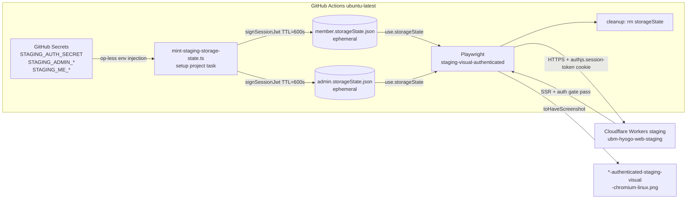

# Phase 2 — Architecture

[実装区分: 実装仕様書]

## 1. 全体構成

## 2. コンポーネント設計

### 2.1 mint-staging-storage-state.ts

| 項目 | 値 |
|---|---|
| パス | `apps/web/playwright/scripts/mint-staging-storage-state.ts` |
| 入力 | env: `STAGING_AUTH_SECRET` / `STAGING_ADMIN_MEMBER_ID` / `STAGING_ADMIN_EMAIL` / `STAGING_ME_MEMBER_ID` / `STAGING_ME_EMAIL` / `STAGING_WORKER_HOST` / CLI: `--role=member\|admin --out=<path> [--dry-run]` |
| 出力 | Playwright storageState JSON（`cookies[].name='authjs.session-token'` / `domain=<staging worker host>` / `path='/'` / `secure=true` / `httpOnly=true` / `sameSite='Lax'` / `expires=iat+600`） |
| 依存 | `@ubm-hyogo/shared` の `signSessionJwt`（HS256 / `AUTH_SECRET` 共有） |
| エラー方針 | env 不在 / role 不正 / out path 不正 → exit 1 + stderr に「`STAGING_AUTH_SECRET missing`」等の env 名のみ出力（値は出力しない） |
| ログ | dry-run でも cookie 値 / token 値を stdout/stderr に出さない（claim の `sub` / `email` / `isAdmin` のみ summary 表示） |

### 2.2 Playwright `staging-visual-authenticated` project

| 項目 | 値 |
|---|---|
| testDir | `apps/web/playwright/tests/visual-staging-authenticated` |
| use.baseURL | `process.env.PLAYWRIGHT_STAGING_BASE_URL ?? 'https://ubm-hyogo-web-staging.daishimanju.workers.dev'` |
| use.storageState | spec ごとに `test.use({ storageState })` で member/admin を切替（project 単位では未指定。spec 内 fixture で member.storageState.json / admin.storageState.json を読む） |
| dependencies | `setup-authenticated-staging`（mint CLI を 2 回実行する setup project） |
| snapshotPathTemplate | `{testDir}/{testFileName}-snapshots/{arg}-authenticated-staging-visual-{platform}{ext}` |
| expect.toHaveScreenshot | `maxDiffPixelRatio: 0.05`（UT-DSF-07 と同水準）、`animations: 'disabled'`、`caret: 'hide'` |

### 2.3 setup project: `setup-authenticated-staging`

| 項目 | 値 |
|---|---|
| testDir | `apps/web/playwright/tests/visual-staging-authenticated` |
| testMatch | `**/setup.staging-auth.ts` |
| 責務 | `mint-staging-storage-state.ts --role=member --out=.auth/member.storageState.json` と同 `--role=admin --out=.auth/admin.storageState.json` を逐次実行し、生成成果物の存在 + cookie 構造を最小 assert |
| 後始末 | `teardown` project で `rm -rf apps/web/playwright/.auth` を実行（CI 内 ephemeral） |

### 2.4 認証後画面 assert 戦略

| 画面 | guard でないことの判定 locator | 撮影範囲 |
|---|---|---|
| `/profile`（member） | profile 本文セクションの `responseEmail` 表示要素（`[data-testid="profile-authenticated-root"]` 等。実在しなければ Phase 5 で attribute 追加）。`/login` への redirect なら fail | ページ全体 or 主要セクション（データ揺れ領域は mask） |
| `/admin`（admin） | admin dashboard 専用 widget（members 件数 KPI / 最新 audit row / sidebar の admin 専用リンク等のいずれか）。`/login` への redirect なら fail | dashboard 主要セクション（KPI 数字部分は mask 可） |

## 3. データフロー

1. CI workflow が secrets を env として inject → mint CLI を 2 回実行 → storageState 2 ファイル生成
2. Playwright setup project が生成物を assert
3. visual-staging-authenticated project の spec が storageState を `test.use()` で読込
4. Playwright が staging Worker に対し cookie 付き request → SSR 完了 → assert (visibility) → screenshot
5. Playwright teardown project が storageState を `rm`
6. CI workflow が artifact upload 時に storageState path を **除外** する

## 4. セキュリティ境界

- storageState JSON はリポジトリ git 管理外（`.gitignore` 強制 + grep gate）
- `AUTH_SECRET` は GitHub Secrets → env として inject、ログ非出力
- cookie 値は mint CLI / Playwright run log / screenshot のいずれにも残さない
- staging Worker 側の `AUTH_SECRET` は `apps/web` (`getAuthEnv()`) / `apps/api` (`verifySessionJwt`) で同一値であることを Phase 10 §2 で `cf.sh` 経由事前確認

## 5. 非採用案

| 案 | 不採用理由 |
|---|---|
| Magic Link / OAuth で実フロー完走 → cookie 取得 | CI 自動化困難 / メール受信依存 |
| `staging-visual` project の test を改造して認証後を相乗 | baseline namespace 衝突・既存 PNG を破壊するリスク |
| storageState を git にコミット（マスキング） | cookie 値の不可逆漏洩。後続 audit / log scan で 0 hit を保証できない |
| Playwright `globalSetup` 単体（dedicated project 不使用） | 失敗時の log 分離が難しく flake 原因が opaque になる |

## 6. 参照

- 親 §0.3 SSR fetch 不可問題: `docs/30-workflows/ut-dsf-07-staging-visual-runtime-evidence/index.md` §0.3
- reference 実装: `apps/web/scripts/lhci-auth-storage.ts`
- mint pattern: `scripts/smoke/mint-staging-bearers.mts`
