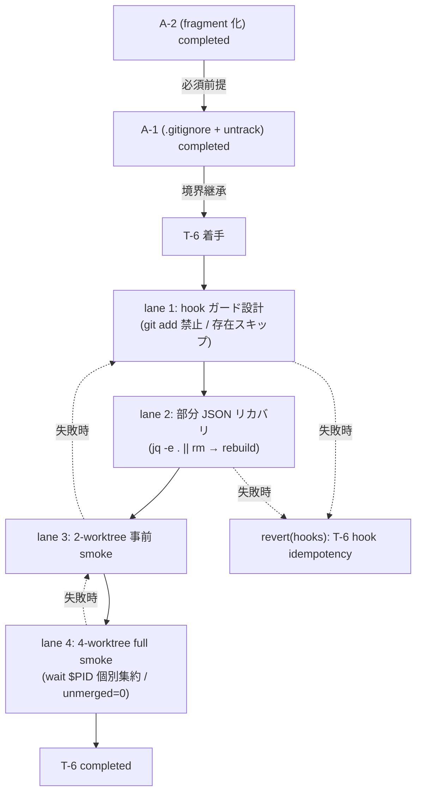

# Phase 2 成果物 — 設計（T-6 hook 冪等化）

## 1. 設計トポロジ



## 2. SubAgent lane 設計

| lane | 役割 | 入力 | 出力 / 副作用 | 成果物 |
| --- | --- | --- | --- | --- |
| 1. hook 副作用ガード設計 | 現行 post-merge が stale 通知のみで、index 再生成・canonical 書き込み・`git add` 系を持たないことを検査 | A-1 state ownership / Phase 1 禁止コマンド集合 | hook 検査擬似コード（実適用は Phase 5） | hook-guard-pseudo.md |
| 2. 部分 JSON リカバリ | `pnpm indexes:rebuild` 失敗時に `jq -e . || rm` → 再 rebuild するループ仕様 | lane 1 完了、`jq` 利用可能 | リカバリ手順擬似コード | json-recovery-pseudo.md |
| 3. 2-worktree 事前 smoke | 2 worktree 並列で `pnpm indexes:rebuild` を実行し `git ls-files --unmerged | wc -l = 0` を最小再現 | lane 1 / 2 完了 | 事前 smoke コマンド系列（NOT EXECUTED） | pre-smoke-2.md |
| 4. 4-worktree full smoke | `pids=()` + `wait $PID` 個別集約付きの 4 並列再生成 → merge → `unmerged=0` 検証 | lane 3 PASS | full smoke コマンド系列（Phase 11 で実走） | full-smoke-4.md |

## 3. ファイル変更計画

| パス | 操作 | 編集者 | 注意 |
| --- | --- | --- | --- |
| `lefthook.yml` | post-merge が stale 通知のみであることを検査し、index 再生成を戻さない（Phase 5 で必要なら CI / script guard 化） | lane 1 | `.git/hooks/*` 直書き禁止。lefthook 経由のみ |
| `scripts/<hook-name>.sh` 等の補助スクリプト | 存在チェック + `git add` 禁止 + 部分 JSON リカバリループ追加（Phase 5 で適用） | lane 1 / 2 | 既存スクリプトがある場合は最小差分。新規作成時はファイル名を Phase 5 で確定 |
| `outputs/phase-11/manual-smoke-log.md` | NOT EXECUTED 状態でテンプレ配置 | lane 4 | 実走は Phase 11 |
| `apps/web` / `apps/api` / `.gitignore` | 変更しない | - | T-6 のスコープ外 |

## 4. state ownership 表

| state | 物理位置 | owner | writer | reader | TTL / lifecycle |
| --- | --- | --- | --- | --- | --- |
| hook | `lefthook.yml` 経由 | T-6 | T-6 PR（必要時は検査 guard のみ） | lefthook | 永続 |
| 派生物（`indexes/*.json` / `*.cache.json` / `LOGS.rendered.md`） | worktree（git untracked、A-1 で確立） | 明示 `pnpm indexes:rebuild` / CI gate | 明示再生成のみ | skill 利用 | worktree-local |
| 部分書き込み JSON | worktree | lane 2 が検出 → 削除 | `jq -e . || rm` | なし | リカバリ後に消滅 |
| 4 worktree smoke ログ | `outputs/phase-11/manual-smoke-log.md` | T-6 PR | Phase 11 実走者 | レビュー | 永続（証跡） |

> **重要 (AC-1 / AC-2)**: hook は `git add` / `git stage` / `git update-index --add` を一切呼ばない。派生物存在時は再生成をスキップする。

## 5. ロールバック設計

```bash
git revert <T-6 hook commit>
mise exec -- pnpm install   # prepare 経由で lefthook install を再配置
lefthook -V                 # 再配置確認
```

1 コミット粒度で完結し、A-1 / A-2 状態に影響しない。

## 6. 4 worktree smoke 検証コマンド系列（仕様レベル / Phase 11 で実走）

```bash
git checkout main

# (1) 4 worktree 作成
for n in 1 2 3 4; do bash scripts/new-worktree.sh verify/t6-$n; done

# (2) 並列再生成 + wait $PID 個別集約（AC-6）
pids=()
rcs=()
for n in 1 2 3 4; do
  ( cd .worktrees/verify-t6-$n && mise exec -- pnpm indexes:rebuild ) &
  pids+=("$!")
done
rc=0
for pid in "${pids[@]}"; do
  if ! wait "$pid"; then
    rc=$?
    rcs+=("pid=$pid rc=$rc")
  fi
done
echo "failed_pids=${rcs[@]:-none}"

# (3) 部分 JSON リカバリ（lane 2）
find .worktrees/verify-t6-*/.claude/skills -name '*.json' \
  -exec sh -c 'jq -e . "$1" >/dev/null 2>&1 || rm -v "$1"' _ {} \;

# (4) merge → unmerged=0 検証（AC-4）
for n in 1 2 3 4; do git merge --no-ff verify/t6-$n; done
test "$(git ls-files --unmerged | wc -l | tr -d ' ')" = "0"
```

> 2-worktree 事前 smoke（AC-7）は `n` を `1 2` に縮約。PASS でなければ 4-worktree に進まない gate。

## 7. 依存タスク順序（A-2 completed 必須）— 重複明記 2/3

A-2（task-skill-ledger-a2-fragment / Issue #130）が completed でなければ Phase 5 以降の実装フェーズに着手しない。本ワークフローは spec_created までで閉じるが、Phase 5 / 11 着手前に再確認 gate を置く。

## 8. 設計判定

- 4 ステップトポロジが連結されている: ✓
- SubAgent lane 4 本に I/O / 成果物が明示されている: ✓
- ファイル変更計画が `lefthook.yml` / `scripts/` のみ: ✓
- state ownership に「hook が `git add` を呼ばない」境界明示: ✓
- ロールバックが 1 コミット粒度: ✓
- smoke 系列に `wait $PID` 個別集約 + `unmerged=0` 検証: ✓
- A-2 完了前提が本 Phase で重複明記: ✓
