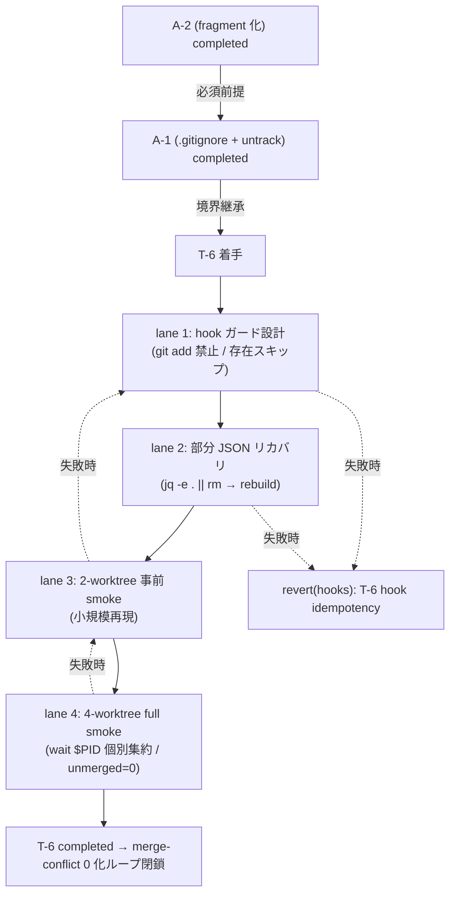

# Phase 2: 設計

## メタ情報

| 項目 | 値 |
| --- | --- |
| タスク名 | hook 冪等化と 4 worktree 並列 smoke 実走 (skill-ledger-t6-hook-idempotency) |
| Phase 番号 | 2 / 13 |
| Phase 名称 | 設計 |
| 作成日 | 2026-04-29 |
| 前 Phase | 1 (要件定義) |
| 次 Phase | 3 (設計レビュー) |
| 状態 | completed |
| タスク種別 | docs-only / NON_VISUAL / infrastructure_governance（本ワークフローは仕様書整備に閉じる） |

## 目的

Phase 1 で確定した「hook が `git add` を呼ばない / 派生物存在時はスキップ / 部分 JSON リカバリ / 二段 smoke」要件を、トポロジ・SubAgent lane 3 本・ファイル変更計画・state ownership・ロールバック・4 worktree smoke コマンド系列に分解し、Phase 3 の代替案比較が結論を出せる粒度の設計入力を作成する。本 Phase の成果は仕様レベルであり、実装は Phase 5 以降に委ねる。

## 実行タスク

1. 4 ステップのトポロジ（hook ガード設計 → 部分 JSON リカバリ → 2-worktree 事前 smoke → 4-worktree full smoke）を Mermaid で固定する（完了条件: 4 ステップが矢印で連結）。
2. SubAgent lane 3 本（lane 1 hook ガード設計 / lane 2 部分 JSON リカバリ / lane 3 二段 smoke）を表化する（完了条件: 各 lane の I/O / 副作用 / 成果物が記述）。
3. ファイル変更計画を確定する（完了条件: 編集対象が `lefthook.yml` および `scripts/` 配下のみで、`apps/` 以下を触らないことが明示）。
4. state ownership 表を作成する（完了条件: hook / 派生物 / lefthook.yml / smoke ログの 4 state について writer / reader / TTL が一意）。
5. ロールバック設計を確定する（完了条件: hook 差分の `git revert` で 1 コミット粒度復元）。
6. 4 worktree smoke 検証コマンド系列を仕様レベルで固定する（完了条件: `pids=()` 配列 + `wait $PID` 個別集約 + `git ls-files --unmerged | wc -l` 出力捕捉が記述）。

## 依存タスク順序（A-2 完了必須）— 重複明記 2/3

> **A-2（task-skill-ledger-a2-fragment / Issue #130）が completed であることが本 Phase の必須前提である。**
> A-2 未完了で本 Phase 設計を Phase 5 実装に持ち込むと、A-1 gitignore と hook 編集が組み合わさり `LOGS.md` を誤って ignore 化する経路が生じる。本 Phase は A-2 completed を「設計の前提」として扱い、A-2 未完了の場合は Phase 3 の NO-GO 条件で block される。

## 参照資料

| 種別 | パス | 用途 |
| --- | --- | --- |
| 必須 | docs/30-workflows/skill-ledger-t6-hook-idempotency/phase-01.md | 真の論点・hook target glob・禁止コマンド集合 |
| 必須 | docs/30-workflows/skill-ledger-a1-gitignore/phase-02.md | state ownership 表 / 4 worktree smoke 系列の継承元 |
| 必須 | CLAUDE.md | hook 方針（post-merge index 再生成廃止 / 明示 rebuild） |
| 必須 | .claude/skills/aiworkflow-requirements/references/technology-devops-core.md | Git hook 運用正本 |
| 必須 | lefthook.yml | post-commit / post-merge の正本配置（参照のみ） |
| 参考 | https://git-scm.com/docs/githooks | hook 仕様 |

## トポロジ (Mermaid)



## SubAgent lane 設計

| lane | 役割 | 入力 | 出力 / 副作用 | 成果物 |
| --- | --- | --- | --- | --- |
| 1. hook 副作用ガード設計 | 現行 hook に `git add` 系・canonical 書き込み・index 再生成が戻っていないことを検査する仕様。将来 hook が派生物に触れる場合のみ「存在スキップ + valid 性チェック」を要求 | A-1 state ownership / Phase 1 禁止コマンド集合 / 現行 hook 正本 | hook 検査擬似コード（実適用は Phase 5） | hook-guard-pseudo.md |
| 2. 部分 JSON リカバリ | `pnpm indexes:rebuild` 失敗時に部分書き込み JSON を `jq -e .` で検査し `rm` → 再 rebuild するループ仕様 | lane 1 完了、`jq` 利用可能 | リカバリ手順擬似コード | json-recovery-pseudo.md |
| 3. 二段 smoke | 2 worktree 事前 smoke で最小再現し、PASS 後に 4 worktree full smoke へ進む。`pids=()` + `wait $PID` 個別集約を共通化 | lane 1 / 2 完了 | 事前 smoke / full smoke コマンド系列（Phase 11 で実走） | pre-smoke-2.md / full-smoke-4.md |

## ファイル変更計画

| パス | 操作 | 編集者 | 注意 |
| --- | --- | --- | --- |
| `lefthook.yml` | post-merge が stale 通知のみで、index 再生成や stage 副作用を持たないことを検査（Phase 5 で必要なら CI / script guard 化） | lane 1 | `.git/hooks/*` 直書き禁止。post-merge 再生成は戻さない |
| `scripts/<hook-name>.sh` 等の補助スクリプト | 存在チェック + `git add` 禁止 + 部分 JSON リカバリループの追加（Phase 5 で適用） | lane 1 / 2 | 既存スクリプトがある場合は最小差分。新規作成時はファイル名を Phase 5 で確定 |
| `docs/30-workflows/skill-ledger-t6-hook-idempotency/outputs/phase-11/manual-smoke-log.md` | NOT EXECUTED 状態でテンプレ配置（Phase 11 で実走時に追記） | lane 4 | 実走は Phase 11 |
| `apps/web` / `apps/api` / `.gitignore` | 変更しない | - | T-6 のスコープ外 |

## 環境変数 / Secret

本タスクは Secret / 環境変数を導入・参照しない。hook 内部でも `op run` を呼ばない（読み取り専用の冪等ガードのため）。

## state ownership 表

| state | 物理位置 | owner | writer | reader | TTL / lifecycle |
| --- | --- | --- | --- | --- | --- |
| hook | `lefthook.yml` 経由（`.git/hooks/*` は lefthook が install） | T-6 | T-6 PR（必要時は検査 guard のみ） | lefthook | 永続。post-merge は stale 通知のみ |
| 派生物（`indexes/*.json` / `*.cache.json` / `LOGS.rendered.md`） | worktree（git untracked = A-1 で確立） | 明示 `pnpm indexes:rebuild` / CI gate | 明示再生成のみ。hook からの自動再生成は行わない | skill 利用 | worktree-local。コミットされない |
| 部分書き込み JSON（破損） | worktree | lane 2 が検出 → 削除 | `jq -e . || rm` | なし | リカバリループ後に消滅 |
| 4 worktree smoke ログ | `outputs/phase-11/manual-smoke-log.md` | T-6 PR | Phase 11 実走者 | レビュー | 永続（証跡） |

> **重要 (AC-1 / AC-2)**: hook は **`git add` / `git stage` / `git update-index --add` を一切呼ばない**。派生物が存在する場合は再生成をスキップする。これが untrack の循環事故を防ぐ核心境界。

## ロールバック設計

```bash
# T-6 を取り消す場合（1 コミット粒度）
git revert <T-6 hook commit>            # lefthook.yml / scripts/ の差分を戻す
mise exec -- pnpm install               # prepare 経由で lefthook install を再実行
# 検証
lefthook -V                             # hook が再配置されたことを確認
```

ロールバックは 1 コミットで完結し、A-1 / A-2 の状態には影響しない。

## 4 worktree smoke 検証コマンド系列（仕様レベル / Phase 11 で実走）

```bash
# A-2 / A-1 / T-6 hook 適用済み main ブランチを起点に
git checkout main

# (1) 4 worktree 作成（既存スクリプト経由）
for n in 1 2 3 4; do bash scripts/new-worktree.sh verify/t6-$n; done

# (2) 並列再生成 + wait $PID 個別集約（AC-6）
pids=()
rcs=()
for n in 1 2 3 4; do
  ( cd .worktrees/verify-t6-$n && mise exec -- pnpm indexes:rebuild ) &
  pids+=("$!")
done
rc=0
for pid in "${pids[@]}"; do
  if ! wait "$pid"; then
    rc=$?
    rcs+=("pid=$pid rc=$rc")
  fi
done
echo "failed_pids=${rcs[@]:-none}"     # 1 件でも失敗なら lane 2 のリカバリへ

# (3) 部分 JSON リカバリ（lane 2、必要時のみ）
find .worktrees/verify-t6-*/.claude/skills -name '*.json' \
  -exec sh -c 'jq -e . "$1" >/dev/null 2>&1 || rm -v "$1"' _ {} \;
# 削除があれば再 rebuild を該当 worktree で再実行

# (4) merge → unmerged 件数 = 0 を検証（AC-4）
for n in 1 2 3 4; do git merge --no-ff verify/t6-$n; done
test "$(git ls-files --unmerged | wc -l | tr -d ' ')" = "0"   # AC-4 の合格条件
```

> 2-worktree 事前 smoke（AC-7）は上記の `n` を `1 2` に縮約して実行する。同手順で 0 件にならない場合は 4-worktree full smoke を実行しない。

## 実行手順

### ステップ 1: hook 禁止コマンドの静的検査仕様

- Phase 5 着手前に「`grep -nE 'git (add|stage|update-index --add)' lefthook.yml scripts/*.sh => 0 件`」を CI / 手動で実施する旨を仕様化。

### ステップ 2: 部分 JSON リカバリの確定

- `find ... -exec jq -e . || rm` のループを Phase 5 ランブックの起点として固定。

### ステップ 3: 2-worktree → 4-worktree 二段構え

- 2-worktree が PASS でなければ 4-worktree に進まないゲートを Phase 11 に渡す。

### ステップ 4: state ownership / ロールバック確定

- hook は派生物のみ書く / canonical を書かない境界を A-1 から継承し、T-6 は実装段階の冪等ガードでこれを保証する。

## 統合テスト連携

| 連携先 Phase | 連携内容 |
| --- | --- |
| Phase 3 | 設計の代替案比較・PASS/MINOR/MAJOR 判定の入力 |
| Phase 4 | lane 1〜3 ごとのテスト計画ベースライン |
| Phase 5 | 実装ランブックの擬似コード起点（hook ガード / リカバリ / smoke） |
| Phase 6 | 異常系（hook 内 `git add` 残留 / 部分 JSON 検出漏れ / wait 戻り値喪失 / A-2 未完了） |
| Phase 11 | 2-worktree → 4-worktree 二段 smoke の手順 placeholder |

## 多角的チェック観点

- A-2 完了前提が 3 重に明記されているか（本 Phase が 2 重目）。
- hook が `git add` 系を呼ばない設計が AC-1 / state ownership で明示されているか。
- 部分 JSON リカバリループが lane 2 として独立に表現されているか。
- `wait $PID` が個別集約され、最後のジョブの戻り値で全体判定しない設計か（AC-6）。
- ロールバックが 1 コミット粒度で完結するか（AC-8）。
- 不変条件 #5 を侵害しないか（apps/api / apps/web のソースを触らない）。

## サブタスク管理

| # | サブタスク | 担当 Phase | 状態 | 備考 |
| --- | --- | --- | --- | --- |
| 1 | Mermaid トポロジ | 2 | completed | 4 ステップ + ロールバック分岐 |
| 2 | SubAgent lane 4 本 | 2 | completed | I/O・成果物明示 |
| 3 | ファイル変更計画 | 2 | completed | lefthook.yml / scripts/ のみ |
| 4 | state ownership 表 | 2 | completed | 4 state |
| 5 | ロールバック設計 | 2 | completed | 1 コミット粒度 |
| 6 | 4 worktree smoke コマンド系列 | 2 | completed | wait $PID 個別集約 / unmerged=0 |
| 7 | 2-worktree 事前 smoke 仕様 | 2 | completed | 4-worktree への gate |

## 成果物

| 種別 | パス | 説明 |
| --- | --- | --- |
| 設計 | outputs/phase-02/main.md | トポロジ・SubAgent lane・state ownership・ファイル変更計画・ロールバック・smoke 系列 |
| メタ | artifacts.json | Phase 2 状態の更新（completed） |

## 完了条件

- [x] Mermaid トポロジに 4 ステップとロールバック分岐が記述されている
- [x] SubAgent lane 4 本に I/O / 成果物が記述されている
- [x] ファイル変更計画で `lefthook.yml` / `scripts/` 配下のみが編集対象であることが明示されている
- [x] state ownership 表に「hook が `git add` を呼ばない / 派生物のみ生成」境界が記述されている
- [x] ロールバック設計が 1 コミット粒度で記述されている
- [x] 4 worktree smoke コマンド系列が `wait $PID` 個別集約 + `git ls-files --unmerged | wc -l = 0` 検証付きで仕様レベル固定されている
- [x] 2-worktree 事前 smoke が 4-worktree への gate として固定されている
- [x] A-2 完了前提が本 Phase で重複明記されている（3 重明記の 2 箇所目）

## タスク100%実行確認【必須】

- 全実行タスク（7 件）が `completed`
- 全成果物が `outputs/phase-02/` 配下に配置済み
- 異常系（hook 内 git add 残留 / 部分 JSON 検出漏れ / wait 戻り値喪失 / A-2 未完了）の対応 lane が設計に含まれる
- artifacts.json の `phases[1].status` が `completed`

## 次 Phase への引き渡し

- 次 Phase: 3 (設計レビュー)
- 引き継ぎ事項:
  - base case = lane 1〜3 直列実行（hook ガード → リカバリ → 二段 smoke）+ 1 コミット粒度ロールバック
  - 4 worktree smoke コマンド系列（`pids=()` + `wait $PID` + `unmerged=0`）を Phase 11 へ
  - A-2 完了を NO-GO 条件として Phase 3 へ引き渡す
- ブロック条件:
  - Mermaid に 4 ステップのいずれかが欠落
  - state ownership に「hook が `git add` を呼ばない」境界が無い
  - ロールバック設計が 2 コミット以上を要求している
  - smoke 系列に `wait $PID` 個別集約が欠落している
  - A-2 完了前提が記述されていない
