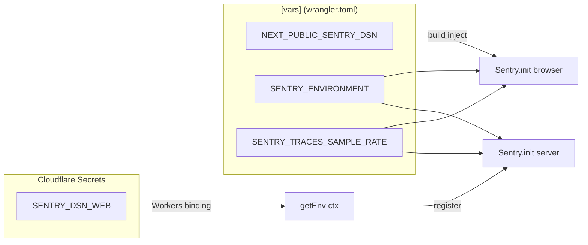

# Phase 2: 設計（runtime 別 entry 分離 / DSN 注入経路 / 二重 init ガード設計）

## 目的

Sentry SDK を runtime 別に物理的に分離するエントリ構造を確定する。Phase 1 の論点 A〜E を、ファイル境界と import グラフへ落とし込み、build 結果（`.open-next/worker.js`）に Browser SDK の参照が混入しないことを構造的に保証する設計とする。

## 真の論点 / 設計判断

### 設計 1: runtime → entry → SDK の対応表

| runtime | エントリファイル | import する SDK | window 参照 | DSN ソース |
| --- | --- | --- | --- | --- |
| Cloudflare Workers | `instrumentation.ts` の `register()` | `@sentry/cloudflare`（`await import` 動的） | 不可 | `getEnv().SENTRY_DSN_WEB`（Cloudflare Secrets 由来） |
| Node SSR（local dev） | 同上 | 同上 | 不可 | 同上 |
| Edge runtime | 同上 | 同上 | 不可 | 同上 |
| Browser | `instrumentation-client.ts` | `@sentry/nextjs`（静的 import） | 可 | `process.env.NEXT_PUBLIC_SENTRY_DSN`（build inject） |

**絶対条件**: server entry から `@sentry/nextjs` を import しない（直接・推移 import 双方）。

### 設計 2: 動的 import で bundle 分離

`instrumentation.ts` 内では **`await import("@sentry/cloudflare")`** を使う。これにより bundler が server/client で別チャンクへ分離し、`@sentry/nextjs` が server bundle へ推移混入する経路を遮断する。`capture.ts` でも `typeof window` 判定後の動的 import を採用。

### 設計 3: 二重 init ガード

```ts
// server (instrumentation.ts)
const g = globalThis as { __ubmSentryInitialized__?: boolean };
if (g.__ubmSentryInitialized__) return;
g.__ubmSentryInitialized__ = true;
```

```ts
// client (instrumentation-client.ts)
if (typeof window === "undefined") return;
const w = window as Window & { __ubmSentryInitialized__?: boolean };
if (w.__ubmSentryInitialized__) return;
w.__ubmSentryInitialized__ = true;
```

両者を **同名（`__ubmSentryInitialized__`）** にすることで、task-04 logger / task-05 error.tsx が runtime に応じて `globalThis` / `window` のどちらをチェックしても同じ意味になる。

### 設計 4: DSN 注入経路（mermaid）



### 設計 5: 失敗時挙動（fail-soft）

- DSN 未設定（local dev 等）: `init` を skip。`captureException` は silent return。
- dynamic import 失敗（SDK 未インストール / bundling 失敗）: try/catch で握り、`console.error("[sentry-capture-failed]", ...)` で fallback（task-04 logger 完成後は logger 経由へ差し替え予定）。
- runtime 不一致（server entry に browser code が混入）: build grep gate（AC-4）で fail させ、deploy 前に検出。

## 実行タスク（チェックリスト）

- [ ] runtime → entry → SDK 対応表をコードコメントに転記する設計を確定
- [ ] 動的 import 採用箇所（`instrumentation.ts` / `capture.ts`）の理由を JSDoc に明記
- [ ] 二重 init ガード変数名を `__ubmSentryInitialized__` に統一（task-04 / task-05 が import 不要）
- [ ] DSN 注入 mermaid を本 phase に固定
- [ ] fail-soft ポリシー（throw しない）を `capture.ts` の JSDoc に明記する旨を Phase 6 へ引き継ぎ
- [ ] 依存追加コマンドを Phase 6 と整合（`pnpm --filter @ubm-hyogo/web add @sentry/cloudflare`）
- [ ] 不要依存（旧 `@sentry/node` 単体採用していた場合）の削除リストを確定

## 依存追加 / 削除一覧

| 種別 | パッケージ | コマンド |
| --- | --- | --- |
| 追加 | `@sentry/cloudflare` | `mise exec -- pnpm --filter @ubm-hyogo/web add @sentry/cloudflare` |
| 確認/維持 | `@sentry/nextjs` | 既存（client 用に維持） |
| 削除候補 | `@sentry/node`（単独利用していた場合） | `mise exec -- pnpm --filter @ubm-hyogo/web remove @sentry/node` |
| 削除候補 | 旧 `sentry.client.config.ts` 等で参照していた `@sentry/tracing` | 現行 v8 系では不要 |

## 入力 / 出力

| 種別 | 内容 |
| --- | --- |
| 入力 | Phase 1 の論点 A〜E、元タスク §4 / §5 / §7 |
| 出力 | runtime 対応表 / DSN 注入 mermaid / 二重 init ガード設計 / 依存追加削除リスト |

## 参照資料

- 元タスク §4「役割分離」, §5「関数 / 型シグネチャ」, §7「DSN / Secrets 取扱い」
- Sentry 公式: Cloudflare Workers ガイド、Next.js Browser-only 利用パターン

## 成果物

- 本 phase-02.md 内の設計表・mermaid（implemented-local 状態で確定）
- `outputs/phase-02/main.md`（executed 段階で生成・本仕様書では作成不要）

## 完了条件（DoD）

- [ ] runtime × entry × SDK 対応表が確定
- [ ] 動的 import の採用方針が明記
- [ ] 二重 init ガード名が `__ubmSentryInitialized__` に統一
- [ ] DSN 注入の mermaid が本 phase に存在
- [ ] 依存追加 / 削除リストが Phase 6 と整合可能な粒度で提示

## 統合テスト連携

- runtime 分離の実装後検証は Phase 11 の G-1 / G-1b / G-2 / G-3 grep gate で確認する。
- `instrumentation.ts` と `instrumentation-client.ts` の相互 import 禁止は typecheck だけでなく grep gate に接続する。

## メタ情報

- workflow: task-03-w2-par-sentry-workers-sdk-unify
- phase: 2
- status: `implemented-local / completed`
- taskType: `implementation`
- visualEvidence: `NON_VISUAL`
