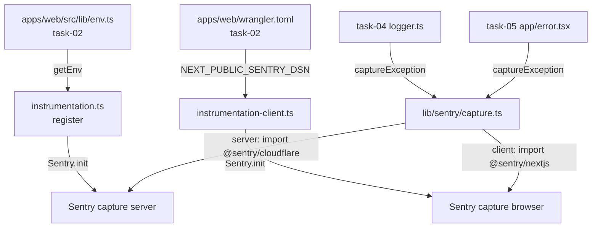

# Phase 9: 統合 / 結線

## 目的

本 task が上流 task-02（env 注入）から受領するシグネチャと、下流 task-04（logger）/ task-05（error.tsx）へ渡す契約を、ファイル境界・呼び出しグラフ・テスト境界で結線する。

## 上流結線（task-02 から受領）

| 受領元 | キー / 関数 | 利用先 |
| --- | --- | --- |
| `apps/web/src/lib/env.ts`（task-02） | `getEnv().SENTRY_DSN_WEB` | `instrumentation.ts` の `register()` |
| 同上 | `getEnv().SENTRY_ENVIRONMENT` | `Sentry.init({ environment, enabled: env !== 'local' })` |
| 同上 | `getEnv().SENTRY_TRACES_SAMPLE_RATE` | `Sentry.init({ tracesSampleRate })` |
| `apps/web/wrangler.toml`（task-02 で配置） | `[vars] NEXT_PUBLIC_SENTRY_DSN` | `instrumentation-client.ts` で `process.env.NEXT_PUBLIC_SENTRY_DSN` として参照 |
| Cloudflare Secrets（task-02 投入手順） | `SENTRY_DSN_WEB` | Workers binding 経由で `getEnv()` に到達 |

### blocking 条件

- task-02 が `getEnv()` を export していない場合、本 task の `instrumentation.ts` は build できない。**Phase 9 開始時に `apps/web/src/lib/env.ts` の存在と Sentry 6 キーの戻り値型を確認**する。
- 未完成なら本 task の S-4（`instrumentation.ts` 実装）を待つ。代替として `getEnv` を本 task で stub 実装する選択肢は **取らない**（task-02 集約原則）。

## 下流結線（task-04 / task-05 へ提供）

### task-04 (window-guard-and-logger)

| 提供 | from | task-04 での利用例 |
| --- | --- | --- |
| `captureException(err, ctx?)` | `apps/web/src/lib/sentry/capture.ts` | `logger.error(msg, { err })` の内部で呼ぶ |
| `captureMessage(msg, ctx?)` | 同上 | `logger.warn(msg)` の内部で呼ぶ |
| `CaptureContext` 型 | 同上 | logger の context 型として再 export |

task-04 の logger は本 task の API に依存。**本 task が PR merge される前に task-04 の実装を進めることは可能だが、結線テストは本 task merge 後**。

### task-05 (error-boundary-and-staging-smoke)

| 提供 | from | task-05 での利用例 |
| --- | --- | --- |
| `captureException(err, { tags: { boundary: 'global-error' } })` | `apps/web/src/lib/sentry/capture.ts` | `app/error.tsx` の `useEffect(() => captureException(error), [error])` |
| staging Sentry dashboard event 受信 | runtime 経路全般 | task-05 staging smoke で 19 routes に対し意図的 throw → event 受信確認 |

## 呼び出しグラフ（mermaid）



## 結線テスト（本 task 内では mock のみ）

- 本 task では task-04 / task-05 の実体を import しない。逆方向（task-04 / 05 → 本 task）も merge 順序により待つ。
- 結線の正しさは **凍結シグネチャ（Phase 3）の固定**で代替担保。

## 互換 / 移行

- 既存コードに `import { captureException } from '@sentry/nextjs'` の直接 import がある場合は本 task で `apps/web/src/lib/sentry/capture.ts` 経由に置換する（grep gate で検出）。
- 該当 grep:

```bash
mise exec -- pnpm --filter @ubm-hyogo/web exec rg "from ['\"]@sentry/(cloudflare|nextjs)['\"]" apps/web/src \
  --glob '!apps/web/src/instrumentation.ts' \
  --glob '!apps/web/src/instrumentation-client.ts' \
  --glob '!apps/web/src/lib/sentry/capture.ts' \
  --glob '!apps/web/src/lib/__tests__/sentry-capture.test.ts'
# 期待: 0 件
```

## 実行タスク（チェックリスト）

- [ ] task-02 の `getEnv()` が Sentry 6 キーを戻り値に含むことを確認
- [ ] task-02 の `apps/web/wrangler.toml` env section に Sentry vars が配置されたことを確認（Phase 4 表）
- [ ] task-04 仕様書に本 task の `captureException` / `captureMessage` シグネチャを参照させる
- [ ] task-05 仕様書に本 task の `captureException` 呼び出し前提を参照させる
- [ ] 既存 `@sentry/*` 直接 import の置換漏れがないことを grep gate で確認

## 入力 / 出力

| 種別 | 内容 |
| --- | --- |
| 入力 | task-02 仕様書、task-04 / task-05 仕様書、Phase 3 凍結契約 |
| 出力 | 上流受領表、下流提供表、呼び出しグラフ mermaid、置換 grep |

## 参照資料

- 元タスク §0.6（上流受領）/ §0.7（下流提供）
- task-02 / task-04 / task-05 各仕様書

## 成果物

- 本 phase-09.md（結線表 + mermaid）
- `outputs/phase-09/main.md`（executed 時のみ）

## 完了条件（DoD）

- [ ] 上流受領 5 項目が表で確認
- [ ] 下流提供 task-04 / task-05 への契約が Phase 3 と一致
- [ ] 呼び出しグラフ mermaid が本 phase に存在
- [ ] 既存直接 import の置換 grep が 0 件期待で記述

## 統合テスト連携

- task-02 との結線は `SENTRY_DSN_WEB` / `NEXT_PUBLIC_SENTRY_DSN` の env 名一致を typecheck と grep gate で確認する。
- task-04 / task-05 との結線は import compile と `captureException` / `captureMessage` の export grep で Phase 11 AC-9 に接続する。

## メタ情報

- workflow: task-03-w2-par-sentry-workers-sdk-unify
- phase: 9
- status: `implemented-local / completed`
- taskType: `implementation`
- visualEvidence: `NON_VISUAL`
