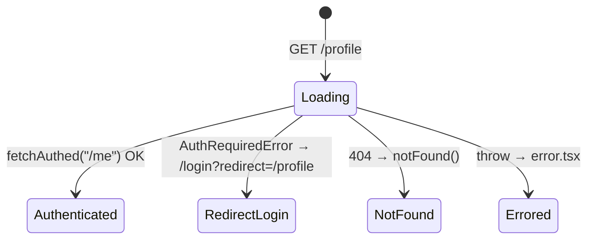
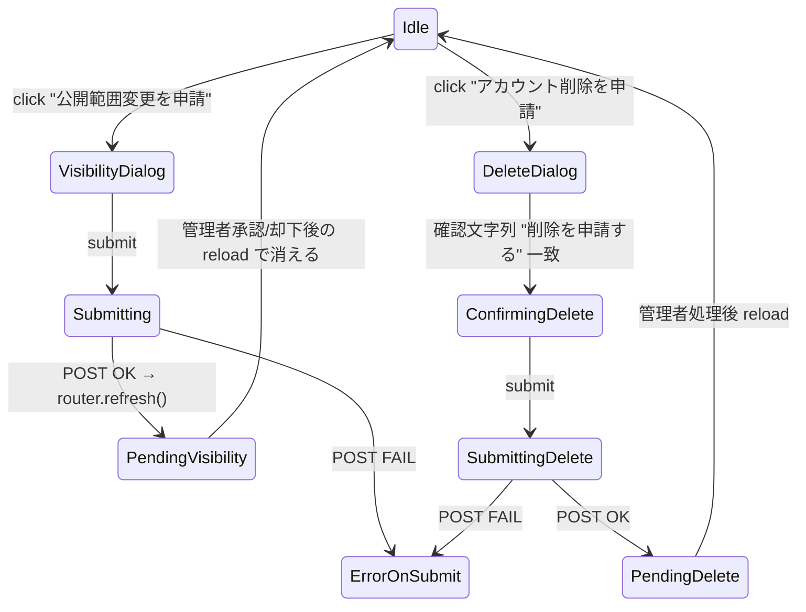

# Phase 2: ドメイン分析

[実装区分: 実装仕様書]

`/profile` の業務ドメイン（公開状態 / 認証 gate / 申請 queue）を整理し、
コード上の型と UI 表示の対応関係を確定する。Phase 4（データ設計）と Phase 6（UI 設計）の前提となる。

---

## 1. 用語集（ユビキタス言語）

| 用語 | 定義 | 型/値 |
|------|------|-------|
| publishState | プロフィール公開状態 | `"public" \| "member_only" \| "hidden"` |
| authGateState | 認証 gate 状態 | `"active" \| "rules_declined" \| "deleted"` |
| rulesConsent | 利用規約への同意状態 | `"consented" \| "declined" \| "unknown"` |
| FieldVisibility | フィールド単位の公開/非公開 | `"public" \| "hidden"` |
| pendingRequest | 管理 queue 上の申請 row | `{ id, type, submittedAt, status }` |
| visibility request | 公開範囲変更申請（全体 publishState 単位） | `type: "visibility"` |
| delete request | アカウント削除申請（管理者承認まで取消不可） | `type: "delete"` |
| `fetchAuthed` | session cookie を引き継ぎ `AuthRequiredError` を throw する fetch wrapper | server / client 両用 |
| Form 再回答 | Google Form 再送による本人プロフィール更新（不変条件 #7） | MVP の正式経路 |

---

## 2. 状態遷移（4 領域）

### 2.1 ページ遷移

### 2.2 申請フロー（client）

---

## 3. 公開状態 × authGateState マトリクス

| publishState | authGateState | Banner tone | 表示文言 hint |
|-------------|---------------|-------------|--------------|
| public | active | success | 公開中 |
| member_only | active | info | 会員限定公開 |
| hidden | active | warning | 非公開 |
| any | rules_declined | warning | 規約再同意が必要 |
| any | deleted | danger | 削除待ち（再ログイン不可） |

`authGateState === "deleted"` は他の publishState よりも優先表示される（danger 上書き）。

---

## 4. 不変条件（task 全体）

| # | 条件 | 出典 |
|---|------|------|
| 1 | 本文編集 UI は描画しない（更新は Form 再回答） | CLAUDE.md 不変条件 #4, #7 |
| 2 | `apps/web` から D1 への直接アクセス禁止 | 不変条件 #5 |
| 3 | session は `memberId` のみを正本 | 不変条件 #7 |
| 4 | 楽観的 UI 不採用（`router.refresh()` で server から再取得） | task-14 起票元 §6.5 |
| 5 | HEX 直書き禁止（OKLch tokens 経由のみ） | task-09 |
| 6 | 削除申請の確認入力は IME 確定後 (`compositionend`) 以降のみ submit 有効 | task-14 §11 |
| 7 | `apps/web/app/api/me/*` handler 追加・変更 0 件 | task-14 §12 |
| 8 | 退会の即時反映なし（管理 queue 経由のまま） | task-14 §2.2 |

---

## 5. ドメインルール（業務ロジック）

| ルール | 実装位置 |
|--------|---------|
| pending visibility request が存在する間は新規の公開範囲変更申請ボタンを disabled | `RequestActionPanel` |
| pending delete request が存在する間は新規の削除申請ボタンを disabled | `RequestActionPanel` |
| 削除確認文字列が `"削除を申請する"` と完全一致するまで submit は disabled | `DeleteRequestDialog` |
| Banner tone は `authGateState=deleted` を最優先、次に `rules_declined`、最後に `publishState` | `PublicVisibilityBanner` |
| `pendingRequests` は `{ visibility?: PendingVisibilityRequest; delete?: PendingDeleteRequest }` の server-side pending object を正本にする | `RequestActionPanel` / `page.tsx` |

---

## 6. データソースと正本

| データ | 正本 | アクセス手段 |
|--------|------|-------------|
| session（memberId, authGateState, displayName） | D1 `members` table | `GET /me` (apps/api) |
| profile 本文 / statusSummary / pendingRequests | D1 `members` + `member_requests` | `GET /me/profile` (apps/api) |
| visibility request 作成 | D1 `member_requests` insert | `POST /me/visibility-request` |
| delete request 作成 | D1 `member_requests` insert + audit | `POST /me/delete-request` |

`apps/web` は **`fetchAuthed` 経由でしかアクセスできない**（不変条件 2）。

---

## 7. 用語のコード対応表

| 業務用語 | コード symbol | path |
|---------|--------------|------|
| 公開状態 | `PublishState` | `apps/web/src/lib/api/me-types.ts` |
| 認証 gate | `AuthGateState` | 同上 |
| フィールド公開設定 | `FieldVisibility`, `FieldVisibilityRow` | 同上 |
| 申請 row | `PendingRequest` | 同上 |
| プロフィール応答 | `MeProfileResponse` | 同上 |
| セッション応答 | `MeSessionResponse` | 同上 |
| 認証エラー | `AuthRequiredError` | `apps/web/src/lib/fetch/authed.ts` |

---

## 8. 完了条件

- 全用語が Phase 4 の型定義と Phase 6 の UI 設計に 1:1 で対応している
- 状態遷移図が Phase 6 で参照される
- 不変条件 8 項目が Phase 9（実装ガイド）に逐次反映される
