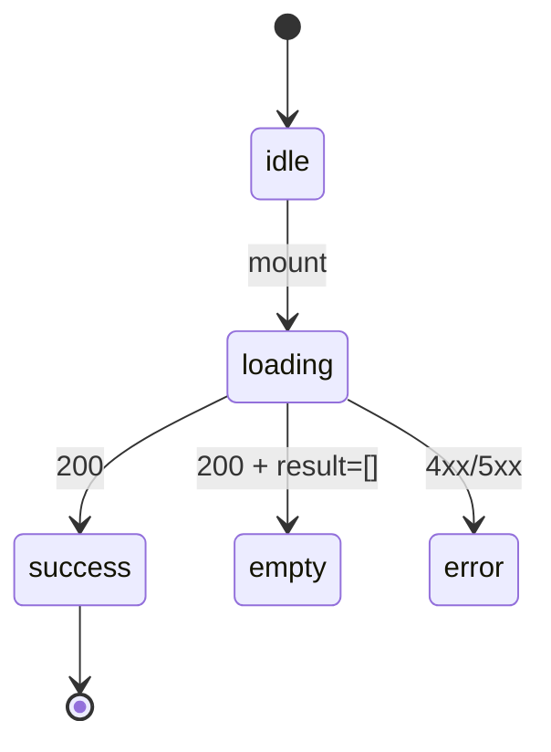
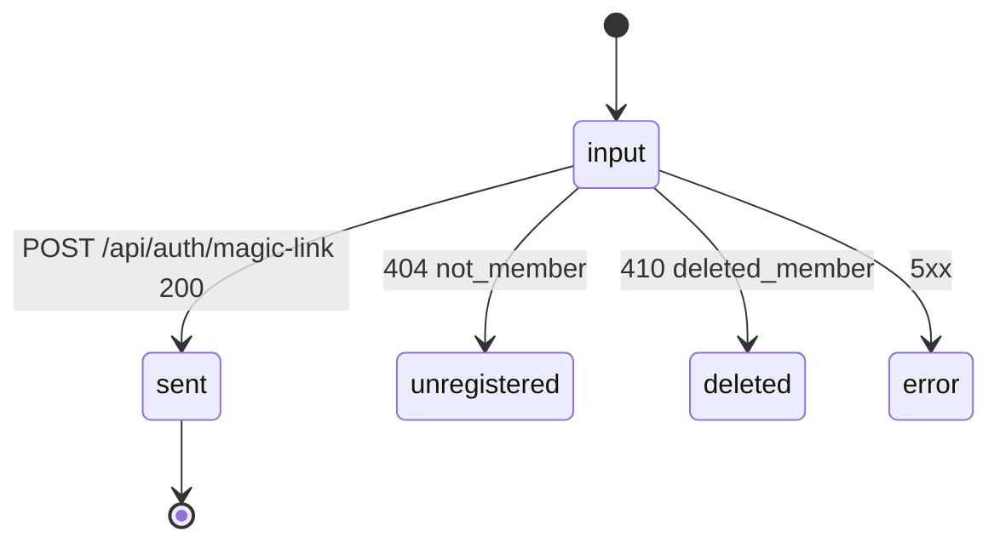

# Phase 02 — 設計

実装区分: ドキュメントのみ仕様書（CONST_004 例外適用 — 純粋に markdown 2 件作成のみ）

## 0. 入力（phase-01 から引き継ぎ）

- 真の論点 Q1〜Q6 結論
- 9 series link 戦略
- 視覚値 0 件 grep gate ルール
- 8 画面 prototype 行範囲
- AC-1〜13 lock 済み

## 1. 09e / 09f 章立て fixed schema

### 1.1 `09e-screen-blueprints-public.md` 章立て

```
1. / (Public Top)               ← pages-public.jsx LandingPage L4-L154
2. /(public)/members            ← MemberListPage L208-L338
3. /(public)/members/[id]       ← MemberDetailPage L339-L472
4. /(public)/register           ← phase-3 §3 §5.2 派生ルール
5. /privacy                     ← LegalProse 派生
6. /terms                       ← LegalProse 派生
99. 不採用要素
```

### 1.2 `09f-screen-blueprints-member.md` 章立て

```
1. /login                       ← pages-member.jsx LoginPage L4-L67（5+1 状態）
2. /profile                     ← MyProfilePage L220-L373（4 領域）
99. 不採用要素
```

### 1.3 §X fixed schema（全 8 画面共通）

```markdown
## X. <route>

### X.1 prototype 由来 (`pages-*.jsx` L<a>-L<b>)
```jsx
// 一字一句転記（return JSX のみ、import / hook は含めない）
```

### X.2 コピー原文（一字一句）
- 見出し / サブ / CTA / placeholder / error message

### X.3 状態遷移


### X.4 API 接続（現行 API 正本と一致）
| method | endpoint | trigger | 状態反映 |

### X.5 props / 内部 state
| name | type | scope |

### X.6 a11y
- landmark / heading hierarchy / form / live region

### X.7 token / primitive / icon 参照
- token: 09b §<番号>
- primitive: 09c §<番号>
- icon: 09d §<番号>
- prototype-map: 09a §<番号>（optional）
```

## 2. 8 画面の prototype 行範囲 mapping

| route | spec | prototype | 行範囲 | 主要 API |
|-------|------|-----------|--------|---------|
| `/` | 09e §1 | pages-public.jsx LandingPage | L4-L154 | `GET /public/stats`, `GET /public/members?limit=6&sort=recent`, `GET /public/form-preview` |
| `/(public)/members` | 09e §2 | pages-public.jsx MemberListPage | L208-L338 | `GET /public/members` |
| `/(public)/members/[id]` | 09e §3 | pages-public.jsx MemberDetailPage | L339-L472 | `GET /public/members/:id` |
| `/(public)/register` | 09e §4 | phase-3 §3 §5.2 派生 | — | `GET /public/form-preview` + responderUrl link |
| `/privacy` | 09e §5 | LegalProse 派生 | — | なし |
| `/terms` | 09e §6 | LegalProse 派生 | — | なし |
| `/login` | 09f §1 | pages-member.jsx LoginPage | L4-L67 | `POST /api/auth/magic-link`, `GET /api/auth/gate-state` |
| `/profile` | 09f §2 | pages-member.jsx MyProfilePage | L220-L373 | `GET /api/me/profile`, `POST /api/me/visibility-request`, `POST /api/me/delete-request`, Auth.js signout |

## 3. mermaid template（5 状態 + 画面固有派生）

### 3.1 標準 5 状態（公開層 + /profile に適用）


### 3.2 login 5+1 状態（09f §1.3 専用）



### 3.3 /profile 4 領域の状態遷移メモ

| 領域 | 主状態 | 上書き禁止条件 |
|------|--------|----------------|
| banner | idle / loading / success | — |
| summary | success / editing | — |
| request | idle / submitting / server-pending / accepted / rejected | server-pending を local 編集で上書き禁止 |
| delete | idle / confirming / submitting / accepted | submitting → accepted の不可逆遷移 |

## 4. §X.4 API 表 sample（template）

```markdown
| method | endpoint | trigger | 状態反映 |
|--------|----------|---------|---------|
| GET | /public/stats | mount | success → Stats render |
| GET | /public/members?limit=6&sort=recent | mount | success → Featured render |
| GET | /public/form-preview | mount | success → 質問列 render |
```

## 5. §99 不採用要素表（09e / 09f 共通）

| 要素 | 理由 |
|------|------|
| TweaksPanel（`app.jsx` L213-L251） | EDITMODE 専用 |
| theme switcher（`styles.css` L42-L70） | dark mode MVP 非対応 |
| AvatarStoreProvider#localStorage 部分 | API 経由（task-14） |
| `gas-prototype/` 由来の振る舞い | 仕様昇格禁止（CLAUDE.md 不変条件 6） |

09f §99 では加えて `AvatarStoreProvider#localStorage` を必ず列挙する（profile が直接影響）。

## 6. 変更対象ファイル表（CONST_005 docs-only 適用）

| 区分 | path | 概要 |
|------|------|------|
| C（新規） | `docs/00-getting-started-manual/specs/09e-screen-blueprints-public.md` | 公開 6 画面 + §99（行数は evidence 記録のみ） |
| C（新規） | `docs/00-getting-started-manual/specs/09f-screen-blueprints-member.md` | 会員 2 画面 + §99（行数は evidence 記録のみ） |
| R（参照） | `docs/00-getting-started-manual/claude-design-prototype/pages-public.jsx` | 転記元（L1-L472 凍結） |
| R（参照） | `docs/00-getting-started-manual/claude-design-prototype/pages-member.jsx` | 転記元（L1-L373 凍結） |
| R（参照） | `docs/30-workflows/ui-prototype-alignment-mvp-recovery/outputs/phase-1/phase-1.md` | §3 routes 一覧 |
| R（参照） | `docs/30-workflows/ui-prototype-alignment-mvp-recovery/outputs/phase-3/phase-3.md` | §2 API 表 / §3 §5.2 派生 |

CONST_005 (5 項目) docs-only 適用判定:

- CONST_005-1 既存 API のみ接続: 本タスクは spec のみ、API endpoint surface に touch しない
- CONST_005-2 OKLch トークン正本化: 視覚値 0 件 grep gate で機械検証
- CONST_005-3 プロトタイプ正本順位: pages-*.jsx は凍結正本、本タスクで改変しない
- CONST_005-4 D1 直接アクセス禁止: §X.4 API 表に D1 binding を含めない
- CONST_005-5 secret 不混入: 本タスクは markdown のみ、secret 取扱なし

## 7. 9 series link format（§X.7 固定）

```markdown
### X.7 token / primitive / icon 参照

- token: 09b §<番号>（例: `--ubm-color-primary`, `--ubm-spacing-md`）
- primitive: 09c §<番号>（例: `Card`, `Button`, `Input`）
- icon: 09d §<番号>（例: `MapPin`, `Mail`）
- prototype-map: 09a §<番号>（行範囲 link、optional）
```

content copy はしない。番号のみで参照する。

## 8. 次フェーズへの引き渡し

phase-03（設計レビュー）に渡す:

- 章立て fixed schema（09e: 6+1 / 09f: 2+1）
- mermaid template（標準 5 状態 / login 5+1 状態 / profile 4 領域）
- 9 series link format
- 不採用要素表（4+1 行）
- 変更対象ファイル表（C 2 件のみ、CONST_005 docs-only）
