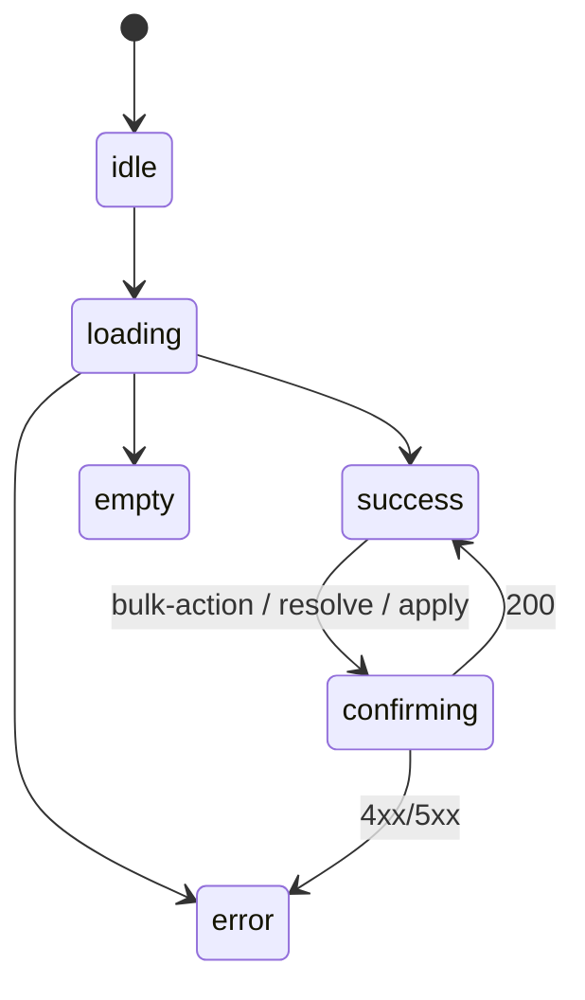

# Phase 03: 設計（task-21-w2-par-screen-blueprints-admin）

[実装区分: ドキュメントのみ]

> 判定根拠注記: 成果物は `docs/00-getting-started-manual/specs/09g-screen-blueprints-admin.md` の新規作成のみで、コード変更を一切伴わない pure docs タスクのため、CONST_004 の例外条件に該当する。

## メタ情報

| 項目 | 値 |
|------|-----|
| タスク ID | `task-21-w2-par-screen-blueprints-admin` |
| Phase | 03 / 13（設計） |
| 推定工数 | 0.10 人日 |
| 依存 Phase | Phase 01 / 02 |
| 並列性 | 不可（Phase 04 実装計画の前提） |
| タスク種別 | `docs-only` / `NON_VISUAL` |
| 改訂日 | 2026-05-07 |

---

## 0. 自己完結コンテキスト

### 0.1 上位ゴール

09g-screen-blueprints-admin.md の **章立て・各 §X の最小列構成・派生ルール適用方針・§99 不採用要素**を確定し、Phase 04 で実装手順に変換できる粒度に落とす。

### 0.2 本 Phase の責務

Phase 03 は **設計**。Phase 02 で確定した IN-01〜IN-12 を章立てに展開し、各 §X (2〜9) の 8 サブセクション構成（X.1〜X.8）を仕様化する。Phase 05 実装段階で「どの粒度で書けばよいか」を一意に決める。

### 0.3 本 Phase の出力

本 Phase そのものは仕様書ファイル `phase-03.md`（本ファイル）の確定が成果物。09g 本体の章立てテンプレ（§1〜§9 + §99）を本 Phase で凍結する。

---

## 1. 目的

09g の章立て・各セクション列構成・派生ルール適用方針を確定し、Phase 05 実装が機械的に進められる状態に閉じる。

---

## 2. 章立て（09g）

```
1. AdminSidebar (全画面共通・1 箇所集約)
2. /(admin)/admin (Dashboard)        ← AdminDashboardPage L4-L161
3. /(admin)/admin/members            ← AdminMembersPage L162-L368
4. /(admin)/admin/tags               ← AdminTagsPage L369-L507
5. /(admin)/admin/meetings           ← phase-3 §3 §5.4 派生 (admin CRUD)
6. /(admin)/admin/schema             ← SchemaDiffPage L508-L657
7. /(admin)/admin/requests           ← phase-3 §3 §5.3 派生 (admin queue)
8. /(admin)/admin/identity-conflicts ← phase-3 §3 §5.6 派生 (admin compare)
9. /(admin)/admin/audit              ← phase-3 §3 §5.7 派生 (admin timeline)
99. 不採用要素 (TweaksPanel / theme switcher / data-theme)
```

---

## 3. §1 AdminSidebar 共通設計

### 3.1 構成

| サブセクション | 内容 |
|--------------|------|
| 1.1 prototype 由来 | AdminLayout 内 sidebar 部分 JSX 一字一句転記 |
| 1.2 nav 項目表 | order / label / route / icon の 8 行表 |
| 1.3 active state | `aria-current="page"` 付与 / focus visible ring（token 経由） |
| 1.4 token / icon 参照 | primitive 09c §9 Sidebar / icon 09d §X / token `--ubm-color-panel` `--ubm-color-accent` `--ubm-radius-md` |

### 3.2 nav 項目表（固定）

| order | label | route | icon |
|-------|-------|-------|------|
| 1 | Dashboard | /(admin)/admin | dashboard |
| 2 | Members | /(admin)/admin/members | users |
| 3 | Tags | /(admin)/admin/tags | tag |
| 4 | Meetings | /(admin)/admin/meetings | calendar |
| 5 | Schema | /(admin)/admin/schema | diff |
| 6 | Requests | /(admin)/admin/requests | inbox |
| 7 | IdentityConflicts | /(admin)/admin/identity-conflicts | merge |
| 8 | Audit | /(admin)/admin/audit | clock |

### 3.3 §2〜§9 から §1 への参照ルール

各画面 §X 冒頭に「**Sidebar は §1 を参照（本 § では再記述しない）**」と明記し、§X 本文では layout の **main 部分のみ**を記述する。

---

## 4. §2〜§9 共通 8 サブセクション構成

各 §X (X = 2..9) は以下 8 列で統一:

| # | サブ § | 内容 |
|---|--------|------|
| X.1 | prototype 由来 / 派生ルール | 掲載画面: 該当行範囲 + jsx code block / 未掲載: 「派生元: phase-3 §3 §5.x」+ 派生ルール正本転記 |
| X.2 | コピー原文（一字一句） | 見出し / button label / placeholder / confirm dialog 文言を箇条書き |
| X.3 | 状態遷移 mermaid | `stateDiagram-v2` で idle / loading / success / error / empty / confirming を描画 |
| X.4 | API 表（current admin API contract 一致） | method / endpoint / trigger / 状態反映 |
| X.5 | props / state | name / type / scope の 3 列表 |
| X.6 | a11y | DataTable 行選択 keyboard / confirm Modal `role="dialog"` + `aria-modal="true"` + focus trap + Esc close / live region |
| X.7 | 操作手順 | bulk-action / queue resolve / schema alias apply confirm の 3〜4 ステップ |
| X.8 | 参照 | primitive 09c §X / icon 09d §X / token 09b §X / mapping 09a §X |

### 4.1 §X.3 状態遷移 mermaid テンプレ



§6 schema は **二段確認**のため `success --> diff_shown --> applying --> success` を追加。

### 4.2 §X.4 API 表テンプレ（current admin API contract 一致）

| § | 主 endpoint |
|---|------------|
| §2 dashboard | `GET /admin/dashboard` / `GET /admin/dashboard/attendance/*` |
| §3 members | `GET /admin/members` / `GET /admin/members/:memberId` / `PATCH /admin/members/:memberId/status` |
| §4 tags | `GET /admin/tags/queue` / `POST /admin/tags/queue/:queueId/resolve` |
| §5 meetings | `GET /admin/meetings` / `POST /admin/meetings` |
| §6 schema | `GET /admin/schema/diff` / `POST /admin/schema/aliases` |
| §7 requests | `GET /admin/requests` / `POST /admin/requests/:noteId/resolve` |
| §8 identity-conflicts | `GET /admin/identity-conflicts` / `POST /admin/identity-conflicts/:id/merge` / `POST /admin/identity-conflicts/:id/dismiss` |
| §9 audit | `GET /admin/audit` |

---

## 5. 未掲載画面（§5 / §7 / §8 / §9）派生ルール

| route | 派生元 | パターン名 | 取り込む情報 |
|-------|--------|-----------|-------------|
| /(admin)/admin/meetings | phase-3 §3 §5.4 | admin CRUD | DataTable + Form Modal / GET, POST /admin/meetings |
| /(admin)/admin/requests | phase-3 §3 §5.3 + current API contract | admin queue | 左 list + 右 detail / request resolve confirm |
| /(admin)/admin/identity-conflicts | phase-3 §3 §5.6 | admin compare | 2-column compare + resolve |
| /(admin)/admin/audit | phase-3 §3 §5.7 | admin timeline | TimelineList + AuditFilterBar |

各派生 § には冒頭に `> 派生元: phase-3 §3 §5.x` の注記行を必ず置き、派生ルール正本（phase-3 該当節）を 1 字も改変せず転記する。

### 5.1 派生時の制約

- 新規 primitive を生成しない（09c の primitive 組合せのみ）
- token は `--ubm-*` 名のみ参照（値は 09b）
- icon は 09d §X から名前で参照
- 状態遷移 mermaid は §4.1 テンプレから派生パターン固有の transition のみ追記

---

## 6. §99 不採用要素

| 要素 | 理由 | 出典 |
|------|------|------|
| TweaksPanel | EDITMODE 専用（本番非対応） | `app.jsx` L213-L251 |
| theme switcher | dark mode MVP 非対応 | styles.css 由来 |
| data-theme="warm" / "cool" | 同上（OKLch 単一テーマで MVP リリース） | styles.css L42-70 |

---

## 7. 不変条件（§冒頭に転記する 10 件）

09g 本体の冒頭「不変条件」節に Phase 02 §4 の C-01〜C-10 をそのまま転記:

1. pages-admin.jsx 改変禁止
2. コピー文言一字一句維持、JSX 視覚値 literal は token 名へ正規化
3. 視覚値 0 件
4. apps/web から D1 直接アクセス禁止
5. AdminSidebar §1 集約・重複禁止
6. confirm Modal 必須（`role="dialog"` + `aria-modal="true"` + focus trap + Esc close）
7. schema alias apply 二段確認
8. 未掲載 4 画面で新規 primitive 生成禁止
9. API 表 current admin API contract 一致
10. 各画面 §X.8 で 09a/09b/09c/09d link 必須

---

## 8. プロトタイプ参照表

| § | prototype 行範囲 / 派生元 |
|---|--------------------------|
| §1 | sidebar 部分（AdminLayout 内） |
| §2 | L4-L161 |
| §3 | L162-L368 |
| §4 | L369-L507 |
| §5 | phase-3 §3 §5.4 派生 |
| §6 | L508-L657 |
| §7 | phase-3 §3 §5.3 派生 |
| §8 | phase-3 §3 §5.6 派生 |
| §9 | phase-3 §3 §5.7 派生 |

---

## 9. リスク / 注意

| リスク | 緩和 |
|-------|------|
| §X.4 API 表が current admin API contract と drift | Phase 07 endpoint grep gate |
| 派生 4 画面が独自 primitive を生やす | §5.1 制約 + Phase 06 spec review |
| §1 Sidebar が他 § に重複 | §3.3 参照ルール + Phase 07 grep |
| 視覚値混入 | Phase 07 grep （HEX / oklch / px / `bg-[`） |

---

## 10. 次 Phase への引き渡し

Phase 04（実装計画）は §1 → §2 → §3 → §4 → §5 → §6 → §7 → §8 → §9 → §99 の順序で執筆手順を分解する。本 Phase の 8 サブセクション構成（§4 共通テンプレ）と派生ルール（§5）を入力とする。

## 実行タスク

- 09g の章立て・各 § 列構成・派生ルール・§99 不採用を確定し Phase 04 へ引き渡す。

## 参照資料

| 参照資料 | パス | 説明 |
| --- | --- | --- |
| 親タスク仕様 | `docs/30-workflows/ui-prototype-alignment-mvp-recovery/03-spec-source/task-21-w2-par-screen-blueprints-admin.md` | source §4 章立て |
| Phase 02 | `phase-02.md` | IN/OUT/制約 |
| 派生ルール正本 | `outputs/phase-3/phase-3.md` §3 §5.3〜§5.7 | 未掲載 4 画面 |

## 成果物

| 成果物 | パス | 説明 |
| --- | --- | --- |
| phase specification | `docs/30-workflows/completed-tasks/task-21-w2-par-screen-blueprints-admin/phase-03.md` | 本 phase の仕様書 |

## 完了条件

- [ ] 本 phase の本文で定義した gate が満たされている。
- [ ] §1〜§9 + §99 の章立てが Phase 02 IN-01..12 と一致。
- [ ] 各 §X の 8 サブセクション構成が確定。
- [ ] 派生 4 画面の派生元が表で固定。

## 目的

- 09g 章立てを凍結し、Phase 04 実装計画が機械的に分解できる状態を確立する。

## 統合テスト連携

- 本タスクは docs-only / NON_VISUAL のため Vitest 統合テストは対象外。Phase 07 grep / Phase 08 link integrity を代替証跡とする。
