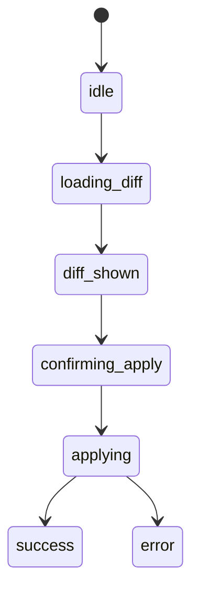

# Phase 05: 実装（task-21-w2-par-screen-blueprints-admin）

[実装区分: ドキュメントのみ]

> 判定根拠注記: 成果物は `docs/00-getting-started-manual/specs/09g-screen-blueprints-admin.md` の新規作成のみで、コード変更を一切伴わない pure docs タスクのため、CONST_004 の例外条件に該当する。

## メタ情報

| 項目 | 値 |
|------|-----|
| タスク ID | `task-21-w2-par-screen-blueprints-admin` |
| Phase | 05 / 13（実装 = 09g 本体執筆） |
| 推定工数 | 0.40 人日（全体 1.0 人日のうち最大セクション） |
| 依存 Phase | Phase 01 / 02 / 03 / 04 |
| 並列性 | 不可（10 ステップ直列） |
| タスク種別 | `docs-only` / `NON_VISUAL` |
| 改訂日 | 2026-05-07 |

---

## 0. 自己完結コンテキスト

### 0.1 上位ゴール

Phase 04 で分解した 10 ステップを順次実行し、`docs/00-getting-started-manual/specs/09g-screen-blueprints-admin.md` 本体（700〜1200 行）を生成する。

### 0.2 本 Phase の責務

Phase 05 は **実装**。本タスクは pure docs であり「実装」= 「09g 本体の執筆」と読み替える。コード差分は一切発生しない。

### 0.3 本 Phase の出力

`docs/00-getting-started-manual/specs/09g-screen-blueprints-admin.md`（新規 / 700〜1200 行）

---

## 1. 目的

Phase 04 の 10 ステップを実行し、09g を完成させる。各ステップの DoD を Phase 06 spec review 前に満たす。

---

## 2. 実行コマンド・前段確認

```bash
# 前段: pages-admin.jsx 一読
cat docs/00-getting-started-manual/claude-design-prototype/pages-admin.jsx

# 前段: phase-3 §5.3〜§5.7 確認
grep -n '^### 5\.' docs/30-workflows/ui-prototype-alignment-mvp-recovery/outputs/phase-3/phase-3.md

# 前段: 09g 未存在確認
test ! -f docs/00-getting-started-manual/specs/09g-screen-blueprints-admin.md

# 執筆: $EDITOR で 09g を新規作成
$EDITOR docs/00-getting-started-manual/specs/09g-screen-blueprints-admin.md
```

---

## 3. 執筆順（Phase 04 10 Step 再掲）

| # | § | 入力 | 想定行 |
|---|---|------|-------|
| 1 | §1 AdminSidebar | sidebar JSX | 60〜100 |
| 2 | §2 dashboard | L4-L161 | 80〜120 |
| 3 | §3 members | L162-L368 | 100〜150 |
| 4 | §4 tags | L369-L507 | 100〜150 |
| 5 | §5 meetings | phase-3 §5.4 | 70〜110 |
| 6 | §6 schema | L508-L657 | 100〜150 |
| 7 | §7 requests | phase-3 §5.3 | 70〜110 |
| 8 | §8 conflicts | phase-3 §5.6 | 70〜110 |
| 9 | §9 audit | phase-3 §5.7 | 60〜100 |
| 10 | §99 不採用 | Phase 03 §6 | 20〜40 |

---

## 4. 09g 冒頭テンプレ（必ず最上部に置く）

```markdown
# 09g. Screen Blueprints — Admin

## 不変条件

1. pages-admin.jsx は凍結正本。改変禁止。
2. JSX inline は一字一句転記。
3. 視覚値（HEX / oklch / px / `bg-[#...]`）を本ファイルに含めない。
4. apps/web から D1 直接アクセス禁止（CLAUDE.md 不変条件 #5）。
5. AdminSidebar は §1 集約・各画面で重複禁止。
6. bulk-action / queue resolve / schema alias apply confirm Modal 必須（`role="dialog"` + `aria-modal="true"` + focus trap + Esc close）。
7. schema alias apply は二段確認（dryRun diff → aliases apply confirm）。
8. 未掲載 4 画面は phase-3 §3 §5.3〜§5.7 派生ルール準拠・新規 primitive 禁止。
9. API 表は current admin API contract と一致。
10. 各画面 §X.8 で 09a / 09b / 09c / 09d への link 必須。

## 章立て

1. AdminSidebar
2. /(admin)/admin (Dashboard)
3. /(admin)/admin/members
4. /(admin)/admin/tags
5. /(admin)/admin/meetings
6. /(admin)/admin/schema
7. /(admin)/admin/requests
8. /(admin)/admin/identity-conflicts
9. /(admin)/admin/audit
99. 不採用要素
```

---

## 5. ステップ実行ガイド

### 5.1 §1 AdminSidebar（最優先）

- AdminLayout の sidebar 部分を JSX code block で一字一句転記
- nav 8 項目表（Phase 03 §3.2）を transparent に転記
- §1.3 active state: `aria-current="page"` 付与ルール
- §1.4 token / icon / primitive link

### 5.2 §X (X = 2..9) 共通テンプレ

```markdown
## X. <route>

> Sidebar は §1 を参照（本 § では再記述しない）。
> （未掲載画面のみ）派生元: phase-3 §3 §5.x

### X.1 prototype 由来 / 派生ルール
（掲載画面: ```jsx ... ``` / 未掲載: 派生ルール正本転記）

### X.2 コピー原文（一字一句）
- 見出し: ...
- button label: ...
- placeholder: ...
- confirm dialog 文言: ...

### X.3 状態遷移
\`\`\`mermaid
stateDiagram-v2
  [*] --> idle
  idle --> loading
  loading --> success
  loading --> error
  loading --> empty
  success --> confirming: bulk-action / approve / apply
  confirming --> success: 200
  confirming --> error: 4xx/5xx
\`\`\`

### X.4 API 表
| method | endpoint | trigger | 状態反映 |

### X.5 props / state
| name | type | scope |

### X.6 a11y
- DataTable 行選択 keyboard
- confirm Modal: `role="dialog"` + `aria-modal="true"` + focus trap + Esc close
- live region (status / alert)

### X.7 操作手順
1. 行選択 → bulk-action button enable
2. button 押下 → confirm Modal open
3. confirm 押下 → API call
4. 成功時 toast + 一覧再取得 / 失敗時 error toast

### X.8 参照
- primitive: 09c §X
- icon: 09d §X
- token: 09b §X
- mapping: 09a §X
```

### 5.3 §6 schema 専用拡張（二段確認）

§6.3 mermaid に以下を追記:



§6.7 操作手順は **5 ステップ**:

1. `GET /admin/schema/diff` 実行 → diff_shown
2. user が「適用」button を押下 → confirm Modal open
3. confirm Modal で再度「適用する」を押下 → applying
4. `POST /admin/schema/aliases` 実行
5. 成功時 toast + diff 再取得 / 失敗時 error toast

### 5.4 §99 不採用要素

```markdown
## 99. 不採用要素

| 要素 | 理由 |
|------|------|
| TweaksPanel (`app.jsx` L213-L251) | EDITMODE 専用 |
| theme switcher | dark mode MVP 非対応 |
| data-theme="warm" / "cool" | 同上 |
```

---

## 6. 実装中の自己チェック

各 § 完了時に以下を確認:

- [ ] §X.1〜§X.8 が揃っている（X = 2..9）
- [ ] §1 への参照行（「Sidebar は §1 参照」）が冒頭にある
- [ ] 派生 §（5/7/8/9）に `> 派生元: phase-3 §3 §5.x` 行がある
- [ ] mermaid block が 1 つ以上
- [ ] API 表が current admin API contract と一致
- [ ] 視覚値（HEX / oklch / px / `bg-[`）混入なし
- [ ] 09a / 09b / 09c / 09d への link が §X.8 にある

---

## 7. 完了条件（Phase 06 へ進む gate）

- [ ] 09g が新規作成されている
- [ ] 行数 700〜1200 範囲内（`wc -l docs/00-getting-started-manual/specs/09g-screen-blueprints-admin.md`）
- [ ] §1〜§9 + §99 = 10 セクションが揃う（`grep -cE '^## [0-9]+\. '` → 10）
- [ ] §1 重複なし（`grep -c '^## 1\. AdminSidebar'` → 1）
- [ ] mermaid block 8 件以上（`grep -c '^```mermaid$'` → 8+）
- [ ] 視覚値 0 件（HEX / oklch / px / `bg-[`）
- [ ] markdown lint error 0

---

## 8. プロトタイプ参照表

| § | prototype 行範囲 / 派生元 | コンポーネント |
|---|--------------------------|---------------|
| §1 | sidebar 部分 | AdminSidebar |
| §2 | L4-L161 | KpiGrid / ZoneChart / StatusChart / RecentActions |
| §3 | L162-L368 | DataTable / MemberDrawer |
| §4 | L369-L507 | TagsQueue / queue resolve confirm |
| §5 | phase-3 §5.4 | MeetingsCalendar / MeetingForm |
| §6 | L508-L657 | SchemaDiff / 二段確認 |
| §7 | phase-3 §5.3 | RequestsQueue / RequestDetail |
| §8 | phase-3 §5.6 | ConflictPair compare |
| §9 | phase-3 §5.7 | AuditTimeline / AuditFilterBar |

---

## 9. リスク / 注意

| リスク | 緩和 |
|-------|------|
| 一字一句から逸脱（語順入れ替え等） | 各 § 完了直後に diff レビュー |
| 視覚値混入 | Phase 07 grep で必ず検出されるが Phase 05 段階でも `pnpm lint:md` 補助 |
| Sidebar 重複 | Step 1 で §1 を確定 + §2〜§9 冒頭に参照行を機械的に挿入 |
| 派生節の解釈ぶれ | phase-3 §5.x を 1 字も改変せず転記 |

---

## 10. 次 Phase への引き渡し

Phase 06（コードレビュー = spec レビュー）は 09g 本体に対して以下を確認: (1) JSX 一字一句一致 / (2) API 表が current admin API contract と一致 / (3) Sidebar §1 集約 / (4) confirm Modal 記述 / (5) 視覚値 0 件 / (6) link 完備。

## 実行タスク

- Phase 04 の 10 ステップを順次実行し、09g 本体を完成させる。

## 参照資料

| 参照資料 | パス | 説明 |
| --- | --- | --- |
| Phase 04 | `phase-04.md` | 10 ステップ実装計画 |
| プロトタイプ | `docs/00-getting-started-manual/claude-design-prototype/pages-admin.jsx` | 凍結 658 行 |
| 派生ルール正本 | `outputs/phase-3/phase-3.md` §3 §5.3〜§5.7 | 未掲載 4 画面 |

## 成果物

| 成果物 | パス | 説明 |
| --- | --- | --- |
| 09g 本体 | `docs/00-getting-started-manual/specs/09g-screen-blueprints-admin.md` | 新規 700〜1200 行 |
| phase specification | `docs/30-workflows/completed-tasks/task-21-w2-par-screen-blueprints-admin/phase-05.md` | 本 phase の仕様書 |

## 完了条件

- [ ] 本 phase の本文で定義した gate が満たされている。
- [ ] 09g 行数 / セクション数 / mermaid 数 / 視覚値 0 / link 完備が全て PASS。

## 目的

- Phase 04 の 10 ステップを実行し、09g 本体（700〜1200 行）を完成させる。

## 統合テスト連携

- 本タスクは docs-only / NON_VISUAL のため Vitest 統合テストは対象外。Phase 07 grep / Phase 08 link integrity を代替証跡とする。
