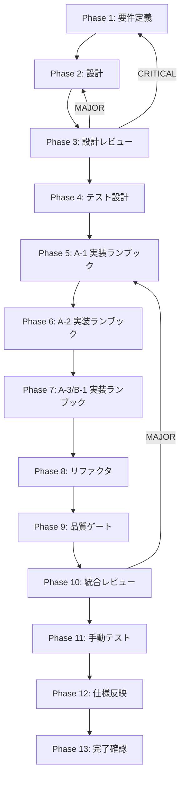

# task-conflict-prevention-skill-state-redesign — タスク仕様書 index

## ユーザーからの元の指示

```
並列開発時に skill 配下の共有 ledger ファイルがコンフリクト多発の根本原因に
なっているため、ファイル設計レベルで再構築する。
A-1: 自動生成 ledger を gitignore 化
A-2: Changesets パターンによる append-only ログの fragment 化
A-3: SKILL.md の Progressive Disclosure 化
B-1: .gitattributes による merge=union driver 適用
```

## メタ情報

| 項目 | 値 |
| --- | --- |
| タスク名 | task-conflict-prevention-skill-state-redesign |
| 機能名 (featureName) | task-conflict-prevention-skill-state-redesign |
| ディレクトリ | docs/30-workflows/task-conflict-prevention-skill-state-redesign |
| タスク種別 | docs-only |
| 視覚証跡区分 | NON_VISUAL |
| ワークフロー | spec_created（仕様書作成のみ。実装は別タスク） |
| 作成日 | 2026-04-28 |
| 担当 | devops / skill-author |
| 状態 | spec_created |
| 優先度 | 高 |
| 見積もり規模 | 中規模 |

---

## タスク概要

### 目的

並列開発（複数 worktree が同一 main 派生で並走）時に、`.claude/skills/` 配下の
**共有 ledger ファイル**（自動カウンタ JSON、追記型 LOGS、肥大化した SKILL.md など）
が常に同じバイト位置で書き換わり、3-way merge で衝突を多発させている。
この衝突を **ファイル設計レベル**で消滅させる方針を 4 つの施策（A-1 / A-2 / A-3 / B-1）として
仕様化し、後続タスクが実装できるよう Phase 1–13 の仕様書として固定する。

### 背景

- `.claude/skills/aiworkflow-requirements/LOGS.md` / `indexes/keywords.json` /
  `indexes/index-meta.json` は post-commit / post-merge hook で自動再生成される派生物。
  4 worktree が同時に commit すると `totalKeywords: 2966` のような単純カウンタが
  100% 衝突する。
- `LOGS.md` 系の append-only ledger は、各 worktree が同じファイル末尾位置に追記するため
  3-way merge では必ずコンフリクトする。
- `task-specification-creator/SKILL.md` のように肥大化した skill 本体ファイルも、
  局所的な追記が連続して衝突源になる。
- 上記は「運用注意」では解決しない。**ファイルの置き場所と分割粒度**を変えるしかない。

### 最終ゴール

- A-1 〜 B-1 の 4 施策を Phase 別仕様書に落とし、Phase 5–7 の実装タスクが
  そのまま着手できる状態にする
- 4 worktree から並列に commit / merge した際、ledger 由来のコンフリクトが **0 件**となる
  検証手順が Phase 4 / Phase 11 で定義されている
- skill ledger の正本ルールを `docs/00-getting-started-manual/specs/` へ追記するための仕様更新手順が Phase 12 で固定される

---

## スコープ

### 含む

- A-1: 自動生成 ledger の `.gitignore` 化方針
  - 対象: `.claude/skills/aiworkflow-requirements/LOGS.md` /
    `indexes/keywords.json` / `indexes/index-meta.json` 等の自動カウンタ系
  - hook ガード（`[[ -f .gitignore対象 ]] || regenerate`）の設計
- A-2: Changesets パターンによる fragment 化
  - 対象: `.claude/skills/aiworkflow-requirements/LOGS.md`、
    `task-specification-creator/SKILL-changelog.md`、`lessons-learned-*.md` 系
  - `LOGS/<YYYYMMDD-HHMMSS>-<escaped-branch>-<nonce>.md` 形式
  - 集約 view 用 render script（`pnpm skill:logs:render`）の API 設計（実装は別タスク）
- A-3: SKILL.md の Progressive Disclosure 分割方針
  - 200 行未満を目標に `references/<topic>.md` へ抽出
- B-1: `.gitattributes` による `merge=union` ドライバ適用
  - 対象: append-only ledger 全般（A-2 fragment 化前の暫定 / fragment 化不可なファイル）
  - 各行が独立した意味を持つフォーマットへの揃え方

### 含まない

- 上記 4 施策のコード実装（Phase 5–7 で参照される別タスクで実施）
- skill 自体の機能改修（責務追加・削除）
- aiworkflow-requirements skill の content 自体の再構成
- post-commit / post-merge hook の実体実装（仕様提示のみ）
- Cloudflare / D1 周辺の設定変更

---

## 依存関係

| 種別 | 対象 | 理由 |
| --- | --- | --- |
| 上流 | `.claude/skills/aiworkflow-requirements/SKILL.md` | 既存 ledger 構造の正本 |
| 上流 | `.claude/skills/task-specification-creator/SKILL.md` | SKILL.md 肥大化の事例ソース |
| 上流 | `.claude/skills/task-specification-creator/SKILL-changelog.md` | append-only changelog 事例 |
| 下流 | （別タスク）A-1 実装 | `.gitignore` 追記 + hook ガード |
| 下流 | （別タスク）A-2 実装 | LOGS/ ディレクトリ転換 + render script |
| 下流 | （別タスク）A-3 実装 | SKILL.md 分割 |
| 下流 | （別タスク）B-1 実装 | `.gitattributes` 追記 |
| 並列 | 他 worktree の skill 改修タスク | 本仕様確定までは ledger 触らないことを推奨 |

---

## 主要な参照資料

| 種別 | パス | 用途 |
| --- | --- | --- |
| 必須 | `.claude/skills/task-specification-creator/SKILL.md` | 仕様書テンプレ規約 |
| 必須 | `.claude/skills/task-specification-creator/assets/main-task-template.md` | index.md 構造 |
| 必須 | `.claude/skills/task-specification-creator/assets/phase-spec-template.md` | Phase 仕様書構造 |
| 必須 | `.claude/skills/task-specification-creator/assets/common-header-template.md` | 共通ヘッダ |
| 必須 | `.claude/skills/task-specification-creator/assets/common-footer-template.md` | 共通フッタ |
| 必須 | `.claude/skills/task-specification-creator/references/phase-template-phase1.md` 〜 `phase-template-phase13.md` | 各 Phase 規約 |
| 参考 | `docs/30-workflows/02-application-implementation/02b-parallel-meeting-tag-queue-and-schema-diff-repository/index.md` | 実例 |
| 参考 | `.claude/skills/aiworkflow-requirements/LOGS.md` | A-2 対象実例 |
| 参考 | `.claude/skills/aiworkflow-requirements/indexes/keywords.json` | A-1 対象実例 |

---

## 受入条件 (AC)

- AC-1: A-1 / A-2 / A-3 / B-1 の各施策に対し、対象ファイルパスと変更後形式が **Phase 2 設計**に明記されている
- AC-2: A-2 の fragment 命名規約 (`LOGS/<YYYYMMDD-HHMMSS>-<escaped-branch>-<nonce>.md`) が **同一秒・同一branchでも一意**に定義されている
- AC-3: A-3 で SKILL.md が **200 行未満**になる分割案が示されている
- AC-4: B-1 の `.gitattributes` パターンが「行レベル独立」を満たすファイルにのみ適用されることが Phase 3 レビューで確認されている
- AC-5: Phase 4 で 4 worktree 並列 commit シミュレーションの再現手順が記述されている
- AC-6: Phase 11 で「4 worktree から並列 fragment 生成 → マージで衝突 0 件」を後続実装後に検証できる手順と証跡形式が固定されている
- AC-7: Phase 12 で `docs/00-getting-started-manual/specs/` 配下へ **skill ledger 仕様**を追記する手順、更新対象、検証コマンドが `documentation-changelog.md` と整合している
- AC-8: 既存 skill 利用者への後方互換性影響（既存 LOGS.md の history 保持方針）が Phase 3 で評価済
- AC-9: 本タスクは **コード実装を含まない**。生成物は Markdown / JSON / `.gitkeep` のみ

---

## Phase 一覧

| Phase | 名称 | ファイル | 状態 | 主成果物 |
| --- | --- | --- | --- | --- |
| 1 | 要件定義 | phase-01.md | completed | outputs/phase-1/main.md |
| 2 | 設計 | phase-02.md | completed | outputs/phase-2/{main,file-layout,fragment-schema,render-api,gitattributes-pattern}.md |
| 3 | 設計レビュー | phase-03.md | completed | outputs/phase-3/{main,impact-matrix,backward-compat}.md |
| 4 | テスト設計 | phase-04.md | completed | outputs/phase-4/{main,parallel-commit-sim,merge-conflict-cases}.md |
| 5 | A-1 実装ランブック | phase-05.md | completed | outputs/phase-5/{main,gitignore-runbook}.md |
| 6 | A-2 実装ランブック | phase-06.md | completed | outputs/phase-6/{main,fragment-runbook}.md |
| 7 | A-3 / B-1 実装ランブック | phase-07.md | completed | outputs/phase-7/{main,skill-split-runbook,gitattributes-runbook}.md |
| 8 | リファクタ | phase-08.md | completed | outputs/phase-8/{main,before-after}.md |
| 9 | 品質ゲート | phase-09.md | completed | outputs/phase-9/{main,quality-checklist}.md |
| 10 | 統合レビュー | phase-10.md | completed | outputs/phase-10/{main,go-no-go}.md |
| 11 | 手動テスト | phase-11.md | completed | outputs/phase-11/{main,manual-smoke-log,link-checklist}.md |
| 12 | 仕様反映 | phase-12.md | completed | outputs/phase-12/{main,implementation-guide,system-spec-update-summary,documentation-changelog,unassigned-task-detection,skill-feedback-report,phase12-task-spec-compliance-check}.md |
| 13 | 完了確認 | phase-13.md | pending | outputs/phase-13/{main,change-summary,pr-template}.md |

---

## 実行フロー図



---

## 主要成果物

| 種別 | パス | 説明 |
| --- | --- | --- |
| 仕様書 | phase-01.md 〜 phase-13.md | 13 phase 別仕様 |
| メタ | artifacts.json | 機械可読サマリー |
| ドキュメント | outputs/phase-2/file-layout.md | 4 施策の対象ファイルマップ |
| ドキュメント | outputs/phase-2/fragment-schema.md | A-2 fragment 命名規約 |
| ドキュメント | outputs/phase-2/render-api.md | render script の API 仕様 |
| ドキュメント | outputs/phase-2/gitattributes-pattern.md | B-1 適用範囲 |
| ドキュメント | outputs/phase-4/parallel-commit-sim.md | 並列 commit 検証手順 |
| ドキュメント | outputs/phase-12/implementation-guide.md | A-1 〜 B-1 実装タスク向け guide |

---

## 関連サービス・ツール

| サービス/ツール | 用途 | 無料枠/コスト |
| --- | --- | --- |
| Git (3-way merge / merge driver) | コンフリクト検証 | OSS |
| Changesets | fragment パターン参照元 | OSS |
| Knip | fragment パターン参照元 | OSS |
| pnpm | render script 実行基盤 | OSS |

---

## Secrets 一覧（このタスクで導入）

なし。

---

## 触れる不変条件

| # | 不変条件 | このタスクでの扱い |
| --- | --- | --- |
| — | skill 仕様の正本性 | LOGS / changelog の正本配置を fragment へ転換 |
| — | 並列開発の独立性 | worktree 間で同一バイト位置を書かない構造に変更 |

---

## テストカバレッジ目標

本タスクは仕様書生成のみ。コード実装はないため unit / integration test は対象外。
ただし Phase 4 で「並列 commit シミュレーション」の検証手順は必須。

---

## 完了判定

- Phase 1〜13 の状態が `artifacts.json` と一致する
- AC-1 〜 AC-9 が Phase 7 / Phase 10 でトレースされる
- Phase 11 で 4 worktree 並列マージの検証手順と証跡形式が固定されている
- Phase 12 で specs 配下に skill ledger 仕様を追記する更新手順が固定されている
- Phase 13 はユーザー承認なしでは実行しない

---

## 関連リンク

- skill 本体: `.claude/skills/task-specification-creator/SKILL.md`
- 実例: `docs/30-workflows/02-application-implementation/02b-parallel-meeting-tag-queue-and-schema-diff-repository/`
- 4 施策の根拠: 本 index.md 冒頭「ユーザーからの元の指示」
