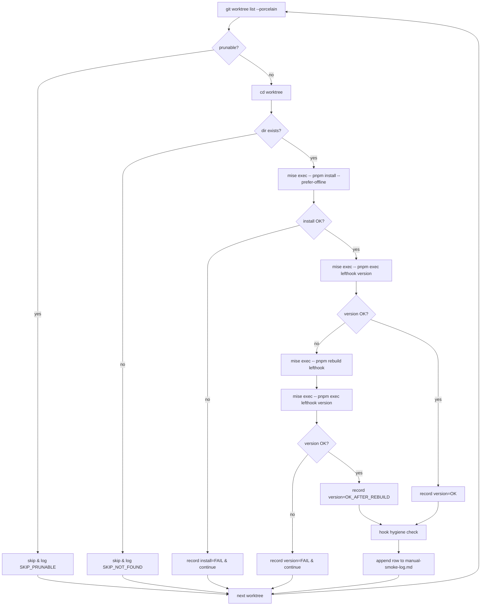

# Phase 2: 設計 — 一括再 install runbook の構成・順序・冪等性設計

## メタ情報

| 項目 | 値 |
| --- | --- |
| タスク名 | 30+ worktree への lefthook 一括再インストール runbook 運用化 |
| Phase 番号 | 2 / 13 |
| Phase 名称 | 設計 |
| 作成日 | 2026-04-28 |
| 前 Phase | 1 (要件定義) |
| 次 Phase | 3 (設計レビュー) |
| 状態 | spec_created |

## 1. 目的

Phase 1 で固定した要件（hook スキップ撲滅 + 継続保証）を満たす一括再 install runbook の
**構成・順序・冪等性・失敗復帰戦略**を確定する。
本タスクは docs-only であるため、本 Phase の主成果物は「runbook 設計書」と
「擬似スクリプト仕様」であり、実コードは別 Wave で生成する。

## 2. 設計の前提（Phase 1 から継承）

| 前提 | 内容 |
| --- | --- |
| 並列禁止 | pnpm の content-addressable store は同時書き込みで壊れる。runbook は逐次のみ |
| 実行ラッパ | 全コマンドに `mise exec --` を前置（Node 24 / pnpm 10 保証） |
| 冪等性 | `lefthook install` は何度実行しても同じ最終状態に収束する（公式仕様） |
| ログ書式 | `outputs/phase-11/manual-smoke-log.md` に Markdown 表形式で記録 |
| プラットフォーム | macOS (Darwin) / Apple Silicon を主対象。Intel Mac / Linux はベストエフォート |
| detached HEAD | hook 必要性は branch state と独立。**含める**（ADR-04） |
| prunable | 抽出時点で除外（pnpm install しても無意味） |

## 3. 全体構成（Mermaid）



## 4. 主要コンポーネント設計

### 4.1 有効 worktree 抽出

| 項目 | 仕様 |
| --- | --- |
| 入力 | `git worktree list --porcelain` |
| 解析 | `worktree <path>` 行を採取し、同一レコード内に `prunable` 行があれば除外 |
| 出力 | 改行区切りの worktree path 一覧（`prunable` 除外後） |
| detached HEAD 扱い | **含める**（hook 必要性は branch と独立） |
| 失敗時 | `git worktree list` 自体が失敗した場合は runbook 中断（fatal） |

awk による parse 仕様:

```awk
BEGIN { path = "" }
/^worktree /  { path = $2 }
/^prunable/   { path = "" }            # prunable レコードは除外
/^$/          { if (path != "") print path; path = "" }
END           { if (path != "") print path }
```

### 4.2 逐次 install ループ

| 項目 | 仕様 |
| --- | --- |
| 実装方針 | `while read -r wt; do ...; done` で**必ず逐次** |
| 並列禁止 | `xargs -P` / GNU parallel / `&` バックグラウンドは仕様違反 |
| 各 worktree の処理 | (a) `cd` → (b) `mise exec -- pnpm install --prefer-offline` → (c) `mise exec -- pnpm exec lefthook version` → (d) hook hygiene check → (e) ログ追記 |
| 続行ポリシー | 1 worktree 失敗で全体停止せず、次に進み、最後に集計（ADR-02） |
| エラーハンドリング | `set -uo pipefail` を採用。`set -e` は採用しない（continue 必要） |

### 4.3 検証フェーズ

| 項目 | 仕様 |
| --- | --- |
| 検証コマンド | `mise exec -- pnpm exec lefthook version` |
| PASS 基準 | exit code = 0 かつ stdout に semver 形式のバージョン表示 |
| FAIL 時の自動 retry | `mise exec -- pnpm rebuild lefthook` を **1 度だけ** 試みる（Apple Silicon binary mismatch 対策） |
| 二度目も FAIL | 当該 worktree を `version=FAIL` として記録し runbook 自体は continue |
| version 記録 | `OK` / `OK_AFTER_REBUILD` / `FAIL` の 3 値で正規化 |

### 4.4 旧 hook 残存点検（hook hygiene）

| 項目 | 仕様 |
| --- | --- |
| 確認対象 | `.git/hooks/post-merge` および `.git/hooks/pre-commit` |
| 判定方法 | `head -n1 .git/hooks/post-merge` を確認 |
| OK 判定 | sentinel `LEFTHOOK` を含む → `OK` |
| STALE 判定 | ファイル存在するが sentinel 無し → `STALE`（手動削除を warning） |
| ABSENT 判定 | ファイル無し → `ABSENT`（lefthook が pre-commit 専用ならば許容） |
| 自動削除 | **行わない**（ADR-03。ユーザーカスタム hook 誤削除リスク回避） |
| 対処 | runbook 末尾で STALE worktree 一覧を表示し、ユーザーに手動削除判断を委ねる |

### 4.5 ログ書式

`outputs/phase-11/manual-smoke-log.md` に下記表で追記する。
ISO8601 UTC（M-01 対応）。

| 実行日時 | worktree path | install result | lefthook version | hook hygiene | 備考 |
| --- | --- | --- | --- | --- | --- |
| 2026-04-28T10:00Z | /Users/dm/.../UBM-Hyogo | PASS | 1.6.10 | OK | - |
| 2026-04-28T10:01Z | /Users/dm/.../wt-1 | PASS | 1.6.10 | STALE | 旧 post-merge 残存・要削除 |
| 2026-04-28T10:02Z | /Users/dm/.../wt-2 | FAIL | - | - | pnpm install 失敗 |
| 2026-04-28T10:03Z | /Users/dm/.../wt-3 | PASS | 1.6.10 | OK_AFTER_REBUILD | Apple Silicon rebuild 適用 |

カラム値の取りうる範囲:

- install result: `PASS` / `FAIL` / `SKIP_NOT_FOUND` / `SKIP_PRUNABLE`
- lefthook version: semver 文字列 or `-`（FAIL 時）
- hook hygiene: `OK` / `STALE` / `ABSENT`

## 5. 擬似スクリプト仕様（実装は別 Wave）

`scripts/reinstall-lefthook-all-worktrees.sh` として将来的に実装予定。
**本タスクではコード化しない**。

```bash
#!/usr/bin/env bash
# scripts/reinstall-lefthook-all-worktrees.sh （仕様。本タスクでは実装しない）
set -uo pipefail

LOG="${LOG:-outputs/phase-11/manual-smoke-log.md}"
TODAY="$(date -u +%Y-%m-%dT%H:%MZ)"
REPO_ROOT="$(git rev-parse --show-toplevel)"

git -C "$REPO_ROOT" worktree list --porcelain |
  awk 'BEGIN{path=""}
       /^worktree /{path=$2}
       /^prunable/{path=""}
       /^$/{if(path) print path; path=""}
       END{if(path) print path}' |
  while read -r wt; do
    if [ ! -d "$wt" ]; then
      printf "| %s | %s | SKIP_NOT_FOUND | - | - | - |\n" "$TODAY" "$wt" >> "$LOG"
      continue
    fi
    pushd "$wt" >/dev/null || continue

    # ---- (a) install ----
    if mise exec -- pnpm install --prefer-offline >/dev/null 2>&1; then
      install_status="PASS"
    else
      install_status="FAIL"
    fi

    # ---- (b) version verify (with retry) ----
    if mise exec -- pnpm exec lefthook version >/dev/null 2>&1; then
      version="$(mise exec -- pnpm exec lefthook version 2>/dev/null | tail -n1)"
      version_status="OK"
    else
      mise exec -- pnpm rebuild lefthook >/dev/null 2>&1 || true
      if mise exec -- pnpm exec lefthook version >/dev/null 2>&1; then
        version="$(mise exec -- pnpm exec lefthook version 2>/dev/null | tail -n1)"
        version_status="OK_AFTER_REBUILD"
      else
        version="-"
        version_status="FAIL"
      fi
    fi

    # ---- (c) hook hygiene ----
    if head -n1 .git/hooks/post-merge 2>/dev/null | grep -q "LEFTHOOK"; then
      hygiene="OK"
    elif [ -f .git/hooks/post-merge ]; then
      hygiene="STALE"
    else
      hygiene="ABSENT"
    fi

    # ---- (d) log row ----
    printf "| %s | %s | %s | %s | %s | %s |\n" \
      "$TODAY" "$wt" "$install_status" "$version_status:$version" "$hygiene" "" \
      >> "$LOG"

    popd >/dev/null
  done
```

> 上記は **仕様としての擬似コード**。本タスクではコード実装しない。
> 実装は次 Wave / 別タスクで `scripts/reinstall-lefthook-all-worktrees.sh` として切り出す。

## 6. 責務境界（new-worktree.sh との分界）

| 経路 | 担当 | 責務 |
| --- | --- | --- |
| 新規 worktree 作成 | `scripts/new-worktree.sh` | 作成直後に `pnpm install` を自動実行（`prepare` script で `lefthook install` も走る）。`lefthook install` を明示呼び出しもする |
| 既存 worktree 群への遡及 | 本 runbook（`scripts/reinstall-lefthook-all-worktrees.sh` 仕様） | 既存の prunable 以外の全 worktree を逐次再 install + version 検証 + hygiene チェック |
| CI ドリフト検出 | task-verify-indexes-up-to-date-ci（unassigned） | indexes 未鮮度の検出（hook が動かなかった結果として現れる症状） |
| 単発 hook 配置のみ | `mise exec -- pnpm exec lefthook install` | 個別 worktree でユーザーが手動実行する経路（runbook 経由しない緊急用） |

責務の重複: `scripts/new-worktree.sh` は新規作成時の自動経路、本 runbook は既存 worktree
群への遡及経路、両者は **対象集合が排他** であるため重複しない。

## 7. ADR

### ADR-01: 並列実行を禁止する

- 採用: 逐次（`while read`）
- 不採用: `xargs -P`、GNU parallel、bash `&`
- 根拠: pnpm の content-addressable store は複数プロセスからの同時書き込みで破壊される。
  retry も困難。lefthook 公式運用ガイドにも逐次推奨が記載されている。
  既存 `lefthook-operations.md` も「並列実行は禁止（pnpm store の同時書き込みで壊れる）」と明記。

### ADR-02: install 失敗時の continue ポリシー

- 採用: 単一 worktree の失敗で runbook を停止せず、最後に集計
- 不採用: fail-fast 即停止
- 根拠: 30+ 件のうち 1 件の失敗で残り 29 件が再実行不要のまま放置されるコストが大きい。
  最後の集計表で人間が判断する設計の方が実用的。
  `set -uo pipefail` を採用し `set -e` は採用しない理由もここにある。

### ADR-03: 旧 hook 自動削除は行わない

- 採用: 検出のみ。削除は人間判断
- 不採用: `rm` 自動実行
- 根拠: 旧 hook をユーザーがカスタマイズしている可能性を完全には否定できない。
  安全側に倒し、runbook では検出と warning に留め、削除判断は人間に委ねる。

### ADR-04: detached HEAD worktree も対象に含める

- 採用: detached HEAD でも install 対象
- 不採用: detached HEAD は除外
- 根拠: hook 層は branch state と独立に必要。コミット可能な worktree であれば hook が必要。
  detached HEAD は実際に commit を作る局面（git bisect / cherry-pick 検証）も多い。

### ADR-05: ログ出力先は `outputs/phase-11/manual-smoke-log.md` 固定

- 採用: 単一ファイルへの追記方式（テーブル行を append）
- 不採用: 実行ごとに新ファイル / JSON 出力
- 根拠: NON_VISUAL タスクの代替 evidence を一元化し、後段の差分監査を容易にする。
  Markdown 表形式は手動レビュー時の認知コストが最小。

## 8. 冪等性設計

| 操作 | 冪等性 | 根拠 |
| --- | --- | --- |
| `pnpm install --prefer-offline` | 冪等 | 同一 lockfile に対する 2 回目以降は no-op に近い |
| `lefthook install` | 冪等 | 公式仕様。`.git/hooks/*` を sentinel 込みで上書き |
| `pnpm rebuild lefthook` | 冪等 | バイナリ再 build。複数回実行で破綻なし |
| ログ追記 | 非冪等（意図的） | 実行ごとの履歴を残す。重複行はタイムスタンプで区別 |

部分再実行ポリシー: FAIL 行のみ抽出して該当 worktree で再実行可能。
runbook 全体を再実行しても無害（ログには新行が追加されるのみ）。

## 9. 失敗復帰戦略

| 失敗種別 | 自動 retry | 復帰経路 |
| --- | --- | --- |
| install FAIL | なし | ユーザーが該当 worktree で個別調査（network / disk full / lockfile 競合等） |
| version FAIL（1 回目） | あり: `pnpm rebuild lefthook` | 自動 retry 後に再判定 |
| version FAIL（2 回目） | なし | ログに `version=FAIL` を残し継続。手動 `pnpm rebuild` で復帰 |
| hygiene STALE | なし | runbook 末尾の warning を見て手動削除判断 |
| `git worktree list` 失敗 | なし | fatal。runbook 中断（リポジトリ破損相当） |

## 10. 既存ドキュメント差分仕様（lefthook-operations.md 追記）

`doc/00-getting-started-manual/lefthook-operations.md` への差分追記内容:

- 「初回セットアップ / 既存 worktree への適用」セクションの直後に、
  本 runbook へのリンク 1 行を追加する。
  > 30+ worktree への遡及適用 runbook: `docs/30-workflows/task-lefthook-multi-worktree-reinstall-runbook/outputs/phase-05/runbook.md`
- トラブルシューティング表に `version=FAIL` 行を追加。
- 「ログ書式」セクションを新設（`outputs/phase-11/manual-smoke-log.md` の表書式を引用）。
- 既存の `git worktree list --porcelain | awk '/^worktree /{print $2}'` の例を、
  prunable 除外版の awk に差し替える（Phase 5 で確定）。

## 11. 実行タスク（本 Phase の責務）

1. Mermaid を含む全体構成を確定する。【done: §3】
2. 有効 worktree 抽出 / 逐次 install ループ / 検証 / 旧 hook 点検 / ログ書式 の
   5 コンポーネントを設計する。【done: §4】
3. 擬似スクリプト仕様を本ファイル §5 に最終化する。【done】
4. ADR-01〜05 を確定する。【done: §7】
5. new-worktree.sh との責務境界表を確定する。【done: §6】

## 12. 成果物

- `outputs/phase-02/runbook-design.md`（本ファイル）
- 擬似スクリプト仕様（§5 に内包）
- ADR-01〜05（§7）
- 責務境界表（§6）
- 冪等性設計（§8）
- 失敗復帰戦略（§9）
- lefthook-operations.md 差分仕様（§10）

## 13. Phase 3 への引き渡し事項

- ADR-01〜05 の妥当性レビュー
- 失敗復帰戦略（continue ポリシー）の運用妥当性
- ログ書式が NON_VISUAL 代替 evidence として十分か
- 擬似スクリプト仕様が「実装担当者が一意にコード化できる」粒度か
- 責務境界（new-worktree.sh / 本 runbook / CI ドリフト検出）に隙間 / 重複が無いか
