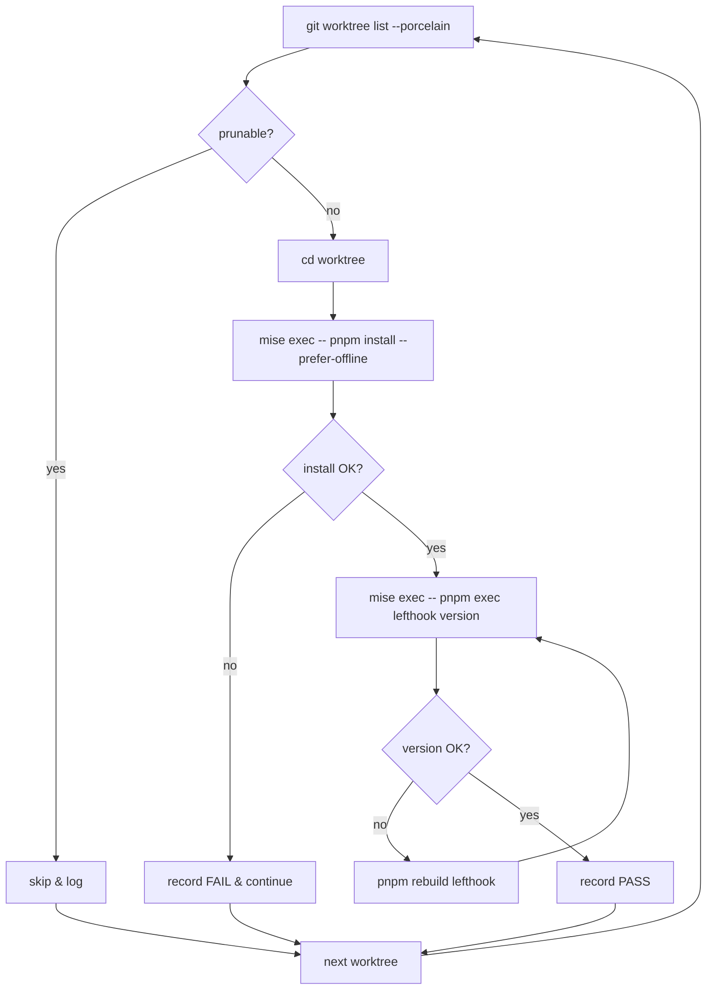

# Phase 2: 設計

## メタ情報

| 項目 | 値 |
| --- | --- |
| タスク名 | 30+ worktree への lefthook 一括再インストール runbook 運用化 |
| Phase 番号 | 2 / 13 |
| Phase 名称 | 設計 |
| 作成日 | 2026-04-28 |
| 前 Phase | 1 (要件定義) |
| 次 Phase | 3 (設計レビュー) |
| 状態 | spec_created |

## 目的

Phase 1 で固定した要件を満たす一括再 install runbook の構成・順序・冪等性・失敗復帰戦略を確定する。本タスクは docs-only であるため、本 Phase の主成果物は「runbook 設計書」と「擬似スクリプト仕様」であり、実コードは生成しない。

## 設計の前提

| 前提 | 内容 |
| --- | --- |
| 並列禁止 | pnpm の content-addressable store は同時書き込みで壊れる。runbook は逐次のみ |
| 実行ラッパ | 全コマンドに `mise exec --` を前置（Node 24 / pnpm 10 保証） |
| 冪等性 | `lefthook install` は何度実行しても同じ最終状態に収束する（公式仕様） |
| ログ書式 | `outputs/phase-11/manual-smoke-log.md` に Markdown 表形式で記録 |
| プラットフォーム | macOS (Darwin) / Apple Silicon を主対象。Intel Mac / Linux はベストエフォート |

## 全体構成（Mermaid）



## 主要コンポーネント設計

### 1. 有効 worktree 抽出

| 項目 | 仕様 |
| --- | --- |
| 入力 | `git worktree list --porcelain` |
| 解析 | 行頭 `worktree <path>` を採取。直後の `prunable` 行があれば除外 |
| 出力 | 改行区切りの worktree path 一覧 |
| 失敗時 | `git worktree list` 自体が失敗した場合は runbook を中断（fatal） |

### 2. 逐次 install ループ

| 項目 | 仕様 |
| --- | --- |
| 実装方針 | `while read -r wt; do ...; done` で **必ず逐次** |
| 並列禁止 | `xargs -P` / GNU parallel / `&` バックグラウンドは仕様違反 |
| 各 worktree での処理 | (a) `cd` → (b) `mise exec -- pnpm install --prefer-offline` → (c) `mise exec -- pnpm exec lefthook version` |
| 続行ポリシー | 1 worktree の install 失敗で全体を停止せず、`set +e` 相当で次に進み、最後に集計 |

### 3. 検証フェーズ

| 項目 | 仕様 |
| --- | --- |
| 検証コマンド | `mise exec -- pnpm exec lefthook version` |
| PASS 基準 | exit code = 0 かつ stdout に semver 形式のバージョン表示 |
| FAIL 時の自動 retry | `pnpm rebuild lefthook` を 1 度だけ試みる（Apple Silicon binary mismatch 対策） |
| 二度目も FAIL | 当該 worktree を FAIL として記録し runbook 自体は continue |

### 4. 旧 hook 残存点検

| 項目 | 仕様 |
| --- | --- |
| 確認対象 | `.git/hooks/post-merge`、`.git/hooks/pre-commit` の lefthook 由来でない手書きファイル |
| 判定方法 | `head -n1 .git/hooks/post-merge` に `# LEFTHOOK file` 等の sentinel が無い場合は「旧 hook 残存」と判定 |
| 対処 | runbook 末尾に「lefthook install 後に再判定」を明記。ユーザーへ手動削除を提示（自動削除はしない、安全側） |

### 5. ログ書式

`outputs/phase-11/manual-smoke-log.md` に下記表で追記する。

| 実行日時 | worktree path | install result | lefthook version | hook hygiene | 備考 |
| --- | --- | --- | --- | --- | --- |
| 2026-04-28T10:00 | /Users/dm/.../UBM-Hyogo | PASS | 1.x.x | OK | - |

## 擬似スクリプト仕様（実装は別 Wave）

```bash
# scripts/reinstall-lefthook-all-worktrees.sh （仕様。本タスクでは実装しない）
set -uo pipefail

LOG="outputs/phase-11/manual-smoke-log.md"
TODAY="$(date -u +%Y-%m-%dT%H:%MZ)"

git worktree list --porcelain |
  awk 'BEGIN{path=""} /^worktree /{path=$2} /^prunable/{path=""} /^$/{if(path) print path; path=""} END{if(path) print path}' |
  while read -r wt; do
    [ -d "$wt" ] || { printf "| %s | %s | SKIP_NOT_FOUND | - | - | - |\n" "$TODAY" "$wt" >> "$LOG"; continue; }
    pushd "$wt" >/dev/null

    if mise exec -- pnpm install --prefer-offline >/dev/null 2>&1; then
      install_status="PASS"
    else
      install_status="FAIL"
    fi

    if mise exec -- pnpm exec lefthook version >/dev/null 2>&1; then
      version="$(mise exec -- pnpm exec lefthook version 2>/dev/null | tail -n1)"
      version_status="OK"
    else
      mise exec -- pnpm rebuild lefthook >/dev/null 2>&1 || true
      if mise exec -- pnpm exec lefthook version >/dev/null 2>&1; then
        version="$(mise exec -- pnpm exec lefthook version 2>/dev/null | tail -n1)"
        version_status="OK_AFTER_REBUILD"
      else
        version="-"
        version_status="FAIL"
      fi
    fi

    if head -n1 .git/hooks/post-merge 2>/dev/null | grep -q "LEFTHOOK"; then
      hygiene="OK"
    elif [ -f .git/hooks/post-merge ]; then
      hygiene="STALE"
    else
      hygiene="ABSENT"
    fi

    printf "| %s | %s | %s | %s | %s | %s |\n" "$TODAY" "$wt" "$install_status" "$version" "$hygiene" "" >> "$LOG"
    popd >/dev/null
  done
```

> 上記は **仕様としての擬似コード**。本タスクではコード実装しない。実装は次 Wave / 別タスクで `scripts/reinstall-lefthook-all-worktrees.sh` として切り出す。

## 責務境界（new-worktree.sh との分界）

| 経路 | 担当 | 責務 |
| --- | --- | --- |
| 新規 worktree 作成 | `scripts/new-worktree.sh` | 作成直後に `pnpm install` を自動実行（`prepare` script で `lefthook install` も走る） |
| 既存 worktree 群への遡及 | 本 runbook | 既に存在する prunable 以外の全 worktree を逐次再 install |
| CI ドリフト検出 | task-verify-indexes-up-to-date-ci（unassigned） | indexes 未鮮度の検出（hook が動かなかった結果として現れる） |

## ADR

### ADR-01: 並列実行を禁止する

- 採用: 逐次（`while read`）
- 不採用: `xargs -P`、GNU parallel、bash `&`
- 根拠: pnpm の content-addressable store は複数プロセスからの同時書き込みで破壊される。retry も困難。lefthook 公式運用ガイドにも逐次推奨が記載されている。

### ADR-02: install 失敗時の continue ポリシー

- 採用: 単一 worktree の失敗で runbook を停止せず、最後に集計
- 不採用: fail-fast 即停止
- 根拠: 30+ 件のうち 1 件の失敗で残り 29 件が再実行不要のままに残る方が運用コストが大きい。最後の集計表で人間が判断する設計の方が実用的。

### ADR-03: 旧 hook 自動削除は行わない

- 採用: 検出のみ。削除は人間判断
- 不採用: `rm` 自動実行
- 根拠: 旧 hook をユーザーがカスタマイズしている可能性を完全に否定できない。安全側に倒し、runbook では検出と warning に留める。

### ADR-04: detached HEAD worktree も対象に含める

- 採用: detached HEAD でも install 対象
- 不採用: detached HEAD は除外
- 根拠: hook 層は branch state と独立に必要。コミット可能な worktree であれば hook が必要。

## 実行タスク

1. Mermaid を含む全体構成を確定する。
2. 有効 worktree 抽出 / 逐次 install ループ / 検証 / 旧 hook 点検 / ログ書式の 5 コンポーネントを上記の通り設計する。
3. 擬似スクリプト仕様を `outputs/phase-02/runbook-design.md` に最終化する。
4. ADR-01〜04 を確定する。
5. new-worktree.sh との責務境界表を確定する。

## 成果物

- `outputs/phase-02/runbook-design.md`（本 phase で詳細化）
- 擬似スクリプト仕様（同上に内包）
- ADR-01〜04
- 責務境界表

## Phase 3 への引き渡し

- ADR の妥当性レビュー
- 失敗復帰戦略（continue ポリシー）の運用妥当性
- ログ書式が NON_VISUAL 代替 evidence として十分か
