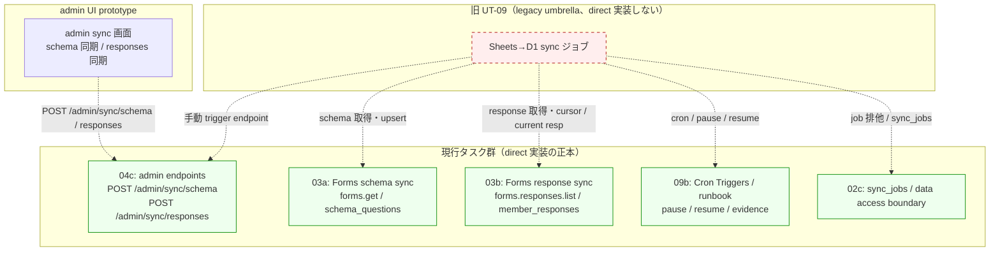

# Phase 02 成果物: 設計（責務移管 / stale↔正本 / env / schema ownership）

## サマリ

Phase 01 の方針（旧 UT-09 を legacy umbrella として閉じる）を、責務移管マッピング・stale↔正本対応・env / dependency matrix・schema ownership 宣言の 4 つの構造に落とし込む。本タスクは新規 schema を導入せず、`sync_jobs` 等の owner を 02c / 03a / 03b と明記し、本タスクは「参照のみ」であることを契約として固定する。

## 全体構造（Mermaid）

## stale 前提 ↔ 現行正本の対応マッピング（7 観点）

| 観点 | stale（旧 UT-09 前提） | 正本（現行仕様） | 反映先 |
| --- | --- | --- | --- |
| 同期 API | Google Sheets API v4 (`spreadsheets.values.get`) | Google Forms API (`forms.get` / `forms.responses.list`) | 03a / 03b |
| 手動 endpoint | 単一 `/admin/sync` | `POST /admin/sync/schema` と `POST /admin/sync/responses` | 04c |
| 監査 / 履歴テーブル | `sync_audit` | `sync_jobs` | 02c / 03a / 03b |
| 環境表記 | `dev / main`（branch と env が混在） | `dev branch -> staging env` / `main branch -> production env` | 09a / 09b / 09c |
| ジョブ排他 | アプリ内 mutex / なし | `sync_jobs.status='running'` 行で排他、二重時 409 Conflict | 02c |
| 競合対策 | PRAGMA WAL 前提 | retry / backoff（指数）、短い transaction、batch-size 制限 | 03a / 03b / 09b |
| ディレクトリ命名 | `docs/30-workflows/ut-09-sheets-to-d1-cron-sync-job/`（新設禁止） | `docs/30-workflows/task-sync-forms-d1-legacy-umbrella-001/` | 本タスク |

## 環境 / 依存マトリクス

| 環境 | branch | Cloudflare env | 用途 | secret 注入 |
| --- | --- | --- | --- | --- |
| local | `feat/*` | -（local dev / wrangler dev） | 単体検証 | `.env`（`op://` 参照） |
| staging | `dev` | `staging` | 統合 smoke / cron 検証 | Cloudflare Secrets (staging) |
| production | `main` | `production` | 本番 sync / cron 稼働 | Cloudflare Secrets (production) |

## 共有 schema ownership 宣言

本タスクは **新規 schema を導入しない**。以下テーブルの owner を明示し、本タスクは参照のみであることを契約として固定する。Google Forms schema 側の正本は `docs/00-getting-started-manual/specs/01-api-schema.md`、D1 運用前提（WAL 非対応 / PRAGMA 制約）は `docs/00-getting-started-manual/specs/08-free-database.md` を根拠とする。

| テーブル | owner | 本タスクの関係 |
| --- | --- | --- |
| `sync_jobs` | 02c | 参照のみ（同種 job 排他方針を記録） |
| `schema_versions` | 03a | 参照のみ |
| `schema_questions` | 03a | 参照のみ |
| `schema_diff_queue` | 03a | 参照のみ |
| `member_responses` | 03b | 参照のみ |
| `member_identities` | 03b | 参照のみ |
| `member_status` | 03b | 参照のみ |

## モジュール / ドキュメント設計

| 成果物 | 配置 | 役割 |
| --- | --- | --- |
| 責務移管表 | `outputs/phase-02/responsibility-mapping.md` | 旧 UT-09 → 03a/03b/04c/09b/02c の詳細マッピング |
| stale↔正本表 | 本ファイル「stale 前提 ↔ 現行正本」 | 7 観点の正規化対応 |
| Mermaid 図 | 本ファイル「全体構造」 | legacy umbrella と現行タスクの関係 |
| env matrix | 本ファイル「環境 / 依存マトリクス」 | branch / env / secret 経路 |

## エビデンス / 参照

- `outputs/phase-01/main.md`（前 Phase）
- `docs/30-workflows/completed-tasks/03a-.../index.md` / `03b-.../index.md`
- `docs/30-workflows/02-application-implementation/04c-.../index.md` / `09b-.../index.md` / `02c-.../index.md`
- `.claude/skills/aiworkflow-requirements/references/api-endpoints.md` / `task-workflow.md` / `deployment-cloudflare.md`
- `docs/00-getting-started-manual/specs/01-api-schema.md` / `03-data-fetching.md` / `08-free-database.md`

## AC トレーサビリティ

| AC | Phase 02 の扱い |
| --- | --- |
| AC-1 | legacy umbrella 構造を Mermaid で可視化 |
| AC-2 | 責務移管表で direct 残責務 0 件確定（responsibility-mapping.md 参照） |
| AC-3 | stale↔正本表で Sheets API → Forms API を明示 |
| AC-4 | 単一 `/admin/sync` 不採用、分割 endpoint を正本固定 |
| AC-5 | retry/backoff / 短い transaction / batch-size 制限を 03a/03b/09b の移植要件として明記 |
| AC-6 | `sync_jobs.status='running'` で 409 Conflict を方針記録 |
| AC-7 | cron / pause / resume / evidence を 09b へ委譲 |
| AC-8 | env matrix で `dev branch -> staging env` / `main branch -> production env` 明記 |
| AC-9 | schema ownership 宣言で D1 owner を `apps/api` 側のみに集中（apps/web→D1 直接禁止と整合） |
| AC-12 | stale ディレクトリ `ut-09-sheets-to-d1-cron-sync-job/` を新設しないと明記 |
| AC-13 | 参照 spec の owner / 用語に矛盾しない（schema ownership で specs/01・03・08 を直接参照） |

## 不変条件チェック

| 不変条件 | Phase 02 での扱い |
| --- | --- |
| #1 schema 過剰固定回避 | `forms.get` 動的取得を 03a に委譲、本タスクで schema を固定化しない |
| #5 apps/web → D1 直接禁止 | schema ownership で D1 owner を 02c/03a/03b（apps/api 側）のみに配置 |
| #6 GAS prototype 不採用 | cron は Workers Cron Triggers（09b）のみ |
| #7 Form 再回答が本人更新 | response sync を 03b に一本化 |

## 次 Phase（03 設計レビュー）への引き渡し

1. 責務移管マッピング表 → A/B/C/D 案比較の入力
2. stale↔正本表 → PASS-MINOR-MAJOR 判定の根拠
3. schema ownership 宣言 → 不変条件 #5 検証材料
4. OQ-1（sync_audit 読替）/ OQ-2（PRAGMA WAL 不採用）→ Phase 03 で最終決着
