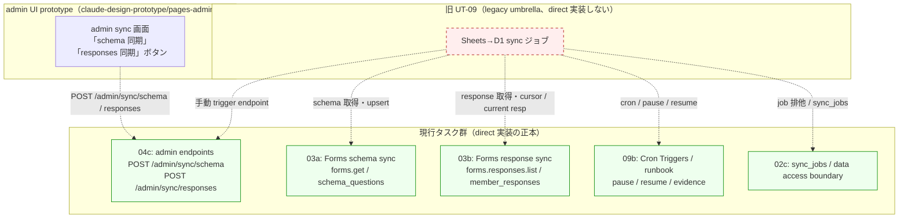

# Phase 2: 設計

## メタ情報

| 項目 | 値 |
| --- | --- |
| タスク名 | task-sync-forms-d1-legacy-umbrella-001 |
| Phase 番号 | 02 |
| Phase 名称 | 設計 |
| Wave | -（legacy / governance） |
| 実行種別 | serial |
| 作成日 | 2026-04-30 |
| 前 Phase | phase-01.md（要件定義） |
| 次 Phase | phase-03.md（設計レビュー） |
| 状態 | pending |

## 目的

Phase 01 で確定した「legacy umbrella close-out」方針を、責務移管マッピング・stale↔正本対応マッピング・dependency / env matrix・schema ownership 宣言という具体構造に落とし込む。本タスクは新規 schema を導入しないため、`sync_jobs` 等の owner を 02c / 03a / 03b と明記し、本タスクは「参照」のみであることを契約として固定する。

## 全体構造（Mermaid）



## 責務移管マッピング表

| 旧 UT-09 の責務 | 現行タスク（受け手） | 受け手 Phase / 成果物 | D1 / API | 備考 |
| --- | --- | --- | --- | --- |
| schema 取得・`schema_questions` upsert | 03a-parallel-forms-schema-sync-and-stablekey-alias-queue | 03a Phase 5 / schema sync 関数 | `schema_versions` / `schema_questions` / `schema_diff_queue` | Sheets API ではなく `forms.get` |
| response 取得・cursor pagination・current response | 03b-parallel-forms-response-sync-and-current-response-resolver | 03b Phase 5 / response sync 関数 | `member_responses` / `member_identities` / `member_status` | `forms.responses.list`、consent snapshot を含む |
| 手動 sync trigger | 04c-parallel-admin-backoffice-api-endpoints | 04c Phase 5 / admin gate + endpoint | `POST /admin/sync/schema` / `POST /admin/sync/responses` | 単一 `/admin/sync` は不採用 |
| cron schedule / pause / resume / evidence | 09b-parallel-cron-triggers-monitoring-and-release-runbook | 09b Phase 5 / runbook、Phase 11 / evidence | wrangler.toml `[triggers]` | `*/15 * * * *` response、`0 3 * * *` schema |
| monitoring / alert | 09b + observability guardrails (05a) | 09b Phase 12 release-runbook | Cloudflare Analytics / Sentry | DSN は placeholder |
| D1 contention / WAL 非前提 / retry / backoff | 03a / 03b 異常系、09b runbook | 03a / 03b Phase 6（failure cases）、09b Phase 6 | retry/backoff、短い transaction、batch-size 制限 | PRAGMA WAL は採用しない（OQ-2） |
| 同種 job 排他 | 02c-parallel-admin-notes-audit-sync-jobs-and-data-access-boundary | 02c Phase 5 / `sync_jobs` repository | `sync_jobs.status='running'` | 二重起動は 409 Conflict |
| secret 配備（GOOGLE_*）| インフラ + 03a/03b 利用 | Cloudflare Secrets | env binding | apps/api のみが参照 |

**direct 残責務件数: 0 件**（AC-2 を満たす）

## stale 前提 ↔ 現行正本の対応マッピング

| 観点 | stale（旧 UT-09 前提） | 正本（現行仕様） | 反映先タスク |
| --- | --- | --- | --- |
| 同期 API | Google Sheets API v4 (`spreadsheets.values.get`) | Google Forms API (`forms.get` / `forms.responses.list`) | 03a / 03b |
| 手動 endpoint | 単一 `/admin/sync` | 分割 `POST /admin/sync/schema` と `POST /admin/sync/responses` | 04c |
| 監査 / 履歴テーブル | `sync_audit` | `sync_jobs` | 02c / 03a / 03b |
| 環境表記 | `dev / main`（branch と env が混在） | `dev branch -> staging env` / `main branch -> production env` | 09a / 09b / 09c |
| ジョブ排他 | アプリ内 mutex / なし | `sync_jobs.status='running'` 行で排他、二重時 409 | 02c |
| 競合対策 | PRAGMA WAL 前提 | retry / backoff（指数）、短い transaction、batch-size 制限 | 03a / 03b / 09b |
| ディレクトリ命名 | `docs/30-workflows/ut-09-sheets-to-d1-cron-sync-job/`（stale、新設禁止） | `docs/30-workflows/task-sync-forms-d1-legacy-umbrella-001/`（本タスク） | 本タスク |

## 環境 / 依存マトリクス

| 環境 | branch | Cloudflare env | 用途 | secret 注入 |
| --- | --- | --- | --- | --- |
| local | feat/* | -（local dev / wrangler dev） | 単体検証 | `.env`（op:// 参照） |
| staging | dev | staging | 統合 smoke / cron 検証 | Cloudflare Secrets (staging) |
| production | main | production | 本番 sync / cron 稼働 | Cloudflare Secrets (production) |

## 共有 schema ownership 宣言

本タスクは **新規 schema を導入しない**。以下テーブルの owner を明示し、本タスクは参照のみであることを契約として固定する。Google Forms schema 側の正本は `docs/00-getting-started-manual/specs/01-api-schema.md`（form schema ownership 宣言の根拠）であり、本タスクが参照する `responseId` / `publicConsent` / `rulesConsent` 等のキー定義はすべて同 spec を出典とする。さらに D1 の運用前提（WAL 非対応 / PRAGMA 制約）は `docs/00-getting-started-manual/specs/08-free-database.md` を根拠とし、本タスクで PRAGMA を新たに前提化しない。

| テーブル | owner タスク | 本タスクの関係 |
| --- | --- | --- |
| `sync_jobs` | 02c-parallel-admin-notes-audit-sync-jobs-and-data-access-boundary | 参照のみ（同種 job 排他方針を記録） |
| `schema_versions` | 03a | 参照のみ |
| `schema_questions` | 03a | 参照のみ |
| `schema_diff_queue` | 03a | 参照のみ |
| `member_responses` | 03b | 参照のみ |
| `member_identities` | 03b | 参照のみ |
| `member_status` | 03b | 参照のみ |

## モジュール / ドキュメント設計

| モジュール（成果物） | 種類 | 配置 | 役割 |
| --- | --- | --- | --- |
| 責務移管表 | docs | outputs/phase-02/responsibility-mapping.md | 旧 UT-09 → 03a/03b/04c/09b/02c のマッピング詳細 |
| stale↔正本表 | docs | outputs/phase-02/main.md | 上記「stale 前提 ↔ 現行正本」表 |
| Mermaid 構造図 | docs | outputs/phase-02/main.md | legacy umbrella と現行タスク群の関係 |
| env / dependency matrix | docs | outputs/phase-02/main.md | branch / env / secret の対応 |

## 実行タスク

1. **Mermaid 構造図作成**（完了条件: legacy umbrella と現行 5 タスクの関係が一目で読める）
2. **責務移管マッピング表作成**（完了条件: direct 残責務 0 件を表で示せる）
3. **stale ↔ 正本対応表作成**（完了条件: 7 観点（API / endpoint / table / env / 排他 / 競合 / ディレクトリ）すべてを網羅）
4. **env / dependency matrix 作成**（完了条件: branch ↔ env ↔ secret 注入経路が確定）
5. **共有 schema ownership 宣言**（完了条件: 7 テーブルの owner と本タスク関係性を明文化）
6. **outputs/phase-02 を生成**（完了条件: main.md と responsibility-mapping.md が揃う）

## 参照資料

| 種別 | パス | 用途 |
| --- | --- | --- |
| 必須 | outputs/phase-01/main.md（前 Phase 出力） | 真の論点 / AC / open questions |
| 必須 | docs/30-workflows/02-application-implementation/03a-.../index.md | schema sync 正本 |
| 必須 | docs/30-workflows/02-application-implementation/03b-.../index.md | response sync 正本 |
| 必須 | docs/30-workflows/02-application-implementation/04c-.../index.md | admin endpoint 正本 |
| 必須 | docs/30-workflows/02-application-implementation/09b-.../index.md | cron / runbook 正本 |
| 必須 | docs/30-workflows/02-application-implementation/02c-.../index.md | `sync_jobs` 正本 |
| 参考 | .claude/skills/aiworkflow-requirements/references/deployment-cloudflare.md | D1 PRAGMA 制約 |
| 必須 | docs/00-getting-started-manual/specs/01-api-schema.md | form schema ownership 宣言の根拠（`responseId` / `publicConsent` / `rulesConsent`） |
| 必須 | docs/00-getting-started-manual/specs/08-free-database.md | D1 PRAGMA / WAL 非前提の根拠 |
| 参考 | docs/00-getting-started-manual/claude-design-prototype/pages-admin.jsx | admin sync UI からの呼出経路（Mermaid 反映元） |

## 実行手順

```bash
# Step 1: 5 タスクの index.md を Read で取得
# Step 2: Mermaid を作成し outputs/phase-02/main.md にセクション化
# Step 3: outputs/phase-02/responsibility-mapping.md に詳細マッピング表を分離して保存
# Step 4: stale↔正本マッピングを 7 観点で並べて outputs/phase-02/main.md に追記
# Step 5: env matrix を branch / env / secret で表化
# Step 6: 共有 schema ownership 宣言で本タスクが参照のみであることを契約化
```

## 統合テスト連携

- 責務移管マッピング表は **Phase 3 設計レビュー** で「直接残責務 0 件」を最終チェックする
- stale↔正本マッピングは **Phase 7 AC マトリクス** で AC-3 / AC-4 / AC-8 / AC-11 のトレースに使う
- 共有 schema ownership は **Phase 9 品質保証** で不変条件 #5（apps/web→D1 直接禁止）の検証に使う
- env matrix は **Phase 11 手動 smoke** での動作確認手順設計に使う

## 多角的チェック観点（不変条件）

| 不変条件 | Phase 02 での扱い |
| --- | --- |
| #1 schema 過剰固定回避 | `forms.get` 動的取得を 03a 委譲、本タスクで schema を固定化しない |
| #5 apps/web → D1 直接禁止 | schema ownership 宣言で 02c/03a/03b の D1 owner を apps/api 側にのみ配置 |
| #6 GAS prototype 不採用 | cron は Workers Cron Triggers（09b）のみを正本と記録 |
| #7 Form 再回答が本人更新の正式経路 | response sync を 03b に一本化 |

## サブタスク管理

- [ ] Mermaid 構造図を作成
- [ ] 責務移管マッピング表（8 行 + direct 残責務 0 件 verdict）を作成
- [ ] stale ↔ 正本対応表（7 観点）を作成
- [ ] env / dependency matrix を作成
- [ ] 共有 schema ownership 宣言（7 テーブル）を作成
- [ ] outputs/phase-02/main.md を生成
- [ ] outputs/phase-02/responsibility-mapping.md を生成

## 成果物

- `outputs/phase-02/main.md`: 設計サマリ（Mermaid / stale↔正本 / env matrix / schema ownership）
- `outputs/phase-02/responsibility-mapping.md`: 責務移管マッピング詳細

## 完了条件（AC）

- [ ] Mermaid 図で legacy umbrella と現行 5 タスクの関係が表現されている
- [ ] 責務移管表で direct 残責務 0 件が明示される
- [ ] stale↔正本対応が 7 観点すべてカバーされる
- [ ] env matrix で branch ↔ env ↔ secret 経路が一意に決まる
- [ ] schema ownership 宣言で 7 テーブルの owner と本タスク関係が明文化

## タスク 100% 実行確認

| 確認項目 | 期待値 | 実測値 |
| --- | --- | --- |
| Mermaid 図 | 1 件 | - |
| 責務移管表行数 | ≥ 8 行 | - |
| direct 残責務 | 0 件 | - |
| stale↔正本観点 | 7 観点 | - |
| schema ownership 宣言行数 | 7 行 | - |
| outputs ファイル数 | 2 件（main.md / responsibility-mapping.md） | - |

## 次 Phase への引き渡し

Phase 03（設計レビュー）へ次を渡す:

1. 責務移管マッピング表 → alternative 案 A/B/C 比較の入力
2. stale↔正本対応 → PASS-MINOR-MAJOR 判定の根拠
3. schema ownership 宣言 → 不変条件 #5 検証材料
4. Open Questions OQ-1（sync_audit 読替）/ OQ-2（PRAGMA WAL 不採用）→ Phase 03 で最終決着
