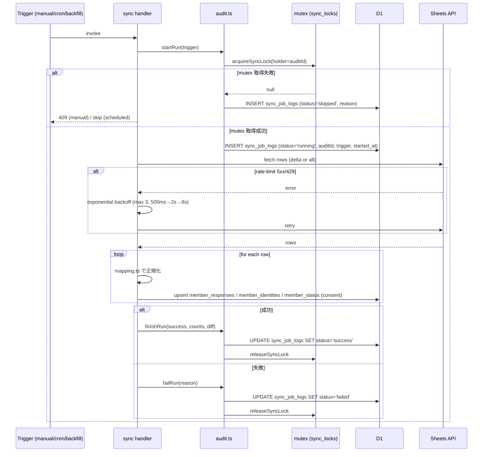
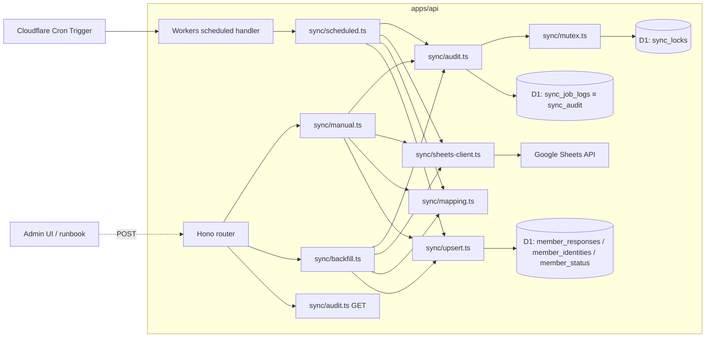

# Phase 2 成果物: 設計サマリ（u-04 sheets-to-d1-sync-implementation）

> 状態: completed-design
> 上位仕様: `../../phase-02.md`
> 入力: `outputs/phase-01/main.md`、03 contract `data-contract.md` / `sync-flow.md`、UT-01 `sync-log-schema.md`
> 隣接成果物: `sync-module-design.md` / `audit-writer-design.md` / `cron-config.md` / `d1-contract-trace.md`

## 1. 概要

Phase 1 で確定した AC-1〜AC-12 を、`apps/api/src/sync/*` のモジュール構成と handler 設計、audit ledger writer の共通基盤、Cron Trigger 設定、D1 contract trace、依存マトリクスへ落とす。**実装コードは書かず**、TypeScript 型シグネチャ・mermaid sequence・対応表のみで設計を確定する。

## 2. 確定 Design Decisions

| ID | 論点 | 採用方針 |
| --- | --- | --- |
| DD-01 | audit ledger 物理接続先 | 既存 `sync_job_logs` テーブル（migration 0002）に writer を寄せる。`sync_audit` は契約論理名として保持し、`audit-writer-design.md` の対応表で吸収。新規テーブル追加は U-05 owner、本タスクでは行わない |
| DD-02 | mutex 実装 | 既存 `sync_locks`（PK=`id`、UNIQUE 衝突 = 取得失敗）を採用。SELECT→INSERT 分離は禁止。stale lock 解放は既存ロジックを継続 |
| DD-03 | conflict audit | mutex 取得失敗時は二重 `running` row を作らず、`status='skipped'` で audit row を 1 件のみ生成（`reason='another sync is in progress'`）|
| DD-04 | scheduled 差分検出 | `submittedAt >= last_success_cursor` + responseId upsert で同秒取りこぼしを吸収。cursor は既存 `cursor-store` 流用も可だが Sheets sync 固有 cursor は `sync_job_logs.finished_at` の最大値（status='success'）を使う |
| DD-05 | Sheets JWT | `crypto.subtle` の RS256 は既存 `apps/api/src/jobs/sheets-fetcher.ts` で動作実績があるため Phase 5 spike を不要化、ただし Phase 5 直前ゲートで再確認 |
| DD-06 | sync 認可 | `/admin/sync*` は `requireSyncAdmin` / `SYNC_ADMIN_TOKEN` Bearer。人間向け `requireAdmin`（admin JWT）は使わない |
| DD-07 | 既存 jobs/ 統合 | `apps/api/src/jobs/sync-sheets-to-d1.ts` の `runSync` は責務分離して `apps/api/src/sync/manual.ts` / `scheduled.ts` / `backfill.ts` に移植、`jobs/sync-sheets-to-d1.ts` は薄い deprecation re-export として 1 phase だけ維持（Phase 9 リファクタリングで削除候補） |
| DD-08 | 既存 forms response sync | `apps/api/src/jobs/sync-forms-responses.ts`（Forms API 系）は U-04 対象外、独自 `syncJobs` ledger を維持。本タスクは Sheets sync core のみ扱う |
| DD-09 | path リネーム | 既存 `POST /admin/sync` を `POST /admin/sync/run` へ正本化。互換維持のため `POST /admin/sync` も同 handler を mount する（既存 e2e / smoke 影響回避）。Phase 12 deprecation 通知 → 後続タスクで削除 |

## 3. モジュールツリー

`sync-module-design.md` 参照。`apps/api/src/sync/` 配下に 9 ファイル + `index.ts` export hub。

## 4. handler 種別と境界

| component | 種別 | 配置 | 認可 |
| --- | --- | --- | --- |
| `manual.ts` | Hono route handler | `/admin/sync/run`（+ `/admin/sync` 互換）| `requireSyncAdmin` |
| `backfill.ts` | Hono route handler | `/admin/sync/backfill` | `requireSyncAdmin` |
| `audit.ts` の `GET handler` | Hono route handler | `GET /admin/sync/audit?limit=N` | `requireSyncAdmin` |
| `scheduled.ts` | Workers `scheduled()` | `apps/api/src/index.ts` default export.scheduled | internal trigger（HTTP 公開なし）|
| `audit.ts` の writer | shared module | 全 handler から import | - |
| `sheets-client.ts` | shared module | 全 handler から import | - |
| `mapping.ts` | pure function module | shared | - |

## 5. sync flow（mermaid sequence）

backfill flow は上記に加え、`Sheets fetch → mapping → upsert` を **D1 batch transaction** 内で実施し、`member_responses` / `member_identities` / `member_status (consent 列のみ)` を truncate-and-reload する（admin 列には触らない）。

## 6. 構成図（mermaid graph）

## 7. env / secrets 表

| 区分 | 変数名 | 配置先 | 確定 Phase | 備考 |
| --- | --- | --- | --- | --- |
| secret | `GOOGLE_SERVICE_ACCOUNT_JSON` | Cloudflare Secrets | 5（04 task が配置）| Workers `crypto.subtle` で JWT 署名 |
| secret | `SYNC_ADMIN_TOKEN` | Cloudflare Secrets | 既存 | manual / backfill / audit Bearer |
| var | `SHEETS_SPREADSHEET_ID` | wrangler vars | 既存 | Sheets API v4 spreadsheetId |
| var | `SYNC_RANGE` / `SYNC_MAX_RETRIES` | wrangler vars | 5 | Sheets range / retry 上限（最大 3） |
| var | `SYNC_RANGE` | wrangler vars | 既存 | A1 range（既定 `Form Responses 1!A1:ZZ10000`）|
| var | `SYNC_BATCH_SIZE` / `SYNC_MAX_RETRIES` | wrangler vars | 既存 | バッチ / リトライ既定 |
| var | `Cron Trigger` | wrangler.toml `[triggers]` | 2 | `0 * * * *` 既定 |
| binding | `DB` | wrangler.toml `[[d1_databases]]` | 既存 | D1 binding |

## 8. 依存マトリクス（owner / co-owner）

| 共有モジュール / 共通コード | 用途 | owner | co-owner | 同期タイミング |
| --- | --- | --- | --- | --- |
| `apps/api/src/sync/audit.ts` | audit writer 共通基盤 | u-04（本タスク）| なし | - |
| `apps/api/src/sync/sheets-client.ts` | Sheets API client | u-04 | なし | - |
| `apps/api/src/sync/mapping.ts` | mapping logic | u-04 | 03 contract（参照のみ完了済）| - |
| `apps/api/src/sync/mutex.ts` | sync_locks 単文 INSERT 排他 | u-04 | UT-09（既存 `sync-lock.ts` 互換）| - |
| `apps/api/wrangler.toml [triggers] crons` | Cron 定義 | u-04 | 09b（監視 / runbook）| 09b 着手時に同期 |
| `sync_job_logs` テーブル schema | audit ledger 物理 | U-05（schema） | u-04（writer）| Phase 4 contract test |
| `sync_locks` テーブル schema | mutex 物理 | U-05（schema） | u-04（writer）| 既存 migration 0002 |
| `requireSyncAdmin` middleware | sync 認可 | 05a / 04c 正本 | u-04（consumer）| - |

## 9. AC トレース

| AC | 設計反映箇所 |
| --- | --- |
| AC-1 | §3 / sync-module-design.md §1 |
| AC-2 | §4 / sync-module-design.md §2 manual |
| AC-3 | §4 / cron-config.md §1〜§3 |
| AC-4 | sync-module-design.md §2 backfill / §5 admin 列ガード |
| AC-5 | audit-writer-design.md §1〜§3 |
| AC-6 | sync-module-design.md §3 upsert（responseId PK）|
| AC-7 | audit-writer-design.md §4 mutex / DD-02 |
| AC-8 | d1-contract-trace.md §1（mapping table 1:1）|
| AC-9 | §4（apps/web 配置なし）/ Phase 1 §6 |
| AC-10 | sync-module-design.md §4 sheets-client |
| AC-11 | d1-contract-trace.md §2 consent 行 |
| AC-12 | sync-module-design.md §6 backoff |

## 10. 多角的チェック観点

- 不変条件 #1〜#7 への対応は Phase 1 §9 と同一、本 Phase ではコードレベル設計に展開
- 認可境界: manual / backfill / audit は `requireSyncAdmin` / `SYNC_ADMIN_TOKEN` Bearer。scheduled は internal trigger
- IPC 4 層整合性: 本タスク対象外（IPC を持たない）
- DI 境界: `AuditDeps` / `SheetsClientDeps` / `D1Database` を引数注入

## 11. サブタスク管理

| # | サブタスク | 状態 | 成果物 |
| --- | --- | --- | --- |
| 1 | モジュールツリー | completed | sync-module-design.md §1 |
| 2 | sequence diagram | completed | §5 |
| 3 | audit writer 設計 | completed | audit-writer-design.md |
| 4 | mapping ↔ contract trace | completed | d1-contract-trace.md |
| 5 | Cron 設定 | completed | cron-config.md |
| 6 | 依存マトリクス | completed | §8 |
| 7 | env / secrets 表 | completed | §7（8 件）|

## 12. 完了条件チェック

- [x] モジュールツリーに 9 ファイル + `index.ts` が含まれる（sync-module-design.md）
- [x] manual / scheduled / backfill の sequence diagram が描かれている（§5）
- [x] audit writer の `startRun` / `finishRun` / `failRun` 契約が決まっている（audit-writer-design.md）
- [x] mapping ↔ data-contract.md の 1:1 trace が完成している（d1-contract-trace.md）
- [x] Cron Trigger の cron 式が wrangler.toml に記載される設計（cron-config.md）
- [x] 依存マトリクスに owner / co-owner 列が含まれている（§8）
- [x] env / secrets が 6 件以上表化されている（§7、8 件）
- [x] 本 Phase 内の全タスクを 100% 実行完了

## 13. 次 Phase 引き継ぎ事項

- mutex 実装方式（DB 排他 vs Durable Object vs KV）の代替案比較 → Phase 3
- scheduled 差分検出キー（`submittedAt` vs revisionId 比較）の代替案比較
- backfill transaction 範囲（D1 batch 一括 vs 分割）
- audit writer を `packages/shared` に切り出すべきかの YAGNI 判断
- 既存 `apps/api/src/jobs/sync-sheets-to-d1.ts` の deprecation 経路（Phase 9 削除候補）
