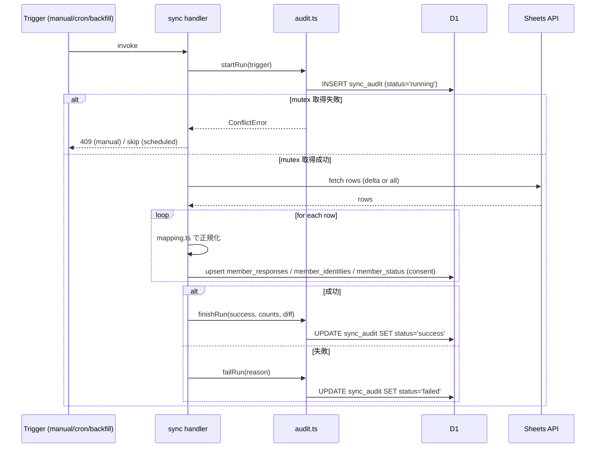
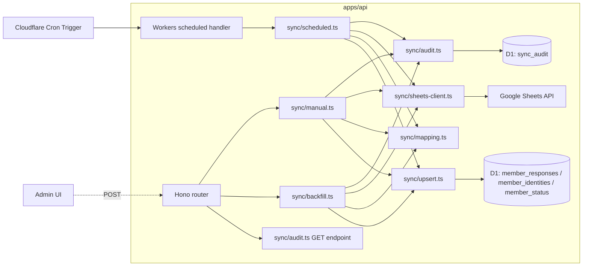

# Phase 2: 設計

## メタ情報

| 項目 | 値 |
| --- | --- |
| タスク名 | sheets-to-d1-sync-implementation |
| Phase 番号 | 2 / 13 |
| Phase 名称 | 設計 |
| 作成日 | 2026-04-30 |
| 前 Phase | 1 (要件定義) |
| 次 Phase | 3 (設計レビュー) |
| タスク種別 | implementation |
| visualEvidence | NON_VISUAL |
| 状態 | pending |

## 目的

Phase 1 で確定した AC-1〜AC-12 を、`apps/api/src/sync/*` のモジュール構成、sync flow（manual / scheduled / backfill）の handler 設計、audit ledger writer の共通基盤、Cron Trigger 設定、D1 contract trace、依存マトリクスへ展開する。**人間向け admin JWT / session 文脈は本タスク外**であり、同期系 `/admin/sync*` は既存正本どおり `requireSyncAdmin` / `SYNC_ADMIN_TOKEN` Bearer を使う。

## 実行タスク

1. モジュールツリー（`apps/api/src/sync/`）
2. manual / scheduled / backfill flow の設計（sequence diagram）
3. `sync_audit` writer 共通基盤の設計（前後フック / mutex）
4. mapping.ts と `form_field_aliases` の結合設計
5. Cron Trigger 設定（wrangler.toml）
6. D1 contract trace（data-contract.md mapping ↔ mapping.ts 1:1 表）
7. 依存マトリクス（owner / co-owner 列を含む）
8. env / secrets 表

## 参照資料

| 種別 | パス | 用途 |
| --- | --- | --- |
| 必須 | outputs/phase-01/main.md | AC |
| 必須 | `docs/30-workflows/completed-tasks/03-serial-data-source-and-storage-contract/outputs/phase-02/data-contract.md` | mapping table 契約 |
| 必須 | `docs/30-workflows/completed-tasks/03-serial-data-source-and-storage-contract/outputs/phase-02/sync-flow.md` | flow 設計の出発点 |
| 必須 | `.claude/skills/aiworkflow-requirements/references/deployment-cloudflare.md` | Cron / D1 binding |
| 参考 | `docs/00-getting-started-manual/specs/08-free-database.md` | D1 制約 |
| 参考 | `docs/00-getting-started-manual/specs/01-api-schema.md` | stableKey 31 件 |

## 実行手順

### ステップ 1: モジュールツリー

```
apps/api/src/sync/
├── index.ts              # Hono router mount + scheduled export wrapper
├── manual.ts             # POST /admin/sync/run handler
├── scheduled.ts          # scheduled() Workers handler（全件 upsert sync）
├── backfill.ts           # POST /admin/sync/backfill handler（truncate-and-reload）
├── audit.ts              # sync_audit writer（共通基盤、startRun / finishRun / failRun）
├── sheets-client.ts      # Workers 互換 fetch + JWT（crypto.subtle）で Sheets API 呼び出し
├── mapping.ts            # Sheets row → stableKey → D1 row への正規化
├── upsert.ts             # member_responses / member_identities / member_status の upsert 実装
├── mutex.ts              # sync_job_logs.status='running' + sync_locks を排他キーとした mutex 取得
└── types.ts              # SyncTrigger / AuditRow / DiffSummary 等の型
```

### ステップ 2: handler 種別と境界

| component | 種別 | 配置 | 理由 |
| --- | --- | --- | --- |
| `manual.ts` | Hono route handler | router mount | 管理者 UI / runbook からの POST、`requireSyncAdmin` 検証必須 |
| `backfill.ts` | Hono route handler | router mount | 同上、ただし長時間実行の可能性あり（CPU time 注意） |
| `scheduled.ts` | Workers `scheduled()` handler | `apps/api/src/index.ts` の default export.scheduled | Cron Trigger は HTTP route ではない |
| `audit.ts` | shared module | 全 handler から import | mutex + audit row 生成を共通化 |
| `sheets-client.ts` | shared module | 全 handler から import | Sheets API 呼び出しを共通化 |
| `mapping.ts` | pure function module | shared | テスト可能性確保 |

### ステップ 3: sync flow（sequence）



### ステップ 4: audit writer 共通基盤

```ts
// outputs/phase-02/audit-writer-design.md placeholder
export interface AuditDeps {
  db: D1Database;
  now: () => string; // ISO8601
  newId: () => string; // UUID
}

export type SyncTrigger = "manual" | "scheduled" | "backfill";

export interface StartRunResult {
  auditId: string;
  acquired: boolean; // mutex acquired?
}

export async function startRun(deps: AuditDeps, trigger: SyncTrigger): Promise<StartRunResult> {
  // 1. SELECT count(*) FROM sync_audit WHERE status='running' → mutex 判定
  // 2. INSERT sync_audit (audit_id, trigger, started_at, status='running')
}

export async function finishRun(deps: AuditDeps, auditId: string, summary: DiffSummary): Promise<void> {
  // UPDATE sync_audit SET status='success', finished_at, counts, diff_summary_json
}

export async function failRun(deps: AuditDeps, auditId: string, reason: string): Promise<void> {
  // UPDATE sync_audit SET status='failed', finished_at, failed_reason
}
```

### ステップ 5: Cron Trigger 設定（wrangler.toml）

```toml
# apps/api/wrangler.toml（追記）
[triggers]
crons = ["0 * * * *"]  # 毎時 0 分

# 環境別オーバーライドが必要な場合:
# [env.production.triggers] crons = ["0 * * * *"]
# [env.staging.triggers]    crons = ["*/30 * * * *"]  # 検証用に 30 分周期も検討
```

`apps/api/src/index.ts` の default export に `scheduled` handler を追加する想定:

```ts
export default {
  fetch: app.fetch,
  scheduled: async (event, env, ctx) => {
    ctx.waitUntil(runScheduledSync(env));
  },
};
```

### ステップ 6: D1 contract trace（data-contract.md mapping ↔ mapping.ts）

| data-contract §3.1 列 | data-contract §3.2 stableKey | 実装 mapping.ts function | D1 列 | 検証 |
| --- | --- | --- | --- | --- |
| タイムスタンプ | (system) | `parseTimestamp` | `member_responses.submitted_at` | contract test ゴールデン |
| メールアドレス | (system) | `normalizeEmail` | `member_responses.response_email` / `member_identities.response_email` | small-case 正規化 |
| (Form API) responseId | (system) | passthrough | `member_responses.response_id` | PK upsert |
| basic_profile 6 件 | fullName 等 | `mapBasicProfile` | `answers_json[stableKey]` | string 型 |
| ubm_profile 7 件 | ubmZone 等 | `mapUbmProfile` | `answers_json[stableKey]` | enum 検証 |
| personal_profile 4 件 | hobbies 等 | `mapPersonalProfile` | `answers_json[stableKey]` | string |
| social_links 11 件 | urlWebsite 等 | `mapSocialLinks` | `answers_json[stableKey]` | URL 文字列 |
| message 1 件 | selfIntroduction | `mapMessage` | `answers_json[stableKey]` | string |
| consent 2 件 | publicConsent / rulesConsent | `mapConsent` | `answers_json[stableKey]` + `member_status.public_consent` / `rules_consent` | enum: consented/declined/unknown |
| 未知 questionId | (extra) | `collectExtras` | `extra_fields_json` / `unmapped_question_ids_json` | 不変条件 #1 |

`outputs/phase-02/d1-contract-trace.md` でこの表を contract test の input としても扱う。

### ステップ 7: 依存マトリクス（owner / co-owner 列）

| 共有モジュール / 共通コード | 用途 | owner | co-owner | 同期タイミング |
| --- | --- | --- | --- | --- |
| `apps/api/src/sync/audit.ts` | audit writer 共通基盤 | u-04（本タスク） | なし（本タスク内に閉じる） | - |
| `apps/api/src/sync/sheets-client.ts` | Sheets API client | u-04 | なし | - |
| `apps/api/src/sync/mapping.ts` | mapping logic | u-04 | 03 contract（参照のみ完了済） | - |
| `apps/api/wrangler.toml` `[triggers] crons` | Cron 定義 | u-04 | 09b（監視 / runbook） | 09b 着手時に同期 |
| audit ledger テーブル | schema | U-05 / UT-01 | u-04（writer） | `sync_audit` と UT-01 `sync_log` / `sync_job_logs` / `sync_locks` 対応を本 Phase で固定 |
| `requireSyncAdmin` middleware | sync 認可 | 05a / 04c 正本 | u-04（consumer） | `/admin/sync*` は人間向け `requireAdmin` と混ぜない |

owner 未記載の共有モジュールはない（Phase 3 の MAJOR 判定対象なし）。

### ステップ 8: env / secrets 表

| 区分 | 変数名 | 配置先 | 確定 Phase | 備考 |
| --- | --- | --- | --- | --- |
| secret | `GOOGLE_SERVICE_ACCOUNT_JSON` | Cloudflare Secrets | 5（04 task が配置） | Workers `crypto.subtle` で JWT 署名 |
| var | `SHEETS_SPREADSHEET_ID` | wrangler vars | 5 | Sheets API v4 の spreadsheet ID（正本名） |
| var | `SYNC_RANGE` / `SYNC_MAX_RETRIES` | wrangler vars | 5 | Sheets range / retry 上限（最大 3） |
| var | `Cron Trigger` | wrangler.toml | 2 | `0 * * * *` 既定 |
| binding | `DB` | wrangler.toml `[[d1_databases]]` | 既存 | apps/api 既存 binding |

## 統合テスト連携【必須】

| 連携先 Phase | 連携内容 |
| --- | --- |
| Phase 3 | alternative 検討（mutex 方式 / scheduled 差分検出キー / backfill transaction 範囲） |
| Phase 4 | contract test / unit test / mutex 試験設計 |
| Phase 6 | 異常系（rate limit / mutex / consent 異常 / D1 transaction 失敗） |
| Phase 7 | AC trace |
| 下流 09b | Cron 監視設計の入力 |

| 判定項目 | 基準 | 結果 |
| --- | --- | --- |
| ユニットテストLine | 80%+ | TBD |
| 結合テストAPI | 100% | TBD |
| 結合テストシナリオ正常系 | 100% | TBD |
| 結合テストシナリオ異常系 | 80%+ | TBD |

## 多角的チェック観点

- 不変条件 #1: mapping は `form_field_aliases` 駆動、stableKey 直書きのみ
- 不変条件 #2: consent enum は `consented` / `declined` / `unknown`、`publicConsent` / `rulesConsent` のみ受理
- 不変条件 #3: `responseEmail` は Form 質問外、system field として小文字正規化
- 不変条件 #4: backfill が `member_status.publish_state` / `is_deleted` / `meeting_sessions` 等に**触らない**ことを ESLint / unit test で阻止
- 不変条件 #5: sync コードは `apps/api/src/sync/` 配下のみ、apps/web から参照禁止
- 不変条件 #6: `googleapis` Node SDK 等の Workers 非互換依存禁止（Workers 互換 fetch + crypto.subtle）
- 不変条件 #7: Sheets を真として再 backfill する recovery を `outputs/phase-02/main.md` で明記
- 認可境界: manual / backfill / audit endpoint は `requireSyncAdmin` / `SYNC_ADMIN_TOKEN` Bearer 必須。scheduled は internal trigger のため HTTP 公開せず、人間向け `requireAdmin` と混ぜない

## Design Decisions（Phase 2で固定）

| ID | 論点 | 採用方針 | 検証 |
| --- | --- | --- | --- |
| DD-01 | audit ledger 名 | 03 contract の `sync_audit` は論理名。実装前に UT-01 `sync_log` / 既存 `sync_job_logs` / `sync_locks` 対応表を読み、U-05 migration で新設するか既存テーブルへ寄せるかを固定 | `outputs/phase-02/ledger-compatibility.md` |
| DD-02 | mutex | SELECT→INSERT 分離は禁止。`sync_locks` または単文 `INSERT ... WHERE NOT EXISTS` 相当で race を閉じる | I-06 / TECH-M-01 |
| DD-03 | conflict audit | lock 取得失敗は二重 running row を作らない。監査が必要な場合は `skipped` または `mutex_held` event を採用 ledger に記録する | AC-5 / AC-7 trace |
| DD-04 | scheduled cursor | `submittedAt >= last_success_cursor` + responseId upsert で同秒取りこぼしを避ける | I-07 / TECH-M-02 |
| DD-05 | Sheets JWT | Workers `crypto.subtle` の RS256 spike を Phase 5 前に実行し、失敗時は Phase 2へ戻す | Q3 |
| DD-06 | sync認可 | `/admin/sync*` は `requireSyncAdmin` / `SYNC_ADMIN_TOKEN` Bearer。人間向け `requireAdmin` は使わない | I-02 |
- IPC 4 層整合性: 本タスクは IPC を持たないため対象外
- DI 境界: `AuditDeps` / `SheetsClientDeps` / `D1Database` を引数注入し、unit test 容易性を確保

## サブタスク管理

| # | サブタスク | 担当 Phase | 状態 | 備考 |
| --- | --- | --- | --- | --- |
| 1 | モジュールツリー | 2 | pending | 9 ファイル |
| 2 | sequence diagram | 2 | pending | mermaid |
| 3 | audit writer 設計 | 2 | pending | startRun / finishRun / failRun |
| 4 | mapping ↔ contract trace | 2 | pending | 1:1 表 |
| 5 | Cron 設定 | 2 | pending | wrangler.toml |
| 6 | 依存マトリクス | 2 | pending | owner 列 |
| 7 | env / secrets 表 | 2 | pending | 6 件 |

## 成果物

| 種別 | パス | 説明 |
| --- | --- | --- |
| 設計 | outputs/phase-02/main.md | Phase 2 サマリ |
| 設計 | outputs/phase-02/sync-module-design.md | モジュールツリー + handler 境界 |
| 設計 | outputs/phase-02/audit-writer-design.md | audit writer 共通基盤と mutex 仕様 |
| 設計 | outputs/phase-02/cron-config.md | wrangler.toml 設定 + scheduled handler 接続 |
| 設計 | outputs/phase-02/d1-contract-trace.md | data-contract.md mapping ↔ mapping.ts 対応表 |
| メタ | artifacts.json | phase 2 status |

## 完了条件

- [ ] モジュールツリーに 9 ファイルが含まれる
- [ ] manual / scheduled / backfill の sequence diagram が描かれている
- [ ] audit writer の `startRun` / `finishRun` / `failRun` 契約が決まっている
- [ ] mapping ↔ data-contract.md の 1:1 trace が完成している
- [ ] Cron Trigger の cron 式が wrangler.toml に記載される設計
- [ ] 依存マトリクスに owner / co-owner 列が含まれている
- [ ] env / secrets が 6 件以上表化されている
- [ ] **本Phase内の全タスクを100%実行完了**

## タスク100%実行確認【必須】

- 全 7 サブタスクが completed
- 5 種ドキュメントが配置（main / sync-module / audit-writer / cron-config / d1-contract-trace）
- Mermaid syntax error なし
- 不変条件 #1〜#7 への対応が明記
- 次 Phase へ alternative の論点（mutex 方式 / scheduled 差分検出 / backfill transaction）を引き継ぎ
- artifacts.json の phase 2 を completed に更新

## 次 Phase

- 次: 3 (設計レビュー)
- 引き継ぎ事項:
  - mutex 実装方式（DB 排他 vs Durable Object）の代替案比較
  - scheduled 差分検出キー（`submittedAt` vs `responseId revision`）の代替案比較
  - backfill の transaction 範囲（D1 BEGIN / 全 upsert / COMMIT が D1 制約内に収まるか）
  - audit writer を packages/shared に切り出すべきかの検討
- ブロック条件: 設計が未完成 / contract trace に欠落 / Cron 式未確定の場合は進まない

## 構成図 (Mermaid)



## 設計値表

| 項目 | 方針 | 根拠 |
| --- | --- | --- |
| Cron 周期（初期値） | `0 * * * *`（1 時間ごと） | sync-flow.md §2 / D1 100K writes 上限の 1〜3% |
| mutex 方式（採用候補） | UT-01 `sync_locks` または単文 DB 排他 | Phase 2 DD-02 で固定、SELECT→INSERT 分離は禁止 |
| backfill transaction | D1 batch + 単一 statement chain | D1 batch API で原子性を確保 |
| Sheets fetch 方式 | scheduled = delta（`submittedAt > last_success`）、manual / backfill = full | sync-flow.md §1 / §2 / §3 |
| consent 値の enum | `consented` / `declined` / `unknown` | data-contract.md §3.2 |
| backoff | exponential, 最大 3 回（500ms → 2s → 8s） | AC-12 |
| audit row PK | UUID（`crypto.randomUUID()`） | Workers ランタイムで利用可 |

## 依存マトリクス

| 種別 | 対象 | 引き渡し物 | 理由 |
| --- | --- | --- | --- |
| 上流 | 03 contract（completed） | data-contract.md / sync-flow.md | 契約入力 |
| 上流 | U-05 | D1 schema / migration | テーブル存在前提 |
| 上流 | 04（secrets） | `GOOGLE_SERVICE_ACCOUNT_JSON` 配置 | runtime 必須 |
| 同層 | apps/api `requireSyncAdmin` middleware | `SYNC_ADMIN_TOKEN` Bearer 検証 | manual / backfill / audit 認可 |
| 下流 | 05b | sync 稼働状態 | smoke readiness |
| 下流 | 09b | Cron 起動実績 | 監視 / runbook |
