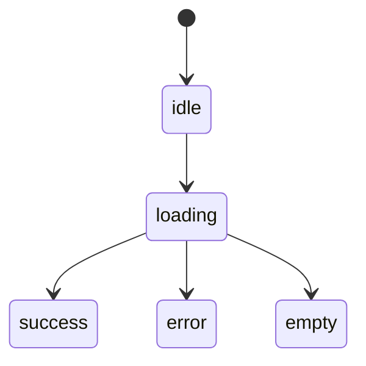
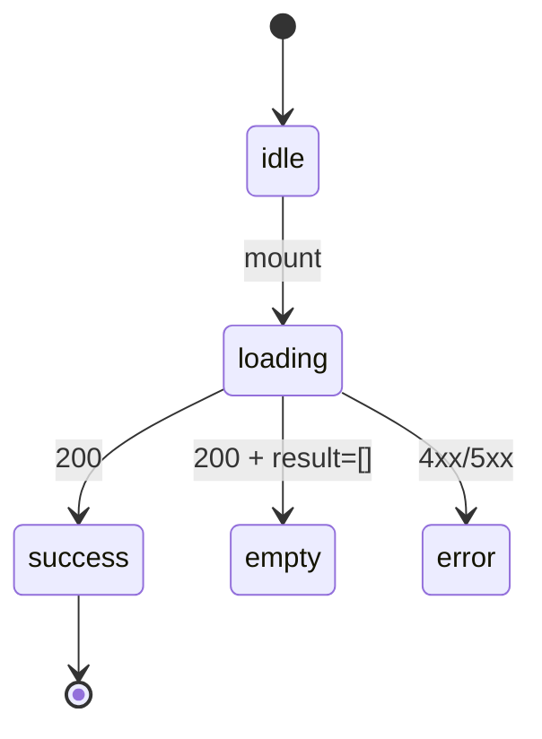
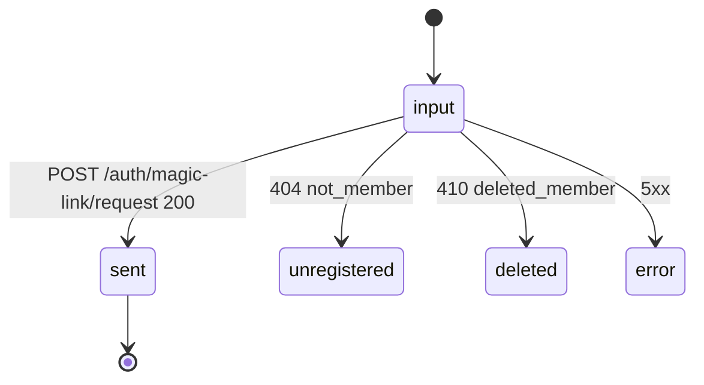

# task-20 screen-blueprints-public-and-member

## §0. 自己完結コンテキスト

このタスクを単独で着手する担当者が、外部資料に遡らずとも実装判断できるよう、必須前提を本節に閉じ込める。

### 0.1 上位ゴール

`docs/00-getting-started-manual/claude-design-prototype/pages-public.jsx`（472 行・凍結正本）と `pages-member.jsx`（373 行・凍結正本）の **公開層 6 routes + 会員層 2 routes（合計 8 画面）** を `09e-screen-blueprints-public.md` / `09f-screen-blueprints-member.md` の 2 ファイルに **完全再現**する。各画面は「JSX inline 一字一句転記 + コピー原文 + 状態遷移 mermaid + API 接続表（phase-3 §2 と完全一致）」を 1 セクションに閉じ込め、後続 task-11..14 が「09e/09f §X を読んで 1 ファイル書ける」決定論的状態を作る。token は `--ubm-*` 名のみで参照する（値は 09b、primitive 仕様は 09c、icon は 09d）。

### 0.2 DAG 座標

- 依存元: なし（task-01 scope-gate-all-screens 完了のみ前提）
- 依存先: task-11（public top + member list）/ task-12（detail + register）/ task-13（login）/ task-14（my profile + requests）/ task-06（09-ui-ux.md が link 先として参照）
- 並列性: **task-06 / task-07 / task-08 / task-19 / task-21 / task-22 と並列実行可**。

### 0.3 触れるファイル群

- C（新規作成）: `docs/00-getting-started-manual/specs/09e-screen-blueprints-public.md`（500〜900 行）/ `docs/00-getting-started-manual/specs/09f-screen-blueprints-member.md`（400〜700 行）
- R（参照のみ）: `pages-public.jsx`（L1-L472）/ `pages-member.jsx`（L1-L373）/ `outputs/phase-1/phase-1.md` §3 / `outputs/phase-3/phase-3.md` §2 §3
- M / 削除: なし

### 0.4 既存 API（不変）

phase-3 §2 の API 接続表を **正本**として転記。route × endpoint × method の 3 タプルを 1 字も改変しない:

- `GET /public/stats` / `GET /public/members[?...]` / `GET /public/members/:id` / `GET /public/form-preview` / `GET /public/meetings`
- `POST /auth/magic-link/request` / `POST /auth/magic-link/verify` / `POST /auth/logout`
- `GET /me/profile` / `PATCH /me/visibility` / `POST /me/visibility-requests` / `POST /me/delete-requests`

### 0.5 不変条件

1. pages-public.jsx / pages-member.jsx は **凍結正本**。本タスクで改変しない。
2. JSX inline 転記は **一字一句**（コピー文・class 名・whitespace 含む）。
3. 視覚値（HEX / oklch / px）を本ファイルに **0 件**含める（grep gate）。
4. consent キーは `publicConsent` / `rulesConsent`（CLAUDE.md 不変条件 2）。
5. `responseEmail` は system field（CLAUDE.md 不変条件 3）。
6. `apps/web` から D1 直接アクセス禁止（CLAUDE.md 不変条件 5）。
7. login 5 状態（input / sent / unregistered / deleted / error）を 09f §1 で正本化。
8. EDITMODE 専用要素（TweaksPanel / theme switcher / AvatarStoreProvider#localStorage）は採用しない。

### 0.6 上流から受け取るシグネチャ

- phase-1 §3: 公開 6 routes（`/`, `/(public)/members`, `/(public)/members/[id]`, `/(public)/register`, `/privacy`, `/terms`）+ 会員 2（`/login`, `/profile`）
- phase-3 §2: API 接続表
- phase-3 §3: 未掲載画面派生ルール（§5 法務 / §5.2 register）
- prototype 行範囲: LandingPage L4-L154 / MemberListPage L208-L338 / MemberDetailPage L339-L472 / LoginPage L4-L67 / MyProfilePage L220-L373

### 0.7 下流へ渡すシグネチャ

#### `09e-screen-blueprints-public.md`

```
1. / (Public Top)               ← pages-public.jsx LandingPage L4-L154
2. /(public)/members            ← MemberListPage L208-L338
3. /(public)/members/[id]       ← MemberDetailPage L339-L472
4. /(public)/register           ← phase-3 §3 §5.2 派生ルール
5. /privacy                     ← LegalProse 派生
6. /terms                       ← LegalProse 派生
99. 不採用要素
```

#### `09f-screen-blueprints-member.md`

```
1. /login                       ← pages-member.jsx LoginPage L4-L67（5 状態）
2. /profile                     ← MyProfilePage L220-L373
99. 不採用要素
```

各 §X は同列構成:

```markdown
## X. <route>

### X.1 prototype 由来 (`pages-*.jsx` L<a>-L<b>)
```jsx
// 一字一句転記
```

### X.2 コピー原文（一字一句）
- 見出し / サブ / CTA / placeholder

### X.3 状態遷移


### X.4 API 接続（phase-3 §2 と完全一致）
| method | endpoint | trigger | 状態反映 |

### X.5 props / 内部 state
| name | type | scope |

### X.6 a11y
- landmark / heading hierarchy / form / live region

### X.7 token / primitive / icon 参照
- primitive: 09c §X / icon: 09d §X / token: 09b §X
```

### 0.8 用語

- **画面 blueprint**: 1 route を実装するために必要な全情報（JSX / コピー / 状態 / API / props / a11y / 参照）を 1 セクションに閉じ込めた仕様。
- **コピー原文**: prototype 内の文字列（見出し・CTA・placeholder・error message）。一字一句転記する。
- **状態遷移**: ページ標準 5 値 + 画面固有状態の mermaid stateDiagram。

---

> 責務 dir: `03-spec-source`
> 想定工数: 1.0 人日
> 主担当: Tech Writer
> 依存: task-01（scope-gate-all-screens）完了
> 後続: task-11 / task-12 / task-13 / task-14（各画面実装）

---

## 1. ヘッダー

| 項目 | 値 |
|------|---|
| task id | 20 |
| task name | screen-blueprints-public-and-member |
| const ref | CONST_005 / CONST_007 |
| 入力 | `pages-public.jsx`（472 行）/ `pages-member.jsx`（373 行）/ phase-1..3 |
| 出力 | `09e-screen-blueprints-public.md`（新規 500〜900 行）/ `09f-screen-blueprints-member.md`（新規 400〜700 行） |
| 主成果物の DoD | §8 参照 |

---

## 2. ゴール / 非ゴール

### 2.1 ゴール

1. 公開 6 + 会員 2 = **8 画面**の blueprint を 09e / 09f に分割して新規作成
2. 各画面の JSX inline を一字一句転記
3. コピー原文を一字一句転記（CTA / placeholder / error message 含む）
4. 状態遷移を mermaid stateDiagram で記述
5. phase-3 §2 と完全一致の API 接続表を各画面に持つ
6. 未掲載画面（register / privacy / terms）は phase-3 §3 派生ルールを正本転記

### 2.2 非ゴール

- 実装コード（task-11..14）
- token 値（task-08 / 09b）
- primitive 仕様（task-19 / 09c）
- icon カタログ（task-22 / 09d）
- admin 画面（task-21 / 09g）
- shell / fixtures（task-22 / 09h）

---

## 3. 変更対象ファイル表

| 区分 | path | 概要 |
|------|------|------|
| C（新規） | `docs/00-getting-started-manual/specs/09e-screen-blueprints-public.md` | 公開 6 画面 |
| C（新規） | `docs/00-getting-started-manual/specs/09f-screen-blueprints-member.md` | 会員 2 画面 |
| R（参照） | `docs/00-getting-started-manual/claude-design-prototype/pages-public.jsx` | 転記元 |
| R（参照） | `docs/00-getting-started-manual/claude-design-prototype/pages-member.jsx` | 転記元 |
| R（参照） | `outputs/phase-3/phase-3.md` §2 §3 | API + 未掲載派生 |

---

## 4. シグネチャ / 章立て

### 4.1 09e 章立て

```
1. / (Public Top)
   1.1 prototype 由来 (LandingPage L4-L154)
   1.2 コピー原文（Hero タイトル / CTA / Stats ラベル / ZoneGuide / Timeline）
   1.3 状態遷移
   1.4 API: GET /public/stats, GET /public/members?limit=6&order=recent, GET /public/form-preview
   1.5 props / state
   1.6 a11y
   1.7 参照
2. /(public)/members
   ... (filter q/zone/status/sort/density, density 3 値)
   2.4 API: GET /public/members
3. /(public)/members/[id]
   ... (summary / overview / skill / offer / personality / contact 順)
   3.4 API: GET /public/members/:id
4. /(public)/register
   ... (phase-3 §3 §5.2 派生 / GET /public/form-preview + form responder URL link)
5. /privacy
   ... (LegalProse 派生)
6. /terms
   ... (LegalProse 派生)
99. 不採用要素 (TweaksPanel / theme switcher 等)
```

### 4.2 09f 章立て

```
1. /login (LoginPage L4-L67)
   1.1 prototype 由来
   1.2 コピー原文
   1.3 状態遷移（5 状態: input / sent / unregistered / deleted / error）
   1.4 API: POST /auth/magic-link/request, POST /auth/magic-link/verify
   1.5 props / state
   1.6 a11y
   1.7 参照
2. /profile (MyProfilePage L220-L373)
   2.1 prototype 由来
   2.2 コピー原文（4 領域: banner / summary / request / delete）
   2.3 状態遷移（server-pending を上書き禁止）
   2.4 API: GET /me/profile, PATCH /me/visibility, POST /me/visibility-requests, POST /me/delete-requests, POST /auth/logout
   2.5 props / state
   2.6 a11y
   2.7 参照
99. 不採用要素 (AvatarStoreProvider#localStorage / theme switcher)
```

### 4.3 §1.3 状態遷移サンプル（mermaid template）



login 5 状態 mermaid:



### 4.4 §X.4 API 表サンプル（template）

```markdown
| method | endpoint | trigger | 状態反映 |
|--------|----------|---------|---------|
| GET | /public/stats | mount | success → Stats render |
| GET | /public/members?limit=6&order=recent | mount | success → Timeline render |
```

### 4.5 §99 不採用要素

| 要素 | 理由 |
|------|------|
| TweaksPanel (`app.jsx` L213-L251) | EDITMODE 専用 |
| theme switcher (`styles.css` L42-L70) | dark mode MVP 非対応 |
| AvatarStoreProvider#localStorage 部分 | API 経由（task-14） |
| `gas-prototype/` 由来の振る舞い | 仕様昇格禁止（CLAUDE.md 不変条件 6） |

---

## 5. 入力・出力

### 5.1 入力
- pages-public.jsx（472 行・凍結）
- pages-member.jsx（373 行・凍結）
- phase-1 §3 / phase-3 §2 §3

### 5.2 出力
- 09e（新規 500〜900 行）
- 09f（新規 400〜700 行）

---

## 6. テスト方針

### 6.1 markdown 構造検証

| 検証 | 方法 |
|------|------|
| 09e 画面数 | `grep -cE '^## [0-9]+\. ' specs/09e-screen-blueprints-public.md` → 6+1 (§99) |
| 09f 画面数 | `grep -cE '^## [0-9]+\. ' specs/09f-screen-blueprints-member.md` → 2+1 |
| mermaid block | `grep -c '^```mermaid$' specs/09e-screen-blueprints-public.md` → 6+ |
| login 5 状態 | `grep -cE 'input\|sent\|unregistered\|deleted\|error' specs/09f-...` → 該当行確認 |

### 6.2 視覚値混入禁止

```bash
for F in specs/09e-screen-blueprints-public.md specs/09f-screen-blueprints-member.md; do
  grep -nE '#[0-9a-fA-F]{3,8}\b' "$F" && exit 1 || true
  grep -nE 'oklch\(' "$F" && exit 1 || true
  grep -nE '\b[0-9]+px\b' "$F" && exit 1 || true
  grep -nE '\bbg-\[' "$F" && exit 1 || true
done
```

### 6.3 API trace check

phase-3 §2 の API 接続表と、09e/09f の §X.4 表を行レベル diff（method × endpoint × route）で完全一致を目視確認。

### 6.4 コピー原文一致

prototype の主要文字列（Hero タイトル / CTA ラベル / login error message）を `grep -F` で 09e/09f に検索し全件 hit を確認。

---

## 7. 実行コマンド

```bash
cat docs/00-getting-started-manual/claude-design-prototype/pages-public.jsx
cat docs/00-getting-started-manual/claude-design-prototype/pages-member.jsx
$EDITOR docs/00-getting-started-manual/specs/09e-screen-blueprints-public.md
$EDITOR docs/00-getting-started-manual/specs/09f-screen-blueprints-member.md
grep -cE '^## [0-9]+\. ' docs/00-getting-started-manual/specs/09e-screen-blueprints-public.md
grep -cE '^## [0-9]+\. ' docs/00-getting-started-manual/specs/09f-screen-blueprints-member.md
bash scripts/verify-09ef-no-visual-values.sh || true
mise exec -- pnpm lint:md docs/00-getting-started-manual/specs/09e-screen-blueprints-public.md docs/00-getting-started-manual/specs/09f-screen-blueprints-member.md || true
```

---

## 8. DoD（Definition of Done）

- [ ] `09e-screen-blueprints-public.md` が新規作成・500〜900 行
- [ ] `09f-screen-blueprints-member.md` が新規作成・400〜700 行
- [ ] 09e に §1〜§6 + §99（公開 6 画面 + 不採用）
- [ ] 09f に §1〜§2 + §99（会員 2 画面 + 不採用）
- [ ] 全 8 画面で X.1 (JSX inline) / X.2 (コピー原文) / X.3 (mermaid 状態遷移) / X.4 (API 表) / X.5 (props/state) / X.6 (a11y) / X.7 (参照) が揃う
- [ ] login 5 状態（input/sent/unregistered/deleted/error）が 09f §1.3 mermaid に列挙
- [ ] /profile の 4 領域（banner/summary/request/delete）が 09f §2 で網羅
- [ ] register / privacy / terms は phase-3 §3 派生ルール正本転記
- [ ] 視覚値（HEX / oklch / px / `bg-[#...]`) が §6.2 grep で 0 件
- [ ] phase-3 §2 と §X.4 の API 表が完全一致
- [ ] consent キー / responseEmail / D1 直接アクセス禁止 等の不変条件が反映
- [ ] markdown lint で error 0
- [ ] 09c / 09b / 09d / 09a への link が全画面で記述

---

## 9. 影響範囲・リスク

| リスク | 緩和策 |
|--------|--------|
| 画面漏れ（公開 6 + 会員 2 = 8） | phase-1 §3 の checklist で全件確認 |
| コピー原文ドリフト | `grep -F` でランダム文字列を pre-commit 検証 |
| API 表ドリフト | §6.3 trace check |
| 未掲載画面の独自 primitive 生成 | 09c の primitive 組合せに限定する制約を §冒頭で明記 |

---

## 10. 関連 task / link 先

- task-06（09-ui-ux.md 契約 → 09e/09f に index）
- task-07（09a-prototype-map.md → 行範囲 mapping）
- task-08（09b-design-tokens.md → token 値）
- task-19（09c-primitives.md → primitive 仕様）
- task-22（09d-icons.md → icon カタログ / 09h shell+fixtures）
- task-11..14（実装）


---

## diff scope 規律（task-01 反映 / 2026-05-07）

`SCOPE.md §6 diff scope 規律 / archive rule` を遵守する。本 task 完了前に以下を必ず確認:

- `git diff --name-only main...HEAD` の出力が、本 task 仕様 §3「変更対象ファイル」 + 本 task package（`docs/30-workflows/ui-prototype-alignment-mvp-recovery/<dir>/`）配下のみで構成されていること
- 完了済み workflow dir を整理する場合は `git mv <dir> docs/30-workflows/completed-tasks/<dir>` でアーカイブ（`git rm -r` 純削除は禁止）
- sync-merge / rebase で混入した範囲外削除は `git checkout HEAD -- <path>` で復旧してから commit する
