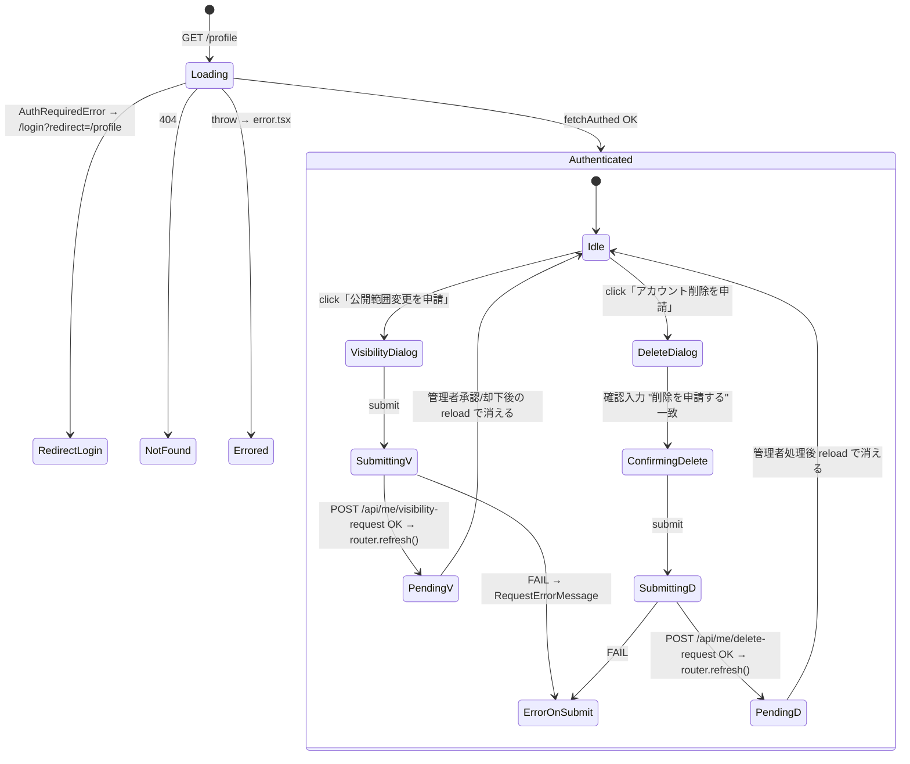
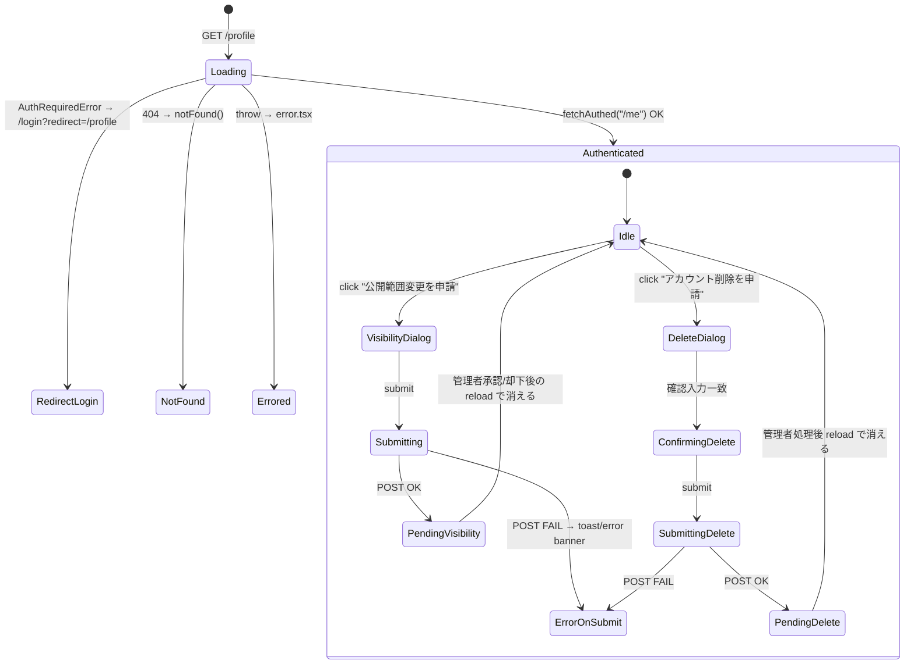

# task-14: my-profile-and-requests — `/profile` 公開状態 & 申請パネル実装仕様書

> 改訂日: 2026-05-07
> 担当 dir: `06-screens-member`
> 主担当: Frontend
> 工数見積: 1.0 人日
> 依存: task-09（Tailwind v4 / OKLch tokens）, task-10（ui-primitives: Card / Banner / Badge / Button / Dialog / Input / Skeleton）, task-13（login の redirect 着地点が `/profile`）
> 後続: task-18（Playwright smoke + verify-design-tokens）

---

## 0. 自己完結コンテキスト

このセクションは task-14 を**単独で読んでも実装に着手できる**ための前提集約。並列着手する Claude Code / 人間が、他タスク仕様書 / outputs / コードを行き来せずに着手判断できることを意図する。

### 0.1 上位ゴール

`/profile`（会員マイページ）を prototype 準拠の **4 領域構成**（PublicVisibilityBanner / StatusSummary / RequestActionPanel / DeleteRequestDialog）にリビルドし、公開状態 3 値（public / partial / private）と申請 pending を OKLch tokens のみで描画する。本人による本文編集 UI は描画しない（不変条件 #4：MVP では Form 再回答が更新経路）。**`apps/api/src/routes/me/*` および `apps/web/app/api/me/*` の API surface は一切変更しない**。

### 0.2 DAG 座標

```
[task-09 Tailwind v4 / OKLch] ──┐
[task-10 ui-primitives] ────────┼──▶ [task-14 my-profile-and-requests] ──▶ [task-18]
[task-13 login redirect=/profile]┘
```

- **依存元**: task-09（OKLch tokens）, task-10（`<Card>` `<Banner>` `<Badge>` `<Button>` `<Dialog>` `<Input>` `<Skeleton>`）, task-13（`/login?redirect=/profile` の着地先）
- **依存先**: task-18（Playwright smoke で 4 領域 + Dialog open / `verify-design-tokens` gate）
- **並列可能**: **task-11, task-12, task-13, task-15, task-16, task-17** と完全並列（route scope と既存 API surface が独立）

### 0.3 触れるファイル群（read / write 全列挙）

write（編集 / 新規）:
- `apps/web/app/profile/page.tsx`（Server Component / fetchAuthed × 2）
- `apps/web/app/profile/_components/PublicVisibilityBanner.tsx`（new）
- `apps/web/app/profile/_components/StatusSummary.tsx`（rebuild）
- `apps/web/app/profile/_components/RequestActionPanel.tsx`（minor）
- `apps/web/app/profile/_components/VisibilityRequestDialog.tsx`（Dialog primitive 化）
- `apps/web/app/profile/_components/DeleteRequestDialog.tsx`（Dialog primitive 化）
- `apps/web/app/profile/_components/RequestPendingBanner.tsx`（minor）
- `apps/web/app/profile/_components/RequestErrorMessage.tsx`（minor）
- `apps/web/app/profile/_components/__tests__/*`（追記 / new）
- `e2e/profile-smoke.spec.ts`（task-18 spec への append）

read（参照のみ・変更禁止）:
- `apps/web/app/api/me/[...path]/route.ts`（`/me`, `/me/profile` proxy）
- `apps/web/app/api/me/visibility-request/route.ts`
- `apps/web/app/api/me/delete-request/route.ts`
- `apps/api/src/routes/me/{index,services,schemas}.ts`
- `apps/web/src/lib/api/me-types.ts`（`MeProfileResponse` / `MeSessionResponse` 等の型）
- `apps/web/src/lib/fetch/authed.ts`（`fetchAuthed` 実装）
- `docs/00-getting-started-manual/claude-design-prototype/pages-member.jsx`（MyProfile block の正本）
- `docs/30-workflows/ui-prototype-alignment-mvp-recovery/outputs/phase-1..3/`

### 0.4 既存 API（不変・新規追加禁止）

| endpoint（apps/web） | method | proxy 先（apps/api） | 役割 |
|---------------------|--------|----------------------|------|
| `/api/me/[...path]` | GET / POST | `apps/api/src/routes/me/index.ts` | `/me`, `/me/profile` 等への透過 proxy |
| `/api/me/visibility-request` | POST | `apps/api/src/routes/me/services.ts` | 公開範囲申請の row 作成 |
| `/api/me/delete-request` | POST | 同上 | 削除申請の row 作成 |

`apps/api/src/routes/me/{index,services,schemas}.ts` の追加・変更は禁止（不変条件 #1, phase-1 §1.2）。

### 0.5 不変条件

1. 本文編集 UI は描画しない（不変条件 #4: 本人更新は Form 再回答が正式経路 / 不変条件 #7）
2. `apps/web` から D1 への直接アクセス禁止（不変条件 #5）。`fetchAuthed` 経由のみ。
3. session は `memberId` のみを正本とする（不変条件 #7）
4. 楽観的 UI を採用しない（pending は `router.refresh()` で Server から再取得）
5. HEX 直書き禁止（OKLch tokens 経由のみ。`pnpm verify-design-tokens` で gate）
6. 削除申請の確認入力は IME 確定後 (`compositionend`) 以降のみ submit を有効化する
7. `apps/web/app/api/me/*` の handler 追加・変更 0 件
8. 退会の即時反映は行わない（管理 queue 経由のままとする）

### 0.6 上流シグネチャ（inline 展開）

#### 0.6.1 `GET /api/me`

```ts
type AuthGateState = "active" | "rules_pending" | "deleted";
interface MeSessionResponse {
  readonly memberId: string;
  readonly authGateState: AuthGateState;
  readonly displayName: string;
}
```

#### 0.6.2 `GET /api/me/profile`

```ts
type PublishState = "public" | "partial" | "private";
type RulesConsent = "agreed" | "pending" | "declined";
type FieldVisibility = "public" | "private";

interface FieldVisibilityRow {
  readonly fieldId: string;
  readonly label: string;
  readonly visibility: FieldVisibility;
}
interface PendingRequest {
  readonly id: string;
  readonly type: "visibility" | "delete";
  readonly submittedAt: string;          // ISO 8601
  readonly status: "pending" | "approved" | "rejected";
}
interface MeProfileResponse {
  readonly profile: { readonly sections: SectionDto[]; readonly attendance: AttendanceDto[] };
  readonly statusSummary: {
    readonly publishState: PublishState;
    readonly rulesConsent: RulesConsent;
    readonly fields: readonly FieldVisibilityRow[];
  };
  readonly pendingRequests: readonly PendingRequest[];
  readonly editResponseUrl?: string;
  readonly fallbackResponderUrl: string;
}
```

#### 0.6.3 `POST /api/me/visibility-request`

```ts
interface VisibilityRequestInput {
  readonly desiredState: PublishState;   // public | partial | private
  readonly note?: string;                 // ≤500 文字
}
// 200 → { ok: true; requestId: string }
```

#### 0.6.4 `POST /api/me/delete-request`

```ts
interface DeleteRequestInput {
  readonly reason?: string;               // ≤500 文字
  readonly confirmText: string;           // "削除を申請する" を打鍵させる
}
// 200 → { ok: true; requestId: string }
```

#### 0.6.5 認証 gate（`apps/api/src/routes/auth/`）

未認証時は `fetchAuthed` が `AuthRequiredError` を throw → page.tsx で `redirect("/login?redirect=/profile")`。task-13 で確立する 5 状態 login の入口に着地する。

### 0.7 下流シグネチャ（task-18 へ渡す契約）

- 4 領域それぞれに `data-region` 属性を付与:
  - `data-region="public-visibility-banner"`
  - `data-region="status-summary"`
  - `data-region="request-action-panel"`
  - `data-region="delete-request-dialog"`（trigger button、Dialog open 時）
- Dialog open 時は `role="dialog"` `aria-modal="true"` `aria-labelledby` を必須付与（focus trap）。
- `verify-design-tokens` は `apps/web/app/profile/**` に対する HEX 正規表現マッチ 0 件を期待。
- `e2e/profile-smoke.spec.ts` に「未ログイン redirect」「公開状態 3 値」「pending 有無」「Dialog open + focus trap」の case を append する。

### 0.8 用語

| 用語 | 定義 |
|------|------|
| publishState | プロフィール公開状態 3 値（public / partial / private） |
| authGateState | 認証 gate 状態 3 値（active / rules_pending / deleted） |
| pending request | 公開範囲変更 / 削除の管理 queue に入っている申請 row |
| visibility request | 公開範囲変更申請（個別フィールド単位ではなく全体 publishState） |
| delete request | アカウント削除申請（管理者承認まで取消不可） |
| `fetchAuthed` | session cookie を引き継ぎ AuthRequiredError を throw する fetch wrapper |
| Form 再回答 | Google Form を再送して本人プロフィールを更新する MVP の正式経路（不変条件 #7） |

### 0.9 画面の概念（状態遷移含む）

`/profile` は **4 領域**を縦に積んだ Server Component 起点画面。Server で `Promise.all([fetchAuthed("/me"), fetchAuthed("/me/profile")])` を取得し、Client は Dialog の開閉と submit のみを担当する。**pending 申請が存在する間、対応する申請 button を disabled に連動**させるのが本タスクの中核ロジック。



4 領域の構成と pending 連動:

| 領域 | 描画責務 | pending 連動 |
|------|---------|-------------|
| **PublicVisibilityBanner**（最上部・new） | publishState 3 値 × authGateState 3 値の Banner（success / info / warning / danger） | authGateState=`deleted` で danger 上書き |
| **StatusSummary**（rebuild） | `<dl>` で `FieldVisibilityRow[]` を列挙、各行 `<Badge>` で public/private 表示。rulesConsent / authGateState を補助 Badge | rulesConsent=`declined` で warn Badge |
| **RequestActionPanel**（minor） | 「公開範囲変更を申請」「アカウント削除を申請」の 2 button | pending visibility あり → 申請 button disabled + RequestPendingBanner / pending delete あり → 削除 button disabled |
| **DeleteRequestDialog**（Dialog primitive 化） | warning Banner + 理由 textarea + 確認入力 + submit button | 確認文字列一致まで submit disabled、IME 確定後のみ enable |

公開状態 × authGateState のマトリクス（Banner tone 決定表）:

| publishState | authGateState | tone | 文言 hint |
|-------------|---------------|------|----------|
| public | active | success | 公開中 |
| partial | active | info | 一部公開 |
| private | active | warning | 非公開 |
| any | rules_pending | warning | 規約再同意が必要 |
| any | deleted | danger | 削除待ち |

submit 後の挙動は **楽観的 UI 不採用**で、`router.refresh()` を呼んで Server Component を再描画 → `pendingRequests` に新 row が現れる → RequestPendingBanner が表示 → 申請 button が disabled になる、という一方向データフローを徹底する。

---

## 1. ヘッダー

| 項目 | 値 |
|------|-----|
| Task ID | task-14 |
| Task name | my-profile-and-requests |
| 対象 route | `/profile`（App Router、Cloudflare Workers / `@opennextjs/cloudflare` SSR） |
| 4 領域 | 公開状態バナー / 公開範囲サマリ / 申請パネル / 削除申請 |
| 既存実装 | `apps/web/app/profile/page.tsx` + `_components/{StatusSummary,ProfileFields,EditCta,AttendanceList,RequestActionPanel,VisibilityRequestDialog,DeleteRequestDialog,RequestPendingBanner,RequestErrorMessage}.tsx` |
| 不変条件 | 本文編集 UI 非描画（#4）／ D1 直接禁止 #5（fetchAuthed 経由のみ）／ session.memberId のみ（#7）／ MVP では Form 再回答が本人更新の正式経路（#7） |
| 仕様根拠 | `docs/00-getting-started-manual/specs/06-member-auth.md`, `09-ui-ux.md`, `13-mvp-auth.md`, `claude-design-prototype/pages-member.jsx` |
| プロトタイプ部品 | PublicVisibilityBanner / VisibilitySummary / RequestActionPanel / VisibilityRequestDialog / DeleteRequestDialog / RequestPendingBanner |

---

## 2. ゴール / 非ゴール

### 2.1 ゴール（Definition of Done）

| ID | 条件 | 検証 |
|----|------|------|
| G-14-1 | `/profile` の 4 領域（公開状態バナー / 公開範囲サマリ / 申請パネル / 削除申請）が prototype 準拠で描画される | 手動 + Playwright |
| G-14-2 | OKLch tokens が全領域で適用、HEX 直書き 0 件 | `pnpm verify-design-tokens` |
| G-14-3 | `RequestPendingBanner` が pending 申請（visibility / delete）を表示し、二重申請を抑止する | Vitest + 手動 |
| G-14-4 | 公開範囲申請（VisibilityRequestDialog）で `POST /api/me/visibility-request` が呼ばれる | Vitest（fetch mock） |
| G-14-5 | 削除申請（DeleteRequestDialog）で `POST /api/me/delete-request` が呼ばれる | Vitest |
| G-14-6 | `apps/api` 既存 surface（`me/index.ts`, `me/services.ts`, `me/schemas.ts`）に新エンドポイントを追加していない | git diff |
| G-14-7 | `apps/web` から D1 への直接アクセス無し（`fetchAuthed` 経由のみ） | grep |
| G-14-8 | a11y critical violation 0（dialog の focus trap、role=dialog、aria-labelledby） | jest-axe + Playwright |
| G-14-9 | 認証未確立時 `/login?redirect=/profile` に redirect する | Playwright（fixture: 未ログイン） |

### 2.2 非ゴール

- 新 API endpoint 追加（`apps/web/app/api/me/*` 既存 surface 不変）
- D1 schema 変更
- プロフィール本文の inline 編集 UI（不変条件 #4）
- Form schema の inline 表示変更
- 退会の即時反映（管理 queue 経由のままとする）
- attendance（出欠）の編集機能

---

## 3. 変更対象ファイル表

| path | 区分 | 役割 |
|------|------|------|
| `apps/web/app/profile/page.tsx` | M（edit） | Server Component。fetchAuthed で `/me` + `/me/profile` を Promise.all で取得し 4 領域に props 配布。`<PublicVisibilityBanner>` を最上部に追加 |
| `apps/web/app/profile/_components/PublicVisibilityBanner.tsx` | C（new） | 公開状態 3 値（公開中 / 一部非公開 / 非公開）を Banner で表示 |
| `apps/web/app/profile/_components/StatusSummary.tsx` | M（rebuild） | 公開範囲サマリ（フィールド単位の visibility 一覧）。Card + Badge で構成、tokens 適用 |
| `apps/web/app/profile/_components/RequestActionPanel.tsx` | M（minor） | 既存実装を維持しつつ Card 化、Banner で pending を可視化、tokens 適用 |
| `apps/web/app/profile/_components/VisibilityRequestDialog.tsx` | M（minor） | ui-primitive `<Dialog>` 移行、tokens 適用、focus trap |
| `apps/web/app/profile/_components/DeleteRequestDialog.tsx` | M（minor） | ui-primitive `<Dialog>` 移行、tokens 適用、focus trap、確認文言の二重チェック |
| `apps/web/app/profile/_components/RequestPendingBanner.tsx` | M（minor） | tokens 適用、pending 種別ごとの文言を確定 |
| `apps/web/app/profile/_components/RequestErrorMessage.tsx` | M（minor） | tokens 適用、aria-live=polite |
| `apps/web/app/profile/_components/VisibilityRequest.client.tsx` | R（参照） | Dialog 起動 client。propsの tokens 適用のみ |
| `apps/web/app/profile/_components/DeleteRequest.client.tsx` | R（参照） | 同上 |
| `apps/web/app/profile/_components/__tests__/*` | M | 既存テストに `PublicVisibilityBanner` ケースを追加、Dialog 移行に伴う selector 更新 |
| `apps/web/app/profile/loading.tsx` | R | 既存 Skeleton で OK |
| `apps/web/app/profile/error.tsx` | R | 既存で OK（Sentry capture + reset） |
| `e2e/profile-smoke.spec.ts` | M | task-18 で 4 領域可視性 + 申請ボタン visible を追記 |

---

## 4. 各コンポーネントの Props 型（TypeScript 実例）

### 4.1 共有型（既存 `me-types.ts` を流用）

```ts
// apps/web/src/lib/api/me-types.ts（既存）
export type PublishState = "public" | "partial" | "private";
export type AuthGateState = "active" | "rules_pending" | "deleted";
export type RulesConsent = "agreed" | "pending" | "declined";
export type FieldVisibility = "public" | "private";

export interface FieldVisibilityRow {
  readonly fieldId: string;
  readonly label: string;
  readonly visibility: FieldVisibility;
}

export interface PendingRequest {
  readonly id: string;
  readonly type: "visibility" | "delete";
  readonly submittedAt: string; // ISO 8601
  readonly status: "pending" | "approved" | "rejected";
}

export interface MeProfileResponse {
  readonly profile: {
    readonly sections: SectionDto[];
    readonly attendance: AttendanceDto[];
  };
  readonly statusSummary: {
    readonly publishState: PublishState;
    readonly rulesConsent: RulesConsent;
    readonly fields: readonly FieldVisibilityRow[];
  };
  readonly pendingRequests: readonly PendingRequest[];
  readonly editResponseUrl?: string;
  readonly fallbackResponderUrl: string;
}

export interface MeSessionResponse {
  readonly memberId: string;
  readonly authGateState: AuthGateState;
  readonly displayName: string;
}
```

### 4.2 `ProfilePage`（page.tsx）

```ts
// apps/web/app/profile/page.tsx
export const dynamic = "force-dynamic";
export const revalidate = 0;
export default async function ProfilePage(): Promise<JSX.Element>;
```

挙動:
- `fetchAuthed<MeSessionResponse>("/me")` + `fetchAuthed<MeProfileResponse>("/me/profile")` を `Promise.all`
- `AuthRequiredError` → `redirect("/login?redirect=/profile")`
- 404 → `notFound()`
- それ以外の throw → error.tsx へ

### 4.3 `PublicVisibilityBanner`（new）

```ts
// apps/web/app/profile/_components/PublicVisibilityBanner.tsx
export interface PublicVisibilityBannerProps {
  readonly publishState: PublishState;
  readonly authGateState: AuthGateState;
}
export function PublicVisibilityBanner(props: PublicVisibilityBannerProps): JSX.Element;
```

| publishState | tone | 表示文言 |
|-------------|------|----------|
| `public` | success | 「あなたのプロフィールは**公開中**です。会員一覧に表示されます」 |
| `partial` | info | 「あなたのプロフィールは**一部公開**です。公開範囲は下のサマリで確認できます」 |
| `private` | warning | 「あなたのプロフィールは**非公開**です。会員一覧に表示されません」 |

`authGateState === "deleted"` の場合は danger Banner で「アカウントは削除待ちです」と上書き。

### 4.4 `StatusSummary`（rebuild）

```ts
export interface StatusSummaryProps {
  readonly statusSummary: MeProfileResponse["statusSummary"];
  readonly authGateState: AuthGateState;
}
export function StatusSummary(props: StatusSummaryProps): JSX.Element;
```

renders:
- Card 内に `fields: FieldVisibilityRow[]` を `<dl>` で列挙
- 各行: `<dt>{label}</dt><dd><Badge tone={visibility==='public'?'info':'muted'}>{visibility}</Badge></dd>`
- rulesConsent / authGateState を Badge で補助表示

### 4.5 `RequestActionPanel`（minor edit）

```ts
export interface RequestActionPanelProps {
  readonly publishState: PublishState;
  readonly rulesConsent: RulesConsent;
  readonly pendingRequests: readonly PendingRequest[];
}
export function RequestActionPanel(props: RequestActionPanelProps): JSX.Element;
```

挙動:
- `pendingRequests` に `type==="visibility"` で `status==="pending"` の要素があれば「公開範囲変更申請中」Banner + 申請ボタン disabled
- 同様に `type==="delete"` pending → 「削除申請中」Banner + 削除ボタン disabled
- pending 無しの状態では「公開範囲変更を申請」「アカウント削除を申請」の 2 つの button を render（Dialog を起動）

### 4.6 `VisibilityRequestDialog`（minor edit）

```ts
export interface VisibilityRequestDialogProps {
  readonly open: boolean;
  readonly onClose: () => void;
  readonly onSubmit: (input: VisibilityRequestInput) => Promise<void>;
}
export interface VisibilityRequestInput {
  readonly desiredState: PublishState;
  readonly note?: string;
}
```

UI:
- Dialog title: 「公開範囲変更の申請」
- radio group: public / partial / private
- 任意 textarea: 申請理由（≤500 文字）
- submit button: 「申請する」
- cancel button: 「キャンセル」
- focus trap + ESC 閉じる + click outside で閉じる

### 4.7 `DeleteRequestDialog`（minor edit）

```ts
export interface DeleteRequestDialogProps {
  readonly open: boolean;
  readonly onClose: () => void;
  readonly onSubmit: (input: DeleteRequestInput) => Promise<void>;
}
export interface DeleteRequestInput {
  readonly reason?: string;
  readonly confirmText: string; // ユーザーが "削除を申請する" を打鍵した値
}
```

UI:
- Dialog title: 「アカウント削除の申請」
- 警告 Banner（danger tone）: 「削除申請後は管理者が承認するまで取り消し不可」
- textarea: 削除理由（任意、≤500 文字）
- input: 「削除を申請する」と打鍵させる確認入力
- submit button: 確認文字列が一致しないと disabled
- cancel button

### 4.8 `RequestPendingBanner`（minor edit）

```ts
export interface RequestPendingBannerProps {
  readonly type: "visibility" | "delete";
  readonly submittedAt: string;
}
export function RequestPendingBanner(props: RequestPendingBannerProps): JSX.Element;
```

`tone="info"` で「申請内容を管理者が確認中です（提出: yyyy-MM-dd HH:mm）」を表示。

### 4.9 `RequestErrorMessage`（minor edit）

```ts
export interface RequestErrorMessageProps {
  readonly message: string;
  readonly onDismiss?: () => void;
}
```

`tone="danger"` Banner、`role="alert"`、`aria-live="polite"`、dismiss button optional。

---

## 5. 状態遷移図（4 領域）



### 5.1 公開状態 × authGateState マトリクス

| publishState | authGateState | Banner tone | 文言 hint |
|-------------|---------------|-------------|----------|
| public | active | success | 公開中 |
| partial | active | info | 一部公開 |
| private | active | warning | 非公開 |
| any | rules_pending | warning | 規約再同意が必要 |
| any | deleted | danger | 削除待ち（再ログイン不可） |

---

## 6. データフロー

### 6.1 初期描画（Server）

```
GET /profile
  → page.tsx (Server Component)
    → Promise.all([
        fetchAuthed<MeSessionResponse>("/me"),
        fetchAuthed<MeProfileResponse>("/me/profile"),
      ])
    → apps/api/src/routes/me/index.ts handler
    → D1 binding 経由で member + visibility + pending requests を集約
  → success: 4 領域に props 配布
  → AuthRequiredError: redirect("/login?redirect=/profile")
  → 404: notFound()
```

### 6.2 公開範囲申請（Client → API）

```
[click "公開範囲変更を申請"]
  → VisibilityRequest.client.tsx: setOpen(true)
  → <VisibilityRequestDialog> 起動
  → submit
  → fetch POST /api/me/visibility-request
       body: { desiredState, note }
       Cookie: session
  → app/api/me/visibility-request/route.ts → apps/api 経由 → D1 に request row 作成
  → 200 { ok: true, requestId }
  → router.refresh() で Server Component を再取得
  → pendingRequests に新規 row が現れ、Banner が表示される
```

### 6.3 削除申請（Client → API）

```
[click "アカウント削除を申請"]
  → DeleteRequest.client.tsx: setOpen(true)
  → <DeleteRequestDialog>: 確認入力一致まで submit disabled
  → submit
  → fetch POST /api/me/delete-request
       body: { reason }
  → app/api/me/delete-request/route.ts → apps/api → D1 に request row + audit
  → 200
  → router.refresh()
  → pendingRequests に delete pending が現れる、削除ボタン disabled
```

### 6.4 エラーハンドリング

| エラー | UI |
|--------|-----|
| 4xx validation | `<RequestErrorMessage>` で API のエラーメッセージを描画 |
| 401 | router.replace(`/login?redirect=/profile`) |
| 5xx | `<RequestErrorMessage>` + Sentry capture |
| ネットワーク失敗 | retry button 付き error message |

### 6.5 楽観的 UI を採用しない理由

申請の状態は管理 queue 側で意味を持つため、楽観的 UI による pending の即時表示は誤解を生む。**`router.refresh()` 経由で server state を再取得**して描画する設計を採る。

---

## 7. テスト方針

### 7.1 Vitest（unit）

| ファイル | 主ケース |
|---------|---------|
| `__tests__/PublicVisibilityBanner.test.tsx`（new） | publishState 3 値 × authGateState 3 値 = 9 マトリクスから代表 5 ケース |
| `__tests__/StatusSummary.test.tsx`（rebuild） | fields[] 空 / 全 public / mixed / rulesConsent declined |
| `__tests__/RequestActionPanel.test.tsx`（既存追記） | pending visibility あり → 申請ボタン disabled / pending delete あり → 削除ボタン disabled / pending 無し → 両 button enabled |
| `__tests__/VisibilityRequestDialog.test.tsx`（既存追記） | radio 選択 → submit fetch 1 回呼ばれる / cancel → onClose 呼ばれる / textarea > 500 文字で submit disabled |
| `__tests__/DeleteRequestDialog.test.tsx`（既存追記） | 確認文字列不一致 → submit disabled / 一致 → submit enabled / submit → fetch 1 回 / fetch fail → error message 表示 |
| `__tests__/RequestPendingBanner.test.tsx`（既存追記） | type=visibility / type=delete で文言切り替わる |
| `__tests__/RequestErrorMessage.test.tsx`（既存追記） | role=alert / aria-live=polite が付与される |

### 7.2 Vitest（fetch mock）

`vi.mock("@/src/lib/fetch/authed")` で `fetchAuthed` を差し替え、submit 時の payload と URL を assertion:

```ts
expect(fetchAuthed).toHaveBeenCalledWith("/me/visibility-request", {
  method: "POST",
  body: JSON.stringify({ desiredState: "private", note: "..." }),
});
```

### 7.3 Playwright smoke（`e2e/profile-smoke.spec.ts`）

| ケース | 前提 | 期待 |
|--------|------|------|
| 未ログインで `/profile` を踏む | session なし | `/login?redirect=/profile` に redirect |
| ログイン済み公開中 | publishState=public | 公開状態バナー（success）表示、4 領域すべて visible、申請 2 button enabled |
| ログイン済み一部公開 | publishState=partial | 公開状態バナー（info）表示、StatusSummary に public/private mix |
| ログイン済み非公開 | publishState=private | 公開状態バナー（warning）表示 |
| pending visibility あり | mock pendingRequests | `<RequestPendingBanner type="visibility">` visible、申請 button disabled |
| pending delete あり | mock pendingRequests | 削除 button disabled |
| 申請 button click | publish=public | Dialog 表示、focus trap が機能（Tab で外に出ない） |
| 削除 dialog の確認入力 | | 「削除を申請する」打鍵までは submit disabled |

### 7.4 a11y（jest-axe）

- 4 領域それぞれを単独で render → axe critical 0
- Dialog open 時の axe（focus trap、aria-modal、aria-labelledby）

### 7.5 視覚回帰

prototype `pages-member.jsx` の `MyProfile` block と並べた手動レビューで色味 / spacing 整合を確認。

---

## 8. ローカル実行コマンド

```bash
mise install
mise exec -- pnpm install

# 開発サーバ
mise exec -- pnpm --filter web dev          # http://localhost:3000/profile

# 型チェック / lint
mise exec -- pnpm typecheck
mise exec -- pnpm lint

# 単体テスト
mise exec -- pnpm --filter web test -- profile
mise exec -- pnpm --filter web test -- PublicVisibilityBanner
mise exec -- pnpm --filter web test -- StatusSummary
mise exec -- pnpm --filter web test -- RequestActionPanel
mise exec -- pnpm --filter web test -- VisibilityRequestDialog
mise exec -- pnpm --filter web test -- DeleteRequestDialog
mise exec -- pnpm --filter web test -- RequestPendingBanner
mise exec -- pnpm --filter web test -- RequestErrorMessage

# Playwright smoke
mise exec -- pnpm --filter web test:e2e -- profile-smoke

# tokens 検証
mise exec -- pnpm --filter web verify-design-tokens

# 手動 smoke 用 URL（dev サーバ起動後、ログイン済みセッションで）
#   /profile                             … 通常ケース
#   /profile  + mock publishState=partial … StatusSummary 確認
#   /profile  + mock pendingRequests=[…] … pending banner 確認
```

---

## 9. DoD（Definition of Done）

| # | 項目 | 検証 |
|---|------|------|
| D-1 | 4 領域（公開状態バナー / 公開範囲サマリ / 申請パネル / 削除申請）が prototype 準拠で表示される | 手動 + Playwright |
| D-2 | OKLch tokens が全領域で適用、HEX 直書き 0 件 | `verify-design-tokens` |
| D-3 | `PublicVisibilityBanner` の 3 状態 × authGateState 3 状態が網羅されている | Vitest |
| D-4 | `<Dialog>` primitive が VisibilityRequestDialog / DeleteRequestDialog で使用され、focus trap / aria-modal が機能 | jest-axe + Playwright |
| D-5 | 公開範囲申請: `POST /api/me/visibility-request` 1 回呼ばれ、router.refresh() で pending banner が現れる | Vitest + Playwright |
| D-6 | 削除申請: 確認入力一致まで submit disabled、`POST /api/me/delete-request` 1 回呼ばれる | Vitest |
| D-7 | pending 申請が存在する間、対応する申請 button が disabled | Vitest |
| D-8 | 未ログインで `/profile` 踏むと `/login?redirect=/profile` へ redirect | Playwright |
| D-9 | `apps/web` から D1 への直接アクセスが無い（fetchAuthed のみ） | grep |
| D-10 | `apps/api/src/routes/me/*` 配下の追加・変更 0 | git diff |
| D-11 | `apps/web/app/api/me/*` 配下の handler 追加・変更 0（既存 surface のみ） | git diff |
| D-12 | a11y: 4 領域 + Dialog open 時の axe critical violation 0 | jest-axe |
| D-13 | error.tsx / loading.tsx / not-found.tsx が tokens 適用済みで動作 | 手動 |
| D-14 | dev / staging で公開状態 3 値 × pending 有無を一巡し Sentry にエラーが残らない | 手動 |

---

## 10. 実装順序（推奨）

1. `me-types.ts` の型を確認し、`PendingRequest` `FieldVisibilityRow` などが既存型と整合しているか確認（不整合なら adapter を `lib/api/me.ts` に作る）
2. `PublicVisibilityBanner.tsx` を新規作成
3. `StatusSummary.tsx` を tokens + Card + Badge で書き直し
4. `RequestPendingBanner.tsx` / `RequestErrorMessage.tsx` を tokens 適用に最小編集
5. `VisibilityRequestDialog.tsx` / `DeleteRequestDialog.tsx` を ui-primitive `<Dialog>` に移行
6. `RequestActionPanel.tsx` を Card 化、pending 連動の disabled ロジックを確認
7. `page.tsx` を編集し `<PublicVisibilityBanner>` を最上位に挿入、4 領域の縦配置を確定
8. Vitest テストを 4 領域 × Dialog で網羅
9. jest-axe を全コンポーネントに適用
10. Playwright smoke で公開状態 3 値 + pending 有無 + Dialog 起動を確認
11. 手動 smoke で API Worker と D1 の整合確認（dev / staging）

---

## 11. リスクと緩和策

| リスク | 影響 | 緩和 |
|--------|------|------|
| `MeProfileResponse` の shape が想定と乖離 | 型エラー / 描画崩れ | `lib/api/me.ts` に adapter を 1 段挟み、UI は固定の view-model 型のみ受け取る |
| pending request の status 種別が「pending 以外も来る」 | banner が誤表示 | `status === "pending"` だけを filter してから RequestPendingBanner に渡す |
| Dialog の Cloudflare Workers SSR で `document` 参照エラー | 500 | Dialog 本体は `'use client'` 配下に閉じ、SSR では trigger button のみ render |
| 削除申請の確認入力が日本語 IME で確定前に submit 可能になる | 誤操作 | submit は `compositionend` 後のみ enable、または click 時に再 validate |
| `router.refresh()` で fetchAuthed が cookie を引き継がない | pending banner が出ない | `fetchAuthed` 実装で `credentials: "include"` を確認、Worker SSR 経由でも cookie 透過する設計を維持 |
| 認証済みでも 401 が瞬発する race | 誤 redirect | 401 を 1 度だけ retry してから login redirect する fallback を `fetchAuthed` 側に置く（既存実装で対応済か確認） |

---

## 12. 既存 API surface（参照のみ・変更なし）

| endpoint（apps/web） | method | proxy 先（apps/api） | 役割 |
|---------------------|--------|----------------------|------|
| `/api/me/[...path]` | GET / POST | `apps/api/src/routes/me/index.ts` | `/me`, `/me/profile` 等への透過 proxy |
| `/api/me/visibility-request` | POST | `apps/api/src/routes/me/services.ts` 経由 | 公開範囲申請の row 作成 |
| `/api/me/delete-request` | POST | 同上 | 削除申請の row 作成 |

**`apps/api/src/routes/me/{index,services,schemas}.ts` の追加・変更は禁止**（不変条件 #1, phase-1 §1.2）。

---

## 13. 参照ドキュメント

| ファイル | 用途 |
|---------|------|
| `docs/00-getting-started-manual/specs/06-member-auth.md` | 公開状態 / 申請キュー仕様 |
| `docs/00-getting-started-manual/specs/09-ui-ux.md` | RequestPendingBanner / Dialog 文言ガイド |
| `docs/00-getting-started-manual/specs/13-mvp-auth.md` | MVP 認証 / 本人更新方針（Form 再回答） |
| `docs/00-getting-started-manual/claude-design-prototype/pages-member.jsx` | MyProfile block の visual reference |
| `docs/30-workflows/ui-prototype-alignment-mvp-recovery/outputs/phase-1/phase-1.md` §3.2 | API マッピング |
| `docs/30-workflows/ui-prototype-alignment-mvp-recovery/outputs/phase-3/phase-3.md` §4.14 | task-14 差分 hint |

---

## 14. 受け入れチェックリスト（最終）

- [ ] `PublicVisibilityBanner.tsx` が新規作成されている
- [ ] `StatusSummary.tsx` が Card + Badge + tokens 適用で書き直されている
- [ ] `VisibilityRequestDialog` / `DeleteRequestDialog` が ui-primitive `<Dialog>` を使用
- [ ] `RequestPendingBanner` / `RequestErrorMessage` が tokens 適用済み
- [ ] `RequestActionPanel` が pending 連動で button disabled する
- [ ] `page.tsx` に `<PublicVisibilityBanner>` が最上部に追加されている
- [ ] HEX 直書き 0 件
- [ ] Vitest（PublicVisibilityBanner / StatusSummary / RequestActionPanel / 2 Dialog / 2 Banner）すべて green
- [ ] jest-axe で全領域 critical violation 0
- [ ] Playwright smoke pass（公開状態 3 値 + pending 有無 + 未ログイン redirect）
- [ ] `apps/api/src/routes/me/*` の追加・変更 0
- [ ] `apps/web/app/api/me/*` 配下の handler 追加・変更 0
- [ ] PR 説明に prototype と並べたスクリーンショットを添付

---

## 15. 補足: prototype との対応

| prototype block (`pages-member.jsx`) | 本タスクの component |
|-------------------------------------|---------------------|
| `<PublicVisibilityBanner>` | `PublicVisibilityBanner.tsx`（new） |
| `<VisibilitySummary>` | `StatusSummary.tsx`（rebuild） |
| `<RequestActionPanel>` | `RequestActionPanel.tsx`（既存 minor） |
| `<VisibilityRequestDialog>` | `VisibilityRequestDialog.tsx`（既存 + Dialog primitive） |
| `<DeleteRequestDialog>` | `DeleteRequestDialog.tsx`（既存 + Dialog primitive） |
| `<RequestPendingBanner>` | `RequestPendingBanner.tsx`（既存 minor） |
| `<RequestErrorMessage>` | `RequestErrorMessage.tsx`（既存 minor） |

prototype に存在しないが現本番に残す:
- `ProfileFields.tsx`: 入力済みプロフィール本文の read-only 表示
- `EditCta.tsx`: 「Form 再回答で更新」CTA（不変条件 #7）
- `AttendanceList.tsx`: 出欠履歴（read-only）


---

## diff scope 規律（task-01 反映 / 2026-05-07）

`SCOPE.md §6 diff scope 規律 / archive rule` を遵守する。本 task 完了前に以下を必ず確認:

- `git diff --name-only main...HEAD` の出力が、本 task 仕様 §3「変更対象ファイル」 + 本 task package（`docs/30-workflows/ui-prototype-alignment-mvp-recovery/<dir>/`）配下のみで構成されていること
- 完了済み workflow dir を整理する場合は `git mv <dir> docs/30-workflows/completed-tasks/<dir>` でアーカイブ（`git rm -r` 純削除は禁止）
- sync-merge / rebase で混入した範囲外削除は `git checkout HEAD -- <path>` で復旧してから commit する
