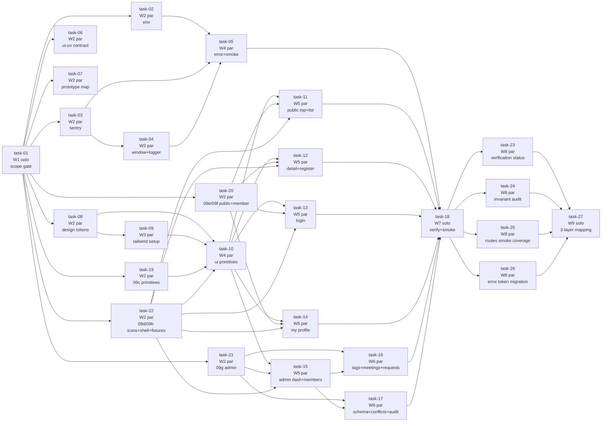

# 実行順 INDEX

ファイル名規約: `task-NN-w{wave}-{solo|par}-{name}.md`
- `wN`  : 実行 wave (W1〜W7)。**同じ wave 内のタスクは並列起動可**
- `solo`: その wave に他タスクがない（並列なし）
- `par` : 同 wave に並列 sibling あり

ディレクトリ番号 (01〜08) は **責務分類** であり、**実行順ではない**。

---

## task-01 完了状況（2026-05-07 反映）

W1 task-01 は以下の状態で W2 起動 gate を通過済み:

- 3 docs（`CLAUDE.md` / `specs/00-overview.md` / `SCOPE.md`）正本化完了
- diff scope contamination（5 dir 誤削除）解消済み: `_design/`, `02-application-implementation/`, `issue-348-09c-github-release-tag-automation/`, `issue-494-09a-A-exec-staging-smoke-runtime/`, `issue-497-post-release-dashboard-30day-conclusion/` を `docs/30-workflows/completed-tasks/` 配下へ archive
- diff scope 規律 / archive rule を `SCOPE.md §6` に明文化（task-02..22 共通遵守）

W2 以降の各 task は `SCOPE.md §6` の diff scope discipline を完了前に必ず検証する。

---

## task-06 完了状況（2026-05-07 反映 / implemented-local）

W2 task-06（ui-ux-contract-rewrite）は以下の状態で完了済み:

- `docs/00-getting-started-manual/specs/09-ui-ux.md` を契約のみへ全面書き換え（19+1 route entries / 13 primitives / feature components / login 5 状態 / server-pending / dialog・drawer・form・live region a11y / token prefix を正本化）
- 視覚詳細値・prototype 行範囲・token 値は 09a..09h と Storybook VRT へ委譲する役割分担を確定
- workflow package: `docs/30-workflows/completed-tasks/task-06-ui-ux-contract-rewrite/`（phase-01..13 outputs / artifacts.json / index.md / outputs）
- skill 反映: `.claude/skills/aiworkflow-requirements/changelog/20260507-task-06-ui-ux-contract-rewrite.md` および `references/lessons-learned-task-06-ui-ux-contract-rewrite-2026-05.md`
- diff scope: `specs/09-ui-ux.md` M + 上記 workflow / skill package A のみに固定（attendance 系 workflow の純削除混入は参照破壊として復元済）

W2 残（task-02, task-03, task-07, task-08, task-19, task-20, task-21, task-22）と並列継続可能。

---

## Wave 一覧（クリティカルパス）

| wave | 並列度 | タスク | 着手条件 |
|---|---|---|---|
| **W1** | solo | task-01 | 即着手可 |
| **W2** | ×9 | task-02, task-03, task-06, task-07, task-08, task-19, task-20, task-21, task-22 | W1 完了後 |
| **W3** | ×2 | task-04, task-09 | W2 のうち task-03 / task-08 完了後 |
| **W4** | ×2 | task-05, task-10 | W3 完了後（+ task-02 完了済） |
| **W5** | ×5 | task-11, task-12, task-13, task-14, task-15 | W4 の task-10 完了後 |
| **W6** | ×2 | task-16, task-17 | W5 の task-15（admin layout）完了後 |
| **W7** | solo | task-18 | W6 まで全完了後 |
| **W8** | ×4 | task-23, task-24, task-25, task-26 | task-01..22 完了後 |
| **W9** | solo | task-27 | W8 完了後 |

## W8 / W9 検証拡張（2026-05-14 反映）

| wave | 並列度 | タスク | 状態 |
|---|---|---|---|
| **W8** | par | task-23 verification status matrix | spec_created |
| **W8** | par | task-24 invariant audit | spec_created |
| **W8** | par | task-25 smoke coverage matrix | spec_created / docs-only / NON_VISUAL / verify_existing |
| **W8** | par | task-26 error.tsx token utility migration | spec_created |
| **W9** | solo | task-27 MVP 3-layer task mapping | spec_created |

task-25 main deliverable: `docs/30-workflows/completed-tasks/ui-prototype-alignment-mvp-recovery/SMOKE-COVERAGE-MATRIX.md`.

---

## 並列起動コマンド例

```text
# W2: 9 タスクを 9 worktree で並列起動
worktree-1 → task-02-w2-par-wrangler-env-injection.md
worktree-2 → task-03-w2-par-sentry-workers-sdk-unify.md
worktree-3 → task-06-w2-par-ui-ux-contract-rewrite.md
worktree-4 → task-07-w2-par-prototype-mapping-table.md
worktree-5 → task-08-w2-par-design-tokens-doc.md
worktree-6 → task-19-w2-par-primitives-full-spec.md
worktree-7 → task-20-w2-par-screen-blueprints-public-and-member.md
worktree-8 → task-21-w2-par-screen-blueprints-admin.md
worktree-9 → task-22-w2-par-shell-and-icons-and-fixtures.md

# W3: 2 タスク並列
worktree-1 → task-04-w3-par-window-guard-and-logger.md
worktree-2 → task-09-w3-par-tailwind-v4-setup.md

# W4: 2 タスク並列
worktree-1 → task-05-w4-par-error-boundary-and-staging-smoke.md
worktree-2 → task-10-w4-par-ui-primitives.md

# W5: 5 タスク並列
worktree-1 → task-11-w5-par-public-top-and-member-list.md
worktree-2 → task-12-w5-par-member-detail-register-legal.md
worktree-3 → task-13-w5-par-login-rebuild.md
worktree-4 → task-14-w5-par-my-profile-and-requests.md
worktree-5 → task-15-w5-par-admin-dashboard-and-members.md

# W6: 2 タスク並列
worktree-1 → task-16-w6-par-admin-tags-meetings-requests.md
worktree-2 → task-17-w6-par-admin-schema-conflicts-audit.md

# W7: solo
worktree-1 → task-18-w7-solo-verify-tokens-and-playwright-smoke.md

# W8: 4 タスク並列
worktree-1 → task-23-ui-mvp-w8-par-verification-status-matrix
worktree-2 → task-24-ui-mvp-w8-par-invariant-audit
worktree-3 → task-25-ui-mvp-w8-par-routes-smoke-coverage
worktree-4 → task-26-ui-mvp-w8-par-error-tsx-token-utility-migration

# W9: solo
worktree-1 → task-27-ui-mvp-w9-solo-mvp-3-layer-task-mapping
```

---

## DAG（mermaid）



---

## ディレクトリ番号 vs Wave 番号の対応

ディレクトリ番号は **責務分類** で、wave とは別軸です。混同しないように。

| dir | 含むタスク | 含む wave |
|---|---|---|
| 01-scope | task-01 | W1 |
| 02-runtime | task-02..05 | **W2 / W3 / W4 に分散** |
| 03-spec-source | task-06..08, task-19..22 | W2 |
| 04-design-system | task-09, 10 | W3, W4 |
| 05-screens-public | task-11, 12 | W5 |
| 06-screens-member | task-13, 14 | W5 |
| 07-screens-admin | task-15..17 | W5, W6 |
| 08-regression | task-18 | W7 |
| 09-w8-audit | task-23..26 | W8 |
| 10-w9-mapping | task-27 | W9 |

→ **「02-runtime を全部終えてから 03-spec-source」は誤り**。W2 で 02-runtime の task-02/03 と 03-spec-source の task-06/07/08 を**同時並列**で進めるのが最速。

---

## 直列実行を選ぶ場合

solo dev で worktree 並列運用が重い場合は、wave 順 + 番号順で直列実行しても問題ありません。

```text
task-01 → 02 → 03 → 06 → 07 → 08 → 19 → 20 → 21 → 22
       → 04 → 09
       → 05 → 10
       → 11 → 12 → 13 → 14 → 15
       → 16 → 17
       → 18
       → 23 → 24 → 25 → 26
       → 27
```

直列の場合は約 14 人日、最大並列の場合は約 6〜8 人日が見込みです。

---

## 各タスクの自己完結性

各 task ファイルの **§0. 自己完結コンテキスト** を読めば、`outputs/phase-1..3.md` を再度開かずに着手可能です。
phase-1..3.md は**ワークフロー設計者向けの上位文書**であり、実装時は task ファイル 1 枚で完結します。
