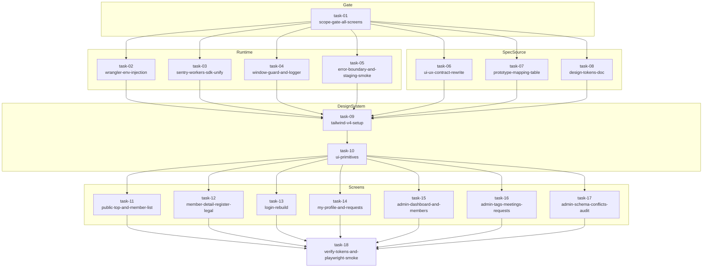

# Phase 2: 責務分解 / 18 タスク DAG / 並列マトリクス

> 改訂日: 2026-05-07
> 改訂理由: phase-1 で全画面（19 routes）スコープに拡張したことに伴い、責務 dir を 7 → 8、タスク数を 13 → 18 に再構成。
> CONST_007（単一実装サイクル完了原則）の妥当性を再見積もりし、~14 人日の根拠を明示。

---

## 1. 8 責務 dir × 18 タスク 一覧

| # | 責務 dir | task name | 主担当 | 主要 deliverable |
|---|---------|-----------|--------|-----------------|
| 01 | 01-scope | scope-gate-all-screens | PM/Tech Lead | 全 19 routes のスコープ確定書、API 接続マップ承認 |
| 02 | 02-runtime | wrangler-env-injection | Platform | `wrangler.toml` の env binding 整理、`apps/web` ↔ `apps/api` 接続環境変数 |
| 03 | 02-runtime | sentry-workers-sdk-unify | Platform | `@sentry/cloudflare` と Browser SDK の二重初期化排除、共通 instrumentation |
| 04 | 02-runtime | window-guard-and-logger | Platform | SSR-safe `window` 参照、共通 logger（client / worker 両対応） |
| 05 | 02-runtime | error-boundary-and-staging-smoke | Platform | App Router `error.tsx` / global error boundary、staging smoke チェックリスト |
| 06 | 03-spec-source | ui-ux-contract-rewrite | Tech Writer | UI/UX 契約書（19 routes 全網羅・状態表・遷移図） |
| 07 | 03-spec-source | prototype-mapping-table | Tech Writer | プロトタイプ部品 → 本番 component マッピング表 |
| 08 | 03-spec-source | design-tokens-doc | Designer | OKLch tokens 一覧 / fallback 戦略 / dark-mode 拡張余地 |
| 09 | 04-design-system | tailwind-v4-setup | Frontend | Tailwind v4 `@theme` 設定、PostCSS / `globals.css` 整備 |
| 10 | 04-design-system | ui-primitives | Frontend | Card / Button / Badge / Input / Select / Table / Tabs / Sidebar / Toast / Skeleton / DataTable / EmptyState / ErrorState |
| 11 | 05-screens-public | public-top-and-member-list | Frontend | `/` + `/(public)/members` |
| 12 | 05-screens-public | member-detail-register-legal | Frontend | `/(public)/members/[id]` + `/(public)/register` + `/privacy` + `/terms` |
| 13 | 06-screens-member | login-rebuild | Frontend | `/login` 5 状態（input / sent / unregistered / deleted / error） |
| 14 | 06-screens-member | my-profile-and-requests | Frontend | `/profile` 公開状態バナー + 公開範囲サマリ + 申請パネル + 削除申請 |
| 15 | 07-screens-admin | admin-dashboard-and-members | Frontend | `/(admin)/admin` + `/(admin)/admin/members` |
| 16 | 07-screens-admin | admin-tags-meetings-requests | Frontend | `/(admin)/admin/tags` + `/(admin)/admin/meetings` + `/(admin)/admin/requests` |
| 17 | 07-screens-admin | admin-schema-conflicts-audit | Frontend | `/(admin)/admin/schema` + `/(admin)/admin/identity-conflicts` + `/(admin)/admin/audit` |
| 18 | 08-regression | verify-tokens-and-playwright-smoke | QA | `verify-design-tokens` CI gate + Playwright smoke 19 routes |

---

## 2. 責務 dir の境界規律

| 責務 dir | 触ってよい場所 | 触ってはいけない場所 |
|---------|---------------|---------------------|
| 01-scope | docs のみ | code 一切 |
| 02-runtime | `apps/web/src/instrumentation*`, `apps/web/wrangler.toml`, `apps/web/src/lib/logger.ts`, app-level `error.tsx` | UI primitive / 画面 component |
| 03-spec-source | docs のみ（`docs/30-workflows/ui-prototype-alignment-mvp-recovery/specs/` 配下） | code 一切 |
| 04-design-system | `apps/web/src/styles/`, `apps/web/src/components/ui/`, Tailwind config | 画面 component / API 接続層 |
| 05-screens-public | `apps/web/src/app/(public)/**`, `apps/web/src/app/page.tsx`, `apps/web/src/app/privacy/**`, `apps/web/src/app/terms/**` | UI primitive 本体（参照のみ）、admin |
| 06-screens-member | `apps/web/src/app/login/**`, `apps/web/src/app/profile/**` | admin / public 本体 |
| 07-screens-admin | `apps/web/src/app/(admin)/admin/**` | public / member 本体 |
| 08-regression | `apps/web/scripts/verify-design-tokens.ts`, `e2e/**`, `.github/workflows/verify-design-tokens.yml` | 画面 / primitive 本体（呼び出すだけ） |

---

## 3. 依存関係 DAG



### 3.1 Critical Path

`task-01 → task-09 → task-10 → task-{11..17} → task-18`

primitives（task-10）が全画面の単一依存点になる。task-10 が遅れると全画面が止まるため、最優先で確定する。

### 3.2 Soft Dependency（推奨先後）

- task-06（UI/UX 契約）が task-09 / task-10 より早く確定していると、primitive の API 設計（props naming）が画面側の期待に整合しやすい。DAG では task-06 → task-09 を hard 依存にしているが、実運用では 06 と 07-08 を並列で進めるのが効率的。
- task-03（Sentry unify）と task-04（window guard）は逆順でも動くが、03 を先に解決すると 04 の logger 実装で sentry hook を組み込める。

---

## 4. 並列実行マトリクス

### 4.1 wave 別並列性

| wave | 並列実行可能タスク | 競合領域 | 備考 |
|------|------------------|---------|------|
| W1 | task-01 | — | 単独実行（gate） |
| W2 | task-02 / task-03 / task-04 / task-05 / task-06 / task-07 / task-08 | wrangler.toml と instrumentation で task-02/03 が部分競合する程度 | docs 系 (06-08) と runtime 系 (02-05) は完全独立 |
| W3 | task-09 | — | Tailwind v4 + tokens 集約。primitives の前提なので単独 wave に切る |
| W4 | task-10 | — | primitives 単独 wave |
| W5 | task-11 / task-12 / task-13 / task-14 / task-15 / task-16 / task-17 | `apps/web/src/app/layout.tsx`、共通ヘッダー / フッター、共通 fetch util | 各画面 dir 内は完全独立、共通 layout だけ task-11 か task-15 のいずれかで先行確定する |
| W6 | task-18 | — | 全画面完成後の regression |

### 4.2 担当者割り当て例（仮）

| 担当 | wave 別タスク |
|------|--------------|
| Platform 1 | W2: task-02, task-03, task-04, task-05 |
| Designer/Writer | W2: task-06, task-07, task-08 |
| Frontend 1 | W3-W4: task-09, task-10 / W5: task-11, task-12 |
| Frontend 2 | W5: task-13, task-14 |
| Frontend 3 | W5: task-15, task-16, task-17 |
| QA | W6: task-18 |

solo 開発の場合は 1 名で wave 順に直列実行。

### 4.3 競合ファイル早見表

| ファイル | 触れる task | 解決方針 |
|---------|------------|---------|
| `apps/web/wrangler.toml` | task-02, task-03 | task-02 が先、task-03 は env のみ追記 |
| `apps/web/src/instrumentation.ts` | task-03, task-04 | task-03 で sentry init、task-04 は別ファイル `lib/logger.ts` に |
| `apps/web/src/app/layout.tsx` | task-11..17 のいずれか | W5 開始時に task-11 が確定してから他は import のみ |
| `apps/web/src/components/ui/index.ts` | task-10 のみ | W4 終了後は基本 read-only |
| `apps/web/src/styles/globals.css` | task-09 のみ | W3 終了後は基本 read-only |

---

## 5. CONST_007: 単一実装サイクル妥当性

### 5.1 結論

本ワークフローは**単一実装サイクル（~14 人日 / 約 2.5〜3 週間）で完了する見込み**である。

### 5.2 工数見積（タスク別）

| # | task | 見積 (人日) | 内訳 |
|---|------|-----------|------|
| 01 | scope-gate-all-screens | 0.25 | docs 確定、stakeholder 同期 |
| 02 | wrangler-env-injection | 0.5 | env binding 整理、staging 反映確認 |
| 03 | sentry-workers-sdk-unify | 0.75 | 二重初期化排除、event 整合確認 |
| 04 | window-guard-and-logger | 0.5 | lint rule + logger 実装 |
| 05 | error-boundary-and-staging-smoke | 0.5 | error.tsx + smoke checklist |
| 06 | ui-ux-contract-rewrite | 1.0 | 19 routes × 状態表、遷移図 |
| 07 | prototype-mapping-table | 0.5 | mapping 表作成 |
| 08 | design-tokens-doc | 0.5 | tokens 一覧 + fallback |
| 09 | tailwind-v4-setup | 0.5 | `@theme` 設定、PostCSS |
| 10 | ui-primitives | 1.5 | 13 primitive、ストーリー的 demo |
| 11 | public-top-and-member-list | 1.0 | Hero/Stats/Zone/Timeline + 一覧 |
| 12 | member-detail-register-legal | 0.75 | 詳細 + register リダイレクト + legal 2 枚 |
| 13 | login-rebuild | 1.0 | 5 状態 |
| 14 | my-profile-and-requests | 1.0 | 4 領域 |
| 15 | admin-dashboard-and-members | 1.25 | KPI + chart + DataTable + drawer |
| 16 | admin-tags-meetings-requests | 1.25 | 3 画面 × queue/CRUD |
| 17 | admin-schema-conflicts-audit | 1.25 | 3 画面 × diff/compare/timeline |
| 18 | verify-tokens-and-playwright-smoke | 0.5 | CI gate + smoke 実装 |
| **合計** | — | **~13.75 人日** | バッファ 0.25 を含めて **~14 人日** |

### 5.3 単一サイクル妥当性の根拠

CONST_007 が要求する「単一実装サイクルで完了」の判定根拠:

1. **依存グラフが直線的**: critical path が `T01 → T09 → T10 → 画面群 → T18` と明確で、循環依存・差し戻しループが発生する余地が小さい。
2. **API 変更を伴わない**: 既存 `apps/api/` をそのまま接続するだけなので、フロントとバックの相互依存による反復が発生しない（phase-1 §1.2 非ゴール）。
3. **primitives 集中**: 13 primitive を W4 で一括確定するため、後段の画面実装は組み立て作業に純化される。「primitive を直しに戻る」反復が抑制される。
4. **デザイン仕様が固定**: プロトタイプ + tokens 文書（task-08）で見た目の正解が pin される。実装中に「色を全部直す」のような全画面巻き戻しが発生しない。
5. **regression が末尾 1 タスク**: 検証を task-18 に集約し、画面実装中の手戻りを最小化。CI gate で fail した場合のみピンポイント修正となる。
6. **人日換算で 14 人日 ≦ 単一サイクル上限の典型値（4 週間 = 20 人日）**: バッファを差し引いても余裕があり、追加のサイクル分割は不要。

### 5.4 サイクルが破綻する条件（早期警戒）

以下が発生した場合は CONST_007 違反として再分割を検討する:

- 既存 API endpoint の response shape が phase-1 §3 の想定と大きく異なり、UI adapter で吸収しきれない（→ 別 workflow で API 側修正）
- primitives（task-10）の確定が 2 人日を超過する（→ 画面群 wave への着手が大幅遅延）
- `verify-design-tokens` の検出 false-positive が大量発生（→ 検証ロジックを別 workflow で再設計）

---

## 6. 18 タスク × 8 責務 dir マッピング再掲

```
docs/30-workflows/ui-prototype-alignment-mvp-recovery/tasks/
├── 01-scope/
│   └── 01-scope-gate-all-screens/
├── 02-runtime/
│   ├── 02-wrangler-env-injection/
│   ├── 03-sentry-workers-sdk-unify/
│   ├── 04-window-guard-and-logger/
│   └── 05-error-boundary-and-staging-smoke/
├── 03-spec-source/
│   ├── 06-ui-ux-contract-rewrite/
│   ├── 07-prototype-mapping-table/
│   └── 08-design-tokens-doc/
├── 04-design-system/
│   ├── 09-tailwind-v4-setup/
│   └── 10-ui-primitives/
├── 05-screens-public/
│   ├── 11-public-top-and-member-list/
│   └── 12-member-detail-register-legal/
├── 06-screens-member/
│   ├── 13-login-rebuild/
│   └── 14-my-profile-and-requests/
├── 07-screens-admin/
│   ├── 15-admin-dashboard-and-members/
│   ├── 16-admin-tags-meetings-requests/
│   └── 17-admin-schema-conflicts-audit/
└── 08-regression/
    └── 18-verify-tokens-and-playwright-smoke/
```

---

## 7. 受け入れチェックリスト（phase-2 として）

- [ ] 18 タスクすべてに dir / name / 主担当 / 主要 deliverable が割り当てられている
- [ ] DAG mermaid 図が描画可能（render-check）
- [ ] critical path が `T01 → T09 → T10 → 画面群 → T18` で書かれている
- [ ] 並列実行可能なタスク群（W2, W5）が明示されている
- [ ] 工数見積合計が 14 人日前後で、CONST_007 妥当性根拠が記述されている
- [ ] 競合ファイル早見表が存在し、merge 競合の予防策が示されている

---

## 8. 次フェーズ参照

- phase-3: 18 タスク × 想定変更ファイル俯瞰、画面 → API endpoint 詳細マッピング、プロトタイプ未掲載画面の設計指針、各 task の差分 hint
