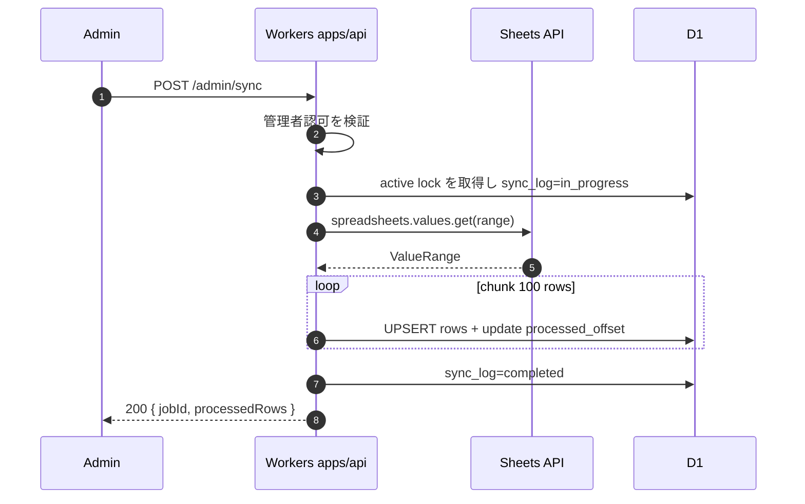
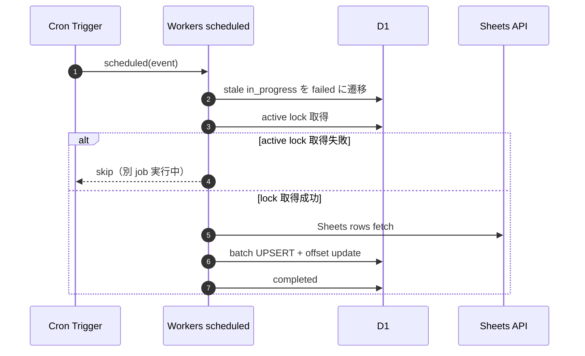
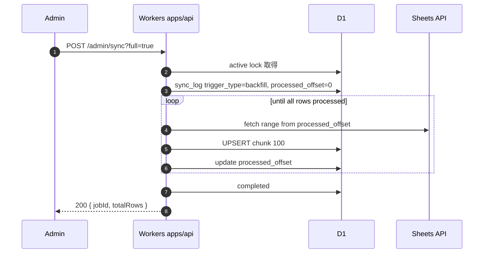
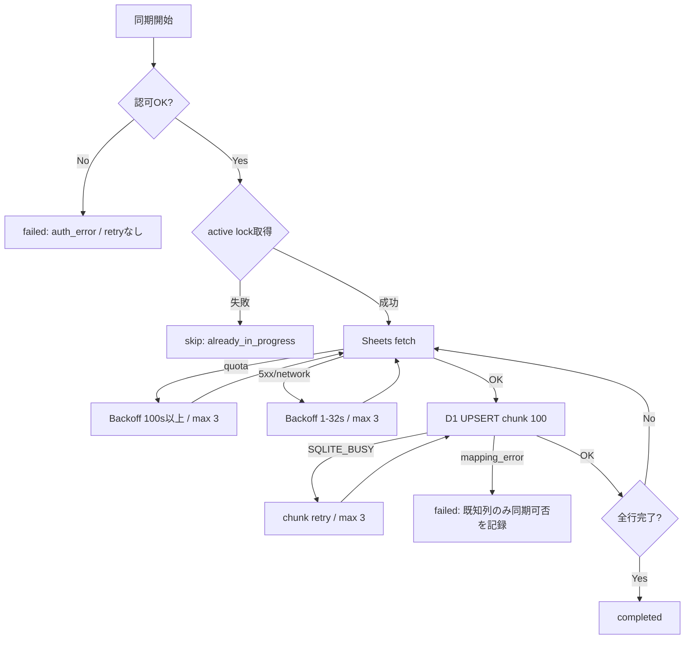
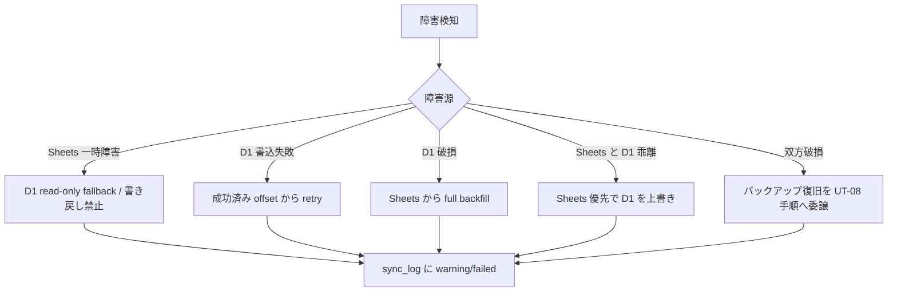

# Phase 2 成果物: 同期フロー図

> **ステータス**: completed-design
> 手動同期 / 定期同期 / バックフィル / エラー処理 / ロールバック判断の正本。

## 1. フロー一覧

| # | フロー | トリガー | 主体 | 失敗時 |
| --- | --- | --- | --- | --- |
| 1 | 手動同期 | 管理者が `POST /admin/sync` | Workers (`apps/api`) | `sync_log.failed` に記録して 4xx/5xx を返す |
| 2 | 定期同期 | Cron Triggers `0 */6 * * *` | Workers scheduled handler | failed log を残し次回 tick で再開 |
| 3 | バックフィル | 管理者が `POST /admin/sync?full=true` | Workers (`apps/api`) | `processed_offset` から再開 |

## 2. フロー図 1: 手動同期

エラーパス:

- 401/403: `auth_error` として `failed` に記録し、再試行しない。
- Sheets 5xx / network: 最大 3 回 retry、Backoff 1s→2s→4s→8s→16s→32s。
- quota exceeded: 100 秒以上待機して retry。上限到達時は `quota_exhausted`。
- D1 `SQLITE_BUSY`: chunk 単位で retry。成功済み offset は戻さない。

## 3. フロー図 2: 定期同期（Cron）

## 4. フロー図 3: バックフィル

## 5. エラーパス共通図

## 6. ロールバック判断フローチャート

## 7. UT-09 実装入力チェックリスト

| 項目 | 確定値 |
| --- | --- |
| 採択方式 | Workers Cron Triggers 定期 pull |
| 手動同期 | `POST /admin/sync` |
| バックフィル | `POST /admin/sync?full=true` |
| cron 初期値 | `0 */6 * * *` |
| batch size | 100 行 |
| retry / backoff | 最大 3 回、1s→32s 上限。quota は 100 秒以上待機 |
| SoT | Sheets 優先 / D1 は反映先 |
| open question | 0 件。staging 調整は値変更タスクであり、方式未決ではない |
