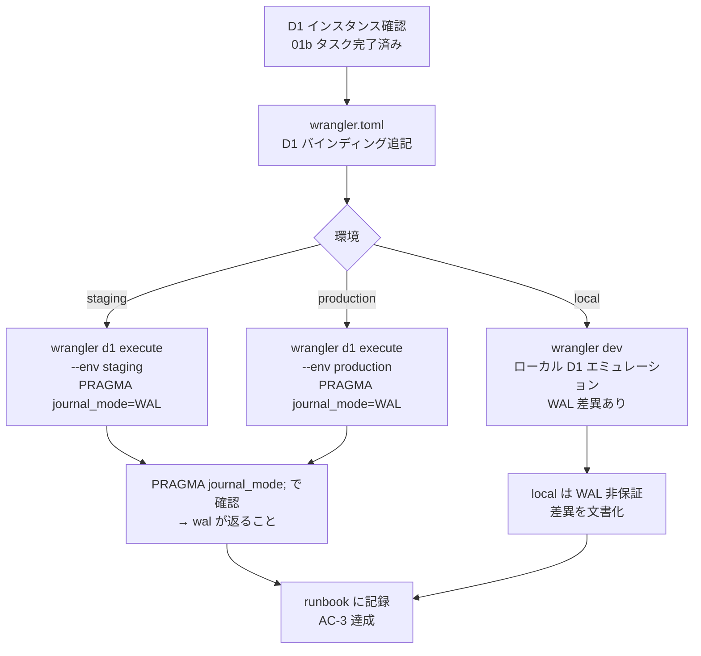

# Phase 2: 設計

## メタ情報

| 項目 | 値 |
| --- | --- |
| タスク名 | D1 WAL mode 設定 (UT-02) |
| Phase 番号 | 2 / 13 |
| Phase 名称 | 設計 |
| 作成日 | 2026-04-26 |
| 前 Phase | 1 (要件定義) |
| 次 Phase | 3 (設計レビュー) |
| 状態 | spec_created |

## 目的

`wrangler.toml` D1 バインディング設計・PRAGMA 実行手順・環境別 WAL mode 差異マトリクスを確定し、Phase 5 のセットアップ実行に必要な設計根拠を固める。

## 実行タスク

- `wrangler.toml` の D1 バインディング設計を行う
- `PRAGMA journal_mode=WAL` 実行手順を設計する
- 環境別（local / staging / production）WAL mode 差異を明確化する
- Mermaid 設計図を作成する
- dependency matrix を作成する

## 参照資料

| 種別 | パス | 用途 |
| --- | --- | --- |
| 必須 | .claude/skills/aiworkflow-requirements/references/deployment-cloudflare.md | D1 binding 設定例・wrangler コマンド |
| 必須 | docs/ut-02-d1-wal-mode/phase-01.md | Phase 1 の AC・スコープ |
| 必須 | docs/ut-02-d1-wal-mode/index.md | タスク概要・依存関係 |
| 参考 | docs/completed-tasks/02-serial-monorepo-runtime-foundation/index.md | 組み込み先タスク |

## 実行手順

### ステップ 1: wrangler.toml D1 バインディング設計

- `apps/api/wrangler.toml` の `[[d1_databases]]` セクション設計
- staging 環境と production 環境の D1 database_id のプレースホルダー設計
- WAL mode 設定根拠コメントの文言を確定する

### ステップ 2: PRAGMA 実行手順設計

- staging / production 各環境への `wrangler d1 execute` コマンドを設計する
- 実行確認クエリ（`PRAGMA journal_mode;`）を設計する
- ローカル環境での動作確認手順を設計する

### ステップ 3: 環境別差異マトリクスと Mermaid 図の作成

- local / staging / production の WAL mode 差異を表形式で整理する
- WAL mode 設定フローを Mermaid で図示する
- dependency matrix を作成する

## 統合テスト連携

| 連携先 Phase | 連携内容 |
| --- | --- |
| Phase 3 | 本 Phase の設計を設計レビューの入力として使用 |
| Phase 4 | verify suite の対象コマンドを本 Phase の設計から取得 |
| Phase 5 | 本 Phase の手順設計を実行の根拠とする |

## 多角的チェック観点（AIが判断）

- 価値性: wrangler.toml の設計が AC-1 を直接満たす構造になっているか
- 実現性: PRAGMA 実行コマンドが wrangler@3.x で動作することを前提にしているか
- 整合性: local / staging / production 差異が env 差異マトリクスに全て記載されているか
- 運用性: 設計に rollback 手順（WAL → DELETE mode への戻し方）が含まれているか

## サブタスク管理

| # | サブタスク | 担当 Phase | 状態 | 備考 |
| --- | --- | --- | --- | --- |
| 1 | D1 バインディング設計 | 2 | spec_created | apps/api/wrangler.toml 対象 |
| 2 | PRAGMA 実行手順設計 | 2 | spec_created | staging / production 両環境 |
| 3 | env 差異マトリクス作成 | 2 | spec_created | local / staging / production |
| 4 | Mermaid 設計図作成 | 2 | spec_created | WAL mode 設定フロー |
| 5 | dependency matrix 作成 | 2 | spec_created | 上流・下流タスクとの依存 |

## 成果物

| 種別 | パス | 説明 |
| --- | --- | --- |
| ドキュメント | outputs/phase-02/wal-mode-design.md | WAL mode 設計・設定根拠 |
| ドキュメント | outputs/phase-02/env-diff-matrix.md | 環境別 WAL mode 差異マトリクス |
| メタ | artifacts.json | Phase 状態と outputs の記録 |

## 完了条件

- [ ] wrangler.toml D1 バインディング設計が完成している
- PRAGMA 実行手順が staging / production 両環境分記載されている
- env 差異マトリクスが作成されている
- Mermaid 設計図が作成されている
- dependency matrix が作成されている

## タスク100%実行確認【必須】

- 全実行タスクが completed
- 全成果物が指定パスに配置済み
- 全完了条件にチェック
- 異常系（WAL 非対応 wrangler バージョン・local エミュレーション差異）も設計に含まれているか確認
- 次 Phase への引き継ぎ事項を記述
- artifacts.json の該当 phase を completed に更新

## 次 Phase

- 次: 3 (設計レビュー)
- 引き継ぎ事項: wrangler.toml 設計・PRAGMA 実行手順・env 差異マトリクス・Mermaid 図を設計レビューに渡す
- ブロック条件: 本 Phase の主成果物が未作成なら次 Phase に進まない

## Mermaid 設計図

### WAL mode 設定フロー

### 環境別 WAL mode 差異マトリクス

| 環境 | WAL mode 設定方法 | 確認コマンド | 備考 |
| --- | --- | --- | --- |
| local (wrangler dev) | 自動（SQLite ファイルのデフォルト設定に依存） | `wrangler d1 execute --local DB --command "PRAGMA journal_mode;"` | WAL が保証されない場合あり |
| staging | `wrangler d1 execute --env staging DB --command "PRAGMA journal_mode=WAL;"` | `wrangler d1 execute --env staging DB --command "PRAGMA journal_mode;"` | wrangler@3.x 必須 |
| production | `wrangler d1 execute --env production DB --command "PRAGMA journal_mode=WAL;"` | `wrangler d1 execute --env production DB --command "PRAGMA journal_mode;"` | wrangler@3.x 必須 |

### dependency matrix

| タスク | 種別 | 依存内容 | Phase |
| --- | --- | --- | --- |
| 01b-parallel-cloudflare-base-bootstrap | 上流 | D1 database_id の確定 | 本 Phase 開始前に必要 |
| 02-serial-monorepo-runtime-foundation | 親 | 本タスクを Phase 5 に組み込む | 並行して進行 |
| UT-01 (Sheets→D1 同期方式定義) | 下流 | D1 競合対策の公式サポート確認結果を同期フロー設計へ渡す | 本 Phase 完了後 |
| UT-04 (D1 スキーマ設計) | 下流 | D1 競合対策方針を前提にスキーマ設計 | 本 Phase 完了後 |
| UT-09 (Sheets→D1 同期ジョブ実装) | 下流 | WAL 非対応時の runtime mitigation を同期ジョブ側で実装 | 本 Phase 完了後 |
