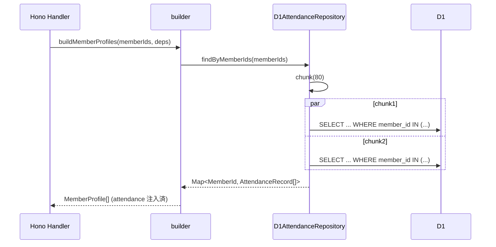

# Phase 2: 設計

## メタ情報

| 項目 | 値 |
| --- | --- |
| Phase 番号 | 2 / 13 |
| Phase 名称 | 設計 |
| 前 Phase | 1 (要件定義) |
| 次 Phase | 3 (設計レビュー) |
| 状態 | completed |

## 目的

AC-1〜10 を充足する具体的な repository contract / builder 注入方式 / branded type module / chunk 戦略 / Schema Ownership を設計し、Phase 3 レビュー gate へ渡す。

## 設計対象

### 2.1 Repository Contract

```ts
// apps/api/src/repository/attendance.ts
export interface AttendanceProvider {
  findByMemberIds(ids: ReadonlyArray<MemberId>):
    Promise<ReadonlyMap<MemberId, ReadonlyArray<AttendanceRecord>>>;
}

export class D1AttendanceRepository implements AttendanceProvider {
  constructor(private readonly db: D1Database) {}
  async findByMemberIds(ids) { /* IN (?,?,...) batch + chunk */ }
}
```

- 戻り値は `Map<MemberId, AttendanceRecord[]>`。entry 不在 = attendance 0 件
- ソート順: meeting `held_on` 降順（新しい順）。tie-break は `session_id` 昇順
- `meeting_sessions` に存在しない record は INNER JOIN で除外

### 2.2 Builder 注入方式

- `apps/api/src/repository/_shared/builder.ts` に optional `attendanceProvider?: AttendanceProvider` を追加
- 未注入時は空配列フォールバック（既存呼び出し互換）。route 側の注入テストで完了条件を担保する
- 単一 member 構築でも複数 member 構築でも、最終的に 1 回の `findByMemberIds` でまとめて解決
- 注入は呼び出し側（ルートハンドラ / service 層）の責務

### 2.3 Branded Type Module

```ts
// apps/api/src/repository/_shared/branded-types/meeting.ts (新設)
export type MeetingSessionId = Brand<string, 'MeetingSessionId'>;
export type AttendanceRecordId = Brand<string, 'AttendanceRecordId'>;

export const toMeetingSessionId = (raw: string): MeetingSessionId => /* ... */;
export const toAttendanceRecordId = (raw: string): AttendanceRecordId => /* ... */;
```

- 既存 `member.ts` / `response.ts` の `MemberId` / `ResponseId` には触らない
- 新規 module は import 単独で利用可能

### 2.4 Chunk 戦略

- 既定 chunk size: **80 件**（D1 / SQLite 100 bind 上限の安全側余裕）
- `Promise.all` で並列実行
- 結果を 1 つの Map にマージ（重複キーなし前提）
- chunk size は constant export し、テストから上書き可能に

### 2.5 Schema Ownership 宣言

| 範囲 | 編集権 | 衝突時の調停 |
| --- | --- | --- |
| `apps/api/src/repository/attendance/**` | 本タスク | — |
| `apps/api/src/repository/_shared/branded-types/meeting.ts` | 本タスク | — |
| `apps/api/src/repository/_shared/builder.ts` の attendance 注入箇所 | 本タスク | 02a 完了済み identity / status / response 部は不変 |
| `apps/api/migrations/*.sql` | 02b 優先 | 不足カラム発見時は 02b へ schema diff PR 起票後待機 |
| `_shared/types/AttendanceRecord` | 02a 確定済み | 拡張不可（02a 契約保護） |

## 設計図

### attendance read 経路



## 完了条件

- [ ] repository-contract.md に interface / 戻り値仕様 / sort order / soft-delete 除外を確定
- [ ] branded-type-module.md に module path / 既存型との非干渉性を記述
- [x] builder-injection-design.md に optional 引数 / フォールバック方針を記述
- [ ] schema-ownership.md に編集権マトリクスを記述
- [ ] Phase 3 への open alternative（ctx 注入案 / DI container 案）の比較材料

## 成果物

| 種別 | パス | 説明 |
| --- | --- | --- |
| ドキュメント | outputs/phase-02/main.md | Phase 2 主成果物 |
| 設計 | outputs/phase-02/repository-contract.md | repository interface |
| 設計 | outputs/phase-02/branded-type-module.md | 新規 branded type 配置 |
| 設計 | outputs/phase-02/builder-injection-design.md | builder 注入方式 |
| 設計 | outputs/phase-02/schema-ownership.md | Ownership 宣言 |

## タスク100%実行確認【必須】

- [ ] 全実行タスク completed
- [ ] 全成果物配置済み
- [ ] 完了条件すべてチェック
- [ ] 異常系（chunk 0 件 / null member）の挙動を仕様に明記
- [ ] artifacts.json の phase 2 を completed

## 次 Phase

- 次: Phase 3 (設計レビュー)
- 引き継ぎ: 4 設計成果物 + alternative 候補（ctx 注入 / DI container）

## 実行タスク

- [ ] Phase 固有の成果物を作成する
- [ ] 完了条件と次 Phase への引き継ぎを確認する
- [ ] artifacts.json の該当 Phase status を実行時に更新する

## 参照資料

| 種別 | パス | 用途 |
| --- | --- | --- |
| 必須 | docs/30-workflows/ut-02a-attendance-profile-integration/index.md | workflow 全体仕様 |
| 必須 | docs/30-workflows/ut-02a-attendance-profile-integration/artifacts.json | Phase status / outputs 契約 |
| 必須 | docs/30-workflows/completed-tasks/UT-02A-ATTENDANCE-PROFILE-INTEGRATION.md | legacy source / Canonical Status |

## 統合テスト連携

| 連携先 | 内容 |
| --- | --- |
| Phase 4 | AC と test matrix の対応を維持 |
| Phase 9 | typecheck / lint / build / regression gate に接続 |
| Phase 11 | NON_VISUAL runtime evidence に接続 |
| Phase 12 | system spec sync と compliance check に接続 |
