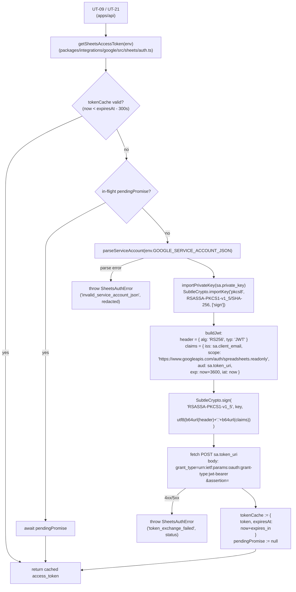

# Phase 2 成果物 — 設計 (UT-03 Sheets API 認証方式設定)

## 1. 認証方式の比較評価表

| 軸 | Service Account JSON key | OAuth 2.0 (offline access) |
| --- | --- | --- |
| 想定主体 | サーバー間通信（Cloudflare Workers → Sheets API） | エンドユーザー操作前提（同意フロー必須） |
| 認証ステップ | (1) JWT 署名 → (2) token 交換（2 段、TTL 1h） | (1) authorize → (2) token 交換 → (3) refresh_token 永続化 → (4) 期限ごとに refresh（4 段） |
| 必要 Secret | `GOOGLE_SERVICE_ACCOUNT_JSON`（1 値） | `client_id` + `client_secret` + `refresh_token`（3 値、`refresh_token` は永続化必須） |
| Workers 互換 | Web Crypto API のみで完結（Node API 非依存） | refresh_token を D1 / KV に保存する追加設計が必要 |
| 失効リスク | private_key ローテーション時のみ（数年単位） | refresh_token は Google 側で 6 ヶ月無使用 / 同意撤回で失効。再同意 UI が必要 |
| 適用領域 | 無人 Cron / scheduled / API server | エンドユーザーログイン |
| MVP 整合 | ◎（運用ゼロ） | ×（同意 UI を別途構築する必要） |
| 不変条件 #5 整合 | ◎（D1 を触らない） | △（refresh_token を D1 / KV に保存する場合は分離設計が必要） |
| Cloudflare 無料枠 | ◎（追加ストレージ不要） | △（KV / D1 storage を消費） |
| 採択 | ◎ 採択 | × 却下（Phase 3 alternatives.md で詳細） |

## 2. 採択方式の理由（Service Account JSON key）

1. **無人実行に最適**: Cron Triggers / scheduled handler 経由の同期ジョブはユーザー操作が無い。Service Account は JWT 自己署名で完結し、再同意フローが不要。
2. **Workers Edge Runtime 互換**: JWT 生成は Web Crypto API（`SubtleCrypto.importKey('pkcs8', ...)` + `sign('RSASSA-PKCS1-v1_5')`）のみで実装可能。Node API 依存ライブラリ（`google-auth-library`、`googleapis` 等）は不要。
3. **Secret 管理の単純さ**: 1 値の JSON 文字列を Cloudflare Secrets に置くだけで済み、refresh_token のような可変・永続データを保持しない。漏洩面積が小さい。
4. **CLAUDE.md 不変条件 #5 と整合**: D1 を触らない util として `packages/integrations/google` 内に閉じ、`apps/api` の D1 アクセス境界を侵さない。
5. **無料枠維持**: KV / D1 を消費しない（OAuth 2.0 は refresh_token 永続化用途で使う設計が増える）。
6. **将来移行時のコスト**: 仮にユーザー個別認証が必要になった場合は別系統（Auth.js + Google OAuth）として並列で導入できる。Service Account 採択は将来の選択肢を狭めない。

## 3. Web Crypto API による JWT 署名フロー



### 擬似 TypeScript signature

```ts
// packages/integrations/google/src/sheets/auth.ts
export type SheetsAuthEnv = { GOOGLE_SERVICE_ACCOUNT_JSON: string };

let tokenCache: { token: string; expiresAt: number } | null = null;
let pendingPromise: Promise<{ accessToken: string; expiresAt: number }> | null = null;

export async function getSheetsAccessToken(env: SheetsAuthEnv): Promise<{ accessToken: string; expiresAt: number }>;

// 内部
type ServiceAccount = { client_email: string; private_key: string; token_uri: string };
function parseServiceAccount(raw: string): ServiceAccount;
async function importPrivateKey(pem: string): Promise<CryptoKey>;
function buildJwt(sa: ServiceAccount, scopes: string, now: number): string; // unsigned canonical
async function signJwt(key: CryptoKey, unsigned: string): Promise<string>;
async function exchangeJwtForAccessToken(jwt: string, tokenUri: string): Promise<{ access_token: string; expires_in: number }>;

export class SheetsAuthError extends Error {
  constructor(public code: 'invalid_service_account_json' | 'token_exchange_failed' | 'web_crypto_unsupported', message: string);
}
```

## 4. トークンキャッシュ設計

| 項目 | 値 |
| --- | --- |
| 保存先 | Workers isolate 内 module スコープ変数（in-memory） |
| TTL | token endpoint の `expires_in` に準拠。再取得は失効 5 分前に開始 |
| 共有範囲 | 同一 isolate のみ（scale-out 時は isolate ごとに独立取得 → token endpoint コールが isolate 数に比例。月数十〜百回程度に収まる想定） |
| 失効判定 | `Date.now() < tokenCache.expiresAt - 100_000ms` を満たす時のみ cache hit |
| 永続化 | しない（KV / D1 不使用） |
| 並行制御 | `pendingPromise` による in-flight de-dup。同一 isolate 内で複数 caller が同時に miss しても token 交換は 1 回のみ実行 |
| 監査 | hit / miss / refresh を `console.log({ event: 'sheets_auth.cache', status: 'hit'\|'miss'\|'refresh' })` で構造化ログ（token 値は出力しない） |

## 5. `packages/integrations/google` モジュール構成

| # | 要素 | パス | 公開度 | 入力 | 出力 / 副作用 |
| --- | --- | --- | --- | --- | --- |
| 1 | `getSheetsAccessToken` | `packages/integrations/google/src/sheets/auth.ts` | public | `env: SheetsAuthEnv` | `Promise<{ accessToken: string; expiresAt: number }>` / `tokenCache` 更新 |
| 2 | `SheetsAuthEnv` | 同上 | public type | - | binding 型 |
| 3 | `SheetsAuthError` | 同上 | public class | code, message | throw 用 |
| 4 | `parseServiceAccount` | 同上 | internal | raw JSON 文字列 | `{client_email, private_key, token_uri}` / parse 失敗時 throw |
| 5 | `importPrivateKey` | 同上 | internal | PEM 文字列 | `CryptoKey` |
| 6 | `buildJwt` | 同上 | internal | SA + scopes + now | unsigned canonical string |
| 7 | `signJwt` | 同上 | internal | CryptoKey + unsigned | b64url 署名済 JWT |
| 8 | `exchangeJwtForAccessToken` | 同上 | internal | JWT + token_uri | `{access_token, expires_in}` / 4xx-5xx 時 throw |
| 9 | エクスポート集約 | `packages/integrations/google/index.ts` | public | - | `getSheetsAccessToken`, `SheetsAuthEnv`, `SheetsAuthError` 再エクスポート |

> UT-09 / UT-21 は `@ubm-hyogo/integrations-google` の `sheets` namespace export 経由で import する。`packages/integrations/google/src/sheets/auth.ts` への直接 import は禁止（同 package のテスト除く）。

## 6. シークレット管理マトリクス

| Secret / Asset | 種別 | dev | staging | production | 注入経路 | 1Password Vault 参照 |
| --- | --- | --- | --- | --- | --- | --- |
| `GOOGLE_SERVICE_ACCOUNT_JSON` | Cloudflare Secret | required | required | required | `bash scripts/cf.sh secret put GOOGLE_SERVICE_ACCOUNT_JSON --config apps/api/wrangler.toml --env <env>` | `op://UBM-Hyogo/<env>/GOOGLE_SERVICE_ACCOUNT_JSON` |
| `.dev.vars` (local 開発) | local file | `GOOGLE_SERVICE_ACCOUNT_JSON=op://UBM-Hyogo/dev/GOOGLE_SERVICE_ACCOUNT_JSON` | n/a | n/a | `bash scripts/with-env.sh -- pnpm --filter @ubm/api dev`（`op run --env-file=.dev.vars` で動的注入） | 同上 |
| `.gitignore` ガード | repo file | `.dev.vars` を除外（既存確認 + 二重チェック） | - | - | repo root | - |
| Sheets 共有設定 | Google Drive ACL | dev sheet | staging sheet | prod sheet | Service Account メール（`xxx@<project>.iam.gserviceaccount.com`）を「閲覧者」（readonly スコープなら閲覧で足りる）として共有 | - |
| `wrangler.toml` `[vars]` | repo config | - | - | - | 平文値は置かない（Secret のみ） | - |

### `.gitignore` ガード手順（runbook 用 placeholder）

```bash
# 1. .gitignore に .dev.vars が含まれているか確認
grep -E '^\.dev\.vars$|^\*\.dev\.vars$' .gitignore || echo "MISSING: add .dev.vars to .gitignore"

# 2. 万一コミット履歴に .dev.vars が混入していないか確認
git log --all --diff-filter=A -- .dev.vars
```

### Service Account メールの Sheets 共有手順（runbook 用 placeholder）

1. 1Password から Service Account メール（`client_email` フィールド）を確認（実 JSON は 1Password 内のみ）。
2. 対象スプレッドシート → 共有 → Service Account メールを追加 → 「閲覧者」を選択 → 通知メール OFF（noreply 用途）。
3. 疎通確認スクリプト（Phase 5 / Phase 11）を実行し 200 OK + 行データを確認。403 PERMISSION_DENIED の場合は本手順 step 2 を再確認。

## 7. エラーハンドリング分類

| エラーコード | 原因 | 方針 | log 方針 |
| --- | --- | --- | --- |
| `invalid_service_account_json` | env 未設定 / JSON parse 失敗 / 必須フィールド欠落 | fail-fast（throw `SheetsAuthError`）。caller 側で retry しない | `{event:'sheets_auth.error', code, env_present: boolean}`。値は出力しない |
| `token_exchange_failed` | token endpoint 4xx / 5xx / network failure | fail-fast。retry は caller（UT-09 with-retry）で実施 | `{event, code, http_status, google_error: <error field only>}`。response body は redact |
| `permission_denied` | Sheets 共有未設定（403） | 本モジュールでは観測不可（Sheets API 呼び出し側で発生）。UT-09 が runbook リンク付きエラーを raise | runbook URL を message に含める |
| `web_crypto_unsupported` | importKey / sign 失敗（理論上 Workers では発生しない） | fail-fast。Phase 11 の疎通確認で early detection | スタック保持、`{event, code, original_error: <name>}` |

## 8. テスト容易性ノート（Phase 4 引き渡し）

- `getSheetsAccessToken` は `env` を引数として受け取るため、Vitest 単体テストで env を mock 可能。
- token 交換 fetch は `globalThis.fetch` を Vitest mock に差し替えて検証する設計とする。
- キャッシュ動作（hit / miss / 並行 de-dup）は時刻を controllable に（`now` を引数化 or `Date.now` の mock）するため、内部関数は `now` を引数に取る純関数とする。
- private_key の test fixture は test 専用の RSA key（`tests/fixtures/test-private-key.pem`）を別途用意し、本番 SA を使わない。

## 9. Phase 3 への引き渡し

- base case = Service Account JSON key + Web Crypto API + TTL 1h キャッシュ + `packages/integrations/google/src/sheets/auth.ts` モジュール構成（本ファイル §1〜§7）。
- Phase 3 alternatives.md で扱う代替案: (B) OAuth 2.0、(C) `google-auth-library`（Node API 依存）、(D) Workers 互換 JWT ライブラリ（`@tsndr/cloudflare-worker-jwt` / `jose` 等）。
- 採択軸: 4 条件（価値性 / 実現性 / 整合性 / 運用性）+ 観点（Edge Runtime 互換 / Secret hygiene / 無料枠 / 不変条件 #5）。
