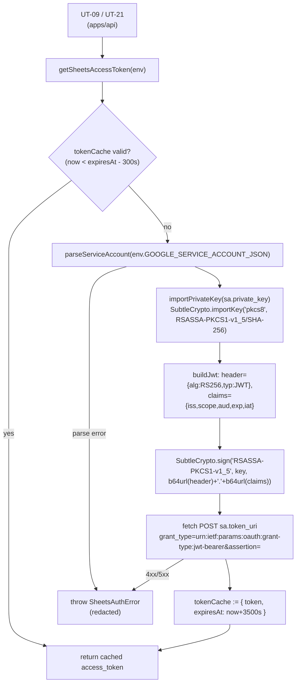

# Phase 2: 設計

## メタ情報

| 項目 | 値 |
| --- | --- |
| タスク名 | Sheets API 認証方式設定 (UT-03) |
| Phase 番号 | 2 / 13 |
| Phase 名称 | 設計 |
| 作成日 | 2026-04-29 |
| 前 Phase | 1 (要件定義) |
| 次 Phase | 3 (設計レビュー) |
| 状態 | completed（実装・仕様書フェーズ完了。workflow root は `completed`） |
| タスク種別 | implementation |
| visualEvidence | NON_VISUAL |

## 目的

Phase 1 で確定した「Edge Runtime 互換 + Secret 一貫運用 + Service Account 採択」要件を、(a) 認証方式の比較評価表、(b) Web Crypto API による JWT 署名 → access_token 取得 → TTL 1h キャッシュフロー、(c) `packages/integrations` 内のモジュール構成、(d) シークレット管理マトリクス、の 4 つに分解し、Phase 3 のレビューが代替案比較で結論を出せる粒度で設計入力を作成する。

## 実行タスク

1. Service Account JSON key vs OAuth 2.0 の比較評価表を作成する（完了条件: 6 軸以上で比較し、採択理由が明文化されている）。
2. Web Crypto API での JWT 署名 → token 取得 → キャッシュフローを Mermaid + 擬似コードで固定する（完了条件: SubtleCrypto.importKey / sign / Sheets OAuth2 token endpoint 呼び出しが図示）。
3. `packages/integrations/google/src/sheets/auth.ts` のモジュール構成（公開 API / 内部関数 / 依存）を擬似 export 仕様で記述する（完了条件: 公開 API 1 / 内部関数 4 以上に input / output / 副作用が記載）。
4. シークレット管理マトリクス（Cloudflare Secrets / `.dev.vars` / `.gitignore` / 1Password Vault）を 3 環境 × 注入経路で表化する（完了条件: 3 環境すべてに登録経路が記述されている）。
5. エラーハンドリング設計（JSON parse 失敗 / token 取得失敗 / 403 PERMISSION_DENIED）を分類する（完了条件: 3 種別すべてに fail-fast / retry / log redact 方針が割り当てられている）。
6. 成果物 `outputs/phase-02/main.md` を作成する（完了条件: 5 セクションすべてが含まれる）。

## 参照資料

| 種別 | パス | 用途 |
| --- | --- | --- |
| 必須 | docs/30-workflows/ut-03-sheets-api-auth-setup/phase-01.md | 真の論点・AC・Ownership 宣言 |
| 必須 | docs/30-workflows/ut-03-sheets-api-auth-setup/outputs/phase-01/main.md | AC-1〜AC-10 詳細 |
| 必須 | .claude/skills/aiworkflow-requirements/references/architecture-monorepo.md | `packages/integrations` 責務境界 |
| 必須 | .claude/skills/aiworkflow-requirements/references/deployment-secrets-management.md | Cloudflare Secrets 配置方針 |
| 必須 | .claude/skills/aiworkflow-requirements/references/environment-variables.md | local canonical env / `.dev.vars` 管理 |
| 参考 | https://developers.google.com/identity/protocols/oauth2/service-account#httprest | SA JWT 公式仕様 |
| 参考 | https://developers.cloudflare.com/workers/runtime-apis/web-crypto/ | Web Crypto API 公式 |

## 設計成果物の章立て（`outputs/phase-02/main.md` 構成）

1. 認証方式の比較評価表（Service Account JSON key vs OAuth 2.0）
2. 採択方式の理由（Service Account JSON key）
3. Web Crypto API による JWT 署名フロー（Mermaid + 擬似コード）
4. トークンキャッシュ設計（TTL 1h / in-memory / refresh 条件）
5. `packages/integrations/google` モジュール構成（公開 API / 内部関数）
6. シークレット管理マトリクス（Cloudflare Secrets / `.dev.vars` / `.gitignore` / 1Password）
7. エラーハンドリング分類

## 認証方式の比較評価（設計入力）

| 軸 | Service Account JSON key | OAuth 2.0 (offline access) |
| --- | --- | --- |
| 想定主体 | サーバー間通信（Workers → Sheets） | ユーザー操作前提 |
| 認証ステップ | JWT 署名 → token 交換（2 段、TTL 1h） | 初回同意 → refresh_token 永続化 → access_token 更新（3 段以上） |
| Workers 互換 | Web Crypto API のみで完結 | refresh_token 永続化用ストレージが追加で必要 |
| Secret 形式 | JSON 1 ファイル（`GOOGLE_SERVICE_ACCOUNT_JSON`） | client_id / client_secret / refresh_token の 3 値 |
| 失効リスク | private_key ローテーションのみ | refresh_token 失効・再同意 UI が必要 |
| 適用領域 | 無人 Cron / scheduled / API server | エンドユーザーログイン |
| 採択 | ◎ | × |

## モジュール構成（設計入力）

| # | 要素 | パス（提案） | 入力 | 出力 / 副作用 | 備考 |
| --- | --- | --- | --- | --- | --- |
| 1 | 公開 API | `packages/integrations/google/src/sheets/auth.ts` `getSheetsAccessToken(env: SheetsAuthEnv): Promise<{ accessToken: string; expiresAt: number }>` | `env` (Workers env binding) | access_token と失効時刻、内部キャッシュ更新 | UT-09 / UT-21 はこれのみ呼ぶ |
| 2 | env 型 | 同上 `export type SheetsAuthEnv` | - | `{ GOOGLE_SERVICE_ACCOUNT_JSON: string }` | binding 型 |
| 3 | 内部: SA JSON parse | 同上 `parseServiceAccount(raw: string)` | raw JSON | `{ client_email, private_key, token_uri }` | parse 失敗時 fail-fast |
| 4 | 内部: JWT 生成 | 同上 `buildJwt(sa, scopes, now)` | parsed SA + scopes + 現在時刻 | RS256 署名済 JWT | Web Crypto SubtleCrypto |
| 5 | 内部: token 交換 | 同上 `exchangeJwtForAccessToken(jwt, tokenUri)` | JWT + token_uri | `{ access_token, expires_in }` | fetch POST `application/x-www-form-urlencoded` |
| 6 | 内部: キャッシュ | 同上 `tokenCache: { token, expiresAt }` | - | TTL 1h（3500s で expire 扱い） | isolate 内 module スコープ |
| 7 | 内部: PEM → CryptoKey | 同上 `importPrivateKey(pem)` | PEM 文字列 | `CryptoKey` (RSASSA-PKCS1-v1_5 / SHA-256) | `crypto.subtle.importKey('pkcs8', ...)` |
| 8 | エクスポート集約 | `packages/integrations/google/index.ts` | - | `getSheetsAccessToken`, `SheetsAuthEnv` 再エクスポート | UT-09 / UT-21 import 点 |

## Web Crypto JWT フロー（Mermaid）

## トークンキャッシュ設計

| 項目 | 値 |
| --- | --- |
| 保存先 | Workers isolate 内 module スコープ変数（in-memory） |
| TTL | token endpoint の expires_in に準拠。再取得は失効 5 分前 |
| 共有範囲 | 同一 isolate 内のみ（Worker scale-out 時は isolate ごとに独立して取得） |
| 失効判定 | `Date.now() < expiresAt` を判定。NG なら再取得 |
| 永続化 | しない（KV / D1 を使わない、単純化と Secret 露出最小化） |
| 並行制御 | 取得中に他 caller が来た場合の race を `pendingPromise` で吸収（in-flight de-dup） |

## シークレット管理マトリクス

| Secret | 種別 | dev | staging | production | 注入経路 | 1Password Vault |
| --- | --- | --- | --- | --- | --- | --- |
| `GOOGLE_SERVICE_ACCOUNT_JSON` | Secret | required | required | required | Cloudflare Secret (`bash scripts/cf.sh secret put` 経由) | UBM-Hyogo / dev|staging|production |
| `.dev.vars`（local） | local file | `op://UBM-Hyogo/dev/GOOGLE_SERVICE_ACCOUNT_JSON` 参照 | n/a | n/a | `scripts/with-env.sh` 経由で `op run` 注入 | 同上 |
| `.gitignore` ガード | repo | `.dev.vars` を除外（既存確認） | - | - | repo root | - |
| Sheets 共有 | Google Drive 設定 | dev sheet | staging sheet | prod sheet | Service Account メール（`xxx@project.iam.gserviceaccount.com`）を「閲覧者」共有 | - |

## エラーハンドリング分類

| エラー | 原因 | 方針 | log 方針 |
| --- | --- | --- | --- |
| `SheetsAuthError: invalid_service_account_json` | env が空 / JSON parse 失敗 | fail-fast（throw） | 値は出力しない、`env name` のみ |
| `SheetsAuthError: token_exchange_failed` | token endpoint 4xx/5xx | fail-fast。retry は caller 側（UT-09 with-retry） | response body は redact、status / `error` field のみ |
| `SheetsAuthError: permission_denied` | Sheets 共有未設定（Sheets API 呼び出し側で 403） | 本モジュールでは観測不可、UT-09 で検出 | runbook 参照リンクを log message に含める |
| `SheetsAuthError: web_crypto_unsupported` | importKey / sign 失敗（理論上 Workers では起きない） | fail-fast、Phase 11 の疎通確認で検出 | スタック保持 |

## 実行手順

### ステップ 1: Phase 1 入力の取り込み

- 真の論点・AC-1〜AC-10・Ownership 宣言を確認。
- `packages/integrations` の既存命名規約を repo 実態に対し走査（`ls packages/integrations 2>/dev/null`）。

### ステップ 2: 比較評価表とフロー図の固定

- 比較評価表を `outputs/phase-02/main.md` に固定。
- Web Crypto JWT フローを Mermaid + 擬似 TypeScript signature で記述。

### ステップ 3: モジュール構成の固定

- 公開 API 1 件 / 内部関数 4 件以上に input / output / 副作用を記述。
- 命名予約（`getSheetsAccessToken` / `SheetsAuthEnv` / `packages/integrations/google/src/sheets/auth.ts`）を本フェーズで占有。

### ステップ 4: シークレット管理マトリクスとエラー分類

- 3 環境 × 4 経路（Cloudflare Secrets / `.dev.vars` / `.gitignore` / 1Password）を表化。
- エラーハンドリング 4 種別に方針を割り当て。

## 統合テスト連携

| 連携先 Phase | 連携内容 |
| --- | --- |
| Phase 3 | 設計の代替案比較・PASS/MINOR/MAJOR 判定の入力 |
| Phase 4 | モジュール 8 要素のテスト計画ベースライン |
| Phase 5 | 実装ランブック・runbook の擬似コード起点 |
| Phase 6 | 異常系（JSON parse 失敗 / token 4xx / 403 / Web Crypto 例外）の網羅対象 |
| Phase 11 | Sheets API 疎通確認スクリプト実行手順 placeholder |

## 多角的チェック観点

- 不変条件 #5: D1 を直接触らない設計を維持（モジュール構成に D1 binding が含まれていないことを確認）。
- Edge Runtime 互換: Node API（`fs` / Node `crypto` モジュール / Buffer 依存処理）を含まないことを設計レベルで確認。
- Secret hygiene: 設計上 SA JSON は env 経由のみ、log には redact 規約。
- 認可境界: 本モジュールは util。public route に露出しない。
- 無料枠: TTL 1h により Sheets token endpoint へのリクエストは月数十回程度に抑制。
- 並行制御: in-flight de-dup（`pendingPromise`）で同一 isolate 内 race を吸収。

## サブタスク管理

| # | サブタスク | 担当 Phase | 状態 | 備考 |
| --- | --- | --- | --- | --- |
| 1 | 比較評価表（SA vs OAuth） | 2 | spec_created | 6 軸以上 |
| 2 | Web Crypto JWT フロー Mermaid + 擬似コード | 2 | spec_created | importKey / sign / fetch |
| 3 | モジュール構成 8 要素 | 2 | spec_created | I/O・副作用記述 |
| 4 | シークレット管理マトリクス | 2 | spec_created | 3 環境 × 4 経路 |
| 5 | エラーハンドリング分類 4 種別 | 2 | spec_created | fail-fast / retry / redact |
| 6 | 成果物 `outputs/phase-02/main.md` 作成 | 2 | spec_created | 7 セクション |

## 成果物

| 種別 | パス | 説明 |
| --- | --- | --- |
| 設計 | outputs/phase-02/main.md | 比較表・採択理由・JWT フロー・キャッシュ設計・モジュール構成・シークレットマトリクス・エラー分類 |
| メタ | artifacts.json | Phase 2 状態の更新（後続 Phase 群作成時に生成） |

## 完了条件

- [ ] 比較評価表が 6 軸以上で記述され、採択理由が明文化されている
- [ ] Web Crypto JWT フローが Mermaid + 擬似コードで固定されている
- [ ] モジュール構成 8 要素すべてに input / output / 副作用が記述されている
- [ ] シークレット管理マトリクスに 3 環境 × 4 経路すべてが記述されている
- [ ] エラーハンドリング 4 種別すべてに方針が割り当てられている
- [ ] 成果物が `outputs/phase-02/main.md` 1 ファイルに集約されている

## タスク 100% 実行確認【必須】

- 全実行タスク（6 件）が `spec_created`
- 異常系（SA JSON parse 失敗 / token 4xx / 403 PERMISSION_DENIED / Web Crypto 例外）の対応モジュールが設計に含まれる
- artifacts.json `phases[1].status = spec_created`

## 次 Phase への引き渡し

- 次 Phase: 3 (設計レビュー)
- 引き継ぎ事項:
  - base case = Service Account JSON key + Web Crypto API + TTL 1h キャッシュ + `packages/integrations/google/src/sheets/auth.ts`
  - 比較評価表を Phase 3 alternatives.md の起点に流用
  - モジュール 8 要素を Phase 4 テスト計画のベースに渡す
- ブロック条件:
  - Mermaid 図に importKey / sign / token 交換 / cache のいずれかが欠落
  - シークレット管理マトリクスに `.gitignore` 列が欠落
  - 既存 `packages/integrations` 規約走査未実施
