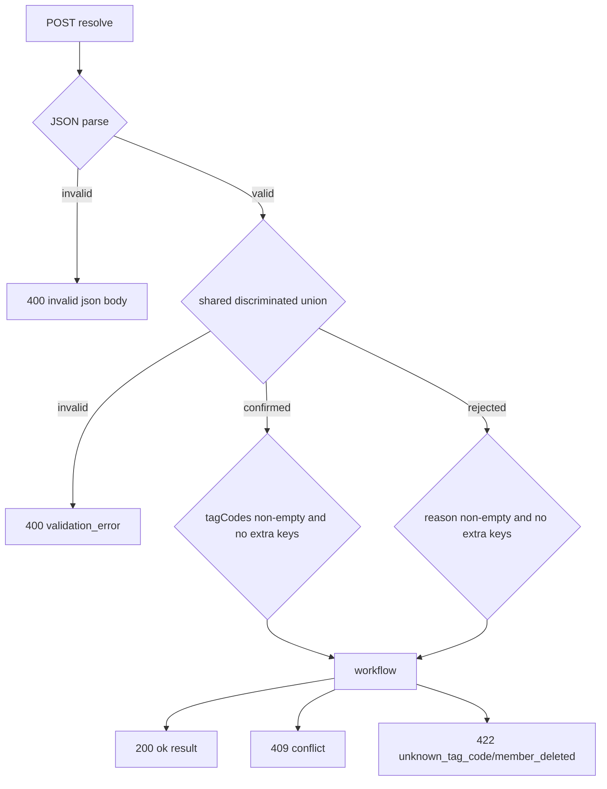
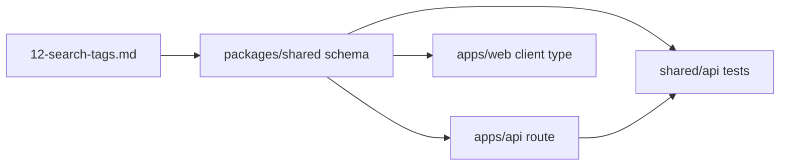

# Phase 2: 設計

## Alias Table

| 概念 | 仕様語 | 実装語 | API body |
| --- | --- | --- | --- |
| タグ確定 | `confirmed` | queue status `resolved` | `action:"confirmed"` |
| タグ拒否 | `rejected` | queue status `rejected` | `action:"rejected"` |
| 確定タグ | `tagCodes` | `tag_definitions.code` → `member_tags.tag_id` | `tagCodes:string[]` |
| 拒否理由 | `reason` | `tag_assignment_queue.reason` | `reason:string` |
| audit | `admin.tag.queue_resolved` / `admin.tag.queue_rejected` | `audit_log.action` | derived |
| 冪等 | `idempotent:true` | computed response | response field |

## Follow-up Targets

| 層 | File | 設計 |
| --- | --- | --- |
| shared | `packages/shared/src/schemas/admin/tag-queue-resolve.ts` | canonical zod schema |
| API compat | `apps/api/src/schemas/tagQueueResolve.ts` | shared schema re-export |
| API route | `apps/api/src/routes/admin/tags-queue.ts` | shared schema parse + stable `validation_error` |
| web client | `apps/web/src/lib/admin/api.ts` | `TagQueueResolveBody` を shared から import |
| tests | `packages/shared/src/schemas/admin/tag-queue-resolve.test.ts` | body contract unit tests |
| tests | `apps/api/src/routes/admin/tags-queue.test.ts` | route contract behavior |

## Validation Flow

## Dependency Matrix

採用案: shared zod schema を SSOT とする案 A。

