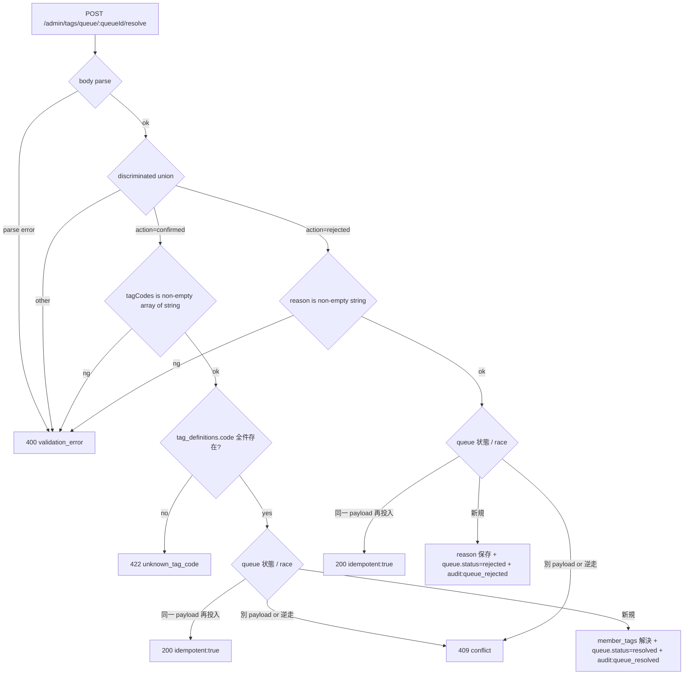
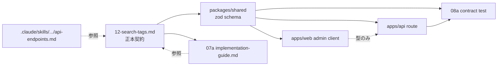

# Phase 2: 設計

## メタ情報

| 項目 | 値 |
| --- | --- |
| タスク名 | ut-07a-02-search-tags-resolve-contract-followup |
| Phase 番号 | 2 / 13 |
| Phase 名称 | 設計 |
| Wave | 7 |
| Mode | serial |
| 作成日 | 2026-05-01 |
| 前 Phase | 1 (要件定義) |
| 次 Phase | 3 (設計レビュー) |
| 状態 | completed |

---

## 目的

Phase 1 で抽出した drift inventory と AC-1〜AC-7 を、
「仕様語 ↔ 実装語 alias 表」「追従対象表（4 層）」「discriminated union バリデーションフロー」「dependency matrix」「module 設計」
の 5 成果物として固定し、Phase 3 のレビューに耐える設計を確立する。

---

## 実行タスク

1. 仕様語 ↔ 実装語 alias 表を確定し、正本配置先を決める
2. 追従対象表（apps/api route / shared zod / apps/web client / TypeScript type / 08a contract test / 正本 docs）を作成
3. discriminated union のバリデーションフロー Mermaid を作成
4. apps/api ↔ shared schema ↔ apps/web ↔ test の dependency matrix を作成
5. shared zod schema の module 配置案（ファイルパス / 命名 / export 形）を作成

---

## 参照資料

| 種別 | パス | 用途 |
| --- | --- | --- |
| 正本 | `docs/00-getting-started-manual/specs/12-search-tags.md` | resolve API body / alias 表の SSOT |
| 正本 | `.claude/skills/aiworkflow-requirements/references/api-endpoints.md` | response shape / error code の現行契約 |
| 正本 | `.claude/skills/aiworkflow-requirements/references/architecture-admin-api-client.md` | `resolveTagQueue(queueId, body)` client 契約 |
| 知見 | `.claude/skills/aiworkflow-requirements/references/lessons-learned-07a-tag-queue-resolve-2026-04.md` | 07a drift 再発防止 |
| 上流 | `docs/30-workflows/completed-tasks/07a-parallel-tag-assignment-queue-resolve-workflow/outputs/phase-12/implementation-guide.md` | 07a 実装ガイドとの文字列整合 |

---

## 実行手順

1. Phase 1 の drift inventory を正本仕様 / API route / web client / contract test / docs の各層へ分類する。
2. alias 表を 12-search-tags.md 正本に集約し、参照系 docs はリンクまたは同一文言へ縮約する。
3. response body と error code は `api-endpoints.md` の現行契約へ合わせ、Phase 4 以降の test ケース名に引き継ぐ。
4. shared zod schema の採否を Phase 3 の比較対象として残し、Phase 2 では案 A を仮採用として設計する。

---

## 仕様語 ↔ 実装語 対応表（alias 表）

| 概念 | 仕様語（正本: 12-search-tags.md） | 実装語（DB enum: tag_assignment_queue.status） | API body action | 備考 |
| --- | --- | --- | --- | --- |
| タグ確定 | `confirmed` | `resolved` | `"confirmed"` | DB は legacy 互換のため `resolved` を継続 |
| タグ拒否 | `rejected` | `rejected` | `"rejected"` | 仕様語と DB enum が一致 |
| 確定要素 | `tagCodes: string[]` | `member_tags.tag_id`（FK to `tag_definitions.id`）| body.tagCodes | code → id の解決はサーバ側 |
| 拒否理由 | `reason: string` | `tag_assignment_queue.reject_reason` | body.reason | 必須 / 非空 |
| audit | `admin.tag.queue_resolved` / `admin.tag.queue_rejected` | `audit_logs.action` 同名 | — | action 名は仕様語ベース |
| 冪等 | `idempotent: true` | （計算プロパティ） | response field | 同一 payload 再投入時のみ true |

> 正本配置: `docs/00-getting-started-manual/specs/12-search-tags.md` に alias 表セクションを追加。`api-endpoints.md` からは参照リンクのみ置く（DRY）。

---

## 追従対象表（4 層 6 ファイル）

| 層 | ファイル / モジュール | 現状 | 期待状態 | 担当 Phase |
| --- | --- | --- | --- | --- |
| 正本仕様 | `docs/00-getting-started-manual/specs/12-search-tags.md` | 新契約記載済（07a で更新済）| alias 表セクション追加 | 12 |
| API route | `apps/api/src/routes/admin/tags/queue/[queueId]/resolve.ts`（または同等）| 07a 実装済 | 変更なし（参照のみ） | — |
| shared zod schema | `packages/shared/src/schemas/admin/tag-queue-resolve.ts`（新規 or 既存）| 案 A 採用時に新設 | discriminated union zod schema を export | 5 |
| apps/web client | `apps/web/src/lib/api/admin.ts` 等の `resolveTagQueue` | 旧契約（空 body）or 部分追従 | discriminated union 引数型 | 5 |
| TypeScript type | 同上モジュール内の `TagQueueResolveBody` type | 未定義 / 旧型 | 仕様準拠 type を export | 5 |
| 08a contract test | `apps/api/test/contract/admin-tags-queue-resolve.test.ts`（または同等）| 部分カバー | confirmed / rejected / validation / idempotent / 409 / 422 を網羅 | 5-6 |
| docs（参照系）| `.claude/skills/aiworkflow-requirements/references/api-endpoints.md` / `architecture-admin-api-client.md` | 部分追従 | body shape を正本仕様参照に統一 | 12 |
| docs（implementation-guide）| `docs/30-workflows/completed-tasks/07a-parallel-tag-assignment-queue-resolve-workflow/outputs/phase-12/implementation-guide.md` | 既追従 | 12-search-tags.md と文字列レベル一致 | 12 |

---

## バリデーションフロー（Mermaid）

---

## Dependency Matrix

| 上流 → 下流 | 契約物 | drift 検出方法 |
| --- | --- | --- |
| SPEC → SHARED | body shape の zod 定義 | shared schema の test snapshot を spec 文字列と diff |
| SHARED → API | request parser | route 実装が同 schema を import |
| SHARED → WEB | client 引数 type | `z.infer` で型導出 |
| SHARED → TEST | 入力 fixture / 異常系 | contract test が同 schema で parse する |
| SPEC → GUIDE | 文字列レベル一致 | grep で body shape 部の差分を 0 行化 |

---

## Module 設計（案 A 採用前提）

| モジュール | パス | 責務 | export |
| --- | --- | --- | --- |
| shared schema | `packages/shared/src/schemas/admin/tag-queue-resolve.ts` | discriminated union zod schema 定義 | `tagQueueResolveBodySchema`, `TagQueueResolveBody` |
| api route | `apps/api/src/routes/admin/tags/queue/resolve.ts`（既存）| body parse → service 呼び出し | route handler |
| web client | `apps/web/src/lib/api/admin.ts`（既存）| `resolveTagQueue(queueId, body)` 公開 | function + type |
| contract test | `apps/api/test/contract/admin-tags-queue-resolve.test.ts` | 4 case + 2 異常系 | vitest spec |

> 案 B / 案 C との比較は Phase 3 で実施。

---

## 統合テスト連携

| 連携先 Phase | 連携内容 |
| --- | --- |
| Phase 3 | 設計レビューで shared schema 案 A を含む 3 案を比較 |
| Phase 4 | バリデーションフロー図の各分岐を contract test ケースに 1:1 対応させる |
| Phase 5 | Module 設計表に従い実装ランブックを作成 |
| Phase 12 | 追従対象表を docs 同期チェックリストとして再利用 |

---

## 多角的チェック観点

- 不変条件 #11: resolve API は `member_tags` の付与のみ・本文編集パスを生まない設計であることを再確認（route handler 設計に member text 操作が含まれないこと）
- 不変条件 #5: shared zod schema は packages/shared に置き、apps/web から D1 binding に触れない（薄め）
- DRY: alias 表を 12-search-tags.md に集約し、参照系 docs はリンクのみ置く
- 可読性: discriminated union を `z.discriminatedUnion('action', [...])` で表現し、誤った type narrowing を防ぐ

---

## サブタスク管理

| # | サブタスク | 担当 Phase | 状態 | 備考 |
| --- | --- | --- | --- | --- |
| 1 | alias 表の正本配置確定 | 2 | pending | 12-search-tags.md を SSOT |
| 2 | 追従対象表の層別整理 | 2 | pending | spec / shared / api / web / test / docs |
| 3 | Mermaid バリデーションフロー作成 | 2 | pending | Phase 4 ケースへ 1:1 引き継ぎ |
| 4 | dependency matrix 作成 | 2 | pending | owner / co-owner を含める |
| 5 | module 設計案 A/B/C の比較準備 | 2 | pending | Phase 3 で採否決定 |

---

## 成果物

| 種別 | パス | 説明 |
| --- | --- | --- |
| ドキュメント | outputs/phase-02/main.md | alias 表 / 追従対象表 / Mermaid 2 種 / Module 設計 |

---

## 完了条件

- [ ] alias 表（仕様語 ↔ DB enum ↔ API action）が 6 行以上で完成している
- [ ] 追従対象表が 4 層 6 ファイル以上で網羅されている
- [ ] discriminated union バリデーションフローが Mermaid で記述されている
- [ ] Dependency Matrix が SPEC / SHARED / API / WEB / TEST の 5 ノード以上で記述されている
- [ ] Module 設計表が 4 モジュール以上で記述されている

---

## タスク100%実行確認【必須】

- 全実行タスクが completed
- `outputs/phase-02/main.md` が指定パスに配置済み
- 完了条件 5 件すべてにチェック
- artifacts.json の phase 2 を completed に更新

---

## 次 Phase

- 次: 3 (設計レビュー)
- 引き継ぎ事項: 設計 5 成果物 + 採用案（案 A 仮採用） + open issue（shared schema 配置先 / contract test 構成）
- ブロック条件: alias 表 / 追従対象表のいずれかが未完成の場合は Phase 3 に進まない
