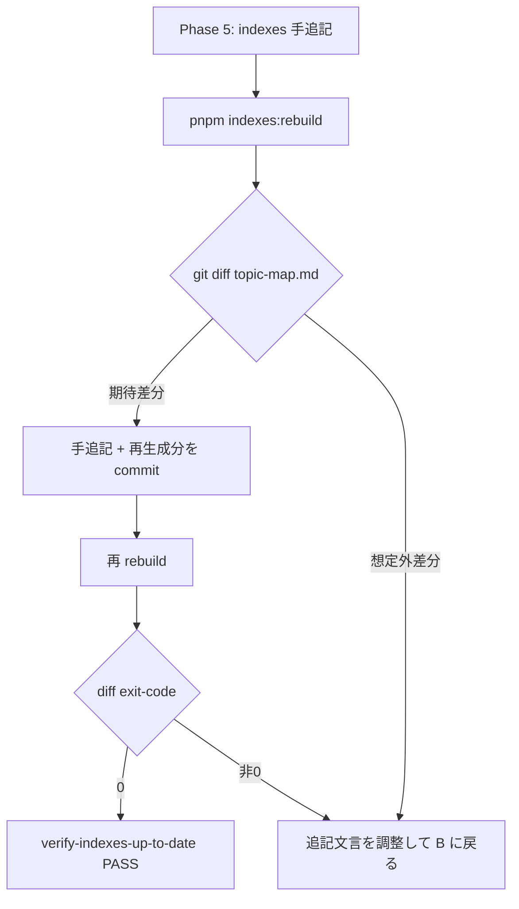
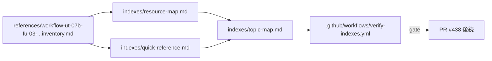

# Phase 2: 設計

[実装区分: 実装仕様書]

## メタ情報

| 項目 | 値 |
| --- | --- |
| タスク名 | ut-07b-fu-05-aiworkflow-skill-d1-runbook-reverse-index |
| Phase 番号 | 2 / 13 |
| Phase 名称 | 設計 |
| Mode | serial |
| 作成日 | 2026-05-04 |
| 前 Phase | 1 (要件定義) |
| 次 Phase | 3 (設計レビュー) |
| 状態 | completed |

---

## 目的

Phase 1 で確定した「変更対象ファイル一覧」「AC-1〜AC-6」を踏まえ、
`resource-map.md` / `quick-reference.md` への具体的な追記文言案・挿入位置・
`pnpm indexes:rebuild` 経由の `topic-map.md` 自動再生成挙動・
CI gate `verify-indexes-up-to-date`（`.github/workflows/verify-indexes.yml`）通過設計を確定する。

---

## 実行タスク

1. `resource-map.md` のクイックルックアップ表に追記する 1 行（または 2 行）の文言案を確定する
2. `quick-reference.md` の追記セクション位置と 1 行文言案を確定する
3. `pnpm indexes:rebuild` 実行による `topic-map.md` 再生成範囲（追加されるトピック）の予測を整理する
4. CI gate `verify-indexes-up-to-date` をローカルで再現する手順を確定する
5. 既存 `references/workflow-ut-07b-fu-03-production-migration-apply-runbook-artifact-inventory.md` と
   indexes 追記の対応関係（drift 防止のため指し示すパスのみで本文重複しない）を表で固定する

---

## 参照資料

| 種別 | パス | 用途 |
| --- | --- | --- |
| 正本 | `.claude/skills/aiworkflow-requirements/indexes/resource-map.md` | 既存表構造 |
| 正本 | `.claude/skills/aiworkflow-requirements/indexes/quick-reference.md` | 既存セクション構造 |
| 自動 | `.claude/skills/aiworkflow-requirements/indexes/topic-map.md` | 再生成挙動の確認対象 |
| 上流 | `.claude/skills/aiworkflow-requirements/references/workflow-ut-07b-fu-03-production-migration-apply-runbook-artifact-inventory.md` | references 側正本 |
| CI | `.github/workflows/verify-indexes.yml` | drift gate 実体 |
| 関連 | `.github/workflows/d1-migration-verify.yml` | 逆引き対象 CI gate |
| script | `scripts/cf.sh`（`d1:apply-prod` サブコマンド）| 逆引き対象 CLI ラッパー |

---

## 設計 1: `resource-map.md` 追記設計

### 挿入位置

`resource-map.md` の「クイックルックアップ → タスク種別別リソース選択ガイド」表の冒頭付近、
他の最新（2026-05-02 / 2026-05-03 系）の `Issue #...` / `UT-...` 行と同列に配置する。
時系列が新しいものを上に積む既存慣習に従い、UT-07B-FU-03 行を最上段に挿入する。

### 追記文言案（1 行案 / 推奨）

| タスク種別 | 最初に読む | 必要に応じて読む |
| --- | --- | --- |
| UT-07B-FU-03 D1 production migration apply runbook（`scripts/d1/*.sh` / `cf.sh d1:apply-prod` / CI gate / 2026-05-03） | `.claude/skills/aiworkflow-requirements/references/workflow-ut-07b-fu-03-production-migration-apply-runbook-artifact-inventory.md`, `references/workflow-ut-07b-fu-03-production-migration-apply-runbook-artifact-inventory.md` | `scripts/d1/`, `.github/workflows/d1-migration-verify.yml`, `scripts/cf.sh`, `.claude/skills/aiworkflow-requirements/references/workflow-ut-07b-fu-03-production-migration-apply-runbook-artifact-inventory.md` |

### 追記文言案（2 行に分割する代替案）

- 1 行目: D1 production migration apply runbook の導線（implementation-guide / artifact inventory）
- 2 行目: D1 migration verify CI gate と `scripts/d1/*.sh` ラッパー群

> 単一行で 3 artifact 全てが「必要に応じて読む」列に収まる場合は 1 行案を採用し、
> 列幅の関係で改行が無理な場合のみ 2 行案にフォールバックする。

### DRY ルール

- references 本文に書かれている artifact 一覧の文言コピーは禁止
- indexes は **「どこに正本があるか」のリンク集** として 1 行で完結させる

---

## 設計 2: `quick-reference.md` 追記設計

### 挿入位置

`quick-reference.md` の最新エントリ群（Issue #196 / Issue #346 等のセクション）に並ぶ位置に
UT-07B-FU-03 用の小セクションを 1 つ追加する。
既存の「Cloudflare 系 / D1 系」共通セクションが存在する場合はそちらに 1 行追記でも可。

### 追記文言案（1 行 / 推奨）

```markdown
### UT-07B-FU-03 D1 production migration apply runbook（2026-05-03）

| 目的 | 参照先 |
| --- | --- |
| production D1 migration apply（CLI ラッパー経由）| `bash scripts/cf.sh d1:apply-prod` |
| migration runbook 全文 | `.claude/skills/aiworkflow-requirements/references/workflow-ut-07b-fu-03-production-migration-apply-runbook-artifact-inventory.md` |
| CI gate | `.github/workflows/d1-migration-verify.yml`（`d1-migration-verify`） |
```

> Issue 指示は「`bash scripts/cf.sh d1:apply-prod` 1 行追記」を必須としているため、
> 上記表のうち最低 1 行（CLI ラッパー行）が含まれていれば AC-3 を満たす。
> 残りの 2 行は drift 検出のための補助文脈として推奨する。

### 注記方針

- `scripts/cf.sh` 経由の理由（op + esbuild + mise 解決を一括）を 1 行で添えてもよいが、
  CLAUDE.md と重複するため**書かないことを推奨**する（DRY）。

---

## 設計 3: `topic-map.md` 自動再生成設計

### コマンド

```bash
mise exec -- pnpm indexes:rebuild
```

### 期待される再生成挙動

- `pnpm indexes:rebuild` が `.claude/skills/aiworkflow-requirements/scripts/generate-index.js`（または同等スクリプト）を呼び出し、
  `resource-map.md` / `quick-reference.md` から topic を抽出して `topic-map.md` を再構築する
- 追記行に含めるキーワード（`D1`, `migration`, `runbook`, `scripts/d1`, `d1:apply-prod`, `d1-migration-verify`）が
  `topic-map.md` の該当 topic に集約されることを期待する
- 再 rebuild 後に diff が出ない（idempotent）ことを以て生成系の安定性を確認する

### 失敗時の挙動と対策

| 失敗種別 | 対策 |
| --- | --- |
| `topic-map.md` の差分が永遠に出続ける | 追記行のキーワードが topic 抽出規則と整合しないため、Phase 5 で文言を調整 |
| `pnpm indexes:rebuild` が script 不存在で fail | `package.json` の script 名を確認し、必要なら `node .claude/skills/aiworkflow-requirements/scripts/generate-index.js` 直叩きにフォールバック |

---

## 設計 4: CI gate `verify-indexes-up-to-date` 通過設計

### gate の正体

- workflow ファイル: `.github/workflows/verify-indexes.yml`
- job 名: `verify-indexes-up-to-date`
- 動作: indexes 再生成スクリプトを CI 上で実行し、`git diff --exit-code` で drift があれば fail

### ローカル再現手順

```bash
# 1. 追記前後で indexes を rebuild
mise exec -- pnpm indexes:rebuild

# 2. 差分確認（手追記 + 自動再生成分のみが残ること）
git status .claude/skills/aiworkflow-requirements/indexes
git diff   .claude/skills/aiworkflow-requirements/indexes

# 3. 全部 commit したのち、再 rebuild が no-op になるか
mise exec -- pnpm indexes:rebuild
git diff --exit-code .claude/skills/aiworkflow-requirements/indexes
# exit 0 なら CI gate 通過の確度が高い
```

### CI gate と本タスクの関係

| 状態 | CI 結果 |
| --- | --- |
| 手追記後に rebuild 未実施 | fail（`topic-map.md` drift）|
| 手追記 + rebuild 実施 + commit | PASS |
| 手追記後 references も書き換え | scope 違反（本タスクは indexes に閉じる）|

---

## 設計 5: references / indexes 対応マトリクス（drift 防止）

| references 側（正本）| indexes 側（リンク先）| 重複展開 |
| --- | --- | --- |
| `references/workflow-ut-07b-fu-03-production-migration-apply-runbook-artifact-inventory.md` の artifact 一覧 | `resource-map.md` の 1 行（artifact inventory への参照のみ）| 禁止 |
| 同上で言及される `scripts/d1/*.sh` 詳細 | `quick-reference.md` の `bash scripts/cf.sh d1:apply-prod` 1 行 | 禁止 |
| 同上で言及される `.github/workflows/d1-migration-verify.yml` | `resource-map.md` の「必要に応じて読む」列のパス | 禁止 |

> 本タスクは references 本文を変更しない。indexes は references の **正本パスを指し示すだけ**にする。

---

## バリデーションフロー（Mermaid）



---

## Dependency Matrix



| 上流 → 下流 | 契約物 | drift 検出方法 |
| --- | --- | --- |
| references → resource-map | artifact inventory のリンク | 手目視（Phase 3 レビュー）|
| references → quick-reference | CLI ラッパー名 | 手目視（Phase 3 レビュー）|
| resource-map / quick-reference → topic-map | topic キーワード | `pnpm indexes:rebuild` の idempotency |
| topic-map → CI gate | git diff exit-code | `verify-indexes-up-to-date` job |

---

## Module 設計

| モジュール | パス | 責務 | 触り方 |
| --- | --- | --- | --- |
| resource-map | `.claude/skills/aiworkflow-requirements/indexes/resource-map.md` | タスク種別逆引き表 | 1〜2 行追記 |
| quick-reference | `.claude/skills/aiworkflow-requirements/indexes/quick-reference.md` | 即時参照リスト | 1 行 + 補助 2 行追記 |
| topic-map | `.claude/skills/aiworkflow-requirements/indexes/topic-map.md` | topic 自動集約 | rebuild に任せる |
| verify-indexes job | `.github/workflows/verify-indexes.yml` | drift gate | 触らない |

---

## 統合テスト連携

| 連携先 Phase | 連携内容 |
| --- | --- |
| Phase 3 | 5 設計成果物のレビュー（artifact inventory との整合 / 重複排除 / CI gate 通過設計）|
| Phase 5 | 設計 1〜4 をそのまま実装ランブックへ展開 |
| Phase 11 | CI gate ローカル再現コマンド列を smoke として固定 |
| Phase 12 | 旧スタブ（`unassigned-task/task-ut-07b-fu-05-...md`）の close-out と feedback#5 resolved マーク |

---

## 多角的チェック観点

- 不変条件 #5: 本タスクは indexes 追記のみで apps/web → D1 直接アクセスを生まない
- DRY: references の artifact inventory を indexes で本文コピーしない
- YAGNI: skill 全体構造（keywords.json / sub topic-map など）には手を入れない
- 機密管理: `cf.sh d1:apply-prod` のラッパー名のみ記載し、token / account id は書かない

---

## サブタスク管理

| # | サブタスク | 担当 Phase | 状態 | 備考 |
| --- | --- | --- | --- | --- |
| 1 | resource-map 追記文言案の確定 | 2 | completed | 1 行案 / 2 行案 |
| 2 | quick-reference 追記セクション位置決定 | 2 | completed | 既存 Cloudflare 系 vs 新セクション |
| 3 | topic-map 再生成挙動の確認 | 2 | completed | キーワード抽出規則 |
| 4 | CI gate ローカル再現手順 | 2 | completed | git diff --exit-code |
| 5 | references / indexes 対応マトリクス | 2 | completed | drift 防止 |

---

## 成果物

| 種別 | パス | 説明 |
| --- | --- | --- |
| ドキュメント | `outputs/phase-02/main.md` | 5 設計成果物（追記文言案 / 挿入位置 / 再生成設計 / CI gate 通過設計 / 対応マトリクス）|

---

## 完了条件

- [ ] `resource-map.md` 追記文言案（1 行案 / 2 行案）が両方提示されている
- [ ] `quick-reference.md` 追記セクション位置と文言案が確定している
- [ ] `topic-map.md` 自動再生成の期待挙動と失敗対策が記述されている
- [ ] CI gate `verify-indexes-up-to-date` のローカル再現手順が記述されている
- [ ] references / indexes 対応マトリクスが drift 防止ポリシー付きで記述されている

---

## タスク 100% 実行確認【必須】

- 全実行タスクが completed
- `outputs/phase-02/main.md` が指定パスに配置済み
- 完了条件 5 件すべてにチェック
- artifacts.json の phase 2 を completed に更新

---

## 次 Phase

- 次: 3 (設計レビュー)
- 引き継ぎ事項: 5 設計成果物 + 採用文言案 + open issue（1 行案 / 2 行案 / 既存セクション統合）
- ブロック条件: 追記文言案がいずれの案でも references と重複する場合は Phase 1 へ戻り変更対象ファイルを再検討
