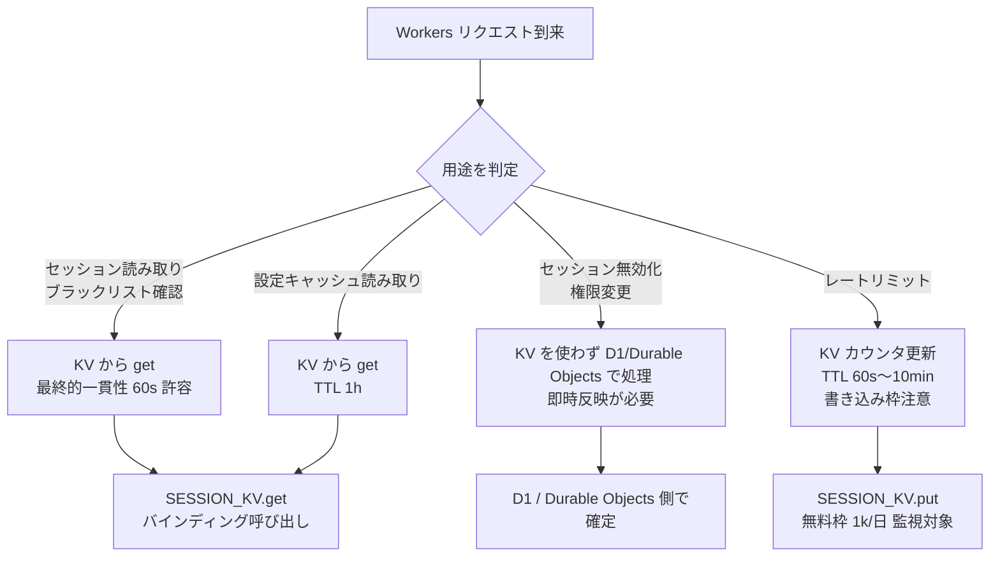

# Phase 2: KV Namespace 設計・バインディング設計

## メタ情報

| 項目 | 値 |
| --- | --- |
| タスク | UT-13 Cloudflare KV セッションキャッシュ設定 |
| Phase | 2 / 13 |
| 状態 | completed |
| 作成日 | 2026-04-27 |

## KV Namespace 命名規約

| 環境 | Namespace 名 | 用途 |
| --- | --- | --- |
| production | `ubm-hyogo-kv-prod` | 本番セッションブラックリスト・設定キャッシュ・レートリミットカウンタ |
| staging | `ubm-hyogo-kv-staging` | staging 用 / Cloudflare 上の dev 環境 |
| staging (preview) | `ubm-hyogo-kv-staging-preview` | `wrangler dev --env staging` のローカル開発用 preview namespace |
| local (miniflare) | preview namespace を流用 | `wrangler dev` のローカル実行時。実 KV にアクセスせずローカル KV エミュレーションを利用 |

### 命名規約のレビュー観点

- ハイフン区切り、英小文字、`<project>-<resource>-<env>` パターンに統一
- 既存 D1 (`ubm-hyogo-db`) / R2 (`ubm-hyogo-storage`) と命名整合
- `preview` サフィックスは `wrangler` 標準の `--preview` フラグ命名に合わせる
- production / staging を視覚的に判別しやすい単語（`prod` / `staging`）を採用し、`prd` / `stg` 等の略語は避ける

## wrangler.toml バインディング設計

`apps/api/wrangler.toml` に追加する設計（Phase 5 で記述）。

```toml
# Cloudflare KV バインディング
# 用途: セッションブラックリスト・設定キャッシュ・レートリミットカウンタ
# 無料枠: 100,000 read/day, 1,000 write/day, 1 GB storage
# 最終的一貫性: 書き込み伝搬最大 60 秒（即時反映が必要な操作には不適）

[env.staging]
[[env.staging.kv_namespaces]]
binding = "SESSION_KV"
id = "<staging-kv-namespace-id>"
preview_id = "<staging-kv-preview-namespace-id>"

[env.production]
[[env.production.kv_namespaces]]
binding = "SESSION_KV"
id = "<production-kv-namespace-id>"
```

### バインディング設計の不変条件

- バインディング名は全環境で `SESSION_KV` に統一する（下流タスクが参照する識別子の一意性確保）
- KV ID は本仕様書には掲載しない。`apps/api/wrangler.toml` への直接記載 vs. CI/CD 経由生成は Phase 5 runbook で運用方針として確定する
- `apps/web` 側からは KV を直接利用しない（不変条件: D1 アクセスは `apps/api` に閉じる、と同方針）

## Mermaid 設計図

### KV 利用フローと「KV を使わない判断」分岐



### KV Namespace 作成・バインディングフロー

```mermaid
flowchart TD
    A[Cloudflare アカウント確認\n01b 完了済み] --> B[wrangler kv:namespace create\nubm-hyogo-kv-staging]
    A --> C[wrangler kv:namespace create\nubm-hyogo-kv-prod]
    B --> D[KV ID 取得\n1Password Environments に保管]
    C --> D
    D --> E[apps/api/wrangler.toml\n[env.staging]/[env.production]\nに [[kv_namespaces]] 追記]
    E --> F[wrangler dev --env staging --remote\nSESSION_KV.put/get smoke test]
    F --> G[wrangler deploy --env staging\n本番 deploy は別タスクで実施]
    G --> H[AC-1〜AC-3 達成]
```

## dependency matrix

| タスク | 種別 | 依存内容 | Phase |
| --- | --- | --- | --- |
| 01b-parallel-cloudflare-base-bootstrap | 上流 | Cloudflare アカウント・Workers 設定確定 | 本 Phase 開始前に必要 |
| UT-04 (D1 スキーマ設計) | 関連 | セッション関連テーブルとの責務切り分け | 本 Phase 完了後に再確認 |
| 認証機能実装タスク（将来） | 上流 / 下流 | セッション要件の確定（上流）と KV バインディング利用（下流） | 双方向 |

## 異常系設計（Phase 6 への申し送り）

| 異常系 | 設計分岐 |
| --- | --- |
| KV ID 取り違え | 1Password 経由で実 ID を取得し、`wrangler.toml` への記載は環境ごとに分離。CI で `wrangler kv:namespace list --env <env>` を実行し ID 整合確認 |
| 無料枠枯渇（write 1k/日） | セッションごとの書き込みを禁止し、ブラックリストのみに限定。レートリミットは TTL 60s〜10min の短期スライディングウィンドウのみ |
| 最終的一貫性影響 | 「put 直後 read」を禁止する設計指針を AC-7 として明文化。即時反映が必要な操作は D1 / Durable Objects 側で処理 |
| TTL 失効による null 返却 | get 側で null チェックを必須化、TTL 失効時のフォールバック（D1 から再構築）を実装ガイドに含める |

## 完了条件

- [x] KV Namespace 命名規約と分離設計が完成している
- [x] wrangler.toml バインディング設計が完成している（KV ID は本仕様に書かない）
- [x] Mermaid 設計図が作成されている
- [x] dependency matrix が作成されている

## 次 Phase 引き継ぎ事項

- 命名規約（`ubm-hyogo-kv-prod` / `ubm-hyogo-kv-staging`）を Phase 3 レビューに渡す
- バインディング名 `SESSION_KV` の不変条件を Phase 5 セットアップ実行・Phase 7 AC matrix で検証
- `ttl-policy.md` および `env-diff-matrix.md` を本 Phase の同梱成果物として配置
