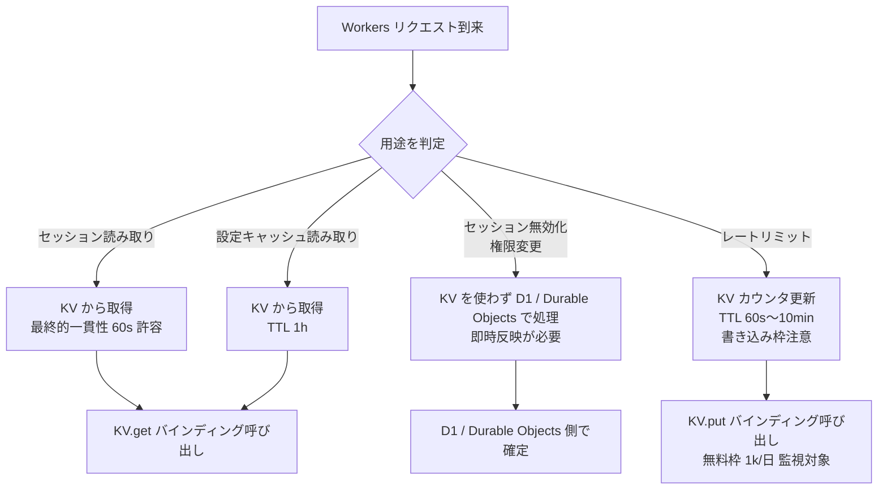

# Phase 2: 設計

## メタ情報

| 項目 | 値 |
| --- | --- |
| タスク名 | Cloudflare KV セッションキャッシュ設定 (UT-13) |
| Phase 番号 | 2 / 13 |
| Phase 名称 | 設計 |
| 作成日 | 2026-04-27 |
| 前 Phase | 1 (要件定義) |
| 次 Phase | 3 (設計レビュー) |
| 状態 | completed |

## 目的

KV Namespace 命名規約・`wrangler.toml` バインディング設計・用途別 TTL 方針・
環境別差異マトリクスを確定し、Phase 5 のセットアップ実行に必要な設計根拠を固める。
最終的一貫性制約と無料枠制約を踏まえた「KV を使う / 使わない」の判断基準を明示化する。

## 実行タスク

- KV Namespace 命名規約と production / staging 分離設計を行う
- `wrangler.toml` の `[env.production]` / `[env.staging]` バインディング設計を行う
- 用途別（セッション / 設定キャッシュ / レートリミット）の TTL 方針を設計する
- 環境別（local / staging / production）KV 差異を明確化する
- Mermaid 設計図と dependency matrix を作成する

## 参照資料

| 種別 | パス | 用途 |
| --- | --- | --- |
| 必須 | .claude/skills/aiworkflow-requirements/references/deployment-cloudflare.md | KV binding 設定例・wrangler コマンド |
| 必須 | docs/30-workflows/ut-13-cloudflare-kv-session-cache/phase-01.md | Phase 1 の AC・スコープ・既存資産インベントリ |
| 必須 | docs/30-workflows/ut-13-cloudflare-kv-session-cache/index.md | タスク概要・依存関係 |
| 参考 | docs/01-infrastructure-setup/01b-parallel-cloudflare-base-bootstrap/outputs/phase-05/cloudflare-bootstrap-runbook.md | 上流 runbook（KV 章追記基準） |

## 実行手順

### ステップ 1: KV Namespace 命名規約と分離設計

- production: `ubm-hyogo-kv-prod`
- staging: `ubm-hyogo-kv-staging`
- local 用 KV (preview / miniflare) の扱いを決める
- 命名規約のレビュー観点（衝突回避・ID 取り違え防止）を文書化する

### ステップ 2: wrangler.toml バインディング設計

- `apps/api/wrangler.toml` の `[env.production]` / `[env.staging]` 配下に `[[kv_namespaces]]` を設計
- バインディング名は `SESSION_KV` に統一する
- KV ID は本仕様には記載せず、runbook に書く（CLAUDE.md / no-doc-for-secrets ルール準拠）
- web 側からは KV を直接使用しない（不変条件「D1 への直接アクセスは apps/api に閉じる」と同方針）

### ステップ 3: 用途別 TTL 方針設計

- セッション: 24h（JWT 主・KV はブラックリストのみ想定）
- 設定キャッシュ: 1h（最終的一貫性 60 秒を許容できる読み取り中心データ）
- レートリミットカウンタ: 60s〜10min（短期スライディングウィンドウ）

### ステップ 4: 環境別差異マトリクスと Mermaid 図の作成

- local / staging / production の KV 差異を表形式で整理する
- KV 利用フローと「KV を使わない判断」分岐を Mermaid で図示する
- dependency matrix を作成する

## 統合テスト連携

| 連携先 Phase | 連携内容 |
| --- | --- |
| Phase 3 | 本 Phase の設計を設計レビューの入力として使用 |
| Phase 4 | verify suite（KV 読み書き smoke / 一貫性確認）の対象を本 Phase の設計から取得 |
| Phase 5 | 本 Phase の手順設計を実行の根拠とする |
| Phase 8 | DRY 化対象（env 差分）の抽出根拠 |

## 多角的チェック観点（AIが判断）

- 価値性: 設計が AC-1〜AC-7 を直接満たす構造になっているか
- 実現性: バインディング設定が package.json の wrangler 4.85.0 前提で動作する設計か
- 整合性: local / staging / production 差異が env 差異マトリクスに全て記載されているか
- 運用性: 設計に rollback 手順（誤った KV ID の差し替え）と無料枠枯渇時の退避方針が含まれているか

## サブタスク管理

| # | サブタスク | 担当 Phase | 状態 | 備考 |
| --- | --- | --- | --- | --- |
| 1 | KV Namespace 命名規約 | 2 | completed | production / staging 分離 |
| 2 | wrangler.toml バインディング設計 | 2 | completed | apps/api/wrangler.toml 対象 |
| 3 | 用途別 TTL 方針 | 2 | completed | セッション / 設定キャッシュ / レートリミット |
| 4 | env 差異マトリクス | 2 | completed | local / staging / production |
| 5 | Mermaid 設計図 | 2 | completed | KV 利用フロー + 「使わない判断」分岐 |
| 6 | dependency matrix | 2 | completed | 上流・下流タスクとの依存 |

## 成果物

| 種別 | パス | 説明 |
| --- | --- | --- |
| ドキュメント | outputs/phase-02/kv-namespace-design.md | KV Namespace 設計・バインディング設計 |
| ドキュメント | outputs/phase-02/ttl-policy.md | 用途別 TTL 方針 |
| ドキュメント | outputs/phase-02/env-diff-matrix.md | 環境別差異マトリクス |
| メタ | artifacts.json | Phase 状態と outputs の記録 |

## 完了条件

- KV Namespace 命名規約と分離設計が完成している
- wrangler.toml バインディング設計が完成している（KV ID は本仕様に書かない）
- 用途別 TTL 方針が文書化されている
- env 差異マトリクスが作成されている
- Mermaid 設計図が作成されている
- dependency matrix が作成されている

## タスク100%実行確認【必須】

- 全実行タスクが completed
- 全成果物が指定パスに配置済み
- 全完了条件にチェック
- 異常系（KV ID 取り違え・無料枠枯渇・最終的一貫性影響）も設計に含まれているか確認
- 次 Phase への引き継ぎ事項を記述
- artifacts.json の該当 phase を completed に更新

## 次 Phase

- 次: 3 (設計レビュー)
- 引き継ぎ事項: KV 命名規約・wrangler.toml 設計・TTL 方針・env 差異マトリクス・Mermaid 図を設計レビューに渡す
- ブロック条件: 本 Phase の主成果物が未作成なら次 Phase に進まない

## Mermaid 設計図

### KV 利用フローと「KV を使わない判断」分岐



### KV Namespace 作成・バインディングフロー

```mermaid
flowchart TD
    A[Cloudflare アカウント確認\n01b 完了済み] --> B[wrangler kv:namespace create\nubm-hyogo-kv-staging]
    A --> C[wrangler kv:namespace create\nubm-hyogo-kv-prod]
    B --> D[KV ID を取得\nrunbook に記載]
    C --> D
    D --> E[apps/api/wrangler.toml\n[env.staging] / [env.production]\nに [[kv_namespaces]] 追記]
    E --> F[wrangler deploy --env staging\n→ KV.get/put smoke test]
    F --> G[wrangler deploy --env production\n→ KV.get/put smoke test]
    G --> H[AC-1〜AC-3 達成]
```

### 環境別 KV 差異マトリクス

| 環境 | KV Namespace | バインディング名 | TTL 上限 | 無料枠カウント | 備考 |
| --- | --- | --- | --- | --- | --- |
| local (wrangler dev) | preview namespace または miniflare KV | KV | 任意 | 対象外 | リージョン伝播はエミュレートされない |
| staging | `ubm-hyogo-kv-staging` | KV | 用途別 TTL | 対象（無料枠は本番と別アカウントなら独立） | 本番データ混入禁止 |
| production | `ubm-hyogo-kv-prod` | KV | 用途別 TTL | 対象（100k read/日・1k write/日） | 書き込み枠監視必須 |

### 用途別 TTL 方針

| 用途 | キー命名例 | TTL | 一貫性要件 | KV 採用判断 |
| --- | --- | --- | --- | --- |
| セッション（JWT 補助 / ブラックリスト） | `session:blacklist:<jti>` | 24h | 最終的一貫性可 | 採用（書き込み少） |
| 設定キャッシュ | `config:<key>` | 1h | 最終的一貫性可 | 採用 |
| レートリミットカウンタ | `rl:<bucket>:<window>` | 60s〜10min | 最終的一貫性可 | 採用（ただし書き込み枠注意） |
| ログアウト即時反映 | - | - | 強整合性必要 | **不採用**（D1 / Durable Objects で処理） |
| 権限変更即時反映 | - | - | 強整合性必要 | **不採用**（D1 / Durable Objects で処理） |

### dependency matrix

| タスク | 種別 | 依存内容 | Phase |
| --- | --- | --- | --- |
| 01b-parallel-cloudflare-base-bootstrap | 上流 | Cloudflare アカウント・Workers 設定確定 | 本 Phase 開始前に必要 |
| 認証機能実装タスク（将来） | 上流 / 下流 | セッション要件の確定（上流）と KV バインディング利用（下流） | 双方向 |
| UT-04 (D1 スキーマ設計) | 関連 | セッション関連テーブルとの責務切り分け | 本 Phase 完了後に再確認 |
