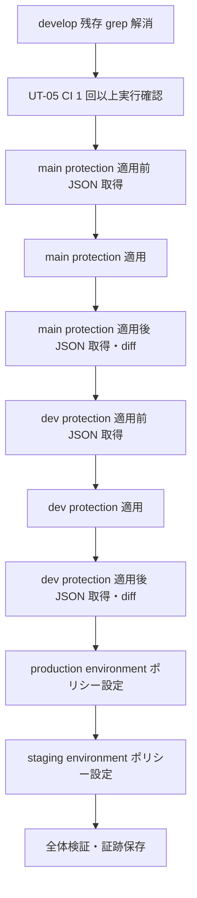

# Phase 2: 設計

## メタ情報

| 項目 | 値 |
| --- | --- |
| タスク名 | GitHub ブランチ保護・Environments 手動適用 (UT-19) |
| Phase 番号 | 2 / 13 |
| Phase 名称 | 設計 |
| 作成日 | 2026-04-27 |
| 前 Phase | 1 (要件定義) |
| 次 Phase | 3 (設計レビュー) |
| 状態 | completed |

## 目的

`main` / `dev` の branch protection 適用 payload、Environments ブランチポリシー、`gh api` での検証手順、適用順序、rollback 設計を確定し、Phase 4（事前検証手順）以降が迷わず実行できる設計根拠を固める。

## 実行タスク

- main / dev それぞれの `gh api PUT .../branches/{branch}/protection` payload を JSON 設計する
- production / staging Environments のブランチポリシー設計（`gh api` 操作可否を含む）
- 適用前/後の API レスポンス検証手順（差分確認・期待値表）
- 適用順序（context 登録確認 → main → dev → Environments）の確定
- SubAgent lane（並列レーン）の要否判定 — 不要なら直列で進める根拠を明記
- 既存コンポーネント再利用可否を docs-only として N/A 判定する
- validation path（AC-1〜AC-5 を満たす検証コマンド列）
- rollback 設計（誤適用時の戻し手順・退避 JSON）

## 参照資料

| 種別 | パス | 用途 |
| --- | --- | --- |
| 必須 | docs/30-workflows/completed-tasks/01a-parallel-github-and-branch-governance/outputs/phase-05/repository-settings-runbook.md | 適用コマンドの正本 |
| 必須 | docs/30-workflows/ut-19-github-branch-protection-manual-apply/phase-01.md | Phase 1 の AC・スコープ |
| 必須 | docs/30-workflows/ut-19-github-branch-protection-manual-apply/index.md | タスク概要・依存関係 |
| 必須 | .claude/skills/aiworkflow-requirements/references/deployment-branch-strategy.md | ブランチ戦略正本 |
| 参考 | .claude/skills/aiworkflow-requirements/references/deployment-cloudflare.md | Environments 設計の背景 |

## 実行手順

### ステップ 1: branch protection payload 設計

- main / dev の `PUT /repos/{owner}/{repo}/branches/{branch}/protection` payload を JSON で設計する
- `required_status_checks.contexts` に `ci` / `Validate Build` を含める
- `required_pull_request_reviews.required_approving_review_count = 0`、`enforce_admins = false`、`allow_force_pushes = false`、`allow_deletions = false` を反映
- 設計差分（main と dev で異なる項目があればその根拠）を明記

### ステップ 2: Environments ブランチポリシー設計

- production: `deployment_branch_policy` を `custom_branch_policies = true` とし、`main` のみ許可
- staging: 同様に `dev` のみ許可
- `gh api` で操作可能な範囲と UI でのみ可能な範囲を切り分ける
- Required Reviewers は 0 名（個人開発方針）

### ステップ 3: API レスポンス検証手順・適用順序・rollback 設計

- 適用前の `gh api GET .../branches/{branch}/protection > before.json` 取得手順
- 適用後の `gh api GET .../branches/{branch}/protection > after.json` 取得・期待値比較手順
- 適用順序: (1) `develop` 残存 grep → (2) CI 実行確認 → (3) main 適用 → (4) dev 適用 → (5) Environments 適用 → (6) 検証
- rollback: before.json を保存し、誤適用時は `gh api PUT` で before.json を再 POST して戻す

## 統合テスト連携

| 連携先 Phase | 連携内容 |
| --- | --- |
| Phase 3 | 本 Phase の設計を設計レビューの入力として使用 |
| Phase 4 | 事前検証チェックリストの根拠として payload と適用順序を渡す |
| Phase 5 | 本 Phase の payload・適用順序・rollback 手順を実行の根拠とする |
| Phase 6 | 422 / 403 / branch 名揺れの異常系設計の入力 |

## 多角的チェック観点（AIが判断）

- 価値性: payload が AC-1 / AC-2 を直接満たし、過不足なく status check を必須化しているか
- 実現性: `gh api` で payload が 200 応答する形式か（GitHub API スキーマ準拠）
- 整合性: main / dev / Environments がブランチ戦略正本（`dev` / `main`）と一致しているか
- 運用性: rollback 設計（before.json 退避 + 再 POST）が明文化されているか

## サブタスク管理

| # | サブタスク | 担当 Phase | 状態 | 備考 |
| --- | --- | --- | --- | --- |
| 1 | main protection payload 設計 | 2 | pending | JSON で完全形 |
| 2 | dev protection payload 設計 | 2 | pending | JSON で完全形 |
| 3 | Environments ポリシー設計 | 2 | pending | gh api / UI 切り分け含む |
| 4 | API レスポンス検証手順 | 2 | pending | before / after 比較手順 |
| 5 | 適用順序の確定 | 2 | pending | context 登録確認 → main → dev → env |
| 6 | SubAgent lane 判定 | 2 | pending | 不要なら直列の根拠を明記 |
| 7 | rollback 設計 | 2 | pending | before.json 退避 + 再 POST |

## 成果物

| 種別 | パス | 説明 |
| --- | --- | --- |
| ドキュメント | outputs/phase-02/branch-protection-design.md | branch protection / Environments 設計（payload・適用順序・rollback） |
| ドキュメント | outputs/phase-02/api-payload-matrix.md | `gh api` payload と期待 response のマトリクス |
| メタ | artifacts.json | Phase 状態と outputs の記録 |

## 完了条件

- main / dev それぞれの protection payload が JSON で完成している
- Environments ブランチポリシー設計が完成している（`gh api` / UI 切り分けを含む）
- API レスポンス検証手順が記載されている
- 適用順序（context 登録確認 → main → dev → Environments）が確定している
- SubAgent lane の要否判定が記載されている
- rollback 設計が記載されている

## タスク100%実行確認【必須】

- 全実行タスクが completed
- 全成果物が指定パスに配置済み
- 全完了条件にチェック
- 異常系（422 / 403 / branch 名揺れ / enforce_admins 罠）が設計に折り込まれているか確認
- 次 Phase への引き継ぎ事項を記述
- artifacts.json の該当 phase を completed に更新

## 次 Phase

- 次: 3 (設計レビュー)
- 引き継ぎ事項: payload 設計・Environments 設計・適用順序・検証手順・rollback 設計を設計レビューに渡す
- ブロック条件: 本 Phase の主成果物（branch-protection-design.md / api-payload-matrix.md）が未作成なら次 Phase に進まない

## branch protection payload 設計（概要）

### main 用 payload（`PUT /repos/daishiman/UBM-Hyogo/branches/main/protection`）

| 項目 | 値 | 根拠 |
| --- | --- | --- |
| `required_status_checks.strict` | true | 最新 base への rebase を必須化 |
| `required_status_checks.contexts` | `["ci", "Validate Build"]` | AC-1 |
| `enforce_admins` | false | 個人開発方針（admin override 残す） |
| `required_pull_request_reviews.required_approving_review_count` | 0 | 個人開発方針 |
| `required_pull_request_reviews.dismiss_stale_reviews` | true | 安全側 |
| `restrictions` | null | 個人リポジトリのため無効 |
| `allow_force_pushes` | false | AC-1 |
| `allow_deletions` | false | AC-1 |

### dev 用 payload

main と同一構造。`contexts` も同じ `["ci", "Validate Build"]`。差分は無し（AC-2）。

## Environments ブランチポリシー設計

| Environment | 許可ブランチ | Required Reviewers | 操作経路 |
| --- | --- | --- | --- |
| production | `main` のみ | 0 名 | `gh api PUT /repos/{owner}/{repo}/environments/production` で `deployment_branch_policy.custom_branch_policies=true` 設定 + UI で `main` を policy として登録 |
| staging | `dev` のみ | 0 名 | 同上、`dev` を policy として登録 |

> `deployment_branch_policy` の細かい branch policy 登録は `gh api` の `repos/{owner}/{repo}/environments/{env}/deployment-branch-policies` エンドポイントを使うが、UI 経由が確実。本タスクでは UI 操作 + `gh api GET` での検証併用とする。

## API レスポンス検証手順

| 手順 | コマンド例 | 期待値 |
| --- | --- | --- |
| 1. 適用前取得 | `gh api repos/daishiman/UBM-Hyogo/branches/main/protection > outputs/phase-05/gh-api-before-main.json` | 既存設定（無ければ 404） |
| 2. payload 適用 | `gh api -X PUT repos/.../branches/main/protection --input main-payload.json` | 200 OK |
| 3. 適用後取得 | `gh api ... > outputs/phase-05/gh-api-after-main.json` | payload 反映済み |
| 4. 差分確認 | `diff before.json after.json` | 期待差分のみ |
| 5. dev も同様 | 上記 1〜4 を dev に対して実行 | AC-2 充足 |

## 適用順序（直列）

## SubAgent lane 判定

| 判定項目 | 結果 | 根拠 |
| --- | --- | --- |
| 既存コンポーネント再利用可否 | N/A | docs-only / operations evidence task のため UI コンポーネント新規実装・再利用判断は発生しない |
| 並列化の要否 | 不要 | 適用対象が main / dev / production / staging の 4 点のみで、依存（context 登録確認 → main → dev → env）が直列 |
| 採用方針 | 直列実行 | 並列化のオーバーヘッド > 期待短縮時間 |

## rollback 設計

| 状況 | rollback 手順 |
| --- | --- |
| protection 誤適用 | `outputs/phase-05/gh-api-before-{branch}.json` を `gh api -X PUT --input` で再 POST し元状態に戻す |
| Environments 誤設定 | UI で deployment_branch_policy を旧設定に戻す（before 状態を Phase 5 で記録） |
| 全面巻き戻し | `gh api -X DELETE repos/.../branches/{branch}/protection` で protection を完全削除（最終手段） |

## 正本仕様参照表

| 種別 | パス | 用途 |
| --- | --- | --- |
| 必須 | docs/30-workflows/completed-tasks/01a-parallel-github-and-branch-governance/outputs/phase-05/repository-settings-runbook.md | payload・コマンドの正本 |
| 必須 | .claude/skills/aiworkflow-requirements/references/deployment-branch-strategy.md | ブランチ戦略正本 |
| 必須 | docs/30-workflows/ut-19-github-branch-protection-manual-apply/phase-01.md | AC・スコープ |
| 参考 | GitHub REST API: Branches / Environments | API スキーマ確認 |
