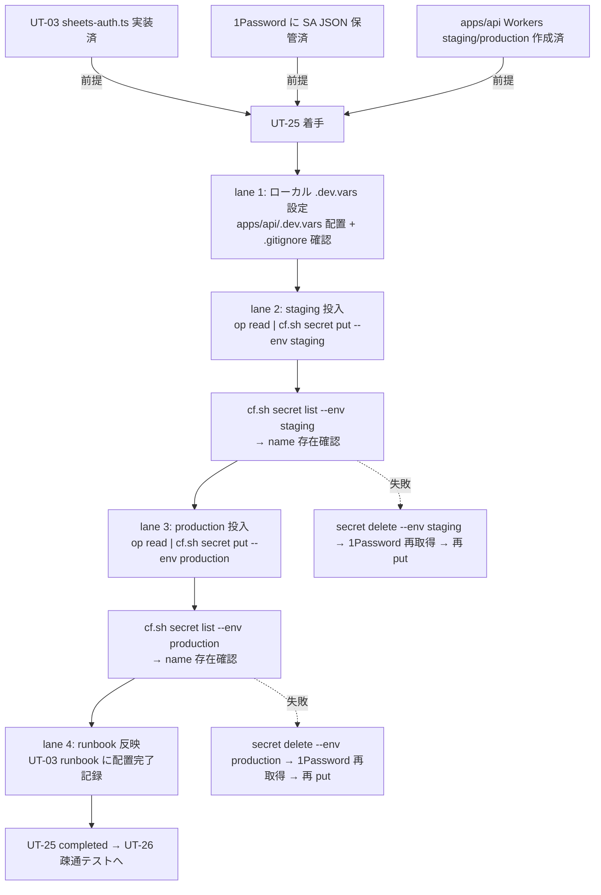

# Phase 2 成果物 — 設計

## 1. 設計方針

Phase 1 の真の論点（5 リスク同時封じ）を、**4 lane 直列トポロジ + stdin パイプ投入 + staging-first 順序 + delete-and-reput rollback** で実装する。`bash scripts/cf.sh` ラッパー以外の wrangler 経路は構造的に排除する（CLAUDE.md ルール）。

## 2. トポロジ (Mermaid)



## 3. SubAgent lane 設計

| lane | 役割 | 入力 | 出力 / 副作用 | 成果物 |
| --- | --- | --- | --- | --- |
| 1. ローカル `.dev.vars` | ローカル wrangler dev 用 secret 設定 | 1Password SA JSON | `apps/api/.dev.vars` 行追加（or op 参照） | git 管理外 |
| 2. staging 投入 | staging への wrangler secret put | 1Password / `[env.staging]` | Cloudflare staging Secret 配置 | `outputs/phase-13/secret-list-evidence-staging.txt` |
| 3. production 投入 | production への wrangler secret put | 1Password / `[env.production]` | Cloudflare production Secret 配置 | `outputs/phase-13/secret-list-evidence-production.txt` |
| 4. runbook 反映 | UT-03 runbook 等への配置完了記録 | applied 状態 | docs 更新 | `outputs/phase-13/deploy-runbook.md` |

## 4. 投入経路（bash 仕様）

```bash
# 0. シェル履歴汚染防止
export HISTFILE=/dev/null
set +o history

# 1. .gitignore 除外確認
grep -E '^\.dev\.vars$' apps/api/.gitignore || echo "WARNING: .dev.vars not gitignored"

# 2. ローカル .dev.vars（op 参照のみ）
# GOOGLE_SERVICE_ACCOUNT_JSON='op://Vault/SA-JSON/credential'

# 3. staging 投入
op read 'op://Vault/SA-JSON/credential' | \
  bash scripts/cf.sh secret put GOOGLE_SERVICE_ACCOUNT_JSON \
    --config apps/api/wrangler.toml --env staging

# 4. staging name 確認
bash scripts/cf.sh secret list --config apps/api/wrangler.toml --env staging \
  > outputs/phase-13/secret-list-evidence-staging.txt
grep GOOGLE_SERVICE_ACCOUNT_JSON outputs/phase-13/secret-list-evidence-staging.txt

# 5. production 投入（staging 確認 PASS 後のみ）
op read 'op://Vault/SA-JSON/credential' | \
  bash scripts/cf.sh secret put GOOGLE_SERVICE_ACCOUNT_JSON \
    --config apps/api/wrangler.toml --env production

# 6. production name 確認
bash scripts/cf.sh secret list --config apps/api/wrangler.toml --env production \
  > outputs/phase-13/secret-list-evidence-production.txt
grep GOOGLE_SERVICE_ACCOUNT_JSON outputs/phase-13/secret-list-evidence-production.txt
```

## 5. wrangler.toml env 切替仕様

| 観点 | 仕様 |
| --- | --- |
| 設定ファイル | `apps/api/wrangler.toml` |
| env 宣言 | `[env.staging]` / `[env.production]` の 2 ブロック |
| `--env` 必須 | 省略禁止（top-level Worker への誤投入を防ぐ） |
| 照合手順 | runbook で `grep -E '^\[env\.(staging\|production)\]' apps/api/wrangler.toml` |

## 6. state ownership 表

| state | 物理位置 | owner | writer | reader | TTL |
| --- | --- | --- | --- | --- | --- |
| SA JSON key（**正本**） | 1Password Vault | 01c bootstrap | 01c | UT-25 投入 | 永続（rotate 時置換） |
| Cloudflare staging Secret | Cloudflare Workers staging | UT-25 lane 2 | lane 2 (put) | apps/api staging runtime | 永続 |
| Cloudflare production Secret | Cloudflare Workers production | UT-25 lane 3 | lane 3 (put) | apps/api production runtime | 永続 |
| `apps/api/.dev.vars` | ローカル | 開発者 | 開発者（op 参照のみ） | ローカル wrangler dev | git 管理外 |
| evidence | `outputs/phase-13/secret-list-evidence-{staging,production}.txt` | UT-25 lane 2/3 | lane 2 / 3 | 監査 | 永続（PR commit） |

> **重要境界**: 正本は 1Password。Cloudflare 側は読み取り不可で二重正本にならない。staging / production は独立投入、bulk 化禁止。

## 7. ファイル変更計画

| パス | 操作 | 注意 |
| --- | --- | --- |
| `apps/api/.dev.vars` | 新規 or 追記（git 管理外） | 実値転記禁止・op 参照のみ |
| `apps/api/.gitignore` | 確認のみ | `.dev.vars` 除外漏れがあれば追加 |
| `outputs/phase-13/deploy-runbook.md` | 新規作成 | 投入手順 / 完了判定 |
| `outputs/phase-13/rollback-runbook.md` | 新規作成 | delete + 旧 key 再投入 |
| `outputs/phase-13/secret-list-evidence-{staging,production}.txt` | 新規作成 | name のみ |
| その他（apps/web / D1 / sheets-auth.ts） | 変更しない | - |

## 8. ロールバック設計

### 8.1 通常 rollback

```bash
bash scripts/cf.sh secret delete GOOGLE_SERVICE_ACCOUNT_JSON \
  --config apps/api/wrangler.toml --env <staging|production>

op read 'op://Vault/SA-JSON-prev/credential' | \
  bash scripts/cf.sh secret put GOOGLE_SERVICE_ACCOUNT_JSON \
    --config apps/api/wrangler.toml --env <staging|production>
```

### 8.2 緊急 rollback（production で UT-26 認証失敗時）

1. UT-26 で 401 / 422 検出
2. `secret delete --env production` で誤値除去
3. 1Password で旧 key 確認
4. `op read | secret put` で再投入
5. UT-26 再実行

担当者: solo 運用では実行者本人。`rollback-runbook.md` に明記。

## 9. シェル履歴汚染防止策

| 策 | 効果 |
| --- | --- |
| `export HISTFILE=/dev/null` | 履歴ファイル無効化 |
| `set +o history` | 現在 shell の履歴記録停止 |
| `op read \| stdin pipe` | 値がプロセス引数 / 環境変数に出ない |
| ファイル経由禁止（`cat sa.json` を MVP では避ける） | ディスク残留防止 |

## 10. 統合境界

| 観点 | 境界 |
| --- | --- |
| apps/web | 触らない |
| D1 | 触らない（不変条件 #5） |
| sheets-auth.ts | 変更しない（参照側のみ） |
| Sheets API | UT-26 へ委譲 |
| Sheets→D1 同期 | UT-09 へ委譲 |

## 11. 引き渡し

Phase 3（設計レビュー）へ：

- base case = lane 1〜4 直列実行
- 投入経路 = `op read | bash scripts/cf.sh secret put --env <env>`
- staging-first 順序固定
- rollback = `secret delete` + 1Password 旧 key 再投入
- 代替案比較対象: (A) cf.sh ラッパー vs 直接 wrangler、(B) staging-first vs production-first、(C) `.dev.vars` vs Cloudflare 単独、(D) 投入手段（op stdin / cat / tty）、(E) rollback（delete+put / 上書き put）
