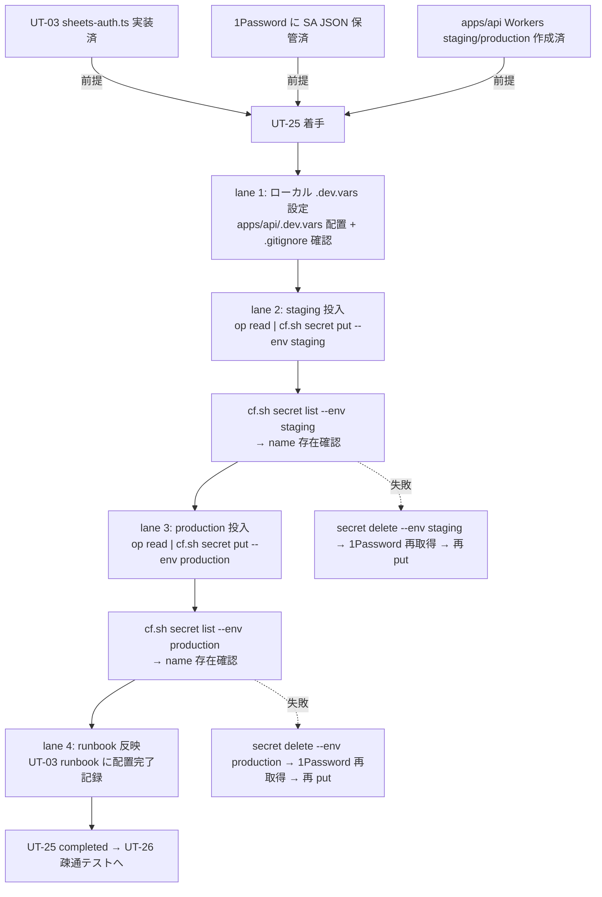

# Phase 2: 設計

## メタ情報

| 項目 | 値 |
| --- | --- |
| タスク名 | Cloudflare Secrets 本番配置（GOOGLE_SERVICE_ACCOUNT_JSON）(ut-25-cloudflare-secrets-production-deploy) |
| Phase 番号 | 2 / 13 |
| Phase 名称 | 設計 |
| 作成日 | 2026-04-29 |
| 前 Phase | 1 (要件定義) |
| 次 Phase | 3 (設計レビュー) |
| 状態 | completed |
| タスク種別 | implementation / NON_VISUAL / cloudflare_secrets_deployment |

## 目的

Phase 1 で確定した「`scripts/cf.sh` ラッパー経路 / staging-first 順序 / `private_key` 改行保全 / 値読取不能前提 / `.dev.vars` 取扱」要件を、投入手順トポロジ・state ownership・wrangler.toml env 切替仕様・rollback 経路・ファイル戦略に分解し、Phase 3 のレビューが代替案比較で結論を出せる粒度の設計入力を作成する。

## 実行タスク

1. 投入手順トポロジ（前提確認 → ローカル投入 → staging 投入 → 確認 → production 投入 → 確認 → runbook 反映）を Mermaid で固定する。
2. SubAgent lane 4 本（lane 1: ローカル `.dev.vars` / lane 2: staging 投入 / lane 3: production 投入 / lane 4: runbook 反映）を表化する。
3. 投入経路（`op read 'op://Vault/Item/sa.json' | bash scripts/cf.sh secret put GOOGLE_SERVICE_ACCOUNT_JSON --config apps/api/wrangler.toml --env <env>`）を bash 系列で固定する。
4. wrangler.toml env 切替仕様を確認する（`apps/api/wrangler.toml` の `[env.staging]` / `[env.production]` 宣言確認）。
5. rollback 経路（`bash scripts/cf.sh secret delete GOOGLE_SERVICE_ACCOUNT_JSON --config apps/api/wrangler.toml --env <env>` + 旧 key 再投入）を仕様化する。
6. state ownership 表（1Password key / Cloudflare Workers Secret staging / Cloudflare Workers Secret production / `.dev.vars` / evidence ファイル）を作成する。
7. シェル履歴汚染防止策（`set +o history` / pipe 直接注入 / `--no-banner` 等）を仕様化する。
8. `apps/api/.dev.vars` の `.gitignore` 確認手順を仕様化する。
9. 配置完了 evidence のファイル分離戦略（`secret-list-evidence-{staging,production}.txt`）を確定する。

## 参照資料

| 種別 | パス | 用途 |
| --- | --- | --- |
| 必須 | docs/30-workflows/ut-25-cloudflare-secrets-production-deploy/phase-01.md | 真の論点 / 4 条件 / 苦戦箇所割り当て |
| 必須 | docs/30-workflows/unassigned-task/UT-25-cloudflare-secrets-sa-json-deploy.md | 親仕様 §苦戦箇所 |
| 必須 | apps/api/wrangler.toml | env 宣言 |
| 必須 | apps/api/src/jobs/sheets-fetcher.ts | secret 参照側 |
| 必須 | scripts/cf.sh | wrangler ラッパー（op 注入経路） |
| 必須 | CLAUDE.md（Cloudflare 系 CLI / シークレット管理） | 直接実行禁止 / op 経由注入ルール |
| 参考 | https://developers.cloudflare.com/workers/wrangler/commands/#secret | wrangler secret 仕様 |

## トポロジ (Mermaid)



## SubAgent lane 設計

| lane | 役割 | 入力 | 出力 / 副作用 | 成果物 |
| --- | --- | --- | --- | --- |
| 1. ローカル `.dev.vars` | ローカル wrangler dev のための SA JSON 配置 | 1Password SA JSON | `apps/api/.dev.vars` 行 1 件追加（or op 参照） | （ファイル本体は git 管理外） |
| 2. staging 投入 | `wrangler secret put` を staging に対して実行 | 1Password SA JSON / `apps/api/wrangler.toml` `[env.staging]` | Cloudflare staging Workers Secret に値配置 | `outputs/phase-13/secret-list-evidence-staging.txt`（name のみ） |
| 3. production 投入 | `wrangler secret put` を production に対して実行 | 1Password SA JSON / `apps/api/wrangler.toml` `[env.production]` | Cloudflare production Workers Secret に値配置 | `outputs/phase-13/secret-list-evidence-production.txt`（name のみ） |
| 4. runbook 反映 | UT-03 runbook 等に配置完了記録 | applied 状態 | docs 更新 | `outputs/phase-13/deploy-runbook.md` 配置完了行追記 |

## 投入経路（bash 仕様レベル）

```bash
# ===== 0. 前提確認 =====
# - UT-03 sheets-auth.ts が secret 名 GOOGLE_SERVICE_ACCOUNT_JSON を参照していることを確認
# - apps/api/wrangler.toml に [env.staging] / [env.production] が宣言済みか確認
# - 1Password に SA JSON が保管されていることを確認

# ===== 1. シェル履歴汚染防止 =====
export HISTFILE=/dev/null
set +o history

# ===== 2. ローカル .dev.vars 設定 (lane 1) =====
# .gitignore 除外確認（apps/api/.gitignore に .dev.vars が含まれているか）
grep -E '^\.dev\.vars$' apps/api/.gitignore || echo "WARNING: .dev.vars not gitignored"
# .dev.vars は op 参照行のみ書く（実値転記禁止）
# GOOGLE_SERVICE_ACCOUNT_JSON='op://Vault/SA-JSON/credential'

# ===== 3. staging 投入 (lane 2) =====
op read 'op://Vault/SA-JSON/credential' | \
  bash scripts/cf.sh secret put GOOGLE_SERVICE_ACCOUNT_JSON \
    --config apps/api/wrangler.toml --env staging

# ===== 4. staging 確認 =====
bash scripts/cf.sh secret list \
  --config apps/api/wrangler.toml --env staging \
  > outputs/phase-13/secret-list-evidence-staging.txt
grep GOOGLE_SERVICE_ACCOUNT_JSON outputs/phase-13/secret-list-evidence-staging.txt

# ===== 5. production 投入 (lane 3, staging 確認 PASS 後のみ) =====
op read 'op://Vault/SA-JSON/credential' | \
  bash scripts/cf.sh secret put GOOGLE_SERVICE_ACCOUNT_JSON \
    --config apps/api/wrangler.toml --env production

# ===== 6. production 確認 =====
bash scripts/cf.sh secret list \
  --config apps/api/wrangler.toml --env production \
  > outputs/phase-13/secret-list-evidence-production.txt
grep GOOGLE_SERVICE_ACCOUNT_JSON outputs/phase-13/secret-list-evidence-production.txt

# ===== 7. runbook 反映 (lane 4) =====
# UT-03 runbook（apps/api 該当 docs）に「YYYY-MM-DD: GOOGLE_SERVICE_ACCOUNT_JSON 配置完了」を追記
```

> **重要**: `op read | wrangler secret put` のパイプは値が **stdin** にのみ流れ、プロセス引数 / 環境変数 / 履歴ファイルに残らない。`cat sa.json | wrangler secret put` 系も改行保全 OK だが、`sa.json` ファイルがディスクに残ることを避けるため `op read` 直接パイプを優先。

## state ownership 表

| state | 物理位置 | owner | writer | reader | TTL / lifecycle |
| --- | --- | --- | --- | --- | --- |
| SA JSON key（**正本**） | 1Password Vault | 01c bootstrap タスク | 01c（key 発行時のみ） | UT-25 投入オペレーション | 永続。ローテーション時に置換 |
| Cloudflare staging Secret | Cloudflare Workers staging | UT-25 lane 2 | lane 2（put 経由のみ） | apps/api staging runtime | 永続（次 rotate まで） |
| Cloudflare production Secret | Cloudflare Workers production | UT-25 lane 3 | lane 3（put 経由のみ） | apps/api production runtime | 永続（次 rotate まで） |
| `apps/api/.dev.vars` | ローカル開発機 | 開発者 | 開発者（op 参照行のみ） | ローカル wrangler dev | 永続（git 管理外） |
| evidence 出力 | `outputs/phase-13/secret-list-evidence-{staging,production}.txt` | UT-25 lane 2 / lane 3 | lane 2 / lane 3 | レビュアー / 監査 | 永続（PR にコミット） |

> **重要境界**:
> - **正本は 1Password の SA JSON**。Cloudflare 側の値は読み取り不可なので二重正本にはならない。
> - `wrangler secret list` は name のみ表示し値は読めない → 機能確認は UT-26 疎通テストに委譲。
> - staging と production は **独立した投入操作**。bulk 化禁止。staging-first 順序固定。

## wrangler.toml env 切替仕様

| 観点 | 仕様 |
| --- | --- |
| 設定ファイル | `apps/api/wrangler.toml` |
| env 宣言 | `[env.staging]` / `[env.production]` の 2 ブロック（01b で作成済みであることを前提） |
| 切替コマンド | `bash scripts/cf.sh secret put GOOGLE_SERVICE_ACCOUNT_JSON --config apps/api/wrangler.toml --env <staging\|production>` |
| デフォルト env | 指定しない（`--env` 必須）。`--env` を忘れると top-level の Worker（dev / preview）に投入される事故が起こり得るため Phase 6 で異常系として扱う |
| confirm | 投入前に `wrangler.toml` の env 宣言名と `--env` 値を grep で照合する手順を runbook に組み込む |

## ファイル変更計画

| パス | 操作 | 編集者 | 注意 |
| --- | --- | --- | --- |
| `apps/api/.dev.vars` | 新規 or 追記（git 管理外） | 開発者 | 実値転記禁止・op 参照のみ |
| `apps/api/.gitignore` | 確認のみ（既に `.dev.vars` 除外済みなら変更なし） | 開発者 | 除外漏れがあれば追加 |
| `outputs/phase-13/deploy-runbook.md` | 新規作成 | lane 4 | 投入手順 / 担当者 / 完了判定 |
| `outputs/phase-13/rollback-runbook.md` | 新規作成 | lane 4 | delete + 旧 key 再投入手順 |
| `outputs/phase-13/secret-list-evidence-{staging,production}.txt` | 新規作成 | lane 2 / 3 | name のみ。値は転記禁止 |
| その他 | 変更しない | - | apps/web / D1 / sheets-auth.ts は触らない |

## ロールバック設計

### 通常 rollback（誤投入の巻き戻し）

```bash
# staging / production それぞれ独立で実行
bash scripts/cf.sh secret delete GOOGLE_SERVICE_ACCOUNT_JSON \
  --config apps/api/wrangler.toml --env staging

# 旧 key（1Password の前バージョン）を再投入する場合
op read 'op://Vault/SA-JSON-prev/credential' | \
  bash scripts/cf.sh secret put GOOGLE_SERVICE_ACCOUNT_JSON \
    --config apps/api/wrangler.toml --env staging
```

### 緊急 rollback（production で sheets-auth.ts が認証失敗を返す場合）

1. UT-26 疎通テストで認証失敗を検出
2. `bash scripts/cf.sh secret delete --env production` で誤値を削除
3. 1Password で旧 key を確認し、`op read | secret put` で再投入
4. UT-26 を再実行して認証成功を確認

> 緊急 rollback の担当者は `rollback-runbook.md` に明記（solo 運用では実行者本人）。

## 環境変数 / Secret

| 種別 | 名前 | 用途 | 管理場所 |
| --- | --- | --- | --- |
| Cloudflare Workers Secret | `GOOGLE_SERVICE_ACCOUNT_JSON` | apps/api Sheets API 認証 | Cloudflare Workers (staging / production) |
| 1Password 参照 | `op://Vault/SA-JSON/credential` | SA JSON 正本（投入元） | 1Password Vault |
| Cloudflare API Token | `CLOUDFLARE_API_TOKEN` | scripts/cf.sh が op 経由で動的注入 | 1Password（既存） |

> 値そのものは payload / runbook / log に転記しない。

## 実行手順

### ステップ 1: 前提確認の固定

- UT-03 / 01b / 01c 完了を Phase 5 着手前のゲート条件として `deploy-runbook.md` に記述。

### ステップ 2: トポロジと lane の確定

- Mermaid 図と SubAgent lane 4 本を `outputs/phase-02/main.md` に固定。

### ステップ 3: 投入経路 bash 系列の確定

- `op read | scripts/cf.sh secret put --env <env>` 系列を仕様レベルで固定。

### ステップ 4: state ownership / 別ファイル戦略の確定

- 5 state の owner / writer / reader / TTL を表化。staging と production の bulk 化禁止を境界として明示。

### ステップ 5: rollback 経路の確定

- 通常 / 緊急の 2 経路と担当者を `rollback-runbook.md` 構造に組み込む。

### ステップ 6: `.dev.vars` gitignore 確認の組み込み

- `grep -E '^\.dev\.vars$' apps/api/.gitignore` を Phase 11 smoke test の必須項目として固定。

## 統合テスト連携

| 連携先 Phase | 連携内容 |
| --- | --- |
| Phase 3 | 設計の代替案比較・PASS/MINOR/MAJOR 判定の入力 |
| Phase 4 | lane 1〜4 ごとのテスト計画ベースライン |
| Phase 5 | 実装ランブック（投入手順スクリプト化）の擬似コード起点 |
| Phase 6 | 異常系（履歴汚染 / 改行破壊 / `--env` 漏れ / .dev.vars 誤コミット / op 参照失敗） |
| Phase 11 | staging 投入 + name 確認の smoke 実走基準 |
| Phase 13 | user_approval_required: true で実投入する根拠を提供 |

## 多角的チェック観点（AIが判断）

- `bash scripts/cf.sh` ラッパー経路が固定されているか（wrangler 直接禁止が遵守されているか）。
- `op read` 直接 stdin パイプにより、シェル履歴 / プロセス引数に値が残らない構造になっているか。
- `private_key` の `\n` 改行が stdin パイプで保全されることが明示されているか。
- staging-first 順序が固定され、production 先行を禁止する記述があるか。
- `--env` 必須が明示され、忘れた場合の事故シナリオが Phase 6 に渡されているか。
- `apps/api/.dev.vars` の `.gitignore` 除外確認が組み込まれているか。
- rollback が delete + 再 put（1Password 旧 key 再取得経由）で完結しているか。
- `wrangler secret list` が name 確認専用で、機能確認は UT-26 へ委譲されているか。
- 不変条件 #5 を侵害しない範囲か（D1 / apps/web を触らない）。

## サブタスク管理

| # | サブタスク | 担当 Phase | 状態 | 備考 |
| --- | --- | --- | --- | --- |
| 1 | Mermaid トポロジ | 2 | completed | 4 lane + rollback 分岐 |
| 2 | SubAgent lane 4 本 | 2 | completed | I/O・成果物明示 |
| 3 | 投入経路 bash 系列 | 2 | completed | op read \| cf.sh パイプ |
| 4 | wrangler.toml env 切替仕様 | 2 | completed | `--env` 必須 |
| 5 | state ownership 表 | 2 | completed | 5 state |
| 6 | rollback 設計 | 2 | completed | 通常 / 緊急 2 経路 |
| 7 | ファイル変更計画 | 2 | completed | bulk 化禁止 |
| 8 | `.dev.vars` gitignore 確認 | 2 | completed | grep 手順固定 |

## 成果物

| 種別 | パス | 説明 |
| --- | --- | --- |
| 設計 | outputs/phase-02/main.md | トポロジ / lane / 投入経路 / state ownership / wrangler env 切替 / rollback 設計 / ファイル戦略 |
| メタ | artifacts.json | Phase 2 状態の更新 |

## 完了条件

- [x] Mermaid トポロジに 4 lane + rollback 分岐が記述されている
- [x] SubAgent lane 4 本に I/O / 成果物が記述されている
- [x] 投入経路が `op read | bash scripts/cf.sh secret put --env <env>` で bash 仕様レベル固定されている
- [x] wrangler.toml の `--env staging/production` 切替仕様が明示されている
- [x] state ownership 表に「正本 = 1Password SA JSON」境界が記述されている
- [x] rollback 設計が通常 / 緊急の 2 経路で記述されている
- [x] `apps/api/.dev.vars` の `.gitignore` 除外確認手順が組み込まれている
- [x] staging-first 順序が固定され bulk 化が禁止されている
- [x] `wrangler secret list` の name 確認 evidence ファイル分離戦略が確定している

## タスク100%実行確認【必須】

- 全実行タスク（9 件）が `completed`
- 全成果物が `outputs/phase-02/` 配下に配置済み
- 異常系（履歴汚染 / 改行破壊 / `--env` 漏れ / .dev.vars 誤コミット）の対応 lane が設計に含まれる
- artifacts.json の `phases[1].status` が `completed`

## 次 Phase への引き渡し

- 次 Phase: 3 (設計レビュー)
- 引き継ぎ事項:
  - base case = lane 1〜4 直列実行（local → staging → 確認 → production → 確認 → runbook）
  - 投入経路 = `op read | bash scripts/cf.sh secret put --env <env>`
  - rollback = delete + 1Password 旧 key 再投入
  - state ownership = 1Password 正本 / Cloudflare は不可視 / evidence は name のみ
  - 代替案比較対象を Phase 3 へ引き渡す: (a) cf.sh ラッパー vs 直接 wrangler、(b) staging-first vs production-first、(c) `.dev.vars` vs Cloudflare 単独
- ブロック条件:
  - Mermaid に 4 lane のいずれかが欠落
  - 投入経路に履歴汚染防止 or 改行保全の記述が無い
  - state ownership に「正本 = 1Password」境界が無い
  - rollback 設計に 1Password 旧 key 再取得経路が無い
  - staging-first 順序が固定されていない
