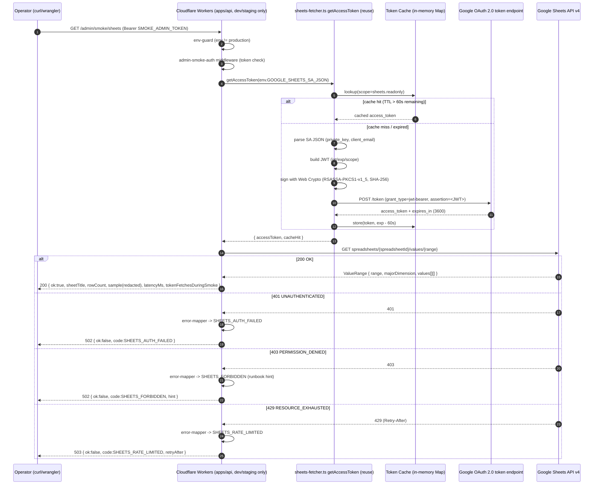
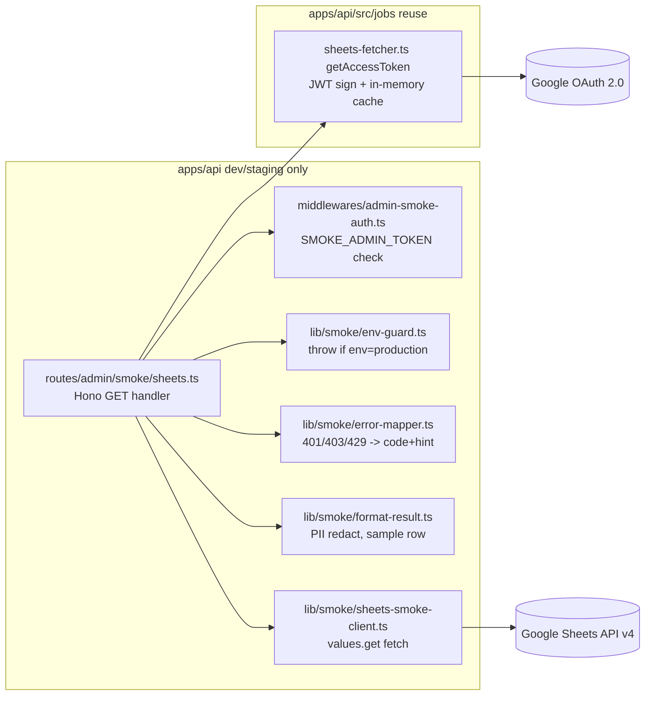

# UT-26 Phase 2 成果物 — smoke-test-design.md

| 項目 | 値 |
| --- | --- |
| タスク | Sheets API エンドツーエンド疎通確認 (UT-26) |
| Phase | 2 / 13（設計） |
| 作成日 | 2026-04-29 |
| 状態 | spec_created |
| 副成果物 | `cache-and-error-mapping.md`（同フォルダ） |

---

## 1. 設計の目的

Phase 1 で確定した「Workers Edge Runtime 上での実機認証保証 + 403 切り分け runbook 化」要件を、シーケンス図 / モジュール構成 / 認可境界 / アクセストークンキャッシュ ADR に分解し、Phase 3 の代替案レビューが結論を出せる粒度で固定する。`apps/api/src/jobs/sheets-fetcher.ts` (UT-03 既存実装) の `getAccessToken` を再利用前提とし、smoke route は `apps/api` 内に閉じ production には露出させない。

---

## 2. シーケンス図（Mermaid）

---

## 3. モジュール構成図（Mermaid）

---

## 4. ファイル一覧（新規・修正）

### 4.1 新規作成

| パス | 役割 | 主な依存 |
| --- | --- | --- |
| `apps/api/src/routes/admin/smoke-sheets.ts` | `GET /admin/smoke/sheets` Hono handler。env-guard + auth middleware + 疎通実行 | `hono`, `apps/api/src/jobs/sheets-fetcher` |
| `apps/api/src/routes/admin/smoke/index.ts` | `/admin/smoke/*` グループルータ集約 export | `hono` |
| `apps/api/src/middlewares/admin-smoke-auth.ts` | `SMOKE_ADMIN_TOKEN` Bearer 検証 middleware | `hono` |
| `apps/api/src/lib/smoke/env-guard.ts` | `env.ENVIRONMENT === "production"` を検出して 404 を返す | なし |
| `apps/api/src/lib/smoke/sheets-smoke-client.ts` | `values.get` の fetch wrapper（GET 専用） | Workers fetch |
| `apps/api/src/lib/smoke/error-mapper.ts` | 401/403/429/5xx → `{code, httpStatus, hint, runbookRef}` | なし |
| `apps/api/src/lib/smoke/format-result.ts` | レスポンスサマリー（sheetTitle / rowCount / sampleRedacted） | なし |
| `apps/api/test/routes/admin/smoke/sheets.test.ts` | unit + authorization 4 ケース | vitest, miniflare |
| `apps/api/test/lib/smoke/format-result.test.ts` | 純粋関数 unit | vitest |

### 4.2 修正

| パス | 修正内容 |
| --- | --- |
| `apps/api/src/index.ts` | `if (env.ENVIRONMENT !== "production") app.route("/admin/smoke", smokeRouter)` の形でガード付き登録 |
| `apps/api/wrangler.toml` | `[env.dev.vars]` / `[env.staging.vars]` に `SHEETS_SPREADSHEET_ID` 追加。`[env.production]` には smoke 関連 binding を追加しない |
| `apps/api/.dev.vars.example` | `GOOGLE_SHEETS_SA_JSON` / `SHEETS_SPREADSHEET_ID` / `SMOKE_ADMIN_TOKEN` のキー名のみ列挙（実値は op 参照） |

> 既存 `apps/api/src/jobs/sheets-fetcher.ts` (UT-03) は **modify 禁止**、reuse のみ。

---

## 5. JWT → token → API 呼出フロー（実装契約）

1. **JWT 構築**: `header={alg:"RS256",typ:"JWT"}`、`claim={iss:client_email, scope:"https://www.googleapis.com/auth/spreadsheets.readonly", aud:"https://oauth2.googleapis.com/token", iat:<now>, exp:<now+3600>}`。
2. **署名**: Workers Web Crypto API (`crypto.subtle.importKey` + `crypto.subtle.sign`) で RSASSA-PKCS1-v1_5 / SHA-256。private_key の `\n` は `replace(/\\n/g, "\n")` で正規化（UT-03 既存実装に準拠）。
3. **token 取得**: `POST https://oauth2.googleapis.com/token` body=`grant_type=urn:ietf:params:oauth:grant-type:jwt-bearer&assertion=<signed JWT>`。レスポンス `{access_token, expires_in, token_type:"Bearer"}`。
4. **キャッシュ書込**: scope key で in-memory Map に `{token, exp:Date.now()+expires_in*1000-60_000}` を保存。
5. **Sheets API 呼出**: `GET https://sheets.googleapis.com/v4/spreadsheets/{spreadsheetId}/values/{range}` ヘッダ `Authorization: Bearer <access_token>`。
6. **レスポンス整形**: `format-result.ts` で `{sheetTitle, rowCount, sampleRowsRedacted, latencyMs, tokenFetchesDuringSmoke}` を返す。

---

## 6. 認可境界（production 非露出の三段ガード）

| 段 | 種別 | 実装ポイント | 検証方法 |
| --- | --- | --- | --- |
| 1 | build-time / route mount ガード | `apps/api/src/index.ts` で `env.ENVIRONMENT !== "production"` 時のみ smoke router を `app.route()` 登録 | Phase 11 で staging / production 両方に curl し、production が 404 を返すことを確認 |
| 2 | runtime / env-guard | `lib/smoke/env-guard.ts` が handler 冒頭で `c.env.ENVIRONMENT === "production"` を検出し `c.notFound()` を返す（多重防御） | unit テスト（`apps/api/test/routes/admin/smoke/sheets.test.ts`）で production 環境を模擬し 404 を assert |
| 3 | runtime / token ガード | `SMOKE_ADMIN_TOKEN` Bearer 認証必須。production Cloudflare Secret には配置しない | Phase 11 で `bash scripts/cf.sh secret list --env production` に該当 token が存在しないことを確認 |
| ログ | logging ガード | SA JSON / access_token / Bearer token は構造化ログに含めない | PR 上で `rg -n 'BEGIN PRIVATE KEY\|access_token=' --hidden` がヒット 0 件 |

---

## 7. env / Secret マトリクス

| Secret / Variable | 種別 | dev (.dev.vars) | staging (Cloudflare Secret) | production | 注入経路 | 1Password Vault |
| --- | --- | --- | --- | --- | --- | --- |
| `GOOGLE_SHEETS_SA_JSON` | Secret | required (op 参照) | required (UT-25 配置済) | **未配置でよい（smoke route 不在）** | `wrangler secret put` / `.dev.vars` (op run) | UBM-Hyogo / staging |
| `SHEETS_SPREADSHEET_ID` | Variable | required | required | 不要 | `wrangler.toml` `[env.*.vars]` | UBM-Hyogo / staging |
| `SMOKE_ADMIN_TOKEN` | Secret | required | required | **配置しない** | `wrangler secret put --env staging` | UBM-Hyogo / staging |
| `SHEETS_SMOKE_RANGE` | Variable | A1:Z10（任意デフォルト） | A1:Z10 | 不要 | `wrangler.toml` `[vars]` | - |
| smoke route mount | Config | enabled | enabled | **disabled** | `apps/api/src/index.ts` の env 分岐 | - |

> Decision (Phase 1 → 2): UT-26 は env 名を **`GOOGLE_SHEETS_SA_JSON`** に統一する。仕様書の `GOOGLE_SHEETS_SA_JSON` 表記揺れは採用しない（既存 `apps/api/src/jobs/sheets-fetcher.ts` 実装に整合）。

---

## 8. モジュール設計（input / output / 副作用 / reuse-or-new）

| # | モジュール | パス | input | output / 副作用 | reuse / new |
| --- | --- | --- | --- | --- | --- |
| 1 | smoke route entry | `apps/api/src/routes/admin/smoke-sheets.ts` | `Hono.Request`（Bearer `SMOKE_ADMIN_TOKEN`） | `200 {ok:true,...}` / `401` / `404` / `502` / `503`、構造化ログ出力 | new |
| 2 | env-guard | `apps/api/src/lib/smoke/env-guard.ts` | `c.env.ENVIRONMENT` | production 時 `c.notFound()` | new |
| 3 | admin-smoke-auth | `apps/api/src/middlewares/admin-smoke-auth.ts` | `Authorization` ヘッダ、`env.SMOKE_ADMIN_TOKEN` | mismatch 時 401 | new |
| 4 | sheets auth client | `apps/api/src/jobs/sheets-fetcher.ts` 内 `getAccessToken` | `env.GOOGLE_SHEETS_SA_JSON`, scope | `{accessToken, cacheHit}` | **reuse**（modify 禁止） |
| 5 | token cache | sheets-fetcher 内蔵 in-memory Map | scope key | cached or null | reuse |
| 6 | sheets smoke client | `apps/api/src/lib/smoke/sheets-smoke-client.ts` | `accessToken`, `spreadsheetId`, `range` | `ValueRange` または throw | new |
| 7 | error-mapper | `apps/api/src/lib/smoke/error-mapper.ts` | `Response.status`, `body` | `{code, httpStatus, hint, runbookRef}` | new |
| 8 | format-result | `apps/api/src/lib/smoke/format-result.ts` | `ValueRange`, meta | PII redact 済み JSON | new |

---

## 9. formId vs spreadsheetId の出典コメント方針

苦戦箇所 #3（`formId` と `spreadsheetId` 取り違え）への設計対応として、以下を**必須**とする。

1. **wrangler.toml**: `SHEETS_SPREADSHEET_ID` の値を設定する箇所の直前に、コメントで「Google Forms の formId（`119ec539YYGmkUEnSYlhI-zMXtvljVpvDFMm7nfhp7Xg`）ではなく、回答先 Google Sheets の spreadsheetId であること。Forms「回答」タブ → 連携シート URL の `/spreadsheets/d/<ID>/edit` から取得する」を記載する。
2. **.dev.vars.example**: 同様のコメントを記載し、誤って formId をコピーすることを防ぐ。
3. **smoke route 内**: `c.env.SHEETS_SPREADSHEET_ID` を参照する箇所のすぐ近くに `// NOTE: formId とは別物。spreadsheets URL から取得した spreadsheetId` コメントを残す。
4. **runbook (Phase 11)**: 403 切り分け 4 候補のうち (d) 取り違えチェックの手順を、(a) Forms 「回答」タブの連携先 URL を確認、(b) `wrangler secret list` 系で値の末尾 4 桁を比較、として明記。

---

## 10. 苦戦箇所 → 設計対応索引

| # | 苦戦箇所 | 受け止めるモジュール / 仕組み |
| --- | --- | --- |
| 1 | fetch mock 差分 | smoke route 自体が実 API e2e を担う。Phase 11 で実機実行 |
| 2 | SA 権限漏れ | `error-mapper.ts` の 403 → 4 候補（SA 共有 / JSON 改行 / API 有効化 / spreadsheetId 取り違え）+ Phase 11 troubleshooting-runbook |
| 3 | formId vs spreadsheetId | `wrangler.toml` / `.dev.vars.example` / route 内コメントで出典明記（本ドキュメント 9 章） |
| 4 | wrangler dev 制約 | Phase 5 runbook で `wrangler dev --remote`（preview モード）を推奨し `--local` は禁止 |
| 5 | token TTL とキャッシュ | `cache-and-error-mapping.md` の ADR-CACHE-001（in-memory Map、TTL = `expires_in - 60s`、isolate 越境は best-effort） |

---

## next: Phase 3 へ引き渡す事項

- **base case**: `apps/api/src/routes/admin/smoke-sheets.ts` を中心とした dev/staging 限定 Hono route + 三段ガード + sheets-fetcher reuse の構成
- **代替案レビューの不変制約**: production 露出禁止の三段ガード、sheets-fetcher modify 禁止、env 名 `GOOGLE_SHEETS_SA_JSON`
- **副成果物**: `cache-and-error-mapping.md` のキャッシュ ADR と 401/403/429 mapping を Phase 3 セルフレビュー入力として渡す
- **苦戦箇所索引**: 5 件すべてが設計上のモジュールに紐づき、Phase 3 self-review チェックリストとして再利用可能
