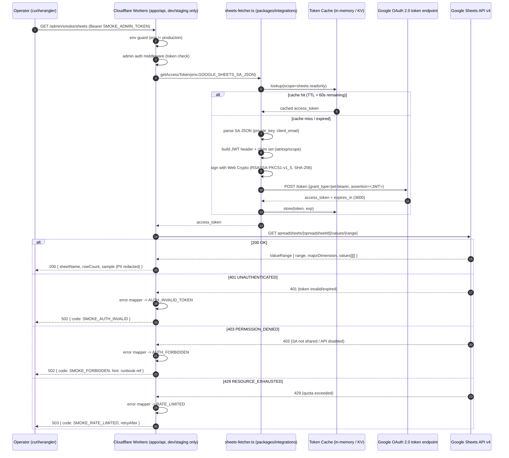

# Phase 2: 設計

## メタ情報

| 項目 | 値 |
| --- | --- |
| タスク名 | Sheets API エンドツーエンド疎通確認 (UT-26) |
| Phase 番号 | 2 / 13 |
| Phase 名称 | 設計 |
| 作成日 | 2026-04-29 |
| 前 Phase | 1 (要件定義) |
| 次 Phase | 3 (設計レビュー) |
| 状態 | spec_created |
| タスク分類 | specification-design |

## 目的

Phase 1 で確定した「Workers Edge Runtime 上での実機認証保証 + 403 切り分け runbook 化」要件を、シーケンス図 / モジュール構成 / 認可境界 / アクセストークンキャッシュ / 401・403・429 error mapping に分解し、Phase 3 のレビューが代替案比較で結論を出せる粒度の設計入力を作成する。`apps/api/src/jobs/sheets-fetcher.ts`（UT-03 成果）と `GOOGLE_SHEETS_SA_JSON`（UT-25 成果）を再利用前提とし、smoke route は `apps/api` 内に閉じ production には露出させない。

## 実行タスク

1. JWT 生成 → OAuth token 取得 → `spreadsheets.values.get` の e2e フローを Mermaid シーケンス図で固定する（完了条件: Workers / Google OAuth / Google Sheets API / Service Account JSON が node として現れ、二回目呼び出しでキャッシュが OAuth fetch を skip する分岐が表現されている）。
2. dev / staging 環境別の env / Secret マトリクスを表化する（完了条件: 3 Secret × 2 環境すべてに注入経路と production 不在の保証が明記されている）。
3. モジュール設計（smoke route entry / sheets-auth 再利用 contract / token cache adapter / response formatter / error mapper）を擬似 export 仕様で記述する（完了条件: 各モジュールに input / output / 副作用 / 再利用判断が記載）。
4. アクセストークンキャッシュ設計（in-memory 第一案 / KV 補助案）を ADR 形式で固定する（完了条件: TTL・キー設計・isolate 越境時の挙動・テスト方法が決定）。
5. 401 / 403 / 429 の error mapping を `outputs/phase-02/cache-and-error-mapping.md` に分離記述する（完了条件: 各ステータスに「観測される Google エラー本文 / 切り分け手順 / 想定原因 3 件以上 / runbook ステップ」が紐づく）。
6. production 露出禁止の認可境界設計を確定する（完了条件: `wrangler.toml` の env 分岐 + `SMOKE_ADMIN_TOKEN` Bearer の二段ガードが図と表に明記され、`[env.production]` で smoke route が import されない構成が示されている）。
7. 苦戦箇所 5 件（fetch mock 差分 / SA 権限漏れ / formId vs spreadsheetId / wrangler dev 制約 / token TTL）を設計内で受け止める箇所を明示する（完了条件: 各苦戦箇所が設計上のどのモジュール / runbook ステップで対応されるかが索引表で繋がる）。

## 参照資料

| 種別 | パス | 用途 |
| --- | --- | --- |
| 必須 | docs/30-workflows/ut-26-sheets-api-e2e-smoke-test/phase-01.md | 真の論点・4条件・命名規則チェックリスト |
| 必須 | docs/30-workflows/unassigned-task/UT-26-sheets-api-e2e-smoke-test.md | 苦戦箇所原典 |
| 必須 | docs/30-workflows/unassigned-task/UT-03-sheets-api-auth-setup.md | sheets-fetcher.ts の実装契約 |
| 必須 | docs/30-workflows/unassigned-task/UT-25-cloudflare-secrets-sa-json-deploy.md | Secret 配置経路 |
| 必須 | .claude/skills/aiworkflow-requirements/references/architecture-overview-core.md | apps/api 境界 |
| 必須 | .claude/skills/aiworkflow-requirements/references/api-endpoints.md | dev 限定 smoke route 命名規約 |
| 必須 | .claude/skills/aiworkflow-requirements/references/deployment-secrets-management.md | SA JSON 取り扱い |
| 参考 | https://developers.google.com/sheets/api/reference/rest/v4/spreadsheets.values/get | Sheets API v4 |
| 参考 | https://developers.google.com/identity/protocols/oauth2/service-account | SA OAuth 2.0 flow |
| 参考 | https://developers.cloudflare.com/workers/runtime-apis/web-crypto/ | Workers Web Crypto API（RSA-SHA256） |

## シーケンス図 (Mermaid)



## モジュール構成図 (Mermaid)

```mermaid
flowchart LR
  subgraph apps/api (dev/staging only)
    Route["routes/admin/smoke/sheets/index.ts\n(Hono GET handler)"]
    Mw["middlewares/admin-smoke-auth.ts\n(SMOKE_ADMIN_TOKEN check)"]
    Mapper["lib/smoke/error-mapper.ts\n(401/403/429 -> code+hint)"]
    Fmt["lib/smoke/response-formatter.ts\n(PII redact, sample row)"]
    Guard["lib/smoke/env-guard.ts\n(throw if env=production)"]
  end
  subgraph packages/integrations
    Auth["sheets-fetcher.ts\n(getAccessToken, JWT sign, cache)"]
  end
  Route --> Guard --> Mw --> Auth --> Sheets[Google Sheets API v4]
  Auth -. reuse .-> Cache[(in-memory Map / optional KV)]
  Route --> Mapper
  Route --> Fmt
```

## 環境変数 / dependency マトリクス

| Secret / Variable | 種別 | dev (.dev.vars) | staging (Cloudflare Secret) | production | 注入経路 | 1Password Vault |
| --- | --- | --- | --- | --- | --- | --- |
| `GOOGLE_SHEETS_SA_JSON` | Secret | required | required (UT-25 配置済) | **未配置でよい（smoke route 自体が無効）** | `wrangler secret put` / `.dev.vars` | UBM-Hyogo / staging |
| `SHEETS_SPREADSHEET_ID` | Variable | required | required | 不要 | `wrangler.toml` `[env.staging.vars]` | UBM-Hyogo / staging |
| `SMOKE_ADMIN_TOKEN` | Secret | required | required | 不要 | `wrangler secret put --env staging` | UBM-Hyogo / staging |
| `SHEETS_SMOKE_RANGE` | Variable | A1:C5 等の小範囲 | A1:C5 等の小範囲 | 不要 | `wrangler.toml` `[vars]` | - |
| `[env.production]` smoke route mount | Config | n/a | n/a | **must be absent** | `wrangler.toml` の env 分岐 / build flag | - |

| 依存ライブラリ | 入手元 | 再利用 / 新設 | 備考 |
| --- | --- | --- | --- |
| Hono | 既存 `apps/api` | reuse | route 登録のみ |
| `sheets-fetcher.ts` | UT-03 成果 | reuse（modify 禁止） | `getAccessToken()` を呼ぶのみ |
| Web Crypto API | Workers Runtime | reuse | RSA-SHA256 署名は sheets-fetcher.ts 内に閉じる |
| logger（あれば） | `apps/api/src/lib/logger.ts` | reuse if exists | structured log で event=`sheets_smoke` |

## モジュール設計

| # | モジュール | パス（提案） | 入力 | 出力 / 副作用 | 再利用 / 新設 |
| --- | --- | --- | --- | --- | --- |
| 1 | Smoke route entry | `apps/api/src/routes/admin/smoke-sheets.ts` | `Hono.Request`（Bearer `SMOKE_ADMIN_TOKEN`） | 200 { sheetName, rowCount, sample[] } / 502 / 503 | new |
| 2 | Env guard | `apps/api/src/lib/smoke/env-guard.ts` | `Env`（`ENVIRONMENT` / wrangler env name） | env=production の場合 throw / 404 | new |
| 3 | Admin smoke auth middleware | `apps/api/src/middlewares/admin-smoke-auth.ts` | Authorization header | unauthorized で 401 | new（既存 admin auth と共通化検討は Phase 3 議題） |
| 4 | Sheets auth client | `apps/api/src/jobs/sheets-fetcher.ts` | `GOOGLE_SHEETS_SA_JSON`、scope | `access_token` | reuse（UT-03） |
| 5 | Token cache adapter | `apps/api/src/jobs/sheets-fetcher.ts` 内 or `lib/smoke/token-cache.ts` | scope key | `cached access_token` or null | reuse if exists / 新設も可（Phase 3 で確定） |
| 6 | Sheets fetcher (smoke) | `apps/api/src/lib/smoke/sheets-smoke-client.ts` | `spreadsheetId`, `range`, `access_token` | `ValueRange` | new（UT-09 fetcher と将来統合可能） |
| 7 | Error mapper | `apps/api/src/lib/smoke/error-mapper.ts` | `Response`（status / body） | `{ code, httpStatus, hint, runbookRef }` | new |
| 8 | Response formatter | `apps/api/src/lib/smoke/response-formatter.ts` | `ValueRange` | PII redact 済み JSON | new |

## アクセストークンキャッシュ設計

| 観点 | 決定 | 根拠 |
| --- | --- | --- |
| 第一案 | **in-memory `Map<scope, { token, exp }>` を sheets-fetcher.ts 内 module scope に保持** | 同一 isolate 内で 1h の TTL を満たすには十分。最も simple |
| 補助案 | KV 永続化（`SHEETS_TOKEN_KV`）はオプション | isolate 越境キャッシュが必要になった場合のみ。MVP では導入しない |
| TTL | `expires_in - 60s`（=3540s）を満了時刻として保持 | clock skew / latency バッファ |
| キー設計 | `sa:${client_email}:${scope}` | 将来 SA / scope 切替に備える |
| 失効戦略 | `Date.now() >= exp - 60_000` で再取得 | OAuth 仕様準拠 |
| isolate 越境 | キャッシュは保証しない（ベストエフォート） | 苦戦箇所 #5 を Phase 3 / Phase 11 で再評価 |
| 検証 | smoke route を 2 回連続で叩き、2 回目に OAuth fetch が省略されることを log で確認 | AC-4 と直結 |

> 詳細擬似コードと 401/403/429 mapping は `outputs/phase-02/cache-and-error-mapping.md` に分離。

## 401 / 403 / 429 Error Mapping（要旨。詳細は副成果物）

| HTTP | Google エラー | 内部 code | 想定原因（runbook 切り分け順） | 返却 HTTP |
| --- | --- | --- | --- | --- |
| 401 | UNAUTHENTICATED | `SMOKE_AUTH_INVALID` | (a) JWT 署名失敗 / (b) iat/exp ずれ / (c) JSON 改行コード破損 / (d) clock skew | 502 |
| 403 | PERMISSION_DENIED | `SMOKE_FORBIDDEN` | (a) SA メール未共有 / (b) Sheets API 無効 / (c) spreadsheetId と formId 取り違え / (d) scope 不足 | 502 |
| 429 | RESOURCE_EXHAUSTED | `SMOKE_RATE_LIMITED` | (a) 300 req/min/project 超過 / (b) per-user quota / (c) 並列叩き | 503（`Retry-After` を伝搬） |
| 5xx | INTERNAL / UNAVAILABLE | `SMOKE_UPSTREAM_ERROR` | Google 側障害 | 502 |

## 認可境界（production 露出禁止）

二段ガードで production から完全に切断する。

1. **build-time ガード**: `wrangler.toml` の `[env.production]` 配下では smoke route を含むモジュールを `main` から import しない。Hono ルーター登録は `if (env.ENVIRONMENT !== 'production')` で gate する（さらに `env-guard.ts` 内で実行時にも throw）。
2. **runtime ガード**: `SMOKE_ADMIN_TOKEN` Bearer 認証必須。token は staging Secret として配置、production には配置しない（Cloudflare 上に Secret が存在しないことが SoR）。
3. **logging ガード**: SA JSON / access_token / Bearer token はいかなる log にも出さない。`logger.redact` 規約 or `JSON.stringify` 前のフィルタを通す。
4. **PR 説明文ガード**: smoke 実行ログを PR に貼る場合は、access_token / SA email / private_key を伏字。Phase 11 の証跡 template に redact チェックリストを盛り込む。

## 苦戦箇所 → 設計対応索引

| # | 苦戦箇所 | 設計上の受け止め |
| --- | --- | --- |
| 1 | fetch mock 差分 | smoke route 自体が実 API への e2e fetch を担う（UT-03 のモックでは届かない領域）。Phase 11 で実機実行 |
| 2 | SA 権限漏れ | error-mapper の 403 切り分け 4 候補 + Phase 11 troubleshooting-runbook |
| 3 | formId vs spreadsheetId | 環境変数 `SHEETS_SPREADSHEET_ID` の値出典コメント（Forms「回答」タブの連携シート URL から取得）を `wrangler.toml` と `.dev.vars.example` に必須化 |
| 4 | wrangler dev 制約 | runbook で `wrangler dev`（remote/preview モード）を推奨し、`--local` は使わない旨を明記 |
| 5 | token TTL とキャッシュ | キャッシュ設計で `exp - 60s` で再取得、isolate 越境は best-effort と明示 |

## 実行手順

### ステップ 1: Phase 1 入力の取り込み

- 真の論点 / 4条件 / 命名規則チェックリスト 5 観点を取り込む。
- `apps/api/src/routes/`、`apps/api/src/lib/`、`apps/api/src/jobs/sheets-fetcher.ts` の実態に対して命名規則を走査する。

### ステップ 2: シーケンス図とモジュール構成図の固定

- Mermaid 2 図を `outputs/phase-02/smoke-test-design.md` に固定。
- キャッシュヒット / ミスの分岐、401/403/429 の三本のエラー alt を必ず含める。

### ステップ 3: env / dependency マトリクスの記述

- 4 Secret/Variable × 3 環境（dev / staging / production）を table 化。
- production 列はすべて「未配置 / 不要」となることを設計上の不変条件として明記。

### ステップ 4: モジュール設計とキャッシュ ADR

- 8 モジュールに input / output / 副作用 / reuse-or-new を付与。
- キャッシュは in-memory 第一案、KV 補助案を ADR 形式で記述。

### ステップ 5: error-mapping の副成果物分離

- `outputs/phase-02/cache-and-error-mapping.md` に以下を記述。
  - キャッシュ実装擬似コード（`Map` / TTL / lookup-store）
  - 401/403/429/5xx の error mapper 擬似コード
  - 各エラーの runbook ステップ（Phase 11 での切り分け順番）
  - SA JSON parse 失敗 / private_key 改行破損の検出方針

### ステップ 6: 認可境界の固定

- `wrangler.toml` の env 分岐サンプル / build-time gate / runtime gate / log redact を表化。
- production には `SMOKE_ADMIN_TOKEN` も `GOOGLE_SHEETS_SA_JSON` smoke 用エントリも配置しない方針を確定。

## 統合テスト連携

| 連携先 Phase | 連携内容 |
| --- | --- |
| Phase 3 | 設計の代替案比較・PASS/MINOR/MAJOR 判定の base case |
| Phase 4 | 8 モジュール × テスト種別（unit / contract / smoke / authorization）の入力 |
| Phase 5 | 実装ランブックの擬似コード起点 |
| Phase 6 | 401/403/429 / SA JSON parse 失敗 / network 切断シナリオの網羅対象 |
| Phase 11 | 実機 smoke 手順 + troubleshooting runbook の起点 |

## 多角的チェック観点

- 不変条件 #1: smoke route は値の存在確認のみ（行数・任意 1 行のサンプル）。Sheets schema を列順 / カラム名でハードコード参照しない。
- 不変条件 #4: 取得のみ。書き込みなし。admin-managed data との混在なし。
- 不変条件 #5: D1 直接アクセスなし。smoke route は `apps/api` に閉じ、`apps/web` から呼ばない。
- 認可境界: production への二段ガード（build-time + runtime）。`SMOKE_ADMIN_TOKEN` 不在環境では smoke route が機能しない。
- Secret hygiene: SA JSON / access_token / Bearer token はログ・PR・証跡から redact。
- 無料枠: 月数十リクエスト想定で Workers / Sheets API いずれも free tier 内。
- 書き込み禁止: `spreadsheets.values.update` 等の write API は設計上呼ばない（fetcher が GET 専用）。

## サブタスク管理

| # | サブタスク | 担当 Phase | 状態 | 備考 |
| --- | --- | --- | --- | --- |
| 1 | シーケンス図 / 構成図 | 2 | spec_created | smoke-test-design.md |
| 2 | env / dependency マトリクス | 2 | spec_created | 4 Secret/Var × 3 環境 |
| 3 | モジュール設計 8 件 | 2 | spec_created | reuse / new 判断付き |
| 4 | キャッシュ ADR | 2 | spec_created | in-memory 第一案 + KV 補助案 |
| 5 | error mapping 副成果物分離 | 2 | spec_created | cache-and-error-mapping.md |
| 6 | 認可境界（production 露出禁止） | 2 | spec_created | 二段ガード |
| 7 | 苦戦箇所 → 設計対応索引 | 2 | spec_created | 5 件すべて受け止め先指定 |

## 成果物

| 種別 | パス | 説明 |
| --- | --- | --- |
| 設計 | outputs/phase-02/smoke-test-design.md | 全体構成・Mermaid・モジュール設計・認可境界・キャッシュ ADR |
| 設計 | outputs/phase-02/cache-and-error-mapping.md | キャッシュ擬似コード・401/403/429 mapping・runbook ステップ |
| メタ | artifacts.json | Phase 2 状態の更新 |

## 完了条件

- [ ] Mermaid シーケンス図にキャッシュヒット / ミス分岐と 401/403/429 alt が表現されている
- [ ] モジュール構成図に env-guard / admin-smoke-auth / error-mapper / sheets-auth (reuse) が含まれる
- [ ] env / dependency マトリクスに production 列がすべて「未配置 / 不要」になっている
- [ ] 8 モジュールすべてに input / output / 副作用 / reuse-or-new が記述されている
- [ ] アクセストークンキャッシュの TTL / キー / 失効戦略が決定している
- [ ] 401 / 403 / 429 / 5xx の各 mapping に切り分け候補が 3 件以上紐づく
- [ ] 認可境界が build-time / runtime / log / PR の四面で固定されている
- [ ] 苦戦箇所 5 件すべてが設計対応索引に記載されている
- [ ] 成果物が 2 ファイル（smoke-test-design.md / cache-and-error-mapping.md）に分離されている

## タスク100%実行確認【必須】

- 全実行タスク（7 件）が `spec_created`
- 全成果物が `outputs/phase-02/` 配下に配置済み
- 異常系（401 / 403 / 429 / SA JSON parse 失敗 / wrangler dev 制約 / token TTL）の対応が設計に含まれる
- production への露出禁止が build-time / runtime の二段で保証されている
- artifacts.json の `phases[1].status` が `spec_created`
- artifacts.json の `phases[1].outputs` に 2 ファイルが列挙されている

## 次 Phase への引き渡し

- 次 Phase: 3 (設計レビュー)
- 引き継ぎ事項:
  - smoke-test-design.md / cache-and-error-mapping.md を代替案比較の base case として渡す
  - 認可境界（二段ガード）は代替案で変更されない不変制約として固定
  - キャッシュ ADR の in-memory 第一案 / KV 補助案を代替案評価の素材として渡す
  - 苦戦箇所 5 件の受け止め先索引を Phase 3 の self-review チェックリストに使う
- ブロック条件:
  - シーケンス図に 401/403/429 alt のいずれかが欠落
  - production 露出禁止が build-time のみ / runtime のみで二段になっていない
  - sheets-fetcher.ts に対する modify が設計内に紛れ込んでいる（reuse 制約違反）
  - SA JSON / access_token の log 出力経路が残っている
