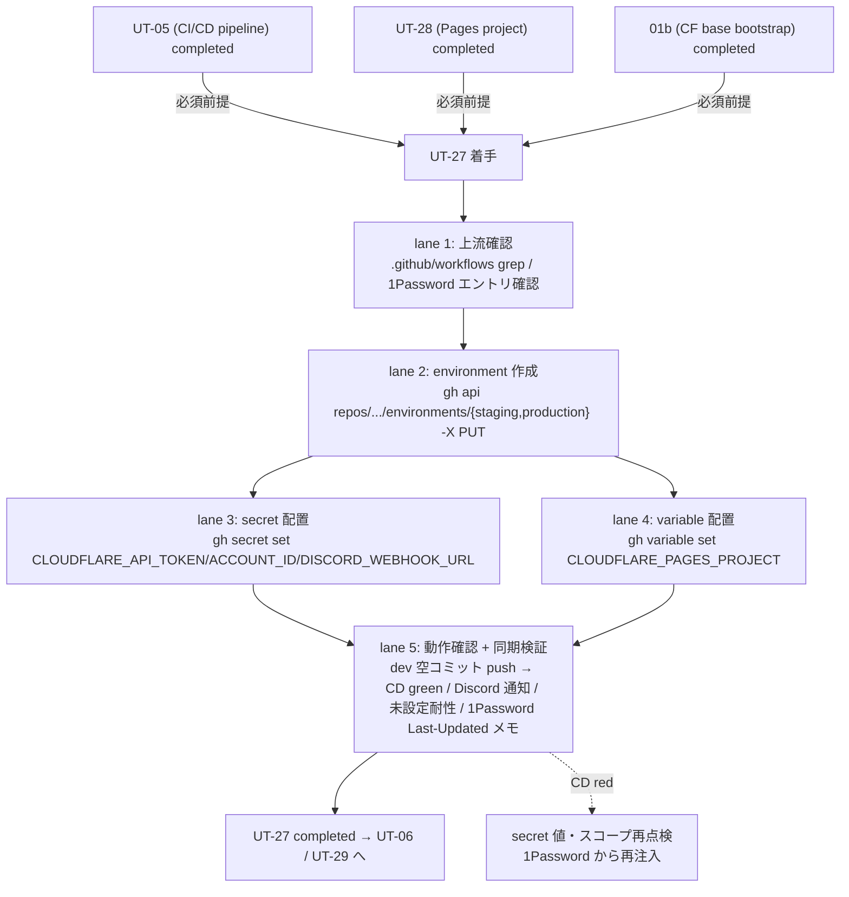

# Phase 2 成果物 — 設計

## 1. 設計目的

Phase 1 で確定した「上流 3 件完了前提・5 リスク同時封じ・Secret 3 件 + Variable 1 件・1Password 正本」要件を、配置トポロジ / SubAgent lane / state ownership / 配置決定マトリクス / `gh` CLI コマンド草案 / 動作確認手順に分解する。本 Phase の成果は仕様レベルであり、実 secret/variable 配置と environment 作成は Phase 13 ユーザー承認後に委ねる。

## 2. トポロジ（Mermaid）



## 3. SubAgent lane 設計

| lane | 役割 | 入力 | 出力 / 副作用 | 成果物 |
| --- | --- | --- | --- | --- |
| 1. 上流確認 | UT-05 / UT-28 / 01b の completed 状態 inventory | repository / 1Password エントリ | 確認ログ（値はマスク） | outputs/phase-13/verification-log.md §upstream |
| 2. environment 作成 | `staging` / `production` を `gh api ... -X PUT` で作成 | repo 名 + 認証 | environment 2 件作成 | outputs/phase-13/apply-runbook.md §environments |
| 3. secret 配置 | 3 件の Secret を `gh secret set` で配置（環境別 or repository） | 1Password 値（一時環境変数） | Secret 配置（値はマスク） | apply-runbook.md §secrets / op-sync-runbook.md |
| 4. variable 配置 | 1 件の Variable を `gh variable set` で配置 | UT-28 命名 | Variable 配置 | apply-runbook.md §variables |
| 5. 動作確認 + 同期検証 | dev 空コミット push → CD green / Discord 通知 / 未設定耐性 / 1Password Last-Updated メモ更新 | CD run URL / 1Password メモ | smoke ログ | outputs/phase-11/manual-smoke-log.md / outputs/phase-13/verification-log.md |

## 4. 配置決定マトリクス（repository-scoped vs environment-scoped）

| 名前 | 種別 | base scope | 同名併存 | 理由 |
| --- | --- | --- | --- | --- |
| `CLOUDFLARE_API_TOKEN` | Secret | environment-scoped（`staging` / `production`） | **禁止**（repository scope に置かない） | environment ごとに別 token を発行可能で漏洩時の影響限定。同名 repository scope を残すと監査時にどちらが効いているか曖昧化 |
| `CLOUDFLARE_ACCOUNT_ID` | Secret | repository-scoped | environment 別アカウントなら environment-scoped に切替 | MVP は staging / production 同一 Cloudflare アカウント想定 |
| `DISCORD_WEBHOOK_URL` | Secret | repository-scoped | チャンネル分離が必要なら environment-scoped に切替 | MVP は単一チャンネル想定 |
| `CLOUDFLARE_PAGES_PROJECT` | **Variable** | repository-scoped | プロジェクト命名が environment 別なら environment-scoped に切替 | `web-cd.yml` で `${{ vars.X }}-staging` の suffix 連結。Secret 化するとログマスクでデバッグ困難（親仕様 §「Variable にする理由」） |

> **既定方針**: 「同名 repository-scoped と environment-scoped の併存禁止」を運用ルールとする（どちらが効いているか曖昧化を防ぐ）。

## 5. Secret 一覧表

| 名前 | 値の出所 | 最小スコープ（Cloudflare 側） | 配置スコープ（GitHub 側） | 1Password 参照例 | 命名規則（Token 側） |
| --- | --- | --- | --- | --- | --- |
| `CLOUDFLARE_API_TOKEN` | 01b で発行 | `Account.Cloudflare Pages.Edit` / `Account.Workers Scripts.Edit` / `Account.D1.Edit` / `Account.Account Settings.Read` のみ | environment-scoped（staging / production 別 token 推奨） | `op://UBM-Hyogo/Cloudflare/api_token_staging` 等 | `ubm-hyogo-cd-{env}-{yyyymmdd}` |
| `CLOUDFLARE_ACCOUNT_ID` | 01b で取得 | N/A（識別子のみ） | repository-scoped | `op://UBM-Hyogo/Cloudflare/account_id` | N/A |
| `DISCORD_WEBHOOK_URL` | Discord 側で発行 | N/A | repository-scoped | `op://UBM-Hyogo/Discord/webhook_url` | N/A |

> 値そのものは payload / runbook / Phase outputs に**一切転記しない**。`op` 参照のみ可。

## 6. Variable 一覧表

| 名前 | 値の出所 | 配置スコープ | 値例 | 用途 |
| --- | --- | --- | --- | --- |
| `CLOUDFLARE_PAGES_PROJECT` | UT-28 で命名確定 | repository-scoped（または environment-scoped） | `ubm-hyogo-web` | `web-cd.yml` の `--project-name=${{ vars.X }}-staging` / `${{ vars.X }}` |

## 7. ファイル変更計画

| パス | 操作 | 編集者 | 注意 |
| --- | --- | --- | --- |
| `outputs/phase-13/apply-runbook.md` | 新規作成（lane 2 / 3 / 4） | lane 2-4 | environment 作成 / secret / variable 配置のコマンド系列。値は op 参照 only |
| `outputs/phase-13/op-sync-runbook.md` | 新規作成（lane 3） | lane 3 | 1Password ↔ GitHub 同期手順 / Last-Updated メモ運用 |
| `outputs/phase-13/verification-log.md` | 新規作成（lane 5） | lane 5 | 動作確認結果（CD run URL / 通知到達 / 未設定耐性確認）。secret 値はマスク |
| `outputs/phase-11/manual-smoke-log.md` | 新規作成（lane 5） | lane 5 | dev push smoke の log |
| `doc/01-infrastructure-setup/04-serial-cicd-secrets-and-environment-sync/` 配下 | 追記方針のみ（Phase 12） | Phase 12 | 同期手順の正本ドキュメント追記方針 |
| その他 | 変更しない | - | apps/web / apps/api / D1 / `.gitignore` / `.env` 等は触らない |

## 8. state ownership 表

| state | 物理位置 | owner | writer | reader | TTL / lifecycle |
| --- | --- | --- | --- | --- | --- |
| 1Password Environments エントリ（**正本**） | 1Password Vault `UBM-Hyogo` | 運用者 | 運用者（ローテーション時） | 開発者 / lane 3（同期時） | 永続 |
| GitHub Secret 値（派生） | repository / environment scope | UT-27 PR | lane 3（PUT 経由のみ） | CD ワークフロー | 永続。1Password 側更新時に再同期 |
| GitHub Variable 値（派生） | repository / environment scope | UT-27 PR | lane 4（PUT 経由のみ） | CD ワークフロー | 永続 |
| GitHub Environment（`staging` / `production`） | repository settings | UT-27 PR | lane 2（PUT 経由のみ） | CD ワークフロー | 永続 |
| 1Password Last-Updated メモ | 1Password Item Notes | lane 3 | lane 3（同期時） | 監査 | 永続。値ハッシュは記載しない |
| `apply-runbook.md` / `op-sync-runbook.md` | `outputs/phase-13/` | UT-27 PR | lane 2-5 | 監査 / 将来運用 | 永続（PR にコミット） |

> **重要境界**:
> - **正本は 1Password Environments**、GitHub Secrets / Variables は派生コピー。
> - GitHub UI 直編集を禁止（1Password 側を古くする drift 防止）。
> - secret 値は **いかなる Phase 成果物にも転記しない**。`op` 参照のみ記述する。
> - 同名 repository-scoped と environment-scoped を併存させない。

## 9. 1Password ↔ GitHub Secrets / Variables 同期手順（仕様レベル）

### 手動同期（MVP）

```bash
# 前提: gh auth login 済み / op signin 済み

# 1. 1Password から値を一時 export（ファイル化禁止 / 環境変数のみ）
export TMP_CF_TOKEN=$(op read "op://UBM-Hyogo/Cloudflare/api_token_staging")
export TMP_CF_ACCT=$(op read "op://UBM-Hyogo/Cloudflare/account_id")
export TMP_DISCORD=$(op read "op://UBM-Hyogo/Discord/webhook_url")

# 2. GitHub に PUT（--body は環境変数経由で値が history に残らない）
gh secret set CLOUDFLARE_API_TOKEN  --env staging    --body "$TMP_CF_TOKEN"
gh secret set CLOUDFLARE_API_TOKEN  --env production --body "$TMP_CF_TOKEN"  # 別 token 推奨
gh secret set CLOUDFLARE_ACCOUNT_ID --body "$TMP_CF_ACCT"
gh secret set DISCORD_WEBHOOK_URL   --body "$TMP_DISCORD"

# 3. 一時変数のクリア
unset TMP_CF_TOKEN TMP_CF_ACCT TMP_DISCORD

# 4. 1Password 側 Item Notes に Last-Updated 日時を追記
#    （値ハッシュは記載しない）
```

### 将来の `op` サービスアカウント化

- `1password/load-secrets-action` を CI に組み込み、GitHub Secrets を**派生コピーすら作らない**運用に移行する案。
- 移行時の障壁: SA トークンの管理 / ランナーごとの op CLI 導入 / `wrangler-action` の `apiToken:` パラメータとの整合。
- 本タスクでは方針言及のみ。実装は Phase 12 unassigned-task-detection に登録。

### 同期検証

- 1Password Item Notes の Last-Updated 日時を毎回更新する。
- ローテーション時: 1Password を先に更新 → 上記 bash で再同期 → CD run の green を確認 の順を厳守（GitHub UI 直編集は禁止）。

## 10. `gh` CLI コマンド草案（仕様レベル / 実 PUT は Phase 13）

```bash
# ===== 0. 上流確認（lane 1） =====
grep -nE "secrets\.|vars\." .github/workflows/{backend-ci,web-cd}.yml
op item get "Cloudflare" --vault UBM-Hyogo > /dev/null

# ===== 1. environment 作成（lane 2） =====
gh api repos/daishiman/UBM-Hyogo/environments/staging    -X PUT --silent
gh api repos/daishiman/UBM-Hyogo/environments/production -X PUT --silent

# ===== 2. secret 配置（lane 3） =====
# §9「手動同期」bash を実行

# ===== 3. variable 配置（lane 4） =====
export TMP_CF_PAGES_PROJECT="$(op read 'op://UBM-Hyogo/Cloudflare/pages_project_name')"
gh variable set CLOUDFLARE_PAGES_PROJECT --body "$TMP_CF_PAGES_PROJECT"
unset TMP_CF_PAGES_PROJECT

# ===== 4. 動作確認（lane 5） =====
git commit --allow-empty -m "chore(cd): trigger deploy-staging smoke [UT-27]"
git push origin dev
gh run watch  # backend-ci.yml / web-cd.yml deploy-staging green を確認

# ===== 5. 同期検証（lane 5） =====
gh secret list                       # 配置済み件数とスコープ確認
gh secret list --env staging
gh secret list --env production
gh variable list                     # CLOUDFLARE_PAGES_PROJECT が表示
# 1Password 側 Item Notes の Last-Updated メモを更新
```

> 値そのものは出力しない（`gh secret list` も値はマスクされる）。コピー＆ペーストして payload / runbook に貼り付ける運用は禁止。

## 11. API Token 最小スコープと命名規則

### 最小スコープ（Cloudflare User API Token）

- `Account.Cloudflare Pages.Edit`
- `Account.Workers Scripts.Edit`
- `Account.D1.Edit`
- `Account.Account Settings.Read`

> Global API Key の流用は厳禁。上記 4 スコープを超える Token を発行した場合、本タスクは GO せず 01b へ差し戻す（Phase 3 NO-GO 条件）。

### 命名規則

- Token 名: `ubm-hyogo-cd-{env}-{yyyymmdd}` 例: `ubm-hyogo-cd-staging-20260429`
- ローテーション履歴を Token 名で追跡可能にする
- 1Password Item Notes に発行日・スコープ・用途を併記

## 12. 動作確認手順

### dev push smoke

1. ワークツリー上で空コミット作成: `git commit --allow-empty -m "chore(cd): smoke [UT-27]"`
2. dev に push: `git push origin dev`
3. `gh run watch` で `backend-ci.yml` の `deploy-staging` green を確認
4. 同様に `web-cd.yml` の `deploy-staging` green を確認
5. Cloudflare ダッシュボードの Pages / Workers Deploys で staging 環境への deploy 履歴を確認

### Discord 通知確認

1. 上記 smoke と同タイミングで Discord チャンネルへの通知到達を確認
2. 通知文面に `success` / `failure` の判定が出ていること

### `DISCORD_WEBHOOK_URL` 未設定耐性確認（苦戦箇所 §3）

1. 一時的に `DISCORD_WEBHOOK_URL` を unset した状態（または別 worktree で空文字環境）を再現
2. CI run が「通知ステップを skip / early-return」して **CI 全体が success** で完了することを確認
3. `if: ${{ always() && secrets.X != '' }}` の評価不能問題に対し、env で受けてシェルで空文字判定する代替設計が `web-cd.yml` / `backend-ci.yml` 側に入っているか確認（入っていなければ Phase 12 unassigned-task に UT-05 へのフィードバックとして登録）

## 13. 環境変数 / Secret サマリ

| 種別 | 名前 | 用途 | 管理場所 |
| --- | --- | --- | --- |
| GitHub Token | `GH_TOKEN` / `gh auth login` | secret / variable / environment の PUT に必要な `actions:write` / `administration:write` | 実行者ローカル（リポジトリ未記録） |
| Cloudflare API Token | `CLOUDFLARE_API_TOKEN` | CD で Pages / Workers / D1 を操作 | 1Password Environments → GitHub Secrets |
| Cloudflare Account ID | `CLOUDFLARE_ACCOUNT_ID` | Cloudflare API のアカウント識別 | 1Password Environments → GitHub Secrets |
| Discord Webhook URL | `DISCORD_WEBHOOK_URL` | CI 結果通知 | 1Password Environments → GitHub Secrets |

> token / secret 値は payload / runbook / log / Phase outputs / `.env` に転記しない。

## 14. 引き渡し

Phase 3（設計レビュー）へ：
- base case = lane 1〜5 直列 / lane 3-4 部分並列の構造
- Secret 3 件 + Variable 1 件、配置スコープ確定済み
- 1Password 正本 / GitHub 派生 の境界確定
- `gh` CLI コマンド草案 bash 系列確定
- 動作確認手順 3 件（dev push / Discord / 未設定耐性）確定
- 上流 3 件完了を NO-GO 条件として再明示

## 15. 苦戦箇所への対応サマリ

| # | 苦戦箇所 | 本 Phase の受け皿 |
| --- | --- | --- |
| 1 | Environments / repository スコープ混在 | §4 配置決定マトリクス + 同名併存禁止運用ルール |
| 2 | Variable / Secret 判定 | §4 / §6 で `CLOUDFLARE_PAGES_PROJECT` を Variable で固定 + 理由明記 |
| 3 | `if: secrets.X != ''` 評価不能 | §12 動作確認手順「未設定耐性確認」 |
| 4 | 1Password ↔ GitHub 二重正本 drift | §8 state ownership + §9 同期手順 + Last-Updated メモ |
| 5 | API Token 過剰スコープ | §5 / §11 最小スコープ列 + Token 命名規則 |
| 6 | secret 値転記禁止 | §5 注釈 + §8 重要境界 + §9 一時変数 + unset + §10 注釈 |
