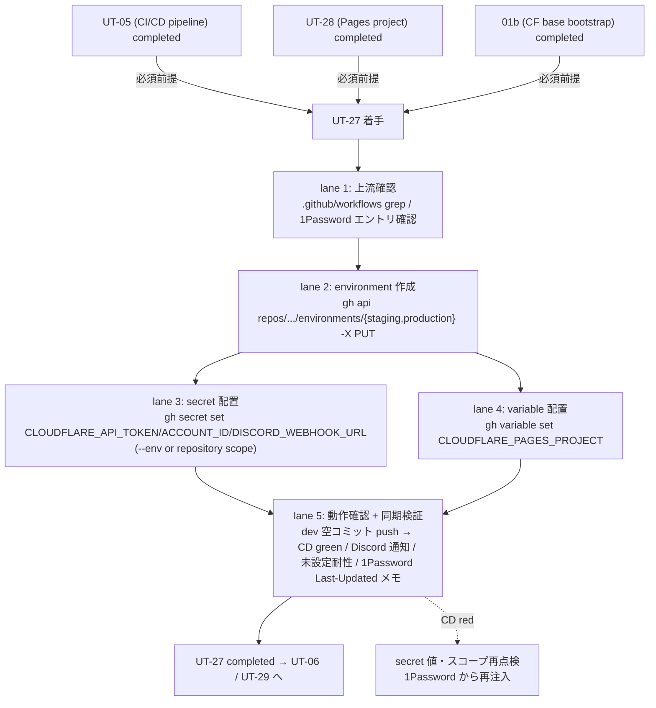

# Phase 2: 設計

## メタ情報

| 項目 | 値 |
| --- | --- |
| タスク名 | GitHub Secrets / Variables 配置実行 (ut-27-github-secrets-variables-deployment) |
| Phase 番号 | 2 / 13 |
| Phase 名称 | 設計 |
| 作成日 | 2026-04-29 |
| 前 Phase | 1 (要件定義) |
| 次 Phase | 3 (設計レビュー) |
| 状態 | completed |
| タスク種別 | implementation / NON_VISUAL / github_secrets_variables_cd_enablement |

## 目的

Phase 1 で確定した「上流 3 件完了前提・5 リスク同時封じ・Secret 3 件 + Variable 1 件・1Password 正本」要件を、配置トポロジ / SubAgent lane / state ownership / 配置決定マトリクス / `gh` CLI コマンド草案 / 動作確認手順に分解し、Phase 3 のレビューが代替案比較で結論を出せる粒度の設計入力を作成する。本 Phase の成果は仕様レベルであり、実 secret/variable 配置と environment 作成は Phase 13 ユーザー承認後に委ねる。

## 実行タスク

1. 5 ステップトポロジ（前提確認 → environment 作成 → secret/variable PUT → 動作確認 → 同期検証）を Mermaid で固定する。
2. SubAgent lane 5 本（lane 1 上流確認 / lane 2 environment 作成 / lane 3 secret 配置 / lane 4 variable 配置 / lane 5 動作確認 + 同期検証）を表化する。
3. repository-scoped vs environment-scoped 配置決定マトリクスを Secret / Variable ごとに確定する。
4. Secret 一覧表（最小スコープ列付き）と Variable 一覧表を確定する。
5. 1Password Environments → GitHub Secrets / Variables の同期手順（手動 + 将来 `op` SA 化）を仕様化する。
6. `gh` CLI コマンド草案（`gh secret set` / `gh variable set` / `gh api repos/.../environments/...`）を bash 系列で固定する。
7. 動作確認手順（dev push → backend-ci.yml deploy-staging green / web-cd.yml deploy-staging green / Discord 通知 / 未設定耐性）を仕様化する。
8. API Token 最小スコープ方針と Token 命名規則を固定する。
9. secret 値転記禁止の運用境界（payload / runbook / Phase outputs / ログ）を確定する。

## 依存タスク順序（上流 3 件完了必須）— 重複明記 2/3

> **UT-05（CI/CD パイプライン実装）/ UT-28（Cloudflare Pages プロジェクト作成）/ 01b（Cloudflare base bootstrap）の 3 件が completed であることが本 Phase の必須前提である。**
> 未完了で本 Phase の設計を実装に移すと、(a) 配置すべき secret/variable のキー名・スコープが workflow と乖離する、(b) `CLOUDFLARE_PAGES_PROJECT` の値が確定しない、(c) `CLOUDFLARE_API_TOKEN` の発行スコープが決まらない、いずれの場合も配置直後に CI 401 / 404 / 値ミスマッチを起こす。Phase 3 の NO-GO 条件で再度 block ゲートを置く。

## 参照資料

| 種別 | パス | 用途 |
| --- | --- | --- |
| 必須 | docs/30-workflows/ut-27-github-secrets-variables-deployment/phase-01.md | 真の論点 / 4 条件 / 苦戦箇所割り当て |
| 必須 | docs/30-workflows/unassigned-task/UT-27-github-secrets-variables-deployment.md | 親仕様 §苦戦箇所・知見 |
| 必須 | .github/workflows/backend-ci.yml | secret/variable 参照キー |
| 必須 | .github/workflows/web-cd.yml | secret/variable 参照キー |
| 必須 | https://docs.github.com/en/rest/actions/secrets | Secrets REST API |
| 必須 | https://docs.github.com/en/rest/actions/variables | Variables REST API |
| 必須 | https://docs.github.com/en/rest/deployments/environments | Environments REST API |
| 参考 | CLAUDE.md「シークレット管理」 | 1Password 正本ポリシー |

## トポロジ (Mermaid)



## SubAgent lane 設計

| lane | 役割 | 入力 | 出力 / 副作用 | 成果物 |
| --- | --- | --- | --- | --- |
| 1. 上流確認 | UT-05 / UT-28 / 01b の completed 状態を inventory として確認 | repository / 1Password エントリ | 確認ログ（値はマスク） | outputs/phase-13/verification-log.md §upstream |
| 2. environment 作成 | `staging` / `production` を `gh api ... -X PUT` で作成 | repo 名 + 認証 | environment 2 件作成 | outputs/phase-13/apply-runbook.md §environments |
| 3. secret 配置 | 3 件の Secret を `gh secret set` で配置（環境別または repository） | 1Password 値 | Secret 配置（値はマスク） | apply-runbook.md §secrets / op-sync-runbook.md |
| 4. variable 配置 | 1 件の Variable を `gh variable set` で配置 | UT-28 命名 | Variable 配置 | apply-runbook.md §variables |
| 5. 動作確認 + 同期検証 | dev 空コミット push → CD green / Discord 通知 / 未設定耐性 / 1Password Last-Updated メモ | CD run URL / 1Password メモ | smoke ログ | outputs/phase-11/manual-smoke-log.md / outputs/phase-13/verification-log.md |

## 配置決定マトリクス（repository-scoped vs environment-scoped）

| 名前 | 種別 | base scope | 推奨追加配置 | 理由 |
| --- | --- | --- | --- | --- |
| `CLOUDFLARE_API_TOKEN` | Secret | environment-scoped（`staging` / `production`） | repository-scoped にも安全側でコピーしない | environment ごとに別 token を発行可能（漏洩時の影響限定）。同名 repository scope を残すと environment-scoped に上書きされて意図せぬ token 漏洩経路となるため**置かない** |
| `CLOUDFLARE_ACCOUNT_ID` | Secret | repository-scoped | environment-scoped 不要（staging / production 同一 Cloudflare アカウント想定） | アカウントが分かれる場合のみ environment-scoped に切替 |
| `DISCORD_WEBHOOK_URL` | Secret | repository-scoped | チャンネル分離が必要なら environment-scoped に切替 | MVP は単一チャンネル想定で repository-scoped |
| `CLOUDFLARE_PAGES_PROJECT` | **Variable** | repository-scoped | プロジェクト命名が environment 別なら environment-scoped に切替 | `web-cd.yml` で `${{ vars.X }}-staging` の suffix 連結。Secret 化するとログマスクでデバッグ困難（親仕様 §「Variable にする理由」） |

> **既定方針**: `environment` 宣言があるジョブからは environment-scoped が優先解決される性質を逆手に取り、CLOUDFLARE_API_TOKEN のように環境別 token が望ましい値は **environment-scoped にのみ配置**する。同名 repository-scoped を残すと監査時に「どちらが効いているか」が曖昧化するため、**「同名併存禁止」を運用ルール**にする。

## Secret 一覧表

| 名前 | 値の出所 | 最小スコープ（Cloudflare 側） | 配置スコープ（GitHub 側） | 1Password 参照例 | 命名規則（Token 側） |
| --- | --- | --- | --- | --- | --- |
| `CLOUDFLARE_API_TOKEN` | 01b で発行 | `Account.Cloudflare Pages.Edit` / `Account.Workers Scripts.Edit` / `Account.D1.Edit` / `Account.Account Settings.Read` のみ | environment-scoped（staging / production 別 token 推奨） | `op://UBM-Hyogo/Cloudflare/api_token_staging` 等 | `ubm-hyogo-cd-{env}-{yyyymmdd}` |
| `CLOUDFLARE_ACCOUNT_ID` | 01b で取得 | N/A（識別子のみ） | repository-scoped | `op://UBM-Hyogo/Cloudflare/account_id` | N/A |
| `DISCORD_WEBHOOK_URL` | Discord 側で発行 | N/A | repository-scoped | `op://UBM-Hyogo/Discord/webhook_url` | N/A |

> 値そのものは payload / runbook / Phase outputs に**一切転記しない**。`op` 参照は記述してよい。

## Variable 一覧表

| 名前 | 値の出所 | 配置スコープ | 値例 | 用途 |
| --- | --- | --- | --- | --- |
| `CLOUDFLARE_PAGES_PROJECT` | UT-28 で命名確定 | repository-scoped（または environment-scoped） | `<UT-28 確定値>` | `web-cd.yml` の `--project-name=${{ vars.X }}-staging` / `${{ vars.X }}` |

## ファイル変更計画

| パス | 操作 | 編集者 | 注意 |
| --- | --- | --- | --- |
| `outputs/phase-13/apply-runbook.md` | 新規作成（lane 2 / 3 / 4） | lane 2-4 | environment 作成 / secret / variable 配置のコマンド系列。値は op 参照 only |
| `outputs/phase-13/op-sync-runbook.md` | 新規作成（lane 3） | lane 3 | 1Password ↔ GitHub 同期手順（手動・将来 `op` SA 化方針）/ Last-Updated メモ運用 |
| `outputs/phase-13/verification-log.md` | 新規作成（lane 5） | lane 5 | 動作確認結果（CD run URL / 通知到達 / 未設定耐性確認）。secret 値はマスク |
| `outputs/phase-11/manual-smoke-log.md` | 新規作成（lane 5） | lane 5 | dev push smoke の log |
| `doc/01-infrastructure-setup/04-serial-cicd-secrets-and-environment-sync/` 配下 | 追記方針のみ（Phase 12） | Phase 12 | 同期手順の正本ドキュメント追記方針 |
| その他 | 変更しない | - | apps/web / apps/api / D1 / `.gitignore` / `.env` 等は触らない |

## 環境変数 / Secret

| 種別 | 名前 | 用途 | 管理場所 |
| --- | --- | --- | --- |
| GitHub Token | `GH_TOKEN`（または `gh auth login`） | secret / variable / environment の PUT に必要な `actions:write` / `administration:write`（environments 操作用） | 実行者ローカル `gh auth login`。本タスクで新規導入しない |
| Cloudflare API Token | `CLOUDFLARE_API_TOKEN` | CD で Pages / Workers / D1 を操作 | 1Password Environments → GitHub Secrets（手動同期） |
| Cloudflare Account ID | `CLOUDFLARE_ACCOUNT_ID` | Cloudflare API のアカウント識別 | 1Password Environments → GitHub Secrets |
| Discord Webhook URL | `DISCORD_WEBHOOK_URL` | CI 結果通知 | 1Password Environments → GitHub Secrets |

> token / secret 値は payload / runbook / log / Phase outputs に転記しない。`.env` にも実値を書かない（CLAUDE.md ローカル `.env` 運用ルール準拠）。

## state ownership 表

| state | 物理位置 | owner | writer | reader | TTL / lifecycle |
| --- | --- | --- | --- | --- | --- |
| 1Password Environments エントリ（**正本**） | 1Password Vault `UBM-Hyogo` | 運用者 | 運用者（ローテーション時） | 開発者 / lane 3（同期時） | 永続。ローテーション時に上書き |
| GitHub Secret 値（派生） | repository / environment scope | UT-27 PR | lane 3（PUT 経由のみ） | CD ワークフロー | 永続。1Password 側更新時に再同期 |
| GitHub Variable 値（派生） | repository / environment scope | UT-27 PR | lane 4（PUT 経由のみ） | CD ワークフロー | 永続。UT-28 命名変更時に再同期 |
| GitHub Environment（`staging` / `production`） | repository settings | UT-27 PR | lane 2（PUT 経由のみ） | CD ワークフロー | 永続 |
| 1Password Last-Updated メモ | 1Password Item Notes | lane 3 | lane 3（同期時） | 監査 | 永続。同期日時を記録（ハッシュは記載しない） |
| `apply-runbook.md` / `op-sync-runbook.md` | `outputs/phase-13/` | UT-27 PR | lane 2-5 | 監査 / 将来運用 | 永続（PR にコミット） |

> **重要境界**:
> - **正本は 1Password Environments**。GitHub Secrets / Variables は派生コピー。GitHub UI 側で直接編集して 1Password を古くする drift を禁止する。
> - secret 値は**いかなる Phase 成果物にも転記しない**。op 参照（`op://Vault/Item/Field`）のみ記述する。
> - 同名の repository-scoped と environment-scoped を併存させない（どちらが効いているか曖昧化を防ぐ）。

## 1Password ↔ GitHub Secrets / Variables 同期手順（仕様レベル）

### 手動同期（MVP）

```bash
# 前提: gh auth login 済み / op signin 済み

# 1. 1Password から値を一時 export（環境変数のみ。ファイル化禁止）
export TMP_CF_TOKEN=$(op read "op://UBM-Hyogo/Cloudflare/api_token_staging")
export TMP_CF_ACCT=$(op read "op://UBM-Hyogo/Cloudflare/account_id")
export TMP_DISCORD=$(op read "op://UBM-Hyogo/Discord/webhook_url")

# 2. GitHub に PUT（--body は環境変数経由で値が history に残らない）
gh secret set CLOUDFLARE_API_TOKEN  --env staging    --body "$TMP_CF_TOKEN"
gh secret set CLOUDFLARE_API_TOKEN  --env production --body "$TMP_CF_TOKEN"  # 別 token を推奨
gh secret set CLOUDFLARE_ACCOUNT_ID --body "$TMP_CF_ACCT"
gh secret set DISCORD_WEBHOOK_URL   --body "$TMP_DISCORD"

# 3. 一時変数のクリア
unset TMP_CF_TOKEN TMP_CF_ACCT TMP_DISCORD

# 4. 1Password 側 Item Notes に Last-Updated 日時を追記
#    （値ハッシュは記載しない。値の内容を間接的に推測されるリスクを避ける）
```

### 将来の `op` サービスアカウント化（Phase 12 で別タスク化）

- `1password/load-secrets-action` を CI に組み込み、GitHub Secrets を**派生コピーすら作らない**運用に移行する案。
- 移行時の障壁: SA トークンの管理（GitHub Secret として SA トークンが 1 件残る）/ ランナーごとの op CLI 導入 / 監査経路の再設計。
- 本タスクでは方針言及のみ。実装は Phase 12 unassigned-task-detection に登録。

### 同期検証

- 1Password Item Notes の Last-Updated 日時を毎回更新する。
- ローテーション時は 1Password を先に更新 → 上記 bash で再同期 → CD run の green を確認 の順を厳守する（GitHub UI 直編集は禁止）。

## `gh` CLI コマンド草案（仕様レベル / 実 PUT は Phase 13）

```bash
# ===== 0. 上流確認（lane 1） =====
grep -nE "secrets\.|vars\." .github/workflows/{backend-ci,web-cd}.yml
op item get "Cloudflare" --vault UBM-Hyogo > /dev/null

# ===== 1. environment 作成（lane 2） =====
gh api repos/daishiman/UBM-Hyogo/environments/staging    -X PUT --silent
gh api repos/daishiman/UBM-Hyogo/environments/production -X PUT --silent

# ===== 2. secret 配置（lane 3） =====
# 上記「手動同期」bash を実行

# ===== 3. variable 配置（lane 4） =====
export TMP_CF_PAGES_PROJECT="$(op read 'op://UBM-Hyogo/Cloudflare/pages_project_name')"
gh variable set CLOUDFLARE_PAGES_PROJECT --body "$TMP_CF_PAGES_PROJECT"
unset TMP_CF_PAGES_PROJECT

# ===== 4. 動作確認（lane 5） =====
git commit --allow-empty -m "chore(cd): trigger deploy-staging smoke [UT-27]"
git push origin dev
gh run watch  # backend-ci.yml / web-cd.yml deploy-staging が green であることを確認

# ===== 5. 同期検証（lane 5） =====
gh secret list                                             # 配置済み件数とスコープ確認
gh secret list --env staging
gh secret list --env production
gh variable list                                           # CLOUDFLARE_PAGES_PROJECT が表示
# 1Password 側 Item Notes の Last-Updated メモを更新
```

> 値そのものは出力しない（`gh secret list` も値はマスクされる）。コピー＆ペーストして payload / runbook に貼り付ける運用は禁止。

## 動作確認手順

### dev push smoke

1. ワークツリー上で空コミットを作成: `git commit --allow-empty -m "chore(cd): smoke [UT-27]"`
2. dev に push: `git push origin dev`
3. `gh run watch` で `backend-ci.yml` の `deploy-staging` が green になることを確認。
4. 同様に `web-cd.yml` の `deploy-staging` が green になることを確認。
5. Cloudflare ダッシュボードの Pages / Workers Deploys で staging 環境への deploy 履歴を確認。

### Discord 通知確認

1. 上記 smoke と同タイミングで Discord チャンネルへの通知到達を確認。
2. 通知文面に `success` / `failure` の判定が出ていること。

### `DISCORD_WEBHOOK_URL` 未設定耐性確認（苦戦箇所 §3）

1. 一時的に `DISCORD_WEBHOOK_URL` を unset した状態（または別 worktree で空文字環境）を再現。
2. CI run が「通知ステップを skip / early-return」して **CI 全体が success** で完了することを確認。
3. 親仕様 §3 の `if: ${{ always() && secrets.X != '' }}` の評価不能問題に対し、env で受けてシェルで空文字判定する代替設計が `web-cd.yml` / `backend-ci.yml` 側に入っているか確認（入っていない場合は UT-05 へフィードバック対象として Phase 12 unassigned-task に登録）。

## 実行手順

### ステップ 1: 前提確認の固定

- 上流 3 件（UT-05 / UT-28 / 01b）completed 確認を Phase 5 着手前のゲート条件として `apply-runbook.md` に記述。

### ステップ 2: トポロジと lane の確定

- Mermaid 図と SubAgent lane 5 本を `outputs/phase-02/main.md` に固定。

### ステップ 3: 配置決定マトリクスの確定

- Secret 3 件 + Variable 1 件すべてに base scope と理由を割り当てる。

### ステップ 4: state ownership / 同期手順の確定

- 1Password 正本 / GitHub 派生 の境界を表化、bash 系列で同期手順を仕様レベル固定。

### ステップ 5: `gh` CLI コマンド草案の確定

- environment / secret / variable / 動作確認 / 同期検証 の 5 段を bash 系列で固定。

### ステップ 6: API Token 最小スコープと命名規則の確定

- Pages Edit / Workers Scripts Edit / D1 Edit / Account Settings Read 以外を含めない。Token 名は `ubm-hyogo-cd-{env}-{yyyymmdd}`。

### ステップ 7: secret 値転記禁止の運用境界確定

- payload / runbook / Phase outputs / ログ への値転記を全面禁止。op 参照のみ可。

## 統合テスト連携

| 連携先 Phase | 連携内容 |
| --- | --- |
| Phase 3 | 設計の代替案比較・PASS/MINOR/MAJOR 判定の入力 |
| Phase 4 | lane 1〜5 ごとのテスト計画ベースライン |
| Phase 5 | 実装ランブック（gh CLI コマンド系列）の擬似コード起点 |
| Phase 6 | 異常系（401 / 404 / スコープ過剰 / 同名併存 / Discord 未設定無音失敗 / 1Password drift） |
| Phase 11 | dev push smoke / Discord 通知 / 未設定耐性 の実走基準 |
| Phase 12 | 1Password 同期手順を `doc/01-infrastructure-setup/04-serial-cicd-secrets-and-environment-sync/` に追記。`op` SA 化を unassigned-task-detection に登録 |
| Phase 13 | user_approval_required: true で実 secret 配置を実行する根拠を提供 |

## 多角的チェック観点

- 上流 3 件完了前提が 3 重に明記されているか（本 Phase が 2 重目）。
- 配置決定マトリクスで Secret 3 件 + Variable 1 件すべてに base scope と理由が割り当たっているか。
- `CLOUDFLARE_API_TOKEN` の最小スコープが Pages Edit / Workers Scripts Edit / D1 Edit / Account Settings Read のみで構成されているか（§5）。
- `CLOUDFLARE_PAGES_PROJECT` が Variable で固定されているか（§2）。
- `if: secrets.X != ''` 評価不能の代替設計が動作確認手順に組み込まれているか（§3）。
- 同名 repository-scoped と environment-scoped の併存禁止が運用ルールとして明記されているか（§1）。
- 1Password 正本 / GitHub 派生 の境界が state ownership で明記されているか（§4 / §6）。
- secret 値が Phase 成果物・runbook・bash 例の文字列に転記されていないか（op 参照のみか）。
- 不変条件 #5 を侵害しない範囲か（apps/api / apps/web / D1 を触らない）。

## サブタスク管理

| # | サブタスク | 担当 Phase | 状態 | 備考 |
| --- | --- | --- | --- | --- |
| 1 | Mermaid トポロジ | 2 | completed | 5 lane + rollback ヒント |
| 2 | SubAgent lane 5 本 | 2 | completed | I/O・成果物明示 |
| 3 | 配置決定マトリクス | 2 | completed | Secret 3 件 + Variable 1 件 |
| 4 | Secret 一覧表（最小スコープ列付き） | 2 | completed | 値は op 参照のみ |
| 5 | Variable 一覧表 | 2 | completed | UT-28 命名と紐付け |
| 6 | ファイル変更計画 | 2 | completed | apply-runbook.md / op-sync-runbook.md / verification-log.md |
| 7 | state ownership 表 | 2 | completed | 6 state |
| 8 | 1Password 同期手順 bash 系列 | 2 | completed | 一時変数 + unset で history 残さず |
| 9 | `gh` CLI コマンド草案 | 2 | completed | environment / secret / variable / 動作確認 / 同期検証 |
| 10 | 動作確認手順（dev push / Discord / 未設定耐性） | 2 | completed | 苦戦箇所 §3 反映 |
| 11 | API Token 最小スコープ / 命名規則 | 2 | completed | §5 反映 |
| 12 | secret 値転記禁止の運用境界 | 2 | completed | AC-13 と整合 |
| 13 | 上流 3 件完了前提の重複明記 | 2 | completed | 3 重明記の 2 箇所目 |

## 成果物

| 種別 | パス | 説明 |
| --- | --- | --- |
| 設計 | outputs/phase-02/main.md | トポロジ / lane / 配置マトリクス / Secret/Variable 一覧 / state ownership / 同期手順 / `gh` CLI 草案 / 動作確認 |
| メタ | artifacts.json | Phase 2 状態の更新 |

## 完了条件

- [x] Mermaid トポロジに 5 lane + rollback ヒントが記述されている
- [x] SubAgent lane 5 本に I/O / 成果物が記述されている
- [x] 配置決定マトリクスに Secret 3 件 + Variable 1 件すべての base scope と理由が記述されている
- [x] Secret 一覧表に「最小スコープ」列が含まれ、`CLOUDFLARE_API_TOKEN` が Pages Edit / Workers Scripts Edit / D1 Edit / Account Settings Read のみで構成されている
- [x] Variable 一覧表に `CLOUDFLARE_PAGES_PROJECT` が Variable として理由付きで記述されている
- [x] state ownership 表に「1Password 正本 / GitHub 派生」境界が記述されている
- [x] 1Password ↔ GitHub 同期手順が一時変数 + unset の bash 系列で固定されている
- [x] `gh` CLI コマンド草案が environment / secret / variable / 動作確認 / 同期検証 の 5 段で固定されている
- [x] 動作確認手順に dev push smoke / Discord 通知 / 未設定耐性確認 の 3 件が含まれている
- [x] 同名 repository-scoped と environment-scoped の併存禁止が明記されている
- [x] secret 値転記禁止が運用境界として明記されている
- [x] 上流 3 件完了前提が本 Phase で重複明記されている（3 重明記の 2 箇所目）

## タスク100%実行確認【必須】

- 全実行タスク（9 件）が `completed`
- 全成果物が `outputs/phase-02/` 配下に配置済み
- 異常系（401 / 404 / スコープ過剰 / 同名併存 / Discord 無音失敗 / 1Password drift）の対応 lane が設計に含まれる
- artifacts.json の `phases[1].status` が `completed`

## 次 Phase への引き渡し

- 次 Phase: 3 (設計レビュー)
- 引き継ぎ事項:
  - base case = lane 1〜5 直列 / lane 3-4 部分並列（前提確認 → environment → (secret + variable 並列) → 動作確認）
  - Secret 3 件 + Variable 1 件、配置スコープ確定
  - 1Password 正本 / GitHub 派生 の境界
  - `gh` CLI コマンド草案の bash 系列
  - 動作確認手順 3 件（dev push / Discord / 未設定耐性）
  - 上流 3 件完了を NO-GO 条件として Phase 3 へ引き渡す
- ブロック条件:
  - Mermaid に 5 lane のいずれかが欠落
  - state ownership に「1Password = 正本」境界が無い
  - 配置マトリクスに Secret/Variable 4 件のいずれかが抜けている
  - secret 値が Phase outputs / runbook / bash 例の文字列に直書きされている
  - 上流 3 件完了前提が記述されていない
